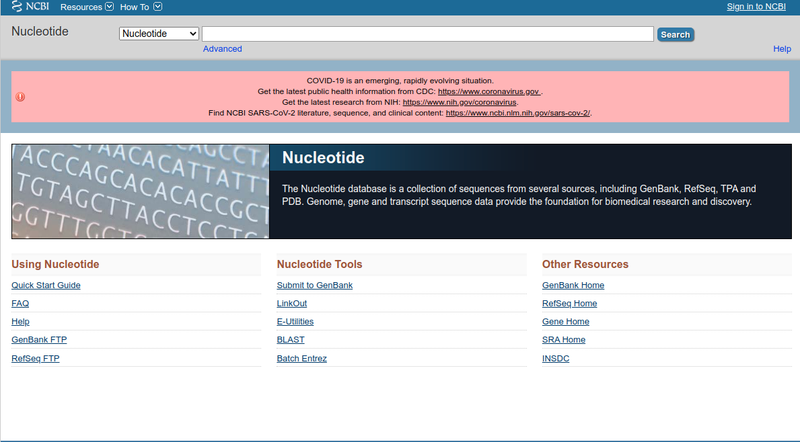

# Descargar secuencias de base de datos

Este es un breve instructivo para descargar secuencias usando el accession number desde el navegador (ideal para poquitas secuencias) o desde la consola, ideal para automatizar tareas que involucran muchas secuencias o que hacemos reiteradas veces.

Imaginemos que queremos descargar una de las secuencias del Trabajo Práctico integrador, llamada _MT510727_ y veamos cómo lo haríamos en cada caso. 

## Descargar secuencias usando el navegador

Para descargar una secuencia usando su _accession number_ (el dato con el que contamos ahora mismo), nuestra base de datos de cabecera será NCBI Nucleotide (para secuencias nucleotídicas) o NCBI Protein (para secuencias aminoacídicas), aunque veremos que ambas traen información similar y normalmente suficiente en cualquiera de los casos. En este caso usaremos la base de datos Nucleotide, pero siéntanse libres de probar la de Protein. 

Para usarla, seguiremos los siguientes pasos:

1. Acceder al [NCBI Nucleotide](https://www.ncbi.nlm.nih.gov/nucleotide/). Pueden googlearlo y sale, o seguir el link aquí señalado.

2. En el cuadro de búsqueda, ingresaremos nuestro accession name, _MT510727_. Le damos ENTER (o click en la _search_)
3. Al haber provisto de un _accession number_, la base de datos devuelve inequívocamente un único registro. 

4. Si se fijan un poco la página a la que los trajo, verán que la respuesta contiene información nucleotídica y aminoacídica; y reconocerán algunas de las cosas que hemos visto en los TPs de Artemis/ACT, como las _FEATURES_.

5. Para descargar este registro, lo único que necesitamos es hacer click en _Send To_ y elegir una opción que nos quede bien. Cada una de las opciones hace cosas distintas. 

Primero tenemos que elegir entre el volumen de informacion que queremos
- **Complete Record**: Todo el archivo genbank (todo lo que vemos), en formato de texto plano.
- **Coding sequences**: Solo las secuencias codificantes
- Gene features: Solo las anotaciones
Luego tendremos que elegir entre distintos destinos. A saber:
 - **File**: Para descargarnos el archivo a la compu (ideal para una sola secuencia)
 - **Clipboard**: Para pegarlo a nuestro _Clipboard_ dentro de NCBI (ideal para muchas secuencias, ya que podemos ir colectándolas y descargarlas todas juntas en un solo archivo)
 - *Collections*: Para guardarlas en nuestras colecciones de NCBI
 - **Analysis Tool**: Para usarla directamente en alguna de las herramientas que provee NCBI Nucleotide

6. Nosotros vamos a elegir, en este caso, _Complete Record_ y _File_. Si todo salió bien aparecerá una nueva decisión para tomar, que tiene que ver con el formato

El formato que quieran descargar depende de lo que quieran hacer y del tipo de archivos que necesite el software o algoritmo que quieran usar para hacerlo. En mi experiencia, Genbank (o Genbank full), FASTA y GFF3 son las más usadas. Descarguen una de cada y vean las diferencias :)

El formato Genbank es equivalente al formato EMBL que usamos en los TPs de artemis/ACT. Contiene la secuencia y las anotaciones, y pueden cargarlo directamente en esos programas para visualizarlo. El archivo FASTA no tiene anotaciones. 

Si en lugar de destinarlas al _File_ usamos el _Clipboard_ del NCBI, podemos juntar varias y descargar una sola vez. 

Luego, haciendo click en donde dice "X Items" abriremos una lista de elementos que podremos descargar conjuntamente

## Descargar secuencias usando la linea de comando

La base de datos NCBI ha desarrollado una forma de acceso programático a sus registros, que podemos aprovechar para automatizar nuestras búsquedas o simplemente para buscar cosas desde un entorno que no tiene interfaz gráfica y en el que solo se puede usar una triste consola (como un servidor, por ejemplo)

El acceso programático requiere que instalemos un pequeño paquete de UNIX, cuyo nombre es Entrez. En este ejemplo lo haremos con Ubuntu (los comandos podrían cambiar ligeramente en otros entornos UNIX, pero por ahora con este les alcanza). Para instalarlo, en la consola escribiremos: `sudo apt-get install ncbi-entrez-direct`

> **_sudo_** para ejecutar el comando como administrador

> **_apt-get_** es el comando que usamos para manejar nuestra biblioteca de aplicaciones en Ubuntu

> **_install_** es el argumento que le dice a apt-get que lo que queremos hacer es instalar algo

> **_ncbi-entrez-direct_** es el nombre del paquete que queremos instalar

Aceptamos todo lo que nos dice que va a instalar y ya estamos listos para empezar. 

El acceso programático a una base de datos es muy poderoso y, con un gran poder, viene una gran responsabilidad (?); asi como también una gran complejidad. Si alguna vez quieren profundizar su conocimiento sobre acceso programático a NCBI, puede leer [este libro](https://www.ncbi.nlm.nih.gov/books/NBK179288/). Para este curso nos alcanza con hacer algunas cuestiones más bien básicas como, por ejemplo, traer una secuencia.

Para hacerlo necesitamos de dos comandos que se acaban de instalar: **esearch** y **efetch**. El primero hace la búsqueda y el segundo lee y formatea el resultado. 

Una consulta estándar para traer una secuencia de NCBI sería así:

	esearch -db nucleotide -query "ACCESSION-NUMBER" 

Como ven, el resultado así puesto no nos dice nada. Es por esto que tenemos que **combinarlo** con efetch. Para hacerlo hacemos uso del pipe: `|`. Este caracter nos ayuda a pasar el output de un comando como input del siguiente; tal que:

	esearch -db nucleotide -query "ACCESSION-NUMBER" | efetch -format FORMATO

Para traer la consulta que veníamos usando, por ejemplo, reemplazamos "ACCESSION-NUMBER" por nuestro MT510727 y el formato que queremos (por ejemplo, fasta):

	esearch -db nucleotide -query "MT510727" | efetch -format fasta

Como ven, ambos requieren de una serie de argumentos que explicaremos a continuación. 
- **esearch** es el comando para ejecutar una búsqueda
- **-db nucleotide** es el argumento que usamos para decir que la búsqueda la haremos sobre la base de datos Nucleotide. 
- **-query "CONSULTA"** es el argumento que usamos para, puntualmente, pedirle algo a la base de datos (como escribir en el cuadradito de búsqueda en el navegador)
- **efetch** es el comando que usamos para interpretar la respuesta del **esearch**
- **-format fasta** es el argumento que usamos para elegir el formato de la respuesta. Fasta es uno de los formatos, pero hay un montón (puden verlos todos usando `efetch -help`):
  

El volumen de información y el formato estarán determinados por este último argumento.

Finalmente lo óptimo sería que el resultado de nuestra búsqueda se guardara en un archivo en lugar de imprimirse en pantalla. Para eso aprovechamos las bondades de UNIX, y usamos el `>`:

	esearch -db nucleotide -query "MT510727" | efetch -format fasta > MT510727.fasta

El archivo puede llamarse como quieran, esta es solo una sugerencia.

