## Introducción 

Este es un instructivo corto sobre cómo hacer para correr la máquina virtual de la materia en sus compus sin tener que reinstalar el sistema operativo. Vamos a necesitar:

**Software y archivos a descargar y/o instalar**

*   El disco de la máquina virtual (VMDK)
*   [Oracle VirtualBox](https://www.virtualbox.org/) instalado en nuestras compus.
*   WinZip o GUnzip para Windows o Linux, respectivamente.

**Requerimientos de Hardware mínimos**

*   20 GB de espacio libres en disco duro (para VMDK)
*   2 GB de RAM. 

## Antes de arrancar...

### ¿Qué es un sistema operativo?

Un sistema operativo es una pieza de _software_ que nos permite realizar funciones básicas, como copiar/pegar/mover/generar archivos, y sobre el cual se construyen otros softwares. Muchos sistemas operativos también proveen una interfaz gráfica que permite al usuario hacer tareas sin línea de comando (yay!). Hay un montón de sistemas operativos, pero los más comunes son Windows, OSX y Linux.

### ¿Qué es una máquina virtual?

Las máquinas virtuales no son más que compus _invitadas_ (o _guests_), emuladas dentro de una computadora real, hospedadora (o _host_). Como las máquinas físicas, éstas corren un sistema operativo que permitirá hacer distintas cosas. La virtualización es un proceso costoso, desde el punto de vista de que nos permite crear nuevas compus pero, al momento de correrlas, estaremos repartiendo los recursos reales (espacio en disco, memoria RAM y velocidad de procesamiento CPU) del _host_ entre todas las máquinas virtuales _guest_ que estén activas. Es por esto que debemos ser cuidadosos al momento de generarlas, dándoles suficientes recursos para funcionar, pero no todos los recursos del _host_.

## **El disco de máquina virtual**

El disco de una máquina virtual es la “foto” de un disco de almacenamiento. Esto es: todo lo que un disco duro “virtual” tiene guardado, incluyendo el sistema operativo y los programas instalados, quedarán guardados en un archivo cuando la creemos con las herramientas adecuadas. Este archivo permite regenerar el estado de la computadora desde la que se creó dicho disco al momento de sacar la foto. Nosotros ya hemos ensamblado, para la materia, un disco de máquina virtual con Lubuntu 18 (una distribución versión ultra liviana de Ubuntu 18) en la que hemos instalado todos los programas y herramientas que usaremos en la asignatura. En adelante, nos referiremos a éste como IBioinfo.

**Google Drive**

*   [Bioinfo-Ubuntu-32.vmdk](https://drive.google.com/file/d/16zMi4nsLLwGqU4WNMvzdVs3n7ruXZoNX/view?usp=sharing) (IBioinfo 32 bits)

Una vez descargado el archivo, descomprimir para obtener el vmdk. 

Notarán que son archivos pesados (~ 10GB). Descárguenlos con tiempo y con conexión estable. Si no cuentan con una conexión estable, pueden escribirnos para buscar alguna solución alternativa. 

## **Instalar Virtualbox**

Mientras descargan IBioinfo, aprovechen el tiempo muerto para descargar Oracle Virtual Box. El programa es gratuito y pueden descargarlo desde [la página oficial](https://www.virtualbox.org/). Descárguenlo y sigan las instrucciones del instalador hasta que hayan terminado. Descarguen la última versión (v6.1), apropiada para su sistema operativo (Windows, OSX o Linux).

## **Crear una máquina virtual**

Virtual Box es un virtualizador de entornos. Nos permite generar una _máquinas virtuales_. Vamos a crear nuestra máquina virtual con el archivo de disco virtual IBioinfo-Lubuntu que acabamos de descargar. Para eso:

1. Abrimos VirtualBox

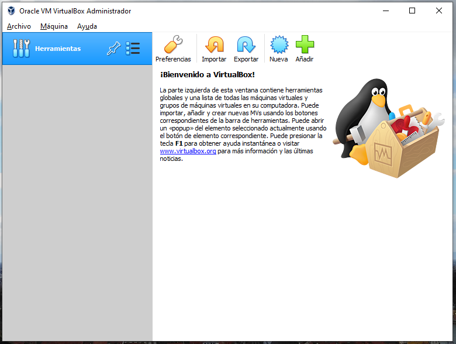

2. Hacemos click en **Nueva**

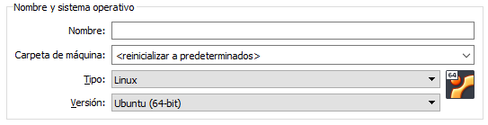

3. Una caja de diálogo aparecerá, en donde deberemos indicar:
- **El nombre que queremos darle a la máquina virtual**: El que quieran
- **La ubicación de la máquina virtual**: La que quieran
- **El tipo de virtualización**: Linux
- **La versión del sistema operativo**: Ubuntu (32 o 64 bits, según lo que hayan descargado).

4. En el mismo panel deberemos indicar el **Tamaño de memoria**: Pongan la máxima que puedan (recuerden que al momento de usar la máquina virtual, ésta sustraerá automáticamente recursos de nuestra compu).

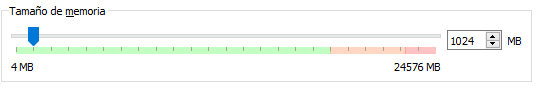

5. Y finalmente el disco duro. Aquí es donde entra nuestro archivo IBioinfo-Lubuntu.vmdk: 

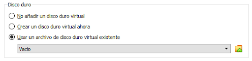

Haciendo click en el icono de la carpeta a la derecha ( la carpetita ), agregaremos nuestro disco virtual (Añadir > elegimos nuestro VMDK):

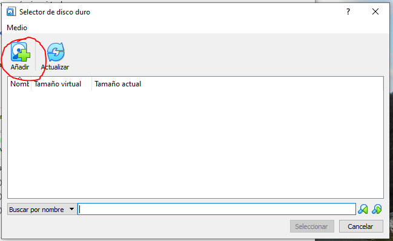

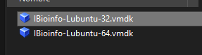

6. Con esto habremos finalizado la creación y podremos comenzar. Si todo salió bien, deberán ver una entrada con su máquina virtual recientemente creada en el Inicio del Virtual Box.

7. Intenten correr la máquina virtual haciendo click en “Iniciar” 

## **IMPORTANTE**

 



## **Problemas y soluciones**

Si no les funciona y eligieron la virtualización de 32 bits, es posible que deban habilitar una opción de virtualización especial (PAN/NX), sobre todo en sistemas nuevos. Para hacerlo, click derecho en la máquina virtual > Configuración > Sistema > Procesador > “Habilitar PAE/NX” 

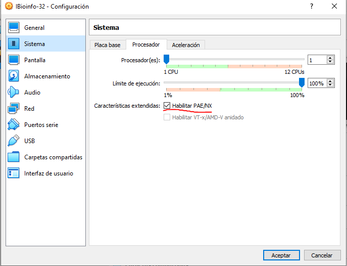
---

Si al lanzar la máquina virtual vemos un error como "_This computer does not have hardware-assisted virtualization_", nos encontraremos ante una compu que, por defecto, no permite la virtualización. Si este es su caso, sigan los pasos descritos en **[este post](https://www.makeuseof.com/tag/virtualization-issues-simple-solutions/)**.

---
Si al configurar la VM hallamos este cartelito dentro de la página de “**Sistema**”, diciendo “el hardware de virtualización está habilitado en la sección de aceleración de la página de Sistema…” 

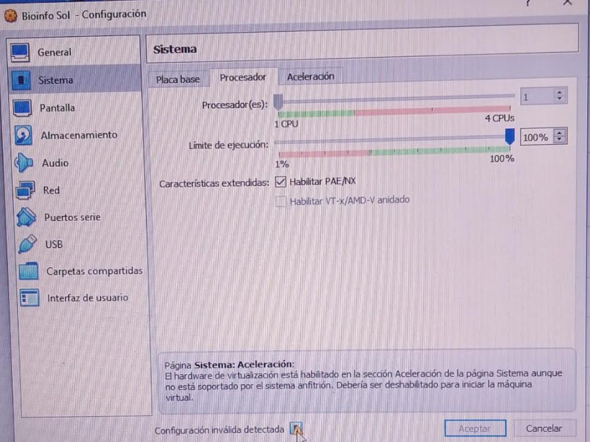
 
Accedan a la pestaña de “Aceleración” y asegúrense de que no haya ninguna interfaz de paravirtualización seleccionada: 

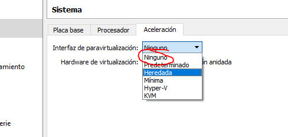

---

Si al iniciar la VM les tira un error sobre “Could not open medium”, como el de la figura de abajo, Es posible que hayan movido el archivo vmdk. Para solucionarlo, accedan vayan a Archivo > Biblioteca de Medios (Virtual media manager) y remuevan el disco problemático. Si la opción de remover les aparece deshabilitada, deberán “Liberarlo” primero. Luego, borren la máquina virtual y vuélvanla a crear usando la nueva (y definitiva) ubicación del vmdk 

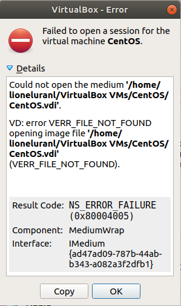

## *Tips & Tricks* para usar la VM más cómodamente

**Adaptar la resolución**: Por defecto, la resolución de la VM es 800x600. Si el monitor o pantalla nos da para agrandar un poco esto, acá les dejo los pasos para hacerlo:

1. Click en el Botón `Inicio` de Lubuntu (esquina inferior izquierda)
2. Click en ``Preferencias``
3. Click en ``Ajustes del monitor``

 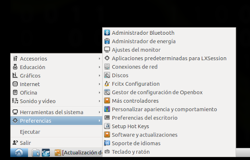

4. Pasar la resolución a la mayor posible (podemos usar la misma que usamos en el sistema operativo del _host_)

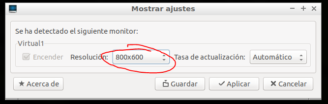

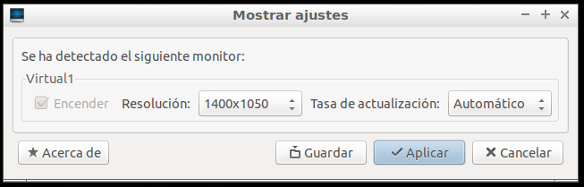

5. Click en ``Aplicar`` y, si estamos conformes, en ``Guardar``
---
**Hacer que la resolución sea permanente:** Esta versión de lubuntu presenta un _bug_ donde la resolución cambia cada vez que se suspende la VM. Por lo tanto la forma más sencilla de solucionarlo es configurando la VM para no suspenderse más:

1. Click en el Botón ``inicio`` de Lubuntu (esquina inferior izquierda)
2. Click en ``Preferencias``
3. Click en ``Administrador de energía``
4. Click en la pestaña Pantalla y luego mover las tres barras hasta la izquierda como se muestra en la siguiente imagen:

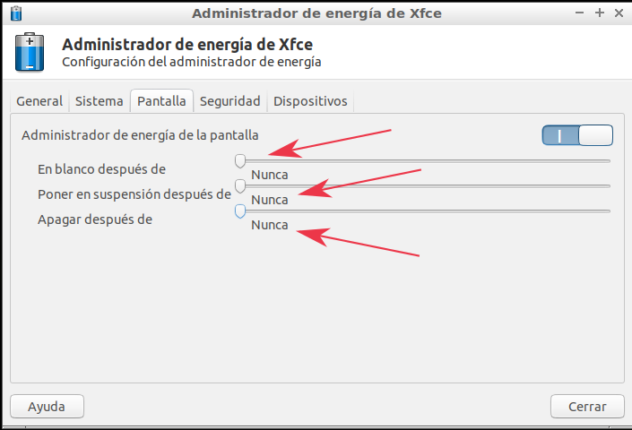

5. Click en la pestaña Seguridad y luego seleccionar “Nunca” en la lista desplegable que aparece al lado de &lt;<Bloquear sesión automáticamente>> y luego destildar donde dice “Bloquear la pantalla cuando el sistema vaya a suspensión”. Tiene que quedar como se ve en la siguiente imagen: 

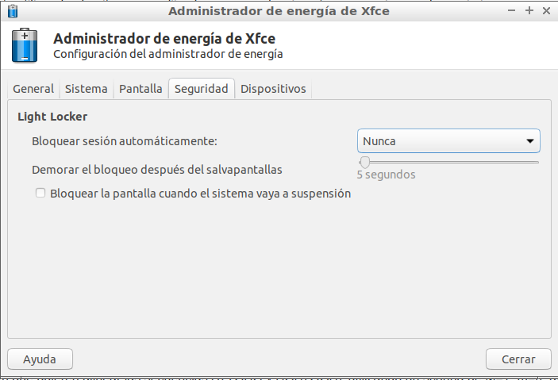
---
**Maximizar la ventana**: Si maximizamos la ventana a “pantalla completa”, será como estar usando la máquina virtual solamente. Esto para algunos puede resultar más cómodo. Pueden probarlo presionando las teclas &lt;Ctrl derecha> + &lt;F> juntas. 

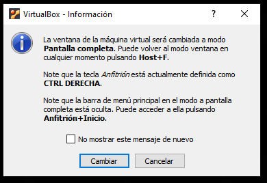

---
**Abrir la línea de comandos**: Para acceder a la línea de comandos hay dos formas: 

*   ``Inicio`` > ``Herramientas del sistema`` > ``LXTerminal``
*   Presionar las teclas ``Ctrl izquierdo`` + ``Alt izquierdo`` + ``T``, las tres juntas.

**Cambiar el _layout_ del teclado**: Para cambiar el layout del teclado hay que:

1. Click derecho en el panel:

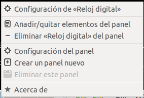

2. Seleccionar Añadir/quitar elementos del panel

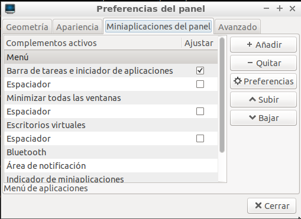

3. Seleccionar Añadir -> Agente de distribución del teclado

4. Hacer click en Añadir, cerrar la ventana. En el panel aparecerá al lado del botón de apagado la bandera española, click derecho sobre la bandera y seleccionar la primera opción: Configuración de ``Agente de distribución de teclado``

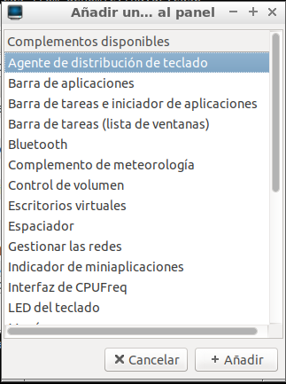

5. Se abrirá una ventana. Destildar la opción: Mantener las distribuciones del sistema y se habilitarán las opciones:

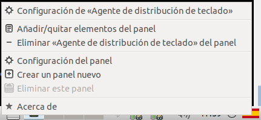

6. En **Distribuciones del teclado** elegir Añadir y busca en la lista el teclado correspondiente.

Los más comunes son:

*   Español (es)
*   Español latinoamericano (latam)
*   Inglés (EE.UU.) (us)

Si no sabés cual es podés chequear algunos teclados en [Wiki](https://es.wikipedia.org/wiki/Distribuci%C3%B3n_del_teclado) en la sección QUERTY.

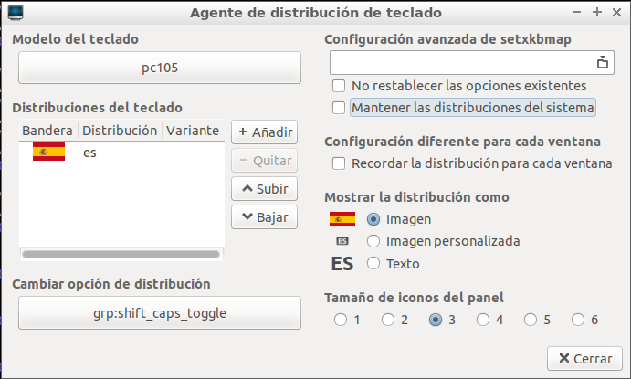

Selecciona el que corresponda y haz click en Aceptar. Volverá a la ventana anterior donde puedes subir la configuración que desees usar (o quitar la que no quieres usar).

Si dejaste más de una configuración, haciendo click sobre la banderita en el panel podés cambiar a las distintas configuraciones (va cambiando la etiqueta).