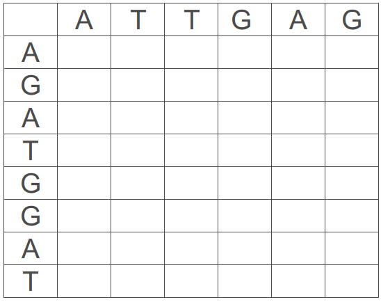
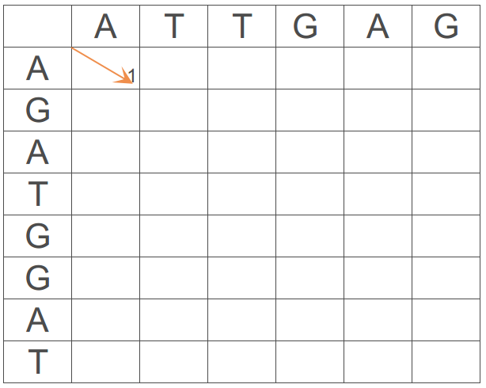
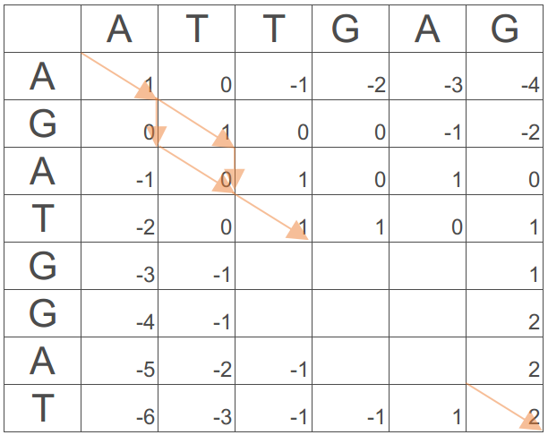

# TP Alineamientos de secuencias de a pares

En este TP vamos a revisar los diferentes algoritmos de alineamiento de secuencia, visualización de los mismos para identificación de patrones y su aplicación.


## Introduccion 

El alineamiento de secuencias de a pares comprende la asignacion uno-a-uno de correspondencias entre los elementos que componen dichas secuencias sin alterar su orden. En dicho proceso tres eventos principales pueden tener lugar:
* **Match (M)**: Cuando los elementos enfrentados son equivalentes.
* **Mismatch (m)**: Cuando los elementos correspondientes son diferentes.
* **Gap (g):** Cuando un elemento de una secuencia no tiene par en la otra y se enfrenta a un espacio, caracterizado por un guion (-).
   * **Gap open:** Cuando se abre un gap.
   * **Gap extend:** Cuando se agregan gaps a continuacion de otro gap.

Por ejemplo si alienamos las secuencias abcde y acxef un posible resutado seria:

> abcde-  
> a-cxef

La principal función de los alineamientos es establecer una medida de similitud entre las secuencias que participan en el mismo. Para ello es necesario definir un sistema de puntuación que pese cada uno de los eventos que tienen lugar en el. Este puntaje nos permitirá tambien optimizar el alineamiento utilizando algoritmos que elijan la correspondencia entre secuencias que lo maximicen. 

Existen varios algoritmos de alineamiento. 
Los **alineamientos globales** (o de Needleman-Wunsch por sus creadores), se realizan pareando todos los elementos de una secuencia con todos los elementos de la otra. Este tipo de alineamientos se utiliza principalmente para comparar dos secuencias que son similares en largo.
Los **alineamientos locales** (o de Smith-Waterman), parean solo parte de las secuencias y son utiles para identificar por ejemplo dominios en comun.
**Alineamientos mixtos**, que combinan los anteriores.


## 1. Dot-Plots

Los dot-plots son representaciones graficas que dan un pantallazo sobre la similitud entre dos secuencias. En ellos se pueden identificar patrones que aporten informacion sobre la relacion entre ambas secuencias.
La forma de obtener uno es muy sencilla: se establece una matriz donde cada elemento de una de las secuencias se corresponde con una fila y los de la otra con una columna. Acto seguido se procede a colorear cada celda donde los caracteres correspondientes a fila y columna sean equivalentes.
Por ejemplo:


Nosotros podemos utilizar la herramienta de EMBOSS **dotmatcher** para generar nuestros propios plots. Pueden utilizar la secuencia *HS-ch11-fragment.fasta* que se encuentra en la carpeta *data* para copararla contra si misma. Esta secuencia es un pequeno fragmento del cromosoma 1 de *Homo sapiens* y la vamos a utilizar unicamente para ver algunos de los patrones que podemos encontrar en un dotplot.

1.1 Genere un dotplot utilizando la secuencia HS-ch11-fragment.fasta contra si misma.

```Bash
dotmatcher data/HS-ch1-fragment.fasta data/HS-ch1-fragment.fasta
```

**Que podemos interpretar de lo que vemos?**

La verdad es que el plot es bastante ruidoso, esto sucede muy a menudo en secuencias genomicas ya que la cantidad de caracteres que componen las secuencias es muy limitada (solo 4) y por ello hay muchas ocurrencias y por lo tanto muchos puntos.
Para limpiar el plot y quedarnos con los matches mas significativos podemos jugar con dos parametros: 

* windowsize: Tamanio de ventana
* threshold: Umbral de ocurrencia

Esto quiere decir que no va a poner un punto cuando haya un match sino si en el fragmento del largo *windowsize* y hay *threshold* matches.
Por ejemplo:

```Bash
dotmatcher -windowsize 50 -threshold 20 data/HS-ch1-fragment.fasta data/HS-ch1-fragment.fasta
```

Si aumentan estos parametros pueden ir eliminando fragmentos que correspondan a secciones compartidas mas cortas, sin embargo existe una relacion de compromiso, utilizar tamanio de ventana y umbral muy grandes nos llevan a perder informacion por lo que hay que seleccionarlos con cuidado.
Una vez obtengan un plot que les parezca adecuado. **Que pueden interpretar del mismo?** Busque explicaciones posibles a los patrones encontrados.

1.2 Teniendo en cuenta lo visto anteriormente, imagine y dibuje en forma esquemática dot-plots que sean el resultado de comparar las siguientes secuencias:  
    1.2.1 Un genoma conteniendo tres copias del mismo gen contra si mismo  
    1.2.2 Una secuencia palindrómica contra si misma  
    1.2.3 Dos proteínas que comparten un motivo  
    1.2.4 Dos secuencias idénticas, pero una de ellas se encuentra invertida  
    1.2.5 Un fragmento o gen contra una secuencia mayor (que lo contiene)  
    1.2.6 Dos proteínas con tres motivos compartidos (distintos entre sí) pero en distinto orden.  

## 2. Dynamic programming

Dado un par de secuencias y un sistema de puntuacion se pueden aplicar diversos algoritmos para encontrar el alineamiento que de el mejor puntaje. El algoritmo mas popular, utiliza una tecnica matematica llamada *dynamic programming*. En el mismo se parte de una matriz identica a la utilizada para graficar los dot-plots, pero se la completa en su totalidad, calculando el costo que tiene llegar a cada una de las celdas (dado el sistema de puntaje preestablecido) y eligiendo la opcion mas favorable, guardando el puntaje con el que se llega a la celda y el movimiento que lo origino. Una vez la matriz esta completa en su totalidad se puede recorrer hacia atras (desde el extremo inferior derecho al superior izquierdo) para reconstruir el alineamiento.
La principal ventaja de este metodo es que **siempre encuentra el alineamiento optimo** entre las secuencias dadas. Sin embargo, puede que existan varios alineamientos que satisfagan esta condicion. Otra desventaja es de origen tecnica, la exahustividad con la que el algoritmo realiza la busqueda hace que su velocidad depende del largo de las secuencias implicadas, lo cual lo hace poco eficiente para busqueda de similitud de una secuencia contra una base de datos. Para esto existen diferentes adaptaciones del algoritmo que se veran mas adelante.

En la practica: imaginen que quieren alinear las secuencias ATTGAG y AGATGGAT utilizando un scoring de M=1, m=0, g=-1
Para eso ubicamos las secuencias en la matriz como ya vimos:



y la completamos calculando para cada vertice el score acumulado de cada posible camino que nos lleve hasta el. Por ejemplo, para alcanzar el primer vertice, los tres caaminos posibles serian:
* Movernos diagonalmente, alineando A con A con un score de 1 (M).

> A  
> A

* Hacer un movimiento horizontal, alineando la A de ATTGAG con un gap (score de -1) y un movimiento vertical alineando la A de AGATGGAT con un gap (otra vez -1) con un score total de -2. 

> A-  
> -A

* Hacer un movimiento vertical, alineando la A de AGATGGAT con un gap (score de -1) y un movimiento horizontal alineando la A de ATTGAG con un gap (otra vez -1) con un score total de -2.

> -A  
> A-

Para decidir que valor ubicamos en el vertice simplemente optamos por el que nos de el mayor score, en este caso 1, y se marca el movimiento que lo produjo: un movimiento diagonal



Este procedimiento se repite iterativamente calculando los scores para cada vertice e indicando el mejor movimiento. Al finalizar la matriz, se puede obtener el mejor alineamiento al reconstruir el camino que nos lleva del extremo inferior derecho al superior izquierdo.

2.1 Utilizando el algoritmo de *dynamic programming* complete la matriz y reconstruya el alineamiento utilizando las secuencias y el scoring del ejemplo:



## 3. Similitud y Homologia

Los terminos similitud y homologia se suelen utilizar como sinonimos por muchos investigadores, sin embargo no es el caso. La similitud es una caracteristica cuantitativa de de un par de secuencias, donde se establece en que grado estas se parecen (por ejemplo aplicando los algoritmos antes vistos, utilizando un sistema de puntajes). La homologia por otro lado es una caracteristica cualitativa, dos secuencias son o no son homologas, decir que un par de secuencias tiene N% de homologia es incorrecto. Homologia implica especificamente que el par de secuencias estudiadas provienen de un mismo ancestro comun. Esta afirmacion es completamente hipotetica, ya que, salvo en contados casos, no se puede corroborar. Uno puede inferir que este es el caso dado la similitud observada en las secuencias actuales, sin tener acceso a las secuencias ancestrales.
A partir de esta relacion entre similitud y homologia se puede aplicar para inferir relaciones entre diferentes especies, buscar posibles funciones de una secuencia desconocida, etc.

3.1 Determinar que especies estan mas relacionadas utilizando la ribonucleasa pancreatica de caballo (Equus caballus), ballena enana (Balaenoptera acutorostrata) y canguro rojo (Macropus rufus).  
    3.1.1 Descargue las secuencias antes mencionadas de la base de datos UniProt en formato fasta.  
    3.1.2 Utilice la herramienta de alineamiento global de EMBOSS **needle** (pueden leer el manual para ver que opciones admite) para comparar las tres secuencias.  

```Bash
needle -asequence -gapopen 10 -gapextend 1 <secuencia_1> -bsequence <secuencia_2> -outfile <salida>
```

    3.1.3 Observe e interprete las salidas obtenidas. Que secuencias son mas similares? Tiene sentido el resultado obtenido?  

3.2 Realice el mismo procedimiento pero esta vez para determinar si los mamuts (Mammuthus primigenius) son mas cercanos a los elefantes africanos (Loxodonta africana) o asiaticos (Elephas maximus) utilizando la secuencia de la cadena alfa de la hemoglobina.  
    3.2.2 Que le sugieren los resultados obtenidos?  
    3.2.3 Que otras explicaciones pueden satisfacer estos resultados?  
    3.2.4 Proponga soluciones para los problemas encontrados.  

