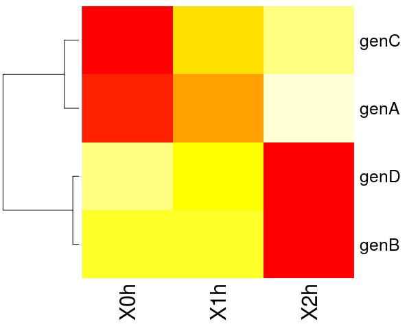

# TP Data mining - Introducción al clustering en bioinformática
Técnicas para analizar grandes conjuntos de datos y encontrar patrones o comportamientos similares entre ellos

En este TP nos vamos a enfocar en la utilidad de las técnicas de Clustering (y Data Mining en general) para analizar e interpretar grandes conjuntos de datos, como es el caso de los generados por análisis transcriptómicos.
Comprender el "funcionamiento" de una de las técnicas más simples de clustering no supervisado: la clasificación jerárquica ascendente (clustering jerárquico). Para esto utilizaremos un conjunto de datos mínimo para agrupar (clusterizar) a mano (o utilizando una planilla de cálculo) los datos utilizando diferentes métricas de distancia y criterios de agregación para finalmente confeccionar un dendograma.
Vamos a utilizar además otro método muy simple de clustering, en este caso particional, el *K-means*. Veremos algunas medidas de calidad de los clusters, como la suma de cuadrados intra-cluster y la silueta (*Silhouette*).
Aplicar los conocimientos adquiridos para analizar e interpretar un conjunto de datos real de expresión génica con *microarrays*.

## Introducción

Por si no recuerdan la dirección del [rserver](http://pi.iib.unsam.edu.ar/rserver/) 

En este TP retomamos el trabajo con R, con lo cual es preferible que repasen como abrir nuevos archivos de texto donde escribir sus *scripts*, cuales eran los atajos para ejecutar código seleccionado, que representaba cada panel de Rstudio, etc. Para eso, pueden aprovechar el [TP de introducción a R](https://github.com/trypanosomatics/introduccion-bioinformatica/blob/master/TPs/IntroR/TP.md) 

Durante el TP vamos a utilizar técnicas básicas para encontrar conglomerados o *clusters* en un conjunto de datos biológicos. La idea es identificar agrupamientos naturales en los datos, que presenten un comportamiento similar entre sí, con alguna relevancia biológica. En particular utilizaremos conjuntos de datos provenientes de medidas de expresión génica generadas mediante experimentos con *microarrays* con muestras tomadas a diferentes tiempos, para identificar grupos o *clusters* de genes que tengan un perfil de expresión común.

1. En 1997 DeRisi *et. al*. estudiaron los cambios transcripcionales de prácticamente todos los genes de *Saccharomyces cerevisiae* a lo largo del salto metabólico de fermentación a respiración. En el archivo diauxic.txt se encuentra una tabla donde cada fila representa un gen y cada columna el tiempo al cual se tomó la muestra. Así, cada celda contiene una medida de la expresión de un gen particular a un momento determinado.

NAMES | col1 |  col2 |  col3 |  col4 |  col5 |  col6 |  col7
----- | ---- |  ---- | ----- | ----- | ----- | ----- | -----
YGR138C | -1.23 | -0.81 | 1.79 |  0.78 |  -0.42 | -0.69 | 0.58
YPR156C | -1.76 | -0.94 | 1.16 |  0.36 |  0.41 |  -0.35 | 1.12
YOR230W | -2.19 | 0.13 |  0.65 |  -0.51 | 0.52 |  1.04 |  0.36


¿Qué genes presentan un perfil de expresión similar? ¿Cuales son los genes que se sobreexpresan al final (en ausencia de glucosa) y cuales son reprimidos? ¿Cuantos tipos de comportamientos diferentes hay? bueno ... con suerte esto lo podremos contestar hacia el final del TP ...

2. En el archivo TablaEjemplo.txt hay una tabla mínima con datos inventados. La tabla contiene para cuatro genes (A, B, C y D) su nivel de expresión a las 0hs, 1hs y 2 hs luego de algún tratamiento.


 
gen | 0h | 1h | 2h
--- | - | - | -
genA | 2 | 4 | 8
genB | -1 | -1 | -2
genC | -2 | 0 | 1
genD | 0 | -1 | -6

* **Grupo Norte** graficar en Excel los niveles de expresión de cada gen por separado vs. tiempo. Realizar a mano o en Excel un clustering jerárquico utilizando la distancia Euclídea, y el criterio de agregación de "Vecino más lejano" (o "complete linkage").
* **Grupo Sur** lo mismo pero estandarizando previamente los datos por gen (a cada dato restarle la media de expresión del gen y dividirlo por su desviación estándar).

Comparar gráficos y dendogramas y discutir qué resultado (Norte o Sur) tiene más sentido biológico.

Lo primero que vamos a hacer en R es cargar los datos de la tabla de ejemplo TablaEjemplo.txt. Para esto tendrán que setear el directorio de trabajo correcto (pista: usar la función `setwd()`) y luego usar alguna función de las que ya conocemos para cargar tablas.

```r
MiTabla <- read.csv("./data/TablaEjemplo.txt", sep="\t", row.names="gen")
```

Lo que hicimos acá, fue leer el archivo de texto TablaEjemplo.txt utilizando la función `read.csv()` de R (csv -- comma separated values -- es la extensión que suele usarse para nombrar archivos de texto conteniendo valores separados por algún delimitador, que comúnmente es una coma, o un carácter de tabulación). Además del nombre del archivo, la función `read.csv()` nos permite declarar cuál es el separador de campos (en este caso son tabulaciones, que se indican como \\t), y cual es la columna que contiene los identificadores para las filas ("gen" es el nombre de esta columna en nuestro ejemplo). Finalmente, notar que el resultado de ejecutar la función `read.csv()` se está almacenando en la variable `MiTabla`.

Ahora si tipeamos el nombre de esta variable, seguido de Enter, R nos muestra el contenido de la variable (nuestra tabla).

```r
MiTabla # En la conssola, si escribo esto y presiono Enter, nos muestra la tabla cargada.
#En un archivo de texto donde estoy escribiendo mi script escribo eso y apreto enter y solo salta a la próxima línea ¿tiene sentido?

```
A continuación vamos a utilizar la función `dist()` para calcular una matriz de distancias a partir de los datos de la tabla. Recordar que estos datos ya están cargados en una variable que se llama `MiTabla`. Como convención a lo largo de esta guía, cualquier cosa que empiece con Mi o Mis es un nombre de variable. Podríamos haber usado cualquier nombre (por ejemplo, pepe), y ustedes pueden cambiarlos cuando usen R por su cuenta.

```r
MisDistancias <- dist(MiTabla,method="euclidean")
```
          genA      genB      genC
genB 11.575837                    
genC  9.000000  3.316625          
genD 15.000000  4.123106  7.348469

La función `dist()` calcula la matriz de distancias usando la medida (el método) especificada/o, entre todas las filas de la matriz. En este ejemplo, calcula la distancia euclídea entre todos los genes tomados de a dos. El resultado se almacena en la variable llamada `MisDistancias`. ¿Como podemos ver el resultado?

Seguidamente vamos a agrupar en forma jerárquica a los genes, de acuerdo a esta matriz de distancias, utilizando la función `hclust()` (hierarchical clustering).

```r
MiClusteringJerarquico <- hclust(MisDistancias, method="complete")
```

La función `hclust()` realiza el clustering jerárquico utilizando el criterio de agregación especificado (*complete linkage* o "vecino más lejano" en este caso). En R si quieren obtener ayuda sobre algún comando, por ejemplo para ver qué otras opciones existen para una función, pueden usar la función `help()`. Haciendo:

```r
help(hclust)
```
podemos ver, qué otros criterios de agregación permite la función


`
  method: the agglomeration method to be used. This should be (an
          unambiguous abbreviation of) one of '"ward"', '"single"',
          '"complete"', '"average"', '"mcquitty"', '"median"' or
          '"centroid"'.
`

En este caso complete = *complete linkage*, single = *single linkage* (o vecino más cercano), average = promedio.

Para graficar el resultado de este agrupamiento utilizamos la función `plot()`

```r
plot(MiClusteringJerarquico) #Grafica el dendograma que resulta del clustering jerárquico
```


Los gráficos en R se pueden exportar a PDF y a JPEG fácilmente:

```r
pdf("MiImagen.pdf") #alternativamente jpeg("MiImagen.jpeg")
plot(MiClusteringJerarquico) # el plot se escribe en el PDF (no se muestra en pantalla!)
dev.off() # cierra el archivo, los próximos plots volverán a ser mostrados en pantalla
```

Ahora vamos a repetir el análisis, estandarizando los datos de expresión disponibles para cada gen, de manera de que todos valores de expresión se encuentren en la misma escala y centrados en cero, tal como lo hicimos manualmente en el ejercicio anterior. R cuenta con la función `scale()` para estandarizar datos. El problema es que esta función estandariza por columnas, y nosotros necesitamos hacerlo por filas (las columnas contienen datos de expresión para todos los genes). Por lo tanto necesitamos transponer la matriz de datos, de manera de que las columnas pasen a ser filas y viceversa. Para transponer tablas, R nos ofrece la función `t()`.

```r
MiTablaTranspuesta <- t(MiTabla)
```

Analizar el contenido de la nueva variable `MiTablaTranspuesta` para ver cómo se modificaron los datos. A continuación, podemos utilizar `scale()` sobre esta nueva tabla.

```r
MiTablaEstandarizadaTranspuesta <- scale(MiTablaTranspuesta)
```
Analizar el contenido de la nueva variable `MiTablaEstandarizadaTranspuesta` para verificar que los datos hayan sido normalizados. Finalmente, necesitamos volver a transponer la tabla estandarizada, para tener nuevamente los datos por gen en filas, y los datos de los distintos tiempos en columnas.

```r
MiTablaEstandarizada <- t(MiTablaEstandarizadaTranspuesta)
```

Esto mismo que hemos hecho en tres pasos (transponer la tabla, normalizarla y volverla a transponer), puede hacerse en un solo paso, así:

```r
MiTablaSTD <- t(scale(t(MiTabla)))

#comparar las medias y las dispersiones....
summary(t(MiTabla))
summary(t(MiTablaSTD))
sd(t(MiTablaSTD))
sd(t(MiTabla))
```

Ahora vamos a repetir todos los comandos desde `MisDistancias <- dist(MiTabla,method="euclidean")` inclusive, en adelante, pero utilizando la tabla con los datos estandarizados `MiTablaSTD`

**OPCIONAL**

Podemos probar con otras medidas de distancia entre datos de expresión, por ejemplo basadas en correlación. Las distancias basadas en correlación permiten comparar "tendencias" en los datos no estandarizados, en forma similar a la distancia euclídea con datos previamente estandarizados. Este tipo de distancias, como la correlación de Pearson, son las más utilizadas en análisis de expresiòn génica con **microarrays**.

```r
DistanciaCorr <- as.dist(1-cor(t(MiTabla)))
```

GEN | genA | genB | genC
---- | ---- | ---- | ---- | ---- 
genA | 1 | | | 
genB | 1.94491118 |  | 
genC | 0.07142857 | 1.75592895 | 
genD | 1.98432414 | 0.01217084 | 1.84855529


La función `cor()` calcula la matriz de correlaciones sobre las columnas, por defecto, utiliza la correlación de Pearson. Este coeficiente de correlación varía entre 1 (genes perfectamente correlacionados) y -1 (correlación negativa perfecta: cuando uno sube, el otro baja), pasando por el 0 (no hay correlación lineal entre ellos).

La distancia es `1-cor()` de forma tal que si la correlación alta, la distancia sea mínima y viceversa. La función `as.dist()` convierte la matriz al formato correcto para ser utilizado por las funciones de clustering, como `hclust()`.

Luego de visualizar el nuevo dendograma....

```r
heatmap(MiTablaSTD, Colv=NA)
```



Inspeccionamos el heatmap que es una imagen que muestra niveles de expresión más altos como más calientes o blancos/amarillos y los de menos expresion como mas frios o rojos. Colv indica si las columnas (tiempos en este caso) deben ser agrupadas o reordenadas y cómo. `Colv= NA` (NA = Not Available), indica que no las reagrupe (respetando el orden natural de la variable tiempo). Las filas (genes) van a ser agrupadas utilizando la función `hclust()` con sus opciones por default y la distancia euclídea, a menos que se indique otra cosa.

Observando el dendograma de los datos estandarizados y el heatmap, podemos ver que hay dos grupos bien distinguibles de genes. Uno que aumenta su expresión a lo largo del tiempo y el otro que disminuye. Podemos cortar el árbol para quedarnos con estos dos grupos a cualquier altura entre ~1 y ~2.5, con la función `cutree()`...

```r
MiCorte <- cutree(MiClusteringJerarquicoSTD,h=1.5)  # cortamos el árbol a la altura de 1.5.
#o lo que es lo mismo...
MiCorte <- cutree(MiClusteringJerarquicoSTD,k=2) # cortamos el árbol a una altura tal que el número de clusters obtenido sea de 2.
MiCorte #visualizamos a que cluster fue asignado cada gen
```

Ahora vamos a agrupar los genes del mismo ejemplo por el método de K-medias, al que se le debe pedir a priori un número K de clusters. En este caso, vamos a pedir K=2.

```r
MiClusteringKMedias=kmeans(MiTablaSTD,2)
MiClusteringKMedias # vemos el resultado, que como es de esperar para un caso tan simple, coincide con el método jerárquico.
```

Si el número de clusters a encontrar fuera mayor, es recomendable aumentar el número de inicios al azar; por ejemplo, para inicializar 100 veces en forma aleatoria:

```r
kmeans(MiTablaGrande,5,nstart=100)
```

## Ejemplos de datos biológicos

### Análisis de Clustering de expresión génica durante salto diáuxico en levaduras

Ahora con lo aprendido, importar y analizar el conjunto de datos diauxic.txt.
1. Identificar grupos de genes que se comporten de manera similar (No se vuelvan locos en generar el mejoooor **clustering** de la historia de la biología, traten de avanzar rápido)

Deberían llegar a algo así:


2. Análisis de enriquecimiento funcional 

Después de haber identificado clusters, analizado el comportamiento global de los datos y probado algunas herramientas de visualización, exportar los identificadores de los genes pertenecientes a los diferentes clusters encontrados (ver instrucciones abajo). En esta instancia tenemos clusters de genes (al menos 2) que presentan comportamientos diferentes y nos podríamos preguntar por ejemplo, si los genes pertenecientes a uno de los clusters, están involucrados en procesos biológicos diferentes a los genes de otro de los clusters. Ya que el genoma de *Saccharomyces cerevisiae* está anotado con mucho detalle y sus genes tienen asignados los procesos biológicos en los que participan ( mediante términos de la ontología GO) podemos averiguar si los genes de un cluster están enriquecidos en términos GO correspondientes a ciertos procesos biológicos, respecto a los genes de otro cluster o bien, respecto a todo el genoma. Para esto utilizar algún servidor online, como FatiGO, GOrilla o DAVID.

 
El servidor requiere seleccionar el organismo (*S. cerevisiae*), subir una lista de identificadores de genes de interés (uno de los clusters, en el que queremos detectar enriquecimiento funcional), e indicar contra qué los queremos contrastar (genoma u otra lista de interés, e.g. otro cluster). Dependiendo de la herramienta utilizada, también hay que seleccionar una o más bases de datos de anotación funcional (en este caso, "GO - biological process"; pero bien podríamos seleccionar otra, como Interpro motifs y detectar motivos que estén significativamente mas representados en uno de los clusters que en el otro). En este sentido, DAVID es una de las herramientas más completas ya que permite detectar enriquecimiento en diversos niveles de anotación: interacciones proteína-proteína, dominios funcionales, asociación con enfermedades, vías metabólicas, homología, patrones de expresión tejido-específicos, publicaciones en literatura, etc.

Para exportar una lista de identificadores a un archivo....

```r
Cluster1 <- MiTablaSTD[which(MiCorte==1),]  #Guardo en la variable Cluster1 los genes que tienen asignado un "1" en el clustering jerárquico.
Cluster2 <- MiTablaSTD[which(MiCorte==2),]  #Guardo en la variable Cluster2 los genes que tienen asignado un "2" en el clustering jerárquico.
write(row.names(Cluster1),"Cluster1.ids") # escribo al un archivo externo "Cluster1.ids" los identificadores de los genes del cluster 1.
write(row.names(Cluster2),"Cluster2.ids")
```
En el caso de usar Gorilla, deberían llegar a algo así para [función](./data/GOrilla_results_diaux/GOResultsFUNCTION.html) y para [procesos](./data/GOrilla_results_diaux/GOResultsPROCESS.html)

### Análisis de Clustering de RNA-Seq de hoja de Maíz.

Hacer un análisis de clustering, ahora con el conjunto de datos maizeTranscDataMappedAt.csv. Este proviene de un estudio de transcriptómica por RNA-Seq de la hoja del maíz, durante su desarrollo desde la base hacia el ápice (Pinghua Li, et al 2010). La última columna de la tabla contiene el identificador del gen homólogo en **Arabidopsis thaliana** (si lo hubiera), para aprovechar el alto grado de anotación de este genoma en el análisis de enriquecimiento funcional de los clusters que se obtengan.

**SUGERENCIA** Antes de calcular matrices de distancias entre genes, probar diferentes transformaciones sobre las medidas de expresión (RPKM) evaluando las distribuciones obtenidas  (e.g. `scale(x)`, `log(x+1)`, `(x-median(x))/IQR(x)`, `t(scale(t(scale(x))))` )

## MEDIDAS DE CALIDAD DE LOS CLUSTERS

Cuando queremos decidir qué método de clustering o qué función de distancia es mejor que otra, necesitamos de herramientas que nos permitan medir la calidad de los clusters y qué tan bien representan éstos la estructura natural de los datos. El coeficiente silueta (*silhouette*) mide cuán buena es la asignación de un elemento o dato a su cluster. Para esto compara las distancias de este elemento respecto a todos los demás elementos del cluster al que pertenece, contra las distancias respecto a los clusters vecinos. El coeficiente silueta del elemento i se denota **s(i)**.

si **s(i) ≈ −1**, el dato i esta mal agrupado

si **s(i) ≈ 0**, el dato i está entre dos clusters

si **s(i) ≈ 1**, el dato i esta bien agrupado

El promedio de los **s** de los elementos dentro un cluster, da una idea de la calidad de ese cluster. El promedio de los **s** de todos los elementos dan una idea de que tan bien están agrupados todos los datos; si el clustering realizado es bueno o no.

**Nota**: la silueta de un grupo con una sola observación es 0, sin embargo, dependiendo el trabajo que estemos realizando puede ser correcto que dicha observación tenga que estar sola y sin agrupar con nadie más. Si tengo varios grupos correctos de una sola observación, el promedio de todos los clusters será baja erróneamente y pueden llegar a tomar una mala elección de K o del método. (Para solucionarlo, por ejemplo, podrían sacar del clustering aquellas observaciones que no se agrupan o usar algún otro parámetro como la suma de todos los **s** en vez del promedio)   


En R se pueden computar fácilmente los coeficientes silueta mediante la función `silhouette()` incorporada en la librería cluster:

```r
library(cluster) # llamamos a la librería "cluster"
MiSiluetaKMeans <- silhouette(MiClusteringKMeans$cluster,MiMatrizDeDistancias) # para un clustering por K-means o bien...
MiSiluetaJerarquico <- silhouette(MiCorteDelArbol,MiMatrizDeDistancias) # para un clustering con hclust() - cutree()
```

Se pueden ver los coeficientes Silueta para todos los datos:

```r
MiSiluetaKMeans
```

O un resumen con los promedios de Silueta de cada cluster:

```r
summary(MiSiluetaKMeans)
```

También se puede hacer una representación gráfica de los coeficientes Silueta:

```r
plot(MiSiluetaKMeans)
```

Este tipo de gráfico es una herramienta muy útil para determinar cuál es el número "natural" de clusters en un conjunto de datos. En este caso, probamos con K=5 y vemos que el cluster 1 (que contiene 203 genes) no es muy bueno ya que además de tener un coeficiente de silueta promedio bajo (0.13), muchos de los genes que contiene, tienen coeficientes de silueta negativos. Habría que probar con otro número K de clusters y/o con otro método de clustering.


**EJERCICIO** Calcular los coeficientes silueta para los clusters encontrados en el dataset diauxic. Evaluar la silueta promedio para distintos números K de clusters. 

## BONUS TRACK

El set de datos fibro.data proviene de un experimento donde se analizan los cambios de expresión génica de fibroblastos humanos en respuesta al suero http://genome-www.stanford.edu/serum/.

El siguiente heatmap muestra los 7 clusters en los que los datos fueron agrupados mediante un clustering jerárquico utilizando el criterio de agregación de vecino más lejano y una medida de distancias basada en correlación.

A continuación se puede ver otra representación de los perfiles de expresión, ahora de cada cluster por separado, usando gráficos de perfiles multivariados o *parallel plots* (y para los que no sepan y/o recuerden que es un parallel plot, pueden leer [esto](https://en.wikipedia.org/wiki/Parallel_coordinates) ):

¿Está de acuerdo con los grupos formados? ¿Partiría o fusionaría algunos clusters?
* Reproducir estos gráficos y probar con diferente número de clusters, utilizando además del método del Vecino más lejano (complete linkage) el promedio (average) y evaluando las siluetas.

Otra forma de representar los datos agrupados, mediante un diagrama de dispersión sobre las 2 primeras Componentes Principales:


```r
library(lattice) # traigo este paquete para generar el gráfico parallel
library(cluster) # traigo este paquete para calcular los coeficientes silueta
library(pheatmap)
library(ggbiplot)
fibro=read.csv("./data/clustering/fibro.data",sep="\t")
summary(fibro)

fibroClust=hclust(as.dist(1-cor(t(fibro))),method="complete") #usamos este método de distancia (1-cor)
fibroCorte=cutree(fibroClust,7) #Definimos 7 clusters, buscar cuantos clusters tomar es otro trabajo completo
pdf("graficos_fibro.pdf")
pheatmap(fibro,cutree_rows =   7,clustering_distance_rows=as.dist(1-cor(t(fibro))),cluster_cols = F)
pheatmap(fibro,kmeans_k = 10,cutree_rows =   7,cluster_cols = F) # Para que vean qeu se puede combinar Kmeans y clustering jerárquico
parallelplot(~fibro | factor(fibroCorte),horizontal=FALSE)
fibro.std=t(scale(t(fibro))) #para escalar
# O podemos usar parametros del paquete de pheatmap
pheatmap(fibro,scale = "row",cutree_rows =   7,clustering_distance_rows=as.dist(1-cor(t(fibro))),cluster_cols = F)
pheatmap(fibro,scale = "row",kmeans_k = 10,cutree_rows =   7,cluster_cols = F) # Para que vean qeu se puede combinar Kmeans y clustering jerárquico
#Hacer un PCA y un gráfico de elipses para los grupos que definimos previamente:
fibro.pca <- prcomp(fibro, center = TRUE,scale. = TRUE)
ggbiplot(fibro.pca, ellipse = T, labels=rownames(fibro), groups=as.factor(fibroCorte))+theme_minimal()


dev.off()
```
### BONUS TRACK del BONUS TRACK

Tomando de [esta guía](https://moderndata.plot.ly/interactive-heat-maps-for-r/) podemos hacer en unos pocos pasos los mismos heatmaps que hicimos hasta ahora pero interactivos ¿Qué es interactivo? 
Es igual pero te permite hacer zoom, desplegar información al posar el cursor e incluso si se ponen en modo programadores, podrían generar gráficos interacivos donde al hacer click se generen nuevos gráficos o cambien los que ya tienen (eso ya excede lo que podemos mostrar en el curso, pero sepan que en R la forma mas sencilla es integrando todo esto con **shiny**)

Prueben lo siguente:

```r
library(heatmaply)
heatmaply(fibro, k_row = 7)
```
Les debe haber aparecído un gráfico interactivo en la pestaña de **viewer** en Rstudio con un heatmap hermoso.

Este paquete usa **plotly** un paquete para hacer gráficos interactivos muy usado.Pueden ver que arriba a la derecha tienen varias opciones para interaccionar con su gráfico, las mas usadas son el zoom, y el de guardar el gráfico como imagen. Sepan que hasta ahí hicimos un gráfico con todas las opciones default, pero hay muchísimas cosas que podrían custimizar (muchiiiiiiisimas) si quisieran. Si les llegara a interesar, pueden encontrar toda la info [acá](https://plot.ly/r/)

## NOTA INSTALACIÓN DE PAQUETES EN R:

En el TP desarrollado estuvimos usando un servidor que previamente ya fue testeado y configurado para que tenga todos los paquetes que fuesen necesarios. Si quieren realizar estas tareas en otra plataforma (computadora personal, trabajo, etc) es más que seguro que tengan la necesidad de instalar paquetes, pueden googlear cómo se hace pero acá les damos algunas de las formas más habituales de trabajar con e instalar paquetes:

Para ver los paquetes instalados:

```r
library()
```

Para cargar un paquete de la lista anterior (por ejemplo, el paquete cluster que utilizamos para calcular los coeficientes silueta ):

```r
library(cluster)
```

Para instalar un paquete no incluido en R base, por ejemplo ggplots que trae herramientas adicionales para graficar datos :

```r
install.packages("ggplot2")
```

y luego lo cargamos normalmente:

```r
library(ggplot2)
```

Hay un gran número de paquetes orientados específicamente al análisis de datos genómicos (en su mayoría aquellos derivados de microarrays de ADN, pero también de SAGE, SNPs, etc.) provenientes del proyecto Bioconductor. Por el momento, exceden los objetivos de este TP introductorio, pero puede serles útil.
