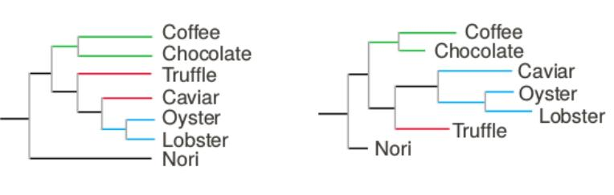

# Filogenia

La filogenética es la ciencia de estimar el pasado evolutivo basado en la comparación de secuencias ADN o protéicas. Un árbol filogenético está compuesto de ramas (o ejes) y nodos. Los ejes conectan nodos y los nodos son los puntos en los cuales dos o más ramas divergen. Ambos pueden ser internos o externos. Un nodo interno corresponde al último ancestro común hipotético de todo lo que está debajo de él. Los nodos terminales, en cambio, son las secuencias a partir de las cuales se construyó el árbol. Los árboles pueden derivarse a partir de varios genes (árboles genéticos), de un único gen proveniente de diferentes especies (arbol de especies) o de una combinación de ambos. En el primer caso, los nodos internos podrían interpretarse como eventos de duplicación, mientras que en el segundo, podrían obedecer a eventos de especiación.


Generalmente los árboles filogenéticos tienen ramas que son proporcionales a la distancia (o "cantidad de evolución") entre las secuencias, calculada a partir de la similitud entre los nodos que conectan. Por lo tanto, mientras más largas son las ramas mayor es la divergencia entre las secuencias que une. Existen igualmente árboles particulares (llamados cladogramas) en los cuales las ramas están justificadas y su largo no corresponde con información alguna, sino que solo son más agradables estéticamente.



En la base del árbol vamos a encontrar su raíz. Este es el punto más antiguo del árbol y marca el orden de ramificación del mismo, osea, quien comparte un ancestro más reciente con quien. La forma de ubicar la raíz del árbol es a través de un "*outgroup*": un punto externo de referencia. Un *outgroup* puede ser cualquier secuencia que no sea un miembro natural del grupo de interés. Cuando uno no cuenta con un elemento que pueda usarse como referencia, la raíz suele ubicarse en el medio del árbol, o aun mejor, no se coloca en ningun lado.

## Paso 1. Construyendo el dataset
Un árbol filogenético se construye a partir de un alineamiento múltiple que a su vez debe calcularse a partir de un set de secuencias representativas. La topología de el o los árboles resultantes va a depender mucho de la cantidad y calidad de los datos que utilicemos. Generalmente la mayor cantidad de tiempo y esfuerzo se invierten en este paso ya que un set de datos ruidoso puede llevarnos a resultados erróneos y por lo tanto a conclusiones inválidas. En la práctica, la obtención de secuencias puede realizarse como ya hemos visto en este curso, utilizando herramientas como PSI-BLAST o HMMer para identificar secuencias homólogas distantes y evitar aquellas que comparten similitud pero no estructura/función. Estas luego se ven sometidas a una meticulosa curación, donde se eliminan secuencias redundantes, incompletas o con errores detectables. Incluso se realizan pasos de modelización de estructura para validar la pertinencia de las moléculas al grupo de proteínas que se desea utilizar. En este TP todos esos paso no van a ser llevados a cabo por cuestiones de tiempo pero tengan presente a la hora de hacer sus propias filogenias que se debe prestar máxima atención a el acondicionamiento de los datos.

Para trabajar hoy vamos a utilizar las secuencias contenidas en el archivo **C_ompA.fasta**. Estas 19 secuencias proteicas provienen de porinas de membrana originadas a partir del gen *ompA* de diferentes cepas y/o serotipos de *Chlamydia*.

## Paso 2. Alineamiento múltiple

Para este paso vamos a utilizar la herramienta de EMBOSS que vimos en el TP de alineamiento de a pares/alineamiento múltiple: *emma*
Si recuerdan *emma* toma como entrada nuestro archivo multifasta (*-sequence*) y devuelve dos salidas: las secuencias con los gaps incluidos para su debido alineamiento (*-outseq*) y el dendograma que sirve de guía para el alineamiento (*-dendoutfile*).

En un desesperado intento por que el MSA sea lo mas acertado posible vamos a utilizar los argumentos **-slowalign** y **-window 1** para sacrificar tiempo en pos de obtener un resultado mas confiable.

```Bash
emma -slowalign -window 1 -sequence C_ompA.fasta -dendoutfile C_ompA.dend -outseq C_ompA.msa
```
Ahora si abrimos el archivo **C_ompA.msa** vamos a ver un multifasta con secuencias con gaps, sin embargo no nos permite visualizar rápidamente si hay regiones conservadas o con muchos gaps a simple vista. Para eso podemos utilizar el comando **showalign** que ya hemos utilizado anteriormente con la opción **-show A** para que no reemplace las bases conservadas por puntos:

```Bash
showalign -show A -sequence C_ompA.msa -outfile C_ompA.showalign
```

La premisa básica de los alineamientos múltiples es que, en cada columna en el alineamiento, cada residuo de cada secuencia es homólogo; osea, ha evolucionado de la misma posición en un ancestro común. Cuando esto se cumple, uno puede obtener de el abundante información sobre la estructura, función, modo de evolución y, por supuesto, filogenia. Sin embargo, las conclusiones a las que lleguemos van a depender mucho de la calidad del alineamiento múltiple, que en el mejor de los casos no nos va a dar información útil, pero en el peor nos va a dar información errónea muy convincente.
Por esto es **SUMAMENTE** importante revisar los alineamientos múltiples! Como ya hemos mencionado, para realizarlos en un tiempo aceptable, los algoritmos utilizan heurísticas y aproximaciones que suelen dar lugar a errores. Por ello muchas veces es necesario curar manualmente los alineamientos, eliminando o agregando gaps. También se puede recurrir a la eliminación de columnas completas si contienen una gran mayoría de gaps o hay dudas sobre su veracidad. En muchos casos estos eventos son mejor eliminarlo para eliminar ruido.

Revisen nuestro alineamiento con la ayuda de **showalign** para ver si hay errores o posiciones dudosas y en caso de encontrarlos corrijanlos en **C_ompA.msa**.

## Paso 3. Arboles – Methods, Models and Madness

Los métodos para llevar a cabo la filogenia se pueden separar en dos categorías generales. Estas son métodos basados en distancia, también conocidos como de clustering o algorítmicos (UPGMA, neighbour-joining, Fitch–Margoliash), y métodos de busqueda de árboles o discretos (parsimony, maximum likelihood, Bayesian
methods)

### Métodos basados en distancias

El funcionamiento de estos es relativamente sencillo. Se cuenta con un solo parámetro: la distancia, que se calcula entre todos los elementos con los que vamos a construir el árbol (OTUs por sus siglas en inglés: *Operational Taxonomic Unit*), el cual es utilizado para ensamblar el árbol agrupando elementos cercanos.

Lo primero que vamos a hacer es un árbol simple utilizando el método de **Neighbor-Joining**. Para ello utilizaremos el comando **fneighbor**. Este comando construye un árbol a partir de una matriz de distancias, haciendo clustering de sus elementos como lo vimos en clase, utilizando los valores de la matriz para calcular el largo de las ramas. El árbol resultante es un árbol sin raíz, lo que quiere decir es que las distancias son relativas entre los miembros y no hay información sobre qué evento se produjo primero (no hay un reloj evolutivo).

Para poder calcular el árbol primero debemos obtener la matriz de distancias, esto lo podemos hacer mediante el comando **fprotdist**.
Este comando utiliza uno de tres algoritmos para calcular las distancias:

1. PAM: Utiliza una matriz PAM 001. Como ya hemos visto, la matriz PAM es una matriz de sustitución obtenida empíricamente. El número 001 indica que las secuencias con las que se construyó tienen un tasa de mutación esperada del 1%.
2. JTT: Nombrado por sus creadores, Jones, Taylor y Thornton, se basa en el mismo concepto que el método PAM, solo que la matriz de sustitución fue creada con un set de datos mucho más grande.
3. PBM: Las matrices de este modelo derivan de la base de datos *Blocks* que contiene secuencias de dominios conservados.

```Bash
fprotdist -method j -sequence C_ompA.msa -outfile C_ompA.dist
```

Ahora con nuestras distancias podemos comenzar a agrupar. Fijense que este método es algo muy similar al que utilizamos en el TP de *data mining*.

```Bash
fneighbor -datafile C_ompA.dist -outfile C_ompA.tree
```

Noten que en realidad **fneighbor** devuelve 2 archivos, el que especificamos con *-outfile* y un archivo llamado de la misma manera, con minúsculas y con extensión *treefile*: **c_ompa.treefile**.

Investiguen ambos archivos.
- Qué información tiene **C_ompA.tree**
- Qué les parece que contiene **c_ompa.treefile** y por que es conveniente su creación?

Comparemos ahora con el método **UPGMA**. La manera de generar el árbol es esencialmente la misma que **Neighbor-Joining**, ir agrupando los pares de elementos con la menor distancia. La diferencia radica en cómo se calculan las distancias una vez se empiezan a generar grupos. **Neighbor-Joining** utiliza una metodología un tanto compleja que pueden encontrar explicada [aca](http://www.deduveinstitute.be/~opperd/private/neighbor.html), mientras que **UPGMA** usa un *average linking* pesado por la cantidad de secuencias que componen cada grupo.

Para construir un árbol con **UPGMA** corremos el comando *neighbor* pero con la opción **-treetype u**:

>**NOTA**: el archivo *.treefile* adopta el nombre del archivo de entrada, por lo que al correr **fneighbor** nuevamente lo van a sobreescribir. Es recomendable en este punto (y cada vez que corramos un metodo que cree un arbol) renombrar ese archivo.

```Bash
fneighbor -treetype u -datafile C_ompA.dist -outfile C_ompA_UPGMA.tree
```

Ahora comparen las salidas de ambos métodos.
- Identifiquen cambios en las agrupaciones

Si bien uno puede ver árboles dibujados en ascii en los archivos *.tree* puede utilizar lo comandos **fdrawtree** y **fdrawgram** para obtener imágenes de los mismos.
- Investigue con la opción **-help** los parámetros que estos comandos reciben y grafique los árboles como le parezca más correcto.

### Metodos de busqueda de árboles

Ahora vamos a realizar la misma tarea pero con los metodos de busqueda de árbol. Estos métodos examinan cada columna del MSA de manera individual y buscan un árbol que mejor represente esta información. Este procedimiento los vuelve mas lentos que los métodos basados en distancia, pero el hecho que se examine cada posición por separado nos da no solo un árbol más acertado sino que nos brinda la posibilidad de relacionar los eventos a cada una.

En este caso no va a ser necesario calcular una matriz de distancias, podemos ejecutar el método directamente sobre el alineamiento. Primero vamos a utilizar Máxima verosimilitud con el comando **fproml**, al cual le indicamos el MSA de entrada **-sequence** y le indicamos donde guardar la salida (**-outfile**). Podemos tambien pasarle (aunque es opcional) un árbol para usar de guia (**-intreefile**), en nuestro caso no lo vamos a hacer pero nos va a preguntar igual, en ese caso apretamos *Enter*.

Antes de correr el comando recuerden ir cambiando el nombre del archivo **c_ompa.treefile** para que al escribirlo no pierdan los árboles anteriores.

```Bash
fproml -seed 1 -sequence C_ompA.msa -outfile C_ompA.ml
```

>**NOTA**: Fijense que estamos pasando, además de los argumentos mínimos, el argumento **-seed**. Esto es una buena práctica para que nuestro experimento sea reproducible. Como deben saber, en computación, lo que llamamos "random" en realidad no lo es. Para obtener números cuya distribución se acerque a la aleatoria se aplica una serie de fórmulas que dan un resultado dependendiendo del número del cual se parte. Este valor es la semilla (seed). Por lo general se utiliza el tiempo, el cual cambia constantemente, pero nosotros podemos fijar esa semilla, para que otras personas, o nosotros mismos en algún futuro, podamos correr nuestros comandos y obtener exactamente los mismos resultados.

Observen e interpreten la salida obtenida (**C_ompA.ml**)
- Comprueben si hubo cambios radicales con respecto a los árboles anteriores.
- Con qué nueva información contamos?

Este método tiene una ventaja: utiliza un modelo de markov para estimar las tasas de cambio de las diferentes posiciones y así poder hacer cálculos más precisos. Esto se debe a que no todas las posiciones varían con la misma frecuencia, posiciones importantes para la estructura/función de la proteína (ej. sitio activo), tienden a variar mucho menos que el resto y esto debe ser tenido en cuenta a la hora de construir la filogenia.

Genere el árbol utilizando máxima parsimonia con el comando **fprotpars**, utilice **-help** para ver qué argumentos recibe.
- Qué información nos da?
- Cuántos árboles nos devuelve? por qué?

## Paso 4. Tests – Seleccionar árboles en el bosque

Entonces, qué tan bueno es nuestro árbol?
Uno de los test más simples para medir la veracidad de nuestro árbol es el *bootstrap*. Hoy en dia seria muy raro encontrar un árbol filogenético que no lo haya utilizado. El *bootstrap* esencialmente prueba si todo el set de datos está de acuerdo con el árbol resultante, o si dicho árbol es un outlier entre varias otras posibilidades. Esto se hace tomando muestras aleatorias de nuestro set de datos y armando varios árboles con estas y calculando la frecuencia de ocurrencia de cada fragmento del árbol.
Si un agrupamiento determinado es encontrado en todos los árboles, entonces tienen un score de 100%; si solo ocurre en 2/3 de los árboles generados el score será de 67% y así.

Es importante aclarar que el sampleo se hace a nivel columna (del MSA), no secuencia. Nuestro árbol va a establecer la relación entre diferentes secuencias dada la conservación/mutación de posiciones "homólogas" y esto es lo que se intenta probar con bootstrap: que cualquier tipo de composición que mantenga esos patrones de conservacion/mutacion va a dar el mismo arbol. Por ello, vamos a tener la misma cantidad de secuencias, y del mismo largo, ya que no solo vamos a reordenar las posiciones al azar sino que también vamos a quitar y repetir columnas. En la siguiente imagen pueden ver un ejemplo de los resultados de un *Bootstrapping*


Este test parece sencillo, pero estudios en filogenias conocidas (poblaciones virales cultivadas en laboratorio) muestra que es una medida adecuada de la certeza de del arbol resultante, y que un valor de 70% o más suele indicar un agrupamiento adecuado.

Para generar nuestro set de alineamientos vamos a utilizar el comando **fseqboot** el cual va a tomar nuestro MSA y generar un archivo con todos los samples:

```Bash
fseqboot -reps 100 -sequence C_ompA.msa -outfile C_ompA.boot
```

**-reps** indica el número de resampleos que queremos producir.


Si abren **C_ompA.boot** veran varios MSA correspondientes al resampleo, con posiciones faltantes, repetidas y en distinto orden que el MSA original. Ahora podemos utilizar este archivo para llevar a cabo numerosos árboles filogenéticos:


Recuerden renombrar **c_ompa.treefile** para no sobreescribirlo!

```Bash
fproml -seed 1 -sequence C_ompA.boot -outfile C_ompA.boot.ml
```
Esto puede tardar un rato, podría ser un buen momento para salir a tomar aire...

En el archivo **C_ompA.boot.ml** va a contener todos los árboles resultantes de todas nuestros sampleos. Al ser tantos, uno puede ver las diferentes topologías creadas, sin embargo es muy difícil sacar conclusiones.

Para poder utilizar toda la información de estas numerosas réplicas vamos a unirlas con el comando **fconsense**. Este toma como entrada el archivo *.treefile* que contiene todos los árboles en formato Phyllip y los va a condensar en uno solo, anotando a cada rama la cantidad de veces que esta fue hallada en nuestros sampleos.

```Bash
fconsense -intreefile c_ompa.treefile -outfile C_ompA.consense
```
Observando el árbol consenso:
- Resulta ser un buen árbol?
- En que se basa para afirmarlo?
- Cómo podría lidiar con nodos de baja calidad?
- Compare el árbol obtenido con alguno de los anteriores.

## Step 5. Presentación

Finalmente algunos conceptos en cuanto a la presentación de los datos. Por lo general no hay reglas duras de cómo debe hacerse pero sí convenciones que están bastante aceptadas.
En árboles de filogenia molecular, los largos de las ramas suelen dibujarse a escala; esto es, proporcional a la cantidad de evolución que se estima ocurrió entre los nodos que conecta. A pesar de que la relación entre el largo de la rama y el tiempo real no es directa y muy probablemente no es confiable, los largos dan una idea general de las tasa de cambio relativas del árbol. Los valores de Bootstrap deben ser presentados en forma de porcentajes, no de valores crudos, para que sea más sencillo de leer y comparar con otros árboles. Por convención, sólo valores de Bootstrap del 50% o mayores son reportados; valores menores significan que la calidad del nodo encontrado es muy baja. Por último, tengan en cuenta la legibilidad del árbol en general. Utilizar nombres para las ramas con códigos de acceso a bases de datos o acrónimos de pocas letras puede resultar muy confuso. Hoy en día existen numerosos softwares para la visualización de arboles (ej. Hypertree) que nos permiten, mediante agrupamientos, colores, fuentes, etc. llamar la atención del lector sobre uno u otro aspecto importante del mismo y lograr que transmita la información que nos interesa mostrar.

