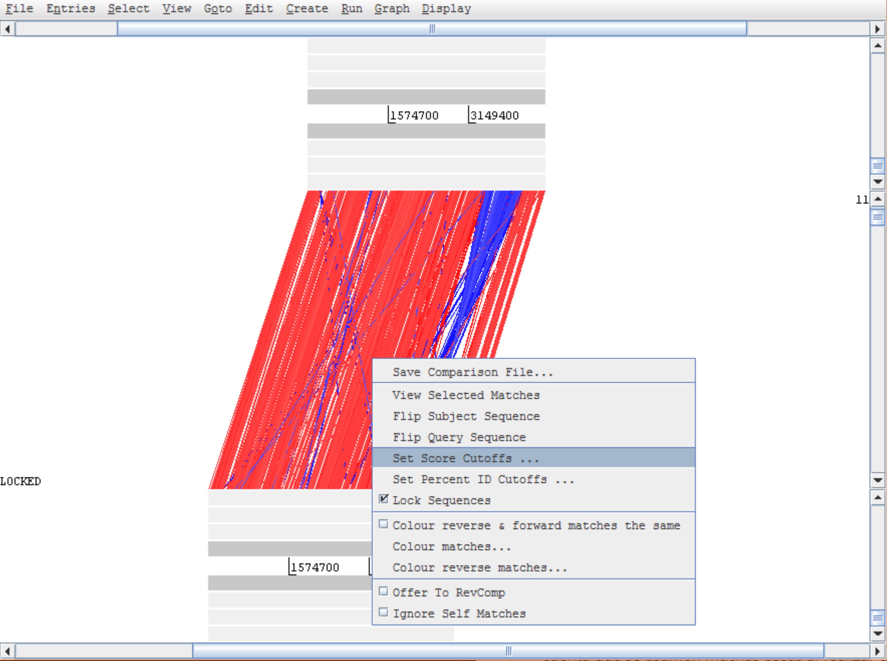
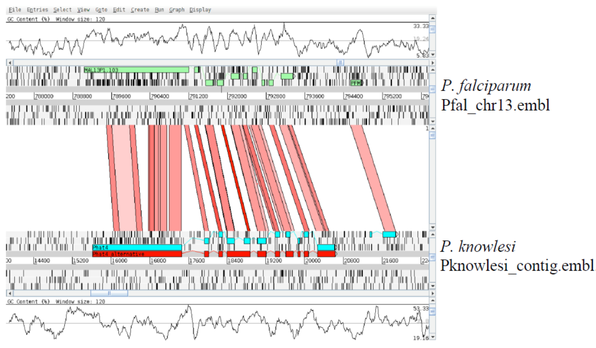

# Genómica comparativa: ACT

## Introducción:

ACT (*Artemis Comparision Tool*), también creada - entre otro - por Kim Rutherford, fue diseñada para extraer información adicional que solo puede ser obtenida a través de la comparación entre dos secuencias (Carver et al. 2005). 

Para trabajar con ACT es necesario proveerle al programa de tres archivos: dos de secuencias (las que voy a comparar entre sí), y uno de comparación. EL archivo de comparación no es otra cosa que un blastn (o un tblastx) entre ambas secuencias. ACT puede leer varios formatos de archivo de comparación, pero por practicidad, nosotros usaremos BLAST para generarlo. En cuanto a los archivos de secuencia, ACT puede leer el mismo tipo de archivos de secuencia de Artemis (ej. multi-fasta, genbank, embl, etc.). 

## Objetivos

El objetivo de este TP es que se familiaricen con las funciones básicas de ACT a través de varios casos de uso. Algunos ejemplos se van a pisar con el TP de Artemis. Esto es intencional. **Para que se les grabe**. Con un poco de suerte, podremos hallar algunas huellas del proceso evolutivo para ratificar (o cuestionar) una que otra hipótesis biológica. 

## Primera parte: Arrancar ACT

En esta primera parte, vamos a trabajar con dos genomas bacterianos (*E. coli* y *S. tiphy*).

Para abrir el programa podemos usar la terminal: 

```bash
cd ~/Tools/artemis/
./art
```

### Preparación de los archivos de entrada

ACT necesita además de las secuencias, un archivo que contenga una comparación entre ellas. Pero dado que vamos a estar intentando comparar secuencias grandes, este archivo no puede ser simplemente un alineamiento continuo de las dos secuencias. La idea es poder visualizar rearreglos (inversiones, deleciones/inserciones, transposiciones) y para ello es necesario contar con una serie de alineamientos locales delimitados, con scores definidos (por ejemplo tal como los que produce BLAST. Ver [ACT:Running a comparison](https://www.sanger.ac.uk/science/tools/artemis-comparison-tool-act).

Para hacer la comparación, pueden usar bl2seq (BLAST 2 Sequences), ya sea en la linea de comando o en el [NCBI](http://blast.ncbi.nlm.nih.gov/Blast.cgi?PAGE_TYPE%3DBlastSearch%26BLAST_SPEC%3Dblast2seq%26LINK_LOC%3Dalign2seq&sa=D&ust=1548712235810000)

	bl2seq -m T -i EcK12.dna -j S_typhi.dna -p blastn -D 1 > EcK12vsStiphy.blastn

donde `-m T` (Mega BLAST = True) indica a BLAST que debe usar el algoritmo ​**Mega BLAST** para hacer el alineamiento y `-D 1` le indica que el formato de output sea tabular, que es el formato que requiere ACT.

Si esto no fuera una opción (porque, por ejemplo, no tienen instalado bl2seq), pueden generar el archivo de comparación online usando [Double ACT](http://www.hpa-bioinfotools.org.uk/pise/double_actv2.html&sa=D&ust=1548712235812000). 

Alternativamente, *porque en este laboratorio puede pasar cualquier cosa*, también encontrarán, en su directorio de trabajo, un pre-calculado con el nombre `EcK12vsStiphy.blastn.pre`.

Ahora que tenemos todo lo necesario, vamos a arrancar ACT. **Cuando se abre un proyecto, el programa pide como entrada los tres archivos que se acaban de copiar**, a saber:

- ``EcoliK12.dna``
- ``S_tiphy.dna``
- ``EcK12vsStiphy.blastn``

### Navengando en ACT

ACT está basado en Artemis, por lo que ya estarán familiarizados con muchas de sus funciones generales; y está compuesto esencialmente de tres capas o ventanas. La ventana superior e inferior son mini-ventanas de Artemis (con sus funcionalidades heredadas), mostrando la representación lineal de la secuencia de ADN con sus "*features*" asociados. La ventana del medio, muestra bloques rojos y azules, que se extienden y conectan regiones conservadas entre las dos secuencias, en el sentido directo e inverso, respectivamente. Por lo cual, si estuviéramos comparando dos secuencias idénticas en la misma orientación veríamos, en la capa central, un bloque rojo que se extiende a lo largo de la longitud de las dos secuencias. Si una de las secuencias estuviera invertida se observaría un bloque azul entre las dos secuencias. Regiones únicas en cualquiera de las secuencias, como deleciones o inserciones, se visualizarán como espacios blancos entre los bloques rojos o azules.


Veamos cómo se organizan estas ventanas y cómo podemos hacer para navegar a través de ellas:


1. Menues desplegables. Son muy similares a los que vimos para Artemis, con la salvedad de que todos (salvo el de `File`) arrancan por seleccionar una de las dos secuencias en la comparación.
2. Este es el panel de la secuencia 1 (la primera que ingresaron al comenzar la sesión de ACT). Básicamente es una mini-ventana de Artemis. 
3. Este es el panel de comparación, en el que se muestran las regiones de similitud (rojo), diferencia (blanco) e inversiones (azul) entre las dos secuencias.
4. Lo mismo que el `2` pero con la segunda secuencia que ingresaron al comenzar la sesión.
5. Menú desplegable que se abre al hacer click derecho sobre el panel de comparación. 

Una vez abierto el proyecto, pueden incluir las anotaciones (el archivo `.tab`) de cada secuencia como lo hicieron con Artemis en el TP anterior (`File` > `Secuencia para la que queremos cargar las anotacioens` > `Read an entry`, salvando las distancias con los menues desplegables. 


Navegar dentro de ACT puede marear un poco al principio, pero es indéntico a Artemis: Si miran arriba y abajo de las secuencias 1 y 2, respectivamente, verán una barra de desplazamiento horizontal; y a los los lados de ambas, una barra de desplazamiento vertical. Las primeras se usan para desplazarnos rio arriba o rio abajo en el genoma, mientras que las segundas se usan para acercar o alejar el foco.

Para ir enganchándole la onda, lo primero que vamos a hacer es alejar el foco de ambas secuencias hasta que podamos ver ambos cromosomas completos en pantalla. Por el momento, es mejor si apagamos los codones de *stop* y, si las cargaron, las anotaciones. Tendrán que hacerlo para ambas secuencias, dado que la mini-ventana de Artemis es independiente en cada caso. Deberíamos ver algo así:


Nótese que cuando nos desplazamos horizontalmente en una secuencia, la otra se desplaza acompañando el movimiento. Este es el comportamiento por defecto y ocurre porque las secuencias están "bloqueadas" o `LOCKED`. Se se fijan en la imagen anterior, verán que a la izquierda aparece "LOCKED" indicando que esa opción está activada. Generalmente es el comportamiento más conveniente, pero si quisiéramos desactivarlo podemos hacerlo con click derecho sobre el panel de comparación y desmarcando la opción `Lock Sequences`.

Si fuera necesario, podemos refinar nuestra comparación cambiando los *cutoffs* que usa ACT para decidir si dibuja una linea o no conectando a los cromosomas. Dependiendo de cuánto divergan nuestras secuencias, esto podría ser fundamental para transformar una maraña de rayas en una gráfica con patrones o arreglos genómicos.


Hallarán estos cuttoffs haciendo click derecho en el panel de comparación:



Ahora que sabemos bien cómo movernos y enfocarnos, analicemos la imagen: ¿Qué patrones o arreglos ven en la comparación de estos cromosomas? Agreguen ahora, a *S. tiphy* las anotaciones con el nombre ``SPIs.tab``. Este archivo contiene todas las islas de patogenicidad de esta *Salmonella* (incluyendo la SPI-7, con la que trabajamos anteriormente) ¿Están presentes en *E. coli* K12?

#### Algunas cositas más para probar

1. Pueden hacer doble click en las cajas rojas o azules para centrarlas en pantalla
2. Carguen, si no lo hicieron ya, las anotaciones de cada genoma y busquen una caja roja. Céntrenla y hagan zoom para revisar la secuencia aminoacídica en ambos cromosomas.
3. Carguen algunos plots de Artemis (ej. %GC) y revisen diferencias entre los cromosomas.
4. Inviertan alguna de las secuencias (``click derecho`` > ``Flip subject/query sequence``)

Cuando ya se hayan aburrido. Cierren **todo** para arrancar una nueva sesión con el próximo ejercicio.

## Segunda Parte:

Esta segunda parte la haremos con dos genómas de patógenos eucariotas, *P. falciparum* y *P. knowlesi*, ambos, agentes etiológicos de la malaria o paludismo. El primero ya ha sido secuenciado parcial y completamente en múltiples oportunidades, dado que es el de mayor prevalencia como causante de la enfermedad en humanos (el segundo está más asociado a paludismo en primates no-humanos). El segundo está actualmente menos estudiado pero ambos están, al menos taxonómicamente, bien emparentados. Usaremos la abundancia de información del primero y la cercanía evolutiva de ambos para extraer información a partir de la genómica comparativa. 

El objetivo de esta segunda parte es el de comparar un fragmentos genómico (contig) del cromosoma 13 de *P. knowlesi* con el cromosoma 13 completo de *P. falciparum*. Mediante la comparación de ambas secuencias, estaremos en condiciones de estudiar el grado de conservación del orden génico (sintenia) e identificar/anotar genes de *P. knowlesi*. Como parte de este ejercicio, también podremos identificar regiones únicas entre las dos secuencias y, finalmente, verificar una serie de anotaciones automáticas realizadas para *P. knowlesi*. Vamos a necesitar los siguientes archivos

- ``Pfal_chr13.embl`` - Archivo combinado con secuencia y anotaciones de *P. falciparum* 
- ``Pknowlesi_contig.seq`` - Archivo de secuencia *P. knowlesi* (sin anotaciones)
- ``Pknowlesi_contig.embl`` - Archivo de antoaciones automáticas *P. knowlesi* 
- ``Plasmodium_comp.crunch`` - Comparación entre ambos cromosomas

### Sintenia o conservación del orden de los genes

Comencemos por cargar nuestros archivos en el ACT. 

NOTA: Fíjense que para *P. falciparum* tienen un archivo combinado (como el que generaron en el tp anterior), por lo pueden usar eso como secuencia. En el caso del otro parásito, tenemos los archivos de secuencia y anotaciones por separado. Es decir, el ``.embl`` de *knowlesi* no tiene secuencia! Podrán cargar las anotaciones de ese archivo una vez que hayan comenzado la sesión de trabajo. Sin las anotacioens, debería ver algo así:


Prueben incluir las anotaciones de *P. knowlesi*. Utilicen las barras de desplazamiento horizontal para ubicar "geográficamente" el contig de *P. knowlesi* en el cromosoma 13 de *P. falciparum*. Un deslizador que aún no usamos pero que puede resultar muy útil para refinar la visualización, es la barra de desplazamiento vertical del panel de comparación. Moviéndolo hacia arriba o hacia abajo, filtrarán la aparición de cajas de comparación en función de la longitud del match (más largas o más cortas, respectivamente). ¡Pruébenlo! 

> Sugerencia: apaguen los codones de stop para ver mejor las regiones codificantes.

- ¿Qué ven? 
- ¿Qué hay de diferente entre los arreglos genéticos que vimos para bacterias y los que vemos para estos parásitos?
- ¿Hay regiones conservadas entre ambos parásitos?
- ¿Qué pasa con el orden de los genes?
- ¿Pueden ver alguna región en la que similitud esté "rota"?
- Hagan zoom a alguno de los genes anotados en *P. falciparum*. ¿Qué pasa con los genes predichos en *P. knowlesi* 
- ¿Pueden identificar genes conservados entre ambos parásitos que no hayan sido debidamente anotados/predichos en *P. knowlesi* pero que están presentes en su par?

Ahora concentrémonos en una región particular. Diríjanse a la región delimitada por las coordenadas 815823..829969 en el cromosoma de *P. falciparum*. Hay una región codificante. ¿De qué gen se trata? (`Click derecho` > `View` > `Selected Features`) ¿Está presente en *P. knowlesi*? ¿Qué opinión les merece, en términos de relevancia biológica, esta observación?

Si ya llegaron hasta acá, avísenle al instructor para que podamos hacer una puesta en común respecto a esta parte. Mientras esperan al resto de sus compañeros, intenten encontrar más genes que estén presentes en uno y ausentes en el otro para sumar a la discusión.

> Para visualizar las anotaciones, pueden probar algunas opciones adicionales como:
> -	Prender/Apagar `One line per entry`
> - Prender/Apagar `Feature stack view`
> - Prender/Apagar `All features on frame lines`
> - Prender/Apagar `Feature labels`

> Todas las opciones están disponibles haciendo click derecho en la secuencia (como la opción de apagar codones de stop).

### Predicción de modelos de genes

Por último, evaluaremos la capacidad predictiva de modelos génicos utilizada para crear las anotaciones de *P. knowlesi*. Como habíamos anticipado, el archivo de anotaciones de este parásito ha sido construído por un anotador automático. Hay muchos algoritmos capaces de proponer modelos génicos pero ninguno es perfecto al 100% y generalmente es necesario curar o refinar las predicciones. Para este ejercicio se utilizó el algoritmo PHAT (***P**retty **H**andy **A**nnotation **T**ool*, Mol. Biochem. Parasitol. 2001 Dec;118(2):167-74). 

Diríjanse, en el genoma de *P. falciparum*, al gen anotado como PFM1010w (o MAL13P1.103). ¿Pueden comparar el modelo génico de uno y otro parásito e identificar el/los exon/es conservado/s? Pueden usar el deslizador vertical del panel de comparación para incluir *hits* más cortos ¿Pueden encontrar a todos los exones en el contig de *P. knowlesi* (ignoren por ahora el *Phat4_alternative* en rojo)? Abran, para cada secuencia, los gráficos de %GC. ¿Qué características tiene la gráfica en *P. falciparum*? ¿Dirían que esa característica está conservada en *P. knowlesi* para el gen *Phat4*?



Cuando hayan terminado avísenle a su instructor y, mientras esperan al resto de sus compañeros, evalúen las siguientes regiones en el cromosoma 13 de *P. falciparum* en Artemis. 

- 789034..793351, 
- 657638..660023, 
- 672361..673753

Pueden abrir una sesión de Artemis directamente desde ACT:


Revisen las regiones inter-exon ¿Pueden hallar algún patrón?

### Sintenias camufladas

Por último, vamos a buscar regiones sinténicas entre dos nuevos parásitos, *Trypanosoma brucei* y *Leishmania major*. Ambos son organismos eukariotas y están taxonómicamente emparentados por familia (Trypanosomatidae). El primero es el causante de la enfermedad del sueño, y el segundo de la leishmaniasis. En este ejercicio evaluaremos la arquitectura de ambos genomas y la existencia de regiones de sintenia entre éstos.

Los archivos que usaremos son:

- ``Tbrucei.dna`` - secuencia *T. brucei*
- ``Tbrucei.embl`` - anotaciones *T. brucei* 
- ``Leish_vs_Tbrucei.tblastx`` - archivo de compración
- ``Leish.dna`` - secuencia *L. major* 
- ``Leish.embl`` - anotaciones *L. major* 

Comiencen cargando las secuencias, apagando codones de stop y agregando las anotaciones.

- ¿Qué pasa con la conservación de la arquitectura genómica entre estos dos cromosomas? ¿Dirían que hay o que no hay sintenia?
- ¿Hay regiones conservadas entre los organismos? ¿Cuáles son los productos predichos para los genes en esas regiones?
