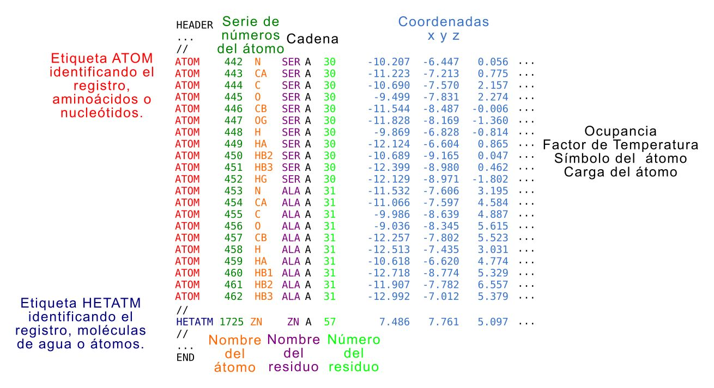

# Modelado por Homología

<div align="right"> <span style="color:grey; font-size:1.5em;"> Lucía Chemes y Juliana Glavina</span></div>

## Ejercicio 1.
Luego de dos años y numerosos intentos fallidos, usted logró determinar por resonancia magnética nuclear una región de la proteína misteriosa y depositar la estructura en la
base de datos de proteínas PDB (1F7W).
Años después ocurre una pandemia de una enfermedad respiratoria causada por Actinobacillus pleuropneumoniae que está causando un rápido aumento en la mortalidad de la población porcina, trayendo terribles consecuencias en la actividad económica mundial. Una vez que se logró aislar la cepa responsable, se cree que una proteína que comparte casi el 25 % de identidad con la proteína misteriosa es un posible blanco para el diseño de una droga. Sin embargo, se desconoce la estructura de la misma. Como usted es el único experto en esa proteína en el mundo, la Asociación del Centro Médico Epidemiológico (ACME) se pone en contacto con usted en busca de una solución. Para solucionar el problema, Ud. decide primero intentar un modelado por homología de la nueva proteína.
1. Ingrese la secuencia de la proteína misteriosa patogénica en [HHPred](https://toolkit.tuebingen.mpg.de/tools/hhpred)

```Bash
>Pathogenic Mistery Protein
MELHILFFILAGLLIAVLISFSLWSARREKSRIFSNTFSTRPPSTPINNIVSDVPPSLNPQSYAQT
TGQHGETEADNPVQIQQEVESSLREIKINLPGQDSAAYQSKVEETPIYSGQPVLPVQPQYQTQVQY
QTQPQHIEPAFTQAPQSPIAEATSVLEQSVEELERQAAQGDVDIYSDASVRVELAKNSMQADSVAE
QKPVAENNMLTLYVVAPEGQQFRGDYVVQSLEALGFQYGEYQIFHRHQHMGNSASPVIFSVANMMQ
PGIFDLTKIEHFSTVGLVLFMHLPSEGNDVVNFKLLLKTTENLAQALGGFVLNEHREIFDENSRQS
YLARVS
```

2. Seleccione el hit que le parezca más conveniente y luego seleccione en la parte
superior Model using selection. ¿Qué se muestra en la nueva ventana? (Mueva la
barra inferior para ver que hay en la ventana).
3. Haga click en Forward to Modeller y luego en Submit. (De ser necesario ingrese la
siguiente key: MODELIRANJE en el recuadro que dice “Modeller key” y luego haga
click en Submit)
¿Qué aparece en la nueva ventana?
4. Descargue el archivo PDB (Download PDB File)
5. La herramienta **Verify3D** permite determinar la compatibilidad de un modelo 3D de
una proteína con su secuencia aminoacídica en base a cuál es el ambiente en el cual se encuentra cada residuo y la compatibilidad con la estructura secundaria en la que se encuentra.


Vaya a la web de [Verify3D](https://servicesn.mbi.ucla.edu/Verify3D/), suba el
archivo PDB obtenido en el paso anterior y corra el programa.
El gráfico reporta la calidad del modelo por posición y en él se observan tres
regiones:  
1) **Posiciones con score menor a cero** están **mal** modeladas,  
2) **Posiciones con score entre cero y 0.2** están **pobremente** modeladas,  
3) **Posiciones con score mayor a 0.2** están modeladas con **buena calidad**.  
Verify 3D asigna como aceptado a un modelo con >80% posiciones en el área
“bien modelada”.

Observe el resultado obtenido. ¿Cuál es el score global? ¿Cuál es el score de los residuos?

6. La herramienta **Procheck** permite analizar la calidad de la geometría de los residuos en una estructura proteica dada en comparación a parámetros estereoquímicos derivados de estructuras tridimensionales de alta resolución ya conocidas.

En la parte superior elija **Procheck**. en Choose File, cargue el archivo PDB y haga
click en *Run Procheck*.

**a.** Investigue los plots de Ramachandran. (“Main Ramachandran Plot” y “All
residues Ramachandran plot) ¿Qué residuos no están en el área esperada?   
**b.** Investigue las propiedades de los residuos. ¿Qué residuos se alejan de los
ángulos dihédricos esperados?  
**c.** Investigue los gráficos de las longitudes de enlace en la cadena principal
(Main-chain bond lengths) y los ángulos de unión de la cadena principal
(Main-chain bond angles). ¿Existen aminoácidos que se alejen significativamente de los resultados esperados?

7. En base a los resultados obtenidos por Verify3D y ProCheck responda: ¿Es bueno
el modelo? ¿Por qué?
8. Abra chimera y busque el modelo que determinó usted años atrás ( File → Fetch by
ID → 1F7W)
9. Luego, cargue en la misma ventana de Chimera la estructura de la proteína
misteriosa patogénica (*File → Open*).
10. Para tener una noción de cuán similar es la estructura de dos proteínas, podemos realizar un **Alineamiento Estructural**, que consiste en superponer las estructuras de ambas proteínas en el espacio intentando alinear sus cadenas aminoacídicas. Alinear estructuras en chimera es muy fácil, sólo requiere un comando.

  Vaya a *Tools → Structure Comparison → MatchMaker*

  Se abrirá una nueva ventana.

  En *Reference structure* (el panel de la izquierda) puede seleccionar una de las estructuras de referencia. Esta estructura es la que se mantendrá fija. (**Ej. 1F7W**)  

  En *Structure(s) to match* (el panel de la derecha) seleccione la estructura que será superpuesta y alineada con la que se eligió como referencia. (Ej. el modelo)

  Observe el resultado del alineamiento: ¿Son parecidas las estructuras? ¿En donde se observan las mayores diferencias?

  Vaya a *Favorites → Reply Log*. ¿Cuál es el RMSD global reportado?

11. Para ver cómo se corresponde el grado de similitud estructural con el grado de
similitud en secuencia podemos realizar un alineamiento de ambas secuencias
guiado por el alineamiento estructural. Para esto, vaya a:

  *Tools → Structure comparison → “Match->Align”*

**Ahora, observando la estructura y el alineamiento responda:**  
**I.** ¿Qué son las regiones marcadas en rosa en el alineamiento?  
**II.** ¿Este alineamiento, identifica regiones que no alinean estructuralmente? ¿A
qué se debe?  
**III.** En la parte superior de la ventana del alineamiento de secuencia vaya a
Headers y seleccione RMSD:*ca*
¿Qué regiones poseen mayor RMSD? ¿A qué elementos estructurales
corresponden? Para responder esto, seleccione estas regiones con el
mouse en el alineamiento y visualícelas en la estructura alineada.
12. Para cuantificar el alineamiento de secuencia obtenido, podemos calcular el % de identidad de secuencia. Para ello, en la ventana del alineamiento de secuencias vaya a: *Info → Percent identity*. Seleccione una estructura en Compare y la otra estructura en with. En Divide by seleccione longer sequence length. Presiona en Ok.  

  ¿Qué valor de identidad de secuencia obtiene? ¿Porque cree que difiere del
reportado anteriormente? ¿Las sustituciones observadas en las secuencias son
conservativas?  

  En base a los resultados obtenidos. ¿Intentaría obtener experimentalmente la
estructura de la nueva proteína, o confiaría en el modelo?  

## Ejercicio 2.
Usted es un famoso ecólogo que desde siempre sintió un especial interés por las ranas.
Durante un viaje de campaña se encontró con unas ranas muy inusuales que poseían una
fascinante coloración azul. Luego de años de investigación y muchos subsidios invertidos,

su becario descubrió que esta coloración se debe a la existencia de una proteína en la
linfa de las ranas que es capaz de conjugar biliverdina. Luego de aislar la proteína,
obtiene su secuencia:
```Bash
>Hypsiboas_punctatus_BP
MRVLLILGVVVLSTLAFAHHEEGHHDDEDLKDDHDPFLPEDHKKALFVYQKPALNNINFA
FKMYRQLARDHPTENIVISPVSISSALALLSLGAKGHTHSQIVERLGYNTSEIPEQQIHE
SFHKQLDVVDDKDRDLEFEHGNALFTCKEHKIHQTFLDDAKKFYHSEVIPTDFKNTEEAK
NQINSYVEKSTHGKITNILDSVDQDAMIALINFIYLRANWQHPFDEKLTKEGDFHVDKDT
TVKVPFMRRRGIYKMAYTDDIIMVTIPYNGSVEMFLAMTKMGKLSELEQNLNRERSLKWR
EIMQYQLIDLSLPKLSVSGILNLKETLSKLGIVDVFSNHADLSGITDESHLKVSKAIHKA
MMSFDEHGTEAAPATAAEADPLMLPPHFKFDYPFIFRVQDLKTKNPLLVGRIANPQK
```

Utilizando la secuencia, el becario busca en las bases de datos y descubre que su proteína es homóloga a una superfamilia de proteínas conocidas como serpinas compartiendo un 43% de identidad de secuencia con la proteína de humanos.  

Para entender las diferencias con la proteína de humanos, estuvo muy interesado en obtener la estructura tridimensional de la proteína de rana. Sin embargo, todos los intentos de cristalización fallaron rotundamente. Su subsidio se está terminando rápidamente pero afortunadamente, un becario muy interesado en bioinformática y el modelado por homología lo salva de su desesperación.  

Utilizando la herramienta HHPred el becario encontró que el mejor template era: 3NE4, Chain A, correspondiente al inhibidor de tripsina humano (Alpha-1-antitrypsin, P01009). Utilizando herramientas de modelado desarrolla un modelo 3D y le asegura que el modelo es de muy buena calidad.  

Desconfiando de los resultados de su becario, Ud. decide analizar la calidad del modelo obtenido. Para esto utiliza todas las herramientas que conoce:
1. Descargue el modelo creado por su becario (Hypsiboas_punctatus_BP.pdb). Utilice las herramientas aprendidas en el punto anterior (Verify3D) e investigue los resultados obtenidos. ¿Le parece que su becario estaba en lo cierto, o equivocado?  

Para explicar las diferencias obtenidas analice las estructuras como se indica en los puntos siguientes (2, 3 y 4) usando Chimera y IUPred:  
2. Utilizando el modelo generado y el PDB (3NE4) utilizado como molde realice un alineamiento estructural en Chimera (*Tools → Structure Comparison → MatchMaker*). ¿Cuál es el RMSD global? ¿Qué diferencias observa en las
estructuras alineadas? ¿Tiene relación con lo obtenido por Verify3D?
3. En Chimera observe el alineamiento de secuencia (*Tools → Structure Comparison Match -> Align*). ¿En qué regiones hay mayor número de Gaps? Observe el RMSD por posición. ¿En qué regiones se observan las mayores diferencias? ¿A qué estructura corresponde? ¿Por qué cree que ocurre esto?
4. Ingrese la secuencia de la rana en [IUPRed2A](https://iupred2a.elte.hu/plot). ¿Qué relación encuentra con lo obtenido por Verify3D?

En base a los resultados de su análisis, responda:
* ¿Pudo explicar todas las regiones de menor calidad reportadas por Verify3D?
* Ud. Se sacó un nuevo subsidio donde tiene plata para seguir haciendo estudios estructurales de esta proteína: le daría alguna indicación a su nuevo becario, para que tenga más suerte al intentar cristalizarla?

## Ejercicios Adicionales
### Ejercicio Adicional 1.
Después del exitoso resultado que obtuvo, ahora más relajado luego de haber salvado a la población porcina, decide rechequear los resultados obtenidos con la proteína misteriosa patogénica 1 utilizando otro programa que requiere más tiempo para modelar su proteína.

1. Ingrese la secuencia de la proteína en la web de [Phyre2](http://www.sbg.bio.ic.ac.uk/phyre2/html/page.cgi?id=index) Espere… Espere… Espere… (Puede llevar horas).
2. Observe los resultados obtenidos. ¿Cuál es el valor de “*Confidence*” del modelo?
¿Cuál es el coverage de la secuencia? ¿A qué se debe este valor?
3. Descargue el modelo (haciendo click sobre la representación) y trate de alinearlo
en chimera con los otros modelos, ¿es muy diferente? Investigue las regiones con
mayor valor de RMSD ¿A qué estructuras corresponde? ¿Qué concluye sobre las
regiones más difíciles de modelar?
4. En la web de Phyre, vaya a la sección Detailed template information. Haga click en
*Run Investigator*.
Explore en Quality las distintas opciones:


Al final de la página posee el alineamiento y puede ir estudiando estas
características posición por posición.
¿Son muy diferentes los resultados obtenidos en comparación a los anteriores?

## Estructura de Proteínas y Visualización de Estructuras con Chimera

### Introducción
#### Chimera, software de visualización de estructuras.
Para poder visualizar estructuras macromoleculares tales como proteínas globulares y
ácidos nucleicos, se usará el software UCSF Chimera. Existen otros software similares
pero Chimera tiene la ventaja de ser mantenido actualmente por sus desarrolladores.  

Chimera es un programa disponible de manera gratuita, y está disponible para descargar
e instalar en tu propia computadora en http://www.cgl.ucsf.edu/chimera/  

Existen un alto número de guías y tutoriales disponibles online que pueden encontrarse
en: http://www.cgl.ucsf.edu/chimera/current/docs/UsersGuide/  

**Antes de empezar, pueden responder: ¿Porqué es importante visualizar estructuras
proteicas? ¿Qué información podríamos obtener de ellas? ¿Estas estructuras, son
un objeto real o un modelo?**

#### Bases de Datos Estructurales. ¿Dónde almacenan todas las
estructuras? ¿Cómo accedemos a ellas?
La base de datos de proteínas (Protein Data Bank, PDB) almacena actualmente más de
150000 estructuras. Puedes acceder a ella aquí: http://www.rcsb.org/pdb/home/home.do


Existe también una versión europea de esta base de datos (European Protein Data Bank,
PDBe). Puedes acceder a ella desde aquí: https://www.ebi.ac.uk/pdbe/  

Las estructuras poseen un identificador de 4 caracteres alfanuméricos. Por ejemplo:
**1GUX** es el identificador, o PDB ID, de la proteína retinoblastoma unida a un péptido de la
proteína E7 de papillomavirus.  

La búsqueda de estructuras puede realizarse utilizando palabras claves, por ejemplo, la
palabra clave **retinoblastoma** devuelve un total de 173 estructuras, o por otras
características como nombre de alguno de los autores que participó en el estudio de esa
estructura, por ejemplo, **Rubin, S.M.** devuelve un total de 32 estructuras. Pueden explorar
la base de datos RCSB PDB para familiarizarse con ella.
#### El archivo PDB. ¿Cómo están codificadas las estructuras?
Las estructuras tridimensionales de las proteı́nas pueden generarse por diferentes métodos (cristalografía de rayos X o XRay, resonancia magnética nuclear o RMN, criomicroscopía electrónica o CryoEM) y están codificadas en archivos pdb. Un archivo pdb está compuesto por múltiples lı́neas de registros, cada uno identificado por una etiqueta determinada incluidos dentro de distintas secciones. En la figura se muestra un fragmento de la sección de coordenadas que describe la estructura de la proteına dando las coordenadas x, y y z (azul claro) de cada uno de los átomos identificados.



En cada lı́nea, además, se identifica si es un átomo (rojo) perteneciente a un aminoácido o nucleótido, o heteroátomo (azul oscuro), la numeración (verde), el nombre del átomo (naranja), el nombre del residuo en el que está incluido el átomo (violeta), la cadena a la que pertenece (negro), el número del residuo al que pertenece (verde). Este archivo puede incluir más columnas para cada átomo con datos relacionados con el espacio que ocupa el átomo, la movilidad del átomo (el factor de temperatura o B-factor), el sı́mbolo que representa al átomo y la carga del mismo (señaladas con “...” en la figura). El encabezado o header del archivo PDB puede tener muchísima información no relacionada directamente con la conformación tridimensional de la proteína, sino con cómo se hizo el experimento, las publicaciones relacionadas y otros. La descripción del resto del contenido de las secciones del archivo pdb puede obtenerse en la sección documentación de http://www.wwpdb.org/.  

**Ejercicio. Busca, descarga y abre un archivo PDB. ¿Puedes identificar los distintos
datos? ¿Puedes identificar qué otra información se encuentra? ¿Cómo está
señalizada u organizada dicha información?**

Los archivos PDB, fueron utilizados por décadas para describir la estructura de una
macromolécula. Sin embargo, tiene un número limitado de líneas y átomos que se pueden
codificar y actualmente no puede manejar complejos macromoleculares muy grandes,
partículas virales, etc.
Recientemente, se desarrolló un nuevo formato de archivo, MMCIF, que puede codificar
estructuras de complejos macromoleculares mucho más grandes. Sin embargo, no todos
los programas utilizados para visualizar estructuras soportan este formato.  

**Ejercicio. Busca, descarga y abre un archivo MMCIF. ¿Puedes identificar los
distintos datos? ¿Puedes identificar qué otra información se encuentra? ¿Cómo
está señalizada u organizada dicha información?**

### Guía de Ejercicios - Chimera
 Chimera es un programa con muchas potencialidades y herramientas de análisis. En la
siguiente guía, introduciremos el uso de las funciones más comunes de este programa, en
relación al análisis estructura-función de proteínas
El objetivo principal de estos ejercicios iniciales es:
* Aprender a visualizar estructuras 3D de proteínas o complejos proteicos,
incluyendo diferentes niveles de análisis
*  Identificar superficies de interacción.
* Identificar diferentes tipos de unión molecular tales como puentes de
hidrógeno o interacciones mediadas por carga y entender el rol de los
mismos.
* Identificar interacciones hidrofóbicas y entender el rol de las mismas.
* Aprender a superponer estructuras relacionadas y analizar los resultados.


#### I- Iniciando Chimera
1. Localiza chimera en tu computadora y abrelo.
2. Existen dos formas de cargar una estructura en Chimera:

**Opción 1:** Ve a File, selecciona Fetch by ID.
Ingresa el identificador del PDB deseado. Por ejemplo: 2AZE.
Se descargará de manera remota el PDB 2AZE de la base de datos PDB.

**Opción 2:** Ve a File, selecciona Open.
Busca el archivo PDB en la carpeta donde lo hayas descargado previamente y
seleccionalo. Todos los archivos se encuentran además en la carpeta PDBs del TP
de la materia.

Archivos PDBs con los que trabajaremos:  

PDB ID | Descripción
------ | -----------
**2AZE** | Complejo creado a partir del ensamblado de fragmentos proteicos provenientes de pRB/E2F1/DP1  
**1YCR** | Complejo de MDM2 y un péptido proveniente del dominio de transactivación de p53  
**2GDM** | Estructura de la LegHemoglobina
**3RGK** | Estructura de la Myoglobin humana  
**5LGY** | 4 Core Domain DE P53 unidos al BAX response element (DNA)

<span style="color:grey;">Ejercicio 1. Algunas definiciones antes de empezar a visualizar</span>  
1. ¿Como se define una superficie de interacción?
2. ¿Como se definen interacciones puentes de hidrógeno, interacciones mediadas por
carga, hidrofóbicas?
3. ¿Por qué sería útil superponer estructuras relacionadas?

<span style="color:grey;">Ejercicio 2. Familiarizándonos con Chimera</span>  
Existen diversas maneras de visualizar los complejos estructurales. Dependiendo cuál es
el objetivo del análisis a veces es mejor utilizar distintos métodos de visualización como
superficies, átomos o ribbons (cinta).

Chimera tiene un menú muy complejo. Pero solamente vamos a usar algunos comandos.

Primero carguemos la estructura correspondiente al **PDB 2AZE** y vayamos viendo como
cambia la representación de la estructura.

**MENU SELECT.**  
Este menú permite seleccionar y deseleccionar secciones de estructuras.

* Se pueden seleccionar cadenas (chain), o características estructurales (structure)
como estructuras secundarias (secondary structure), determinado tipo de
aminoácidos (residue) o aminoácidos agrupados por categorías (amino acid
category) como ser hidrofóbicos (hydrophobic), cargados (charged), etc.
* Para deseleccionar se utiliza la opción clear selection.

**MENU ACTIONS.**  
Permite realizar determinadas acciones en la molécula, relacionadas con:
* Representación de la molécula.
  * Superficie (*Surface → Show*)
  * Cintas (*Ribbon → Show*)
  * Átomos/Uniones (*Atoms/Bonds → Show*)
* Apariencia de la representación
  * Superficie en forma sólida, como una red o como puntos (*Surface → Solid/Mesh/Dot*).
  * Cintas más planas, redonas o gruesas (*Ribbon → Flat, rounded, edge*)
  * Átomos como palillos (sticks), líneas (*wire*), esferas, etc.
* Color deseado (*Color*)
* Centrar la molécula (*Focus*)

**Ejercicio para discutir. ¿Se te ocurre para qué puede ser útil cada forma de
visualización?**

<span style="color:grey;">Ejercicio 3. Analizando estructuras</span>  
En este ejercicio trabajaremos con el complejo formado entre las proteínas E2F y DP1
(factores de transcripción) y la región C-terminal del regulador del ciclo celular
Retinoblastoma. El objetivo es familiarizarse con el uso de diferentes modos de
visualización y análisis de interacciones dentro de cada cadena y entre dominios

**Con el PDB 2AZE:**
1. Selecciona cada una de las cadenas y asignale a cada cadena un color diferente
para poder individualizårlas mejor.

**MENU TOOLS**  
Abarca un conjunto variado de opciones.


* *Depiction*. Contiene opciones para modificar colores, etiquetas, entre otras cosas
* *Structure analysis*. Contiene distintos tipos de análisis comúnmente realizados
sobre la estructura.
  * *FindHBond*. Permite encontrar los puentes de hidrógenos.
2. Selecciona la cadena A del PDB. Luego, ve a *Structure analysis*, *FindHBond*, y
selecciona *Only Find H-Bonds* with both ends selected.  
Asegúrate que la opción *Include Intra-molecule H-bonds* está seleccionada.  
¿Qué se observa? ¿Entre qué grupos se forman los puentes de hidrógeno? ¿De
qué tipo de estructura forman parte?  

  Para removerlos es necesario usar la línea de comandos que se encuentra en la
parte inferior de la pantalla. Si no puedes visualizarla, ve a *Favorites → Command Line.*

  En *Command*. Tipea: *~hbond*

3. Selecciona la cadena A del PDB. Luego, ve a *Structure analysis*, *FindHBond*, y
selecciona *Only Find H-Bonds with both ends selected*.  
Asegúrate que la opción *Include Intra-molecule H-bonds* **NO** está seleccionada.
¿Qué se observa? ¿Entre qué grupos se forman los puentes de hidrógeno? ¿De
qué tipo de estructura forman parte?

<span style="color:grey;"> Ejercicio 4. Estudiando interacciones intermoleculares</span>    
En este ejercicio vamos a trabajar con el complejo entre el dominio TAD de p53 y el
dominio globular de la E3 ligasa MDM2, e interpretaremos el tipo de interacciones que
estabilizan este complejo utilizando métodos para visualizar este tipo de interacción

1. Carga el pdb 1YCR.  
¿Cuántas cadenas observas? ¿Son dominios, y sino qué son?

2. En Favorites selecciona Model Panel. Allí podrás ver el identificador del pdb y
algunos accesos rápidos a algunas de las acciones. En *select chain(s)...*
Selecciona la **cadena A** y representala como superficie.  
¿Qué observas? ¿Se ve bien la superficie haciéndolo de esta manera?

3. En la ventana *Model Panel* verás que aparece ahora también el elemento
superficie (*MSMS main surface of 1ycr*)  
Esconde la superficie. Puedes hacerlo desde *Model Panel* eliminando el tick al lado
del elemento superficie en la columna S (o bien puedes hacerlo como antes:
  *Actions → Surface → Hide*).

  Para poder representar toda la superficie de la cadena es necesario dividir a la
estructura en elementos separados. Para eso:

  En **Command** ingresa *split*. Este comando permite que todas las cadenas sean
objetos individuales. En la ventana *Model Panel* aparecen ahora las dos cadenas
por separado.
Selecciona nuevamente la cadena A, puedes hacerlo haciendo click sobre 1ycr A
y presionando select. Represéntala como superficie. Observa la diferencia: ¿se ve
mejor?

Colorea la superficie por heteroátomos. Para esto: *Action → Color → by heteroatom*

**¿A qué residuos corresponden los colores? ¿porqué es útil este tipo de
representación? Pensar en las propiedades fisicoquímicas de los grupos que
componen a las proteína, y sus tipos de interacciones**

4. Selecciona ahora la cadena B, represéntala como ribbon.
Muestra las cadenas laterales de los aminoácidos. Para esto:

  *Action → atoms/bonds → Show*

  Aparecerán automáticamente representados como Sticks. Puedes cambiarlos a *ball & stick*

  *Action → atoms/bonds → ball & stick*

  Para visualizar la secuencia del péptido ve a: *Tools → Sequence → Sequence*
y selecciona la **cadena B**.

 **¿Puedes correlacionar los residuos en la secuencia con la estructura?**
5. Ahora representaremos algunos aminoácidos de distinta manera. En la ventana de
la secuencia marca los residuos F19 y W23. Para seleccionar es necesario hacer
click y arrastrar levemente el mouse. Luego, manteniendo shift apretado selecciona
el segundo residuo. Representa estos residuos como esferas.
  1. ¿Qué observas? ¿Qué información da esta representación?
  2. ¿Qué puedes decir de estos residuos?
  3. ¿Qué relación estructural encuentras entre estos residuos y el alineamiento
realizado en la práctica de MSA? ¿De qué elemento se trata y qué
aprendemos de cómo se relacionan estructura y secuencia?

Por último, Chimera tiene algunas representaciones ya preconfiguradas en el Menú
Presets.

**MENU PRESETS**  
Abarca un conjunto de opciones preconfiguradas muy útiles.
En Presets selecciona Interactive 3 (*hydrophobicity surface*).

En *Model Panel* deselecciona la *MSMS main surface of 1ycr B*

**De acuerdo a la ‘hydrophobicity surface, y comparando con la representación
de heteroátomos: ¿qué significa la escala de color que se ve, y qué propiedad
fisicoquímica tiene el área (parche de unión) donde se unen los residuos F19 y
W23? ¿De qué tipo de interacciones se trata?**

<span style="color:grey;">Ejercicio 5. Alineando estructuras de dos proteínas </span>   
En este ejercicio, compararemos dos estructuras de proteínas transportadoras de
oxígeno: Mioglobina humana y Leghemoglobina de plantas. Carga los PDBs
correspondientes: 3RGK y 2GDM utilizando la función “fetch”.

**Explora las estructuras y describe lo que observas. ¿Qué compuesto químico se
observa unido a las proteínas?**

Para tener una noción de cuán similar es la estructura de dos proteínas, podemos realizar
un **Alineamiento Estructural**, que consiste en superponer las estructuras de ambas
proteínas en el espacio intentando alinear sus cadenas aminoacídicas.
estructuras en chimera es muy fácil, sólo requiere un comando.

*Ve a Tools → Structure Comparison → MatchMaker*

Se abrirá una nueva ventana.  
En Reference structure (el panel de la izquierda) puedes seleccionar una de las
estructuras de referencia. Esta estructura es la que se mantendrá fija. (Ej. 2GDM)  
En Structure(s) to match (el panel de la derecha) selecciona la estructura que será
superpuesta y alineada con la que se eligió como referencia. (Ej. 3RGK)

Observar el resultado del alineamiento: ¿Son parecidas las estructuras? ¿En donde se
observan las mayores diferencias?

Para ver cómo se corresponde el grado de similitud estructural con el grado de similitud
en secuencia podemos realizar un alineamiento de ambas secuencias guiado por el
alineamiento estructural. Para esto, ve a:

*Tools → Structure comparison → “Match->Align”*

**Ahora, observando la estructura y el alineamiento responde:**
1. ¿Qué relación existe entre el alineamiento estructural y el alineamiento de
secuencia?
2. ¿Qué son las regiones marcadas en rosa en el alineamiento?
3. ¿Este alineamiento: identifica las regiones que no alinean estructuralmente?
4. ¿Qué elementos encuentra en el alineamiento de secuencia en las regiones que no
alinean? ¿A qué estructuras corresponden?

Para cuantificar el alineamiento de secuencia obtenido, podemos calcular el % identidad
de secuencia. Para ello, en la ventana del alineamiento de secuencias ve a: *Info →
Percent identity*

Selecciona una estructura en *Compare* y la otra estructura en *with*. Presiona en Ok.  
Prueba dividiendo por *longer, shorter and non-gap columns*.  
¿Qué valores de identidad de secuencia obtienes? ¿Las sustituciones observadas en las
secuencias son conservativas?

En la carpeta MSA del TP de la materia, pueden encontrar las secuencias FASTA de
ambas proteínas. El archivo **P02240.fasta** corresponde a Leghemoglobina y el archivo
**P02144.fasta** corresponde a la Mioglobina. Utilizando las herramientas ya aprendidas,
realicen un alineamiento de a pares de las secuencias y respondan: Obtienen la misma
identidad de secuencia que por el método usado recién en Chimera? Si hay diferencias,
pueden interpretarlas?

**Entonces: ¿Qué se puede concluir de la divergencia estructural en comparación a
la divergencia de secuencia en proteínas transportadoras de oxígeno? ¿Qué implica
esto a nivel evolutivo?**

<span style="color:grey;"> Ejercicio 6. Visualizando ácidos nucleicos</span>  
Aquí analizaremos el dominio de unión a DNA de p53 estudiado previamente. Carga el
pdb **1YCR**.

¿Cuántas cadenas observas? ¿A qué corresponde cada cadena?
Colorea cada dominio proteico con un color diferente.

Ve a *Actions → Atoms/Bonds → Nucleotide objects → off*  
Selecciona los ácidos nucleicos: *Select → Residue → Standard nucleic acids*  
Encuentra los puentes de hidrógeno.  
*Tools→ Structural Analysis → Find H Bonds*

Selecciona:  
*Only find H-Bonds → with both ends selected*  

Y asegurate que NO estén seleccionados:  
*Include intra-molecule H-bonds*  
*Include intra-residue H-bonds*

**Según los conocimientos que tienes de las uniones en el ADN ¿Se observa lo que
esperabas?**
