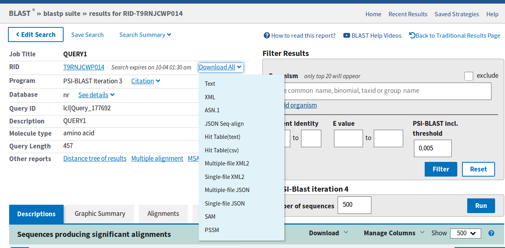

# Profile searches with PSI-BLAST and HMMer

# HMMer

## Introducción:

**HMMer** es un paquete de programas que nuclea varias funciones para realizar búsquedas en bases de datos mediante la utilización de profiles. Está basado en *profile Hidden Marcov Models*, presentados por Anders Krogh en 1994 (Krogh et al., 1994). Estos perfiles son una aproximación estadística del consenso de un alineamiento múltiple y utilizan un sistema de puntaje posición-específico, en contraste con métodos ya vistos como BLAST o FASTA en donde la matriz de puntajes utilizada es la misma en cada posición.

### Construcción:

Supongamos que trabajamos con globinas y queremos buscar homólogos lejanos. Para ello contamos con 50 secuencias de globinas las cuales alineamos y guardamos en el archivo *globins50.msf*. Como primer paso para realizar la búsqueda debemos generar un profile que las represente. Para crear el profile utilizamos la función **hmm2build** de la siguiente manera:

```Bash
hmm2build globin.hmm globins50.msf
```

**hmm2build** recibe como argumentos el archivo en el cual va a guardar el perfil (*globin.hmm*) y el archivo con el cual crearlo (*globins50.msf*). Si bien el contenido del archivo donde se guardó el perfil es legible, su contenido no debería tener sentido para ustedes (más allá del encabezado con información sobre las opciones que se utilizaron para crearlo) porque únicamente almacena los pesos de las transiciones de estado en el HMM.

### Calibración:

Este paso no es imprescindible pero si aconsejable. La calibración del perfil le otorga mayor sensibilidad en la búsqueda ya que modifica la estimación del E-value de los hits encontrados. Si recuerdan, la búsqueda contra bases de datos nos devuelve junto con cada alineamiento un score y un E-value, este último nos da una idea sobre la cantidad de hits que esperamos encontrar con ese score en una base de datos construida con secuencias aleatorias y se calcula según el largo de la secuencia query y el tamaño de la base de datos. En el caso de HMMer, la estimación del E-value es analítica y resulta muy conservativa, por lo que se dejan de lado posibles hits (como homólogos lejanos). Utilizando **hmm2calibrate** podemos calibrar el cálculo de E-values de manera empírica incrementando de manera significativa la sensibilidad de la búsqueda.

```Bash
hmm2calibrate globin.hmm
```

# Búsqueda en bases de datos

El comando para utilizar nuestro flamante profile en una búsqueda es **hmm2search**. En este caso lo vamos a utilizar contra el archivo Artemia.fa que contiene una única secuencia de globina en búsqueda de dominios pertenecientes a nuestra familia de interés.

```Bash
hmm2search globin.hmm Artemia.fa
```

La salida de este comando es más larga que las anteriores, consta de un encabezado con la información sobre el programa y los parámetros que utilizamos en la búsqueda:

```
hmmsearch - search a sequence database with a profile HMM  
HMMER 2.3.2 (Oct 2003)  
Copyright (C) 1992-2003 HHMI/Washington University School of Medicine  
Freely distributed under the GNU General Public License (GPL)  
- - - - - - - - - - - - - - - - - - - - - - - - - - - - - - - - - - - -
HMM file:                   globin2.hmm [globins50]  
Sequence database:          Artemia.fa  
per-sequence score cutoff:  [none]  
per-domain score cutoff:    [none]  
per-sequence Eval cutoff:   <= 10        
per-domain Eval cutoff:     [none]
- - - - - - - - - - - - - - - - - - - - - - - - - - - - - - - -

Query HMM:   globins50  
Accession:   [none]  
Description: [none]  
  [HMM has been calibrated; E-values are empirical estimates]  
```

Una lista tipo BLAST con los hits mas importantes ordenados por su E-value:

```
Scores for complete sequences (score includes all domains):
Sequence Description                                    Score    E-value  N
-------- -----------                                    -----    ------- ---
S13421   S13421 GLOBIN - BRINE SHRIMP                   474.3   1.7e-143   9
```

 Noten que después del E-value hay un campo que no se encontraban en los otros algoritmos de búsqueda denominado "N". Este valor representa la cantidad de dominios de nuestro profile que fueron encontrados en el hit.

Luego encontramos información sobre los dominios de nuestro profile individualmente. Los campos son el nombre del hit, el dominio que se alineó (por ej. 7/9 significa que es el dominio Nro 7 de 9 que hay en total en nuestro profile) **seq-f** y **seq-t** son las posiciones del hit donde comienza y termina el alineamiento de ese dominio y el campo siguiente a estos valores (sin nombre) es una codificación de qué parte de la secuencia fue alineada. Los corchetes significan extremos y los puntos posiciones en el medio, por lo que ".." significa que el alineamiento comenzó y terminó en una posición que no es terminal de la secuencia hit; "\[." significa que el alineamiento empieza al comienzo de la secuencia y termina en alguna posición en medio; al revés, ".\]" empieza en una posición intermedia y termina en el fin de la secuencia y por último "\[\]" es que el dominio abarca toda la secuencia. Los tres siguientes campos son análogos pero refiriéndose a la secuencia del dominio. y luego se reportan el score y el E-value.

```
Parsed for domains:
Sequence Domain  seq-f seq-t    hmm-f hmm-t      score  E-value
-------- ------- ----- -----    ----- -----      -----  -------
S13421     7/9     932  1075 ..     1   143 []    76.9  7.3e-24
S13421     2/9     153   293 ..     1   143 []    63.7  6.8e-20
S13421     3/9     307   450 ..     1   143 []    59.8  9.8e-19
S13421     8/9    1089  1234 ..     1   143 []    57.6  4.5e-18
S13421     9/9    1248  1390 ..     1   143 []    52.3  1.8e-16
S13421     1/9       1   143 [.     1   143 []    51.2    4e-16
S13421     4/9     464   607 ..     1   143 []    46.7  8.6e-15
S13421     6/9     775   918 ..     1   143 []    42.2    2e-13
S13421     5/9     623   762 ..     1   143 []    23.9  6.6e-08
```

 La sección siguiente contiene los alineamientos de los dominios que fueron hit en la lista anterior en un formato similar al de BLAST, teniendo como primera secuencia el consenso del profile (noten que hay aminoácidos en mayúsculas, estos se encuentran altamente conservados en el profile). AL igual que BLAST en medio de ambas secuencias se escriben los aminoácidos que machean y signos más (+) en donde hay mismatches con puntaje positivo en la matriz de sustitución.

```
Alignments of top-scoring domains:
S13421: domain 7 of 9, from 932 to 1075: score 76.9, E = 7.3e-24
                   *->eekalvksvwgkveknveevGaeaLerllvvyPetkryFpkFkdLss
                      +e a vk+ w+ v+ ++  vG  +++ l++ +P+ +++FpkF d+  
      S13421   932    REVAVVKQTWNLVKPDLMGVGMRIFKSLFEAFPAYQAVFPKFSDVPL 978  

                   adavkgsakvkahgkkVltalgdavkkldd...lkgalakLselHaqklr
                    d++++++ v +h   V t+l++ ++ ld++ +l+   ++L+e H+  lr
      S13421   979 -DKLEDTPAVGKHSISVTTKLDELIQTLDEpanLALLARQLGEDHIV-LR 1026

                   vdpenfkllsevllvvlaeklgkeftpevqaalekllaavataLaakYk<
                   v+   fk +++vl+  l++ lg+ f+  ++ +++k+++++++ +++  +
      S13421  1027 VNKPMFKSFGKVLVRLLENDLGQRFSSFASRSWHKAYDVIVEYIEEGLQ  1075

                   -*
                     
      S13421     -    -    

```

Llegando al final encontramos un histograma, similar al que nos mostraba FASTA. En este caso como nuestra "base de datos" tiene una sola secuencia no es informativo en absoluto.

```
Histogram of all scores:
score    obs    exp  (one = represents 1 sequences)
-----    ---    ---
  474      1      0|=}}}

Y por último algunos datos estadísticos que no tienen mucha utilidad y podemos obviar.

{{{% Statistical details of theoretical EVD fit:
              mu =   -38.9116
          lambda =     0.2355
chi-sq statistic =     0.0000
  P(chi-square)  =          0

Total sequences searched: 1

Whole sequence top hits:
tophits_s report:
     Total hits:           1
     Satisfying E cutoff:  1
     Total memory:         20K

Domain top hits:
tophits_s report:
     Total hits:           9
     Satisfying E cutoff:  9
     Total memory:         26K
```

## Búsqueda en bases de datos reales

HMMer puede leer los formatos de la mayoría de las bases de datos conocidas. A diferencia de BLAST no es necesario indexar la base de datos. Si recuerdan de la práctica de BLAST/FASTA, uno podía crear su propia base de datos donde realizar los alineamientos a partir de un archivo multifasta utilizando el comando **formatdb**, el cual crea todo el sistema de índices de *ktuplas* y demás archivos para facilitar la búsqueda. En este caso HMMer puede realizar la búsqueda directamente sobre el multifasta sin necesidad de más procesamiento. En nuestro servidor podemos realizar la búsqueda utilizando:

```Bash
hmm2search globin.hmm ~/Swissprot_db/Swissprot.fasta
```

## Modos de alineamiento

HMMer no utiliza los métodos clásicos de alineamiento (*Smith-Waterman o Needleman-Wunsch*) como el resto de los algoritmos de alineamiento sino que el modo de alinear (local o global) está dado por el modelo que construimos. Por defecto **hmm2build** lleva a cabo alineamientos que son globales con respecto al HMM y local con respecto a la secuencia objetivo, permitiendo alinear varios dominios en esa misma secuencia. Qué significa esto? que cada dominio se intenta alinear completamente en alguna porción de la secuencia objetivo. Si queremos recuperar secuencias que contengan alineamientos parciales de dominios podemos agregar la opcion -f a **hmm2build**.

## Bases de datos de HMM

 Así como nos es posible realizar búsquedas de profiles contra bases de datos de secuencias, podemos crear una base de datos de profiles y utilizar como query una secuencia. Este es el caso de la base de datos **PFAM** (Sonnhammer et al., 1997; Sonnhammer et al., 1998) que nuclea profiles de una gran variedad de dominios y es una herramienta sumamente utilizada para analizar secuencias de proteínas de las cuales no tenemos información previa.

Las bases de datos de profiles no son más que múltiples HMMs concatenados, por lo que el comando para construirlas es también **hmm2build**, pero vamos a utilizar la opción **-A** (append) para agregar nuevos profiles a nuestro archivo de HMMs.

Por ejemplo, si queremos construir una base de datos "myhmms" que contiene perfiles de dominios **rrm** de reconocimiento de ARN, **fn3** de fibronectina tipo III y **pkinase** del dominio catalítico de las kinasas podemos realizarlo fácilmente con:

```Bash
hmm2build -A myhmms rrm.sto
hmm2build -A myhmms fn3.sto
hmm2build -A myhmms pkinase.sto
hmm2calibrate myhmms
```

Para realizar búsquedas en nuestra nueva base de datos el comando que utilizamos es **hmm2pfam**. En este caso vamos a usar el producto del gen *Sevenless* de *Drosophila melanogaster* que codifica un receptor de *tyrosine kinase* esencial para el desarrollo de las células R7 del ojo guardado en el archivo **7LES_DROME**:

```Bash
hmm2pfam myhmms 7LES_DROME
```

La salida es muy parecida a la de **hmm2search** pero los hits reportados no serán secuencias sino dominios contenidos en la base de datos. En nuestro caso particular podrán notar que tenemos un hit contra un dominio RRM aun cuando nuestra proteína query no contiene ningún dominio de este tipo. Nos podemos dar cuenta que este hit es al menos sospechoso debido a su score negativo y su E-value cercano a 1. Por defecto el límite de E-value, al igual que BLAST es 10, este umbral es extremadamente permisivo y proclive a devolver ruido. Si queremos ser más quisquillosos podemos utilizar la opción **-E** seguida del umbral deseado. Por ejemplo:

```Bash
hmm2pfam -E 0.1 myhmms 7LES_DROME
```

## Alineamientos multiples con HMM

Otro uso que se les da a los profiles es la de asistir a la hora de llevar a cabo alineamientos múltiples de grandes cantidades de secuencias. En general este proceso suele ser lento y los alineamientos resultantes contienen errores que requieren curarse a mano. Utilizando HMMs construidos a partir de un alineamiento de unas pocas secuencias representativas, se pueden alinear grandes cantidades de secuencias relacionadas fácilmente. Siguiendo con nuestras globinas, tenemos un archivo (**globins630.fa**), que como habrán deducido, contiene 630 secuencias de globinas que vamos a alinear utilizando el comando **hmm2align**:

```Bash
hmmalign -o globins630.ali globin.hmm globins630.fa
```

mediante la opción **-o** indicamos el archivo en el que deseamos guardar el alineamiento (**globins630.ali**), y como argumentos debemos indicar el profile que vamos a utilizar como "semilla" y el archivo con las secuencias a alinear (**globin.hmm** y **globins630.fa** respectivamente). Noten que también se puede utilizar la opción **--outformat** para cambiar el formato del alineamiento producido. Por defecto se utiliza el formato *Stockholm*, pero también puede producir alineamientos en formato *MSF*, *Clustal*, *Phylip* y *SELEX*.

# PSI-BLAST

## Introducción
Psi-Blast es un algoritmo alternativo de BLAST que utiliza una matriz de puntajes posición específica para calcular el score de los alineamientos. Para calcular dicha matriz utiliza los hits que obtiene en cada iteración. De esta forma, la primer corrida es idéntica a un BLAST común, sin embargo, a partir de la segunda iteración los puntajes varían acorde a la conservación de cada posición permitiendo refinar la búsqueda y recuperando secuencias distantes que comparten motivos o dominios con nuestra secuencia query.

## Cuando BLAST falla

Digamos que tiene una secuencia query (abajo) y quiere predecir su estructur y función. Como vimos anteriormente uno recurre generalmente a BLAST para este tipo de tareas. Si logramos identificar una proteína suficientemente similar podríamos hipotetizar que comparten dichas caracteristicas.

```
>QUERY1
MKDTDLSTLLSIIRLTELKESKRNALLSLIFQLSVAYFIALVIVSRFVRYVNYITYNNLV
EFIIVLSLIMLIIVTDIFIKKYISKFSNILLETLNLKINSDNNFRREIINASKNHNDKNK
LYDLINKTFEKDNIEIKQLGLFIISSVINNFAYIILLSIGFILLNEVYSNLFSSRYTTIS
IFTLIVSYMLFIRNKIISSEEEEQIEYEKVATSYISSLINRILNTKFTENTTTIGQDKQL
YDSFKTPKIQYGAKVPVKLEEIKEVAKNIEHIPSKAYFVLLAESGLRPGELLNVSIENID
LKARIIWINKETQTKRAYFSFFSRKTAEFLEKVYLPAREEFIRANEKNIAKLAAANENQE
IDLEKWKAKLFPYKDDVLRRKIYEAMDRALGKRFELYALRRHFATYMQLKKVPPLAINIL
QGRVGPNEFRILKENYTVFTIEDLRKLYDEAGLVVLE
```

Vayan a la pagina de [BLAST](https://blast.ncbi.nlm.nih.gov/Blast.cgi) y utilicen el algoritmo de *protein BLAST* para buscar secuencias similares. **En el campo de base de datos seleccione pdb que es la base que contiene estructuras**

1. Cuantos hits con E-value < 0.005 encuentra?

## Usando PSI-BLAST

> **NOTA:** Realice  cada corrida de BLAST (e iteración de PSI-BLAST) en una ventana diferente, en varios casos van a necesitar comparar las salidas.

Vuelvan atrás a la página de alineamiento de proteínas, pero esta vez seleccionen la base de datos (nr) y en la sección de algoritmos seleccionen PSI-BLAST.

Teniendo en cuenta que el primer hit es nuestro query y por lo tanto vamos a ignorarlo:
2. Ahora cuantos hits significativos encuentra (E-value < 0.005)?
3. Cual es el coverage de estos hits?

## Construyendo la PSSM

Si se fijan debajo de los hits significativos van a tener la opción de seguir iterando PSI-BLAST:


 
Allí pueden especificar cuantas secuencias queremos utilizar para refinar nuestras PSSM (*Position-Specific Scoring Matrix*). Conservando el valor por defecto corramos la siguiente iteración.

4. Cuantos hits significativos podemos encontrar ahora (E-value < 0.005)?
5. Cómo se modificó el coverage de estos hits?
6. Por qué cree que BLAST puede identificar ahora más hits significativos y que es lo que está afectando el coverage?

Antes de proseguir realice una o dos iteraciones más y observe la aparición de nuevas proteínas identificadas (marcadas con amarillo).

## Guardando y reutilizando la PSSM

Ahora podemos utilizar la PSSM que está ajustada con los resultados obtenidos de PSI-BLAST para realizar búsquedas más significativas en otras bases de datos.
Para obtener la PSSM descarguenla arriba donde dice "*Dowload All*"



Volvamos una vez más a la página para realizar la búsqueda. Sin ingresar ninguna secuencia query seleccionemos otra vez la base de datos de estructuras (pdb) y como algoritmo PSI-BLAST. Por último, justo debajo del botón de BLAST, abramos el menú de *Algorithm parameters* y carguemos nuestra PSSM (justo al final). Ahora si corramos la búsqueda.

7. Podemos encontrar hits significativos de PDB ahora?
8. Qué función puede identificar en los primeros hits?

## Identificando residuos conservados

Ahora (sí tuvimos suerte) habremos podido identificar una relación estructural entre nuestra secuencia query secuencias de la base de datos de estructuras proteicas PDB. Digamos que ahora nos gustaría validar esa relación y para ello vamos a llevar a cabo un ensayo en el cual mutaremos residuos esenciales en nuestra secuencia para probar si estos afectan su función (o estructura).

La secuencia de nuestra query es larga (más de 400 aminoácidos) y un estudio completo de mutación podría resultar extremadamente costoso. Por ello debemos tener especial cuidado en elegir posiciones que sean más probables de ser esenciales para la estructura y/o función de nuestra proteína.

Para esto vamos a utilizar lo que ya hemos hecho con PSI-BLAST y el programa [Blast2logo](http://www.cbs.dtu.dk/biotools/Blast2logo/) y vamos a seleccionar (guiados por la conservación de los residuos) 4 de los siguientes 8 residuos para llevar a cabo nuestro ensayo de mutagénesis:

* (a): H271
* (b): R287
* (c): E290
* (d): Y334
* (e): F371
* (f): R379
* (g): R400
* (h): Y436

Para identificar los residuos conservados vamos al servidor de [Blast2logo](http://www.cbs.dtu.dk/biotools/Blast2logo/) y suban la secuencia query. Seleccionen la base de datos NR70 y denle *submit* (esto puede llevar un tiempito). En caso de que algo falle puede encontrar la salida [aca](http://www.cbs.dtu.dk/biotools/Blast2logo/teaching/Query1/).

Cuando esto termine deberían tener un logo de toda la secuencia. Si les resulta difícil de leer pueden hacer click en el botón *Customize visualization using Seq2Logo*. Al hacer esto los transfiere al servidor de **Seq2logo**, allí, sin tocar ninguna opción denle submit. Arriba tienen la opción de descargar cada imagen por separado (JPEG(1), JPEG(2), etc.) o en un solo archivo, similar a PDF (EPS) en el cual van a poderlo ver mucho más claro (recomiendo esta ultima opcion).

9. Viendo el logo, por que cree que las primeras ~150 posiciones se ven bastante planas (Bits<1)?
10. Cuales cree que son los 4 residuos que podríamos mutar de la lista para generar un impacto en la función de nuestra proteína query?

## Modelado por homología

Para seguir acumulando pruebas de que nuestro ensayo realmente podría funcionar vamos a ver si las posiciones que seleccionamos podrían ser parte de su sitio activo. Para esto vamos a utilizar el servidor [CPHmodels](http://www.cbs.dtu.dk/services/CPHmodels/), el cual realiza modelado por homologia. Este programa toma como entrada una secuencia proteica, busca secuencias similares en PDB y utiliza una estructura para generar una aproximación a la estructura 3D de la secuencia query. Este proceso puede tardar entre 10 y 20 minutos asi que para ser practicos, imaginen que corrieron el servidor y vayan a la salida [aca](http://www.cbs.dtu.dk/services/CPHmodels/teaching/query1.html).


La salida de CPHmodels no es muy intuitiva, sin embargo, el método provee un Z-score cuando el query y la proteína modelo tienen poca similitud de secuencia. Como regla general, un Z-score mayor a 10 significa que el modelo es confiable.

15. CPHmodels concuerda con PSI-BLAST en su elección del modelo para obtener la estructura?

La estructura puede descargarse (desde el link *query.pdb*) y abrirse con programas que tengamos instalados (Pymol) para poder corroborar la ubicación de las posiciones seleccionadas. Cómo explicar el uso de Pymol o cualquier otro software de visualización puede llevar bastante tiempo, aquí hay una visualización ya resuelta de la estructura en verde con los 4 residuos correctos en rojo:


16. Podrían estos residuos ser parte del sitio activo?


