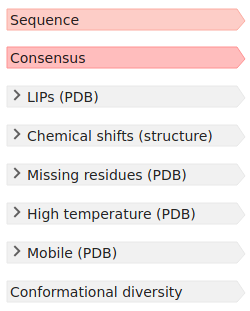
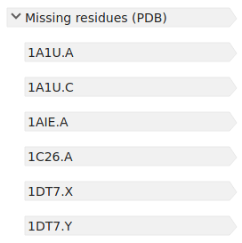

# PARTE I: Predicción de Desorden
<span style="color:gray"> Lucía B. Chemes, Juliana Glavina </span>

#### Recursos a utilizar:
* ProViz                [http://slim.icr.ac.uk/proviz/](http://slim.icr.ac.uk/proviz/)
* DisProt            [https://www.disprot.org](https://www.disprot.org)
* IUPred2A            [https://iupred2a.elte.hu/plot](https://iupred2a.elte.hu/plot)
* MobiDB            [http://mobidb.bio.unipd.it/](http://mobidb.bio.unipd.it/)

## Introducción

#### Objetivos.
* Interpretar alineamientos múltiples de secuencias
* Familiarizarse con distintos métodos de predicción de desorden
* Interpretación de los resultados de los distintos métodos

#### Métodos de predicción de desorden
Uno de los mayores desafíos en el campo de las proteínas es la predicción de la estructura tridimensional a partir de la estructura primaria incluyendo aquellas proteínas que son total o parcialmente desordenadas. Mientras que las proteínas globulares adquieren una única estructura nativa, las proteínas intrínsecamente desordenadas (IDPs) son un conjunto de estructuras tridimensionales. También pueden existir regiones de proteínas que pueden ser desordenadas como por ejemplo fragmentos proteicos que conectan dos dominios globulares, denominados loops o regiones que abarcan más de 30 residuos de longitud en cuyo caso se los llama regiones intrínsecamente desordenadas (IDRs).

La predicción de IDRs a partir de la secuencia de aminoácidos permite un análisis rápido y abarcativo de distintas proteínas permitiendo establecer hipótesis sobre la presencia de desorden en las proteínas (Dunker et al., 2008; van der Lee et al., 2014). La importancia que adquirieron las IDRs/IDPs en los últimos años llevó al desarrollo de numerosos métodos de predicción, pero en general se basan en tres estrategias de predicción de desorden: (1) a partir de composición de secuencia, (2) a partir de machine learning sobre estructuras determinadas por cristalografía de rayos X y (3) a partir de meta-predictores que integran los resultados predichos por diferentes métodos.

Entre los algoritmos que se basan en composición de secuencia podemos nombrar IUPred (Dosztányi et al., 2005a,b; Mészáros et al., 2018), que aplica un campo de energı́a desarrollado a partir de un gran número de proteínas con estructura determinada obtenidas de PDB. El primer algoritmo en machine learning fue PONDR (Obradovic et al., 2003; Romero et al., 1997), entrenado a partir de un grupo estructuras de proteínas globulares y atributos de secuencia asociados a residuos no resueltos en dichas estructuras, que corresponden a regiones flexibles dentro del cristal. GlobPlot (Linding et al., 2003b) fue entrenado estudiando la tendencia de un residuo a adquirir determinada estructura secundaria, hélices α o láminas β.

## Guía de Ejercicios - Desorden
### Ejercicio 1. Visualización de Alineamientos en ProViz.
**Antes de empezar, piensen: ¿Porqué es importante visualizar un MSA? ¿Qué información podemos obtener de los MSA?**

**ProViz** es una herramienta que permite visualizar alineamientos y estructura de dominios de una proteína online. Ingresa a la web de **ProViz** [http://slim.icr.ac.uk/proviz/](http://slim.icr.ac.uk/proviz/), y busca la proteína p53 ingresando su Accession Number en la ventana “search” (Accession Number: P04637):

Selecciona la proteína que se llama: [Cellular tumor antigen p53 (TP53) Homo sapiens (Human)](http://slim.icr.ac.uk/proviz/proviz.php?uniprot_acc=P04637). Es la primera de la lista.

Chequea que en la parte superior de la página, en **alignments** esté seleccionada la opción **QFO**.


1. ¿Qué regiones parecen estar mejor alineadas?

2. ¿Existe diferencia en la composición de secuencia entre las regiones mejor alineadas y las no tan bien alineadas?

3. ¿Se observan diferencias en el grado de conservación de estas regiones?

4. ¿A qué pueden deberse las diferencias observadas?


### Ejercicio 2. Predicción de desorden a partir de la secuencia.
Ingresa en la web de **IUPred2A** [https://iupred2a.elte.hu](https://iupred2a.elte.hu) e ingresa la proteína p53 (puede ingresarse la secuencia de aminoácidos, el UNIPROT ID, P53_HUMAN, o el accession number, P04637). El algoritmo IUPred considera que un residuo es desordenado cuando el valor de IUPred es mayor o igual a 0.5 y ordenado cuando es menor a 0.5. Anota las posiciones iniciales y finales de las regiones predichas como desordenadas. ¿Se correlacionan las regiones predichas como ordenadas o desordenadas con las diferencias observadas en el ejercicio anterior?

Imaginemos que queremos correr la predicción de desorden para cientos de proteínas, o que queremos contar el porcentaje de aminoácidos que se encuentran en regiones desordenadas ¿Le parece que el visualizador online sería una herramienta útil para hacerlo? ¡Claro que no! Por suerte, el algoritmo IUPred puede también correrse de manera local y además es rápido.

Abre una terminal y ve al directorio dónde está IUPred

```bash
cd ~/Tools/IUPred/

# Primero corremos IUPred sin ninguna opción para ver cómo es su uso:
./iupred2a.py

# Debería aparecer lo siguiente:

# Usage: ./iupred2a.py (options) (seqfile) (iupred type)
#    Available types: "long", "short", "glob"

# Options
#    -d str   -   Location of data directory (default='./')
#    -a       -   Enable ANCHOR2 predition

```

El archivo con la secuencia de p53 (P53_HUMAN.seq) está guardado en el mismo directorio que IUPred. En base a esto, el comando a utilizar es el siguiente

```bash
./iupred2a.py -a P53_HUMAN.seq long >P53_HUMAN.iupred

```

Explora el archivo generado (P53_HUMAN.iupred).

* ¿Cómo es el formato de los datos?
* ¿Las columnas tienen nombre? ¿Serán interpretadas correctamente por R?

Crea un script en R. Recuerda ver en qué directorio estás trabajando y configurarlo para trabajar en el directorio deseado, por si no lo recuerdas las funciones eran: ```getwd()``` y ```setwd()```.

A cargar los datos! ¿Te acordás cómo se hacía? Se utilizaba la función ```read.csv()```. Vamos a modificar algunos argumentos para que lea correctamente el archivo. Si querés saber que es cada argumento siempre se puede revisar el uso de las funciones con ```help(read.csv)```

``` R
p53 <- read.csv(file="~/Tools/IUPred/P53_HUMAN.iupred", header=F ,sep="\t", col.names=c("Posición","Aminoácido","Iupred","Anchor"),  comment.char="#")

```
Asegurate que los datos se cargaron correctamente, esperamos un dataframe con 4 columnas.

Ahora quisiéramos clasificar las posiciones en pase a la predicción realizada por IUPred como *Orden* y *Desorden*. ¿Se te ocurre cómo hacerlo?

Primero crearemos una columna en el dataframe:

``` R
p53$Prediccion <- NA
p53$Prediccion[p53$Iupred>=0.5] <- "Desorden"
p53$Prediccion[p53$Iupred<0.5] <- "Orden"

```

Para obtener un gráfico similar al que brinda el servidor de IUPred, utilizaremos la librería ggplot2:

``` R
library(ggplot2)

p3 <- ggplot(p53,aes(x=Posición,y=Iupred)) +
  scale_x_continuous(n.breaks = 20,expand = c(0.01,0.01)) +
  scale_y_continuous(n.breaks = 10) +
  geom_line(color="navyblue") +
  geom_point(aes(color=Prediccion)) +
  geom_hline(yintercept = 0.5,lty="dotted",size=1) +
  theme_linedraw()

```

Debería obtener un gráfico como el siguiente:


Ahora, quisiéramos evaluar el porcentaje de residuos predichos ordenados y desordenados. Por suerte, R tiene una función que “cuenta” por nosotros:

``` R
cuentaTotal <- table(p53$Prediccion)
porcentaje <- 100*cuentaTotal/length(p53$Position)

```

* En base a los valores obtenidos, ¿diría que la proteína p53 es altamente desordenada?

Por último, analizaremos la composición de aminoácidos de p53. Pero antes:
* ¿Qué residuos espera ver enriquecidos en las regiones desordenadas y cuales en las ordenadas? ¿Porqué?

Vamos a graficar el porcentaje de cada aminoácido predicho como ordenado o desordenado en la secuencia de p53

``` R
aminoacidos <- table(p53$Aminoácido,p53$Prediccion)

```
* ¿Qué hizo la función ```table``` en este caso?

Para calcular el porcentaje de aminoácidos:

``` R
aminoacidos_porcentaje <- 100*aminoácidos/length(p53$Posición)

```

Ahora lo vamos a convertir la tabla en un dataframe para graficar con ggplot2:

``` R
aminoacidos_df<-as.data.frame(aminoacidos_porcentaje)
colnames(aminoacidos_df) <- c("Aminoacidos","Prediccion","Porcentaje")

p2 <- ggplot(aminoacidos_df,aes(x=Aminoacidos,y=Porcentaje,fill=Prediccion)) + geom_col(position = "dodge") + theme_bw()

```
Deberías obtener un gráfico como el siguiente:


* ¿Qué aminoácidos son los más abundantes? ¿La abundancia de los aminoácidos coincide con lo esperado?


### Ejercicio 3. Base de datos DisProt
#### Objetivos:
* Familiarizarse con la base de datos DisProt
* Entender las técnicas experimentales que permiten la identificación de regiones desordenadas.

#### Introducción a Disprot
La base de datos DisProt es una colección de evidencia de desorden experimental recolectada de la literatura y curada manualmente. La evidencia corresponde a una región proteica, e incluye por lo menos: un experimento, el artículo científico correspondiente a ese experimento, el inicio y final de la región en la secuencia proteica y un término de anotación que corresponde a la Ontología de desorden. **Cada una de las entradas en la base de datos posee un identificador único**.

La ontología de desorden está organizada en cinco categorías diferentes:
* Estado estructural (*Structural State*): Order or Disorder
* Transición estructural (*Structural Transition*): Transiciones que pueden ocurrir entre diferentes estados estructurales (*Disorder to order*)
* Par de Interacción (*Interaction Partner*): La entidad que interactúa (proteína, ión, moléculas pequeñas)
* Función de desorden (*Disorder Function*): La función de una región incluyendo términos específicos a desorden.
* Método experimental (*Experimental Method*): Métodos experimentales para detectar regiones desordenadas.

**Ejercicio:**
La proteína p53 es una proteína supresora de tumores, es decir que su mutación favorece el crecimiento tumoral. p53 es uno de los genes más mutados en el cáncer humano, y actúa como un factor de transcripción que se expresa en todos los tejidos. Cumple un rol principal en el ciclo celular y es el regulador principal de la apoptosis. Es esencial para inducir la respuesta celular ante el daño al ADN, deteniendo el ciclo celular cuando las células no pueden reparar el ADN dañado por agentes genotóxicos. Si falla p53 podrían facilitar la formación de tumores celulares y en consecuencia producir cáncer. Alrededor de un 50% de los tumores humanos identificados poseen mutaciones en la proteína p53. Esta proteína, por su importancia para la salud humana, es una de las proteínas más estudiadas en cuanto a su estructura y función.

 1. Ingresa a la página web de DisProt (www.disprot.org) y encuentra la proteína p53 (P53_HUMAN, P04637). La búsqueda puede realizarse utilizando el Accession Number o por palabras claves. El identificador de DisProt que deberían encontrar es DP00086.

 2. Expande *Disprot consensus* ¿Qué tipo de información observa en la página?

    a. Expande *Structural state* y luego expande *Disorder*. ¿A qué corresponden los segmentos coloreados? ¿Qué tipo de evidencia poseen dichos fragmentos?

 3. ¿Cuál es el rol de las regiones desordenadas?

    a. Expande *Interaction* ¿Qué tipo de interacciones están indicadas?¿Qué técnicas se usaron para identificarlas?  
    b. Expande *Function* ¿Qué tipo de funciones están indicadas? ¿Qué técnicas se usaron para identificarlas?

 4. ¿Se observa algún dominio globular conservado?

    a. Expande *Domains*. ¿A qué corresponden los segmentos coloreados? ¿Qué tipo de evidencia poseen dichos fragmentos?

 5. ¿La evidencia experimental recolectada coincide con las predicciones realizadas en el **Ejercicio 1** y en el **Ejercicio 2**?


# PARTE II: Análisis de alineamientos múltiples de secuencia de proteínas - Visualizando alineamientos con JalView

#### Recursos a utilizar:
* JalView:                [https://www.jalview.org/](https://www.jalview.org/)
* PFAM:                    [https://pfam.xfam.org/](https://pfam.xfam.org/)

## Introducción
#### Objetivos:
* Aprender a utilizar Jalview para visualizar un MSA y familiarizarse con el manejo de programas de visualización de alineamientos.
* Interpretar alineamientos múltiples de secuencias. Identificar regiones de secuencia conservadas y asociarlas a diferentes elementos funcionales de las proteínas. 
* Visualizar y analizar los patrones de sustitución aminoacídica encontrados en proteínas modulares. Correlacionar con sus conocimientos sobre matrices de sustitución 


#### JalView, software de visualización de alineamientos.
Para poder visualizar alineamientos múltiples de secuencias (MSA, de sus siglas en inglés: Multiple Sequence Alignment) utilizaremos el visualizador de alineamientos JalView desarrollado en JAVA. Jalview permite generar alineamientos, manipularlos, editarlos y anotarlos. Tiene una interfaz que permite acceder remotamente numerosas herramientas como programas para realizar alineamientos múltiples de secuencia y predictores de estructura secundaria. A lo largo de la guía de ejercicios, introduciremos este programa usandolo para visualizar alineamientos múltiples de secuencias (MSAs) de proteínas modulares y discutir características de secuencia asociadas a los dominios y motivos funcionales encontrados en las  proteínas.

JalView es un programa disponible de manera gratuita, y está disponible para descargar e instalar en tu propia computadora en [https://www.jalview.org/](https://www.jalview.org/)
 
Existen un alto número de guías y tutoriales disponibles online que pueden encontrarse en: [https://www.jalview.org/training](https://www.jalview.org/training)

Los desarrolladores de JalView crearon numerosos videos de entrenamiento disponibles en el [Canal de YouTube de JalView](https://www.youtube.com/channel/UCIjpnvZB770yz7ftbrJ0tfw)

## Guía de Ejercicios - Jalview
### Ejercicio 1. Identificando Módulos en Proteínas
Utilizando su código UNIPROT (P04637), busca la proteína p53 humana (P53_HUMAN) en la base de datos PFAM [https://pfam.xfam.org/](https://pfam.xfam.org/)

La base de datos PFAM es una colección de familias de dominios de proteínas construida en base a alineamientos múltiples de secuencia y modelos ocultos de markov (HMMs). Las proteínas están compuestas por una o más regiones funcionales o dominios, que combinados de distintas maneras crean la diversidad proteica que se encuentra en las proteínas naturales.

* ¿Porqué es necesario identificar dominios en las proteínas?

Para buscar la proteína p53 puedes hacerlo ingresando en VIEW A SEQUENCE el accession number (P04637) o el uniprot ID (P53_HUMAN)

1. ¿Qué longitud tiene la proteína p53 humana?
2. Observar el esquema modular de p53: ¿Puedes identificar qué dominios PFAM tiene p53? ¿Qué nombres y qué funciones tienen?
3. ¿En qué regiones de la secuencia se encuentran estos dominios? Anotar de qué residuo a qué residuo abarca cada dominio, para usar más adelante. 
4. ¿Creen que estos dominios corresponden unívocamente a dominios globulares?
5. ¿A qué cree que corresponden las regiones marcadas como “Disorder” y “Low Complexity” en p53?
6. ¿Se corresponden las regiones identificadas como Disorder en PFAM con las predichas por IUPred en el **Ejercicio 1** de la guía de desorden?

### Ejercicio 2. Usando JalView para analizar un MSA de p53
1. Descarga un conjunto de secuencias homólogas de p53 obtenido de la base de datos Swiss Prot. El archivo también se puede obtener desde la página de la materia por:

``` bash
wget https://raw.githubusercontent.com/trypanosomatics/introduccion-bioinformatica/master/TPs/Regiones-flexibles/data/p53.fasta

```

    Lo abrimos en Jalview:
    
    *File* → *Input Alignment* →  *From File*


2. Para realizar el alineamiento utilizaremos el programa Clustal, al cual accederemos de manera remota desde JalView:

    *Web Service* → *Alignment* →  *Clustal* → *With defaults*

    o descarga y abre el archivo p53_aligned.fasta:

``` bash
wget https://raw.githubusercontent.com/trypanosomatics/introduccion-bioinformatica/master/TPs/Regiones-flexibles/data/p53_aligned.fasta

```

3. Inspecciona el alineamiento visualmente y reconoce algunas características de las secuencias. Si no se muestran todos los residuos y algunos aparecen como **“.”** ve a:

    *Format* → *Show Non-Conserved*

    a. Algunas secuencias son más cortas que otras ¿por qué crees que es esto?  
    b. ¿Todas las secuencias comienzan con el aminoácido metionina? A qué corresponden las secuencias que no?  
    c. ¿Si quieren construir un alineamiento de alta calidad, preservarían o descartarían estas secuencias?  
    d. Remuevan las secuencias que no corresponden a proteínas completas. Para ello seleccionar las secuencias haciendo click sobre el nombre de la misma en el panel izquierdo, la secuencia se marcará con una caja roja punteada. Remover la secuencia seleccionada utilizando la tecla *Backspace* o *Del*  
    e. ¿Existen regiones del alineamiento que no estén alineadas correctamente?

    Para editar el alineamiento, primero asegurate de realizar:
    
    *Select* → *Deselect All*

    **Eliminar gaps:** Seleccione con el mouse el gap o arrastrando sobre el grupo de gaps que desea eliminar y presione “Backspace” o “Del”
    **Agregar gaps:** Presione F2. En primera posición del alineamiento en la primera secuencia aparecerá un cursor de color negro. Colóquelo en la posición donde desee ingresar un gap y presione la barra espaciadora.

### Ejercicio 3. Análisis de distintas propiedades del MSA utilizando el menú COLOUR.
Este menú permite colorear el alineamiento con diferentes paletas de colores que permiten visualizar determinadas características fisicoquímicas o relacionadas con la conservación o identidad de secuencia que facilitan el análisis de la información contenida en el MSA.

Por ejemplo: *Percentage identity* colorea los residuos según el porcentaje de identidad en la columna. *Hydrophobicity* colorea los residuos según el grado de hidrofobicidad.

También es posible disminuir la intensidad de los colores según el grado de conservación (*By conservation*) o filtrar los colores según el porcentaje de identidad (*Above identity threshold*) a partir de un umbral deseado.

1. Seleccione para colorear el alineamiento desde el menú la opción:

    *Colour* → *Clustalx*

    Este esquema es muy comúnmente utilizado para la visualización de MSAs y permite representar información importante contenida en los patrones de sustitución de un MSA

    Observando el alineamiento intente identificar:

    a. ¿Cuál es la base del esquema de color “ClustalX” provisto por Jalview?  
    b. ¿Cuántos colores existen?  
    c. ¿Qué propiedades fisicoquímicas representa cada grupo de color?  
    d. La cisteína cumple un rol estructural importante en algunas proteínas (¿cual?). Qué observa respecto de la coloración de la cisteína: ¿Es siempre igual? ¿A qué se debe el cambio en la representación?  
    e. ¿En qué situaciones los residuos no están coloreados?  
    f. Hay residuos que siempre están coloreados? ¿Cuáles son y a qué cree que se debe?

2. Manteniendo el esquema de color Clustal, es posible filtrar regiones de acuerdo al % identidad en el alineamiento múltiple. Para ello, aplique el filtro de identidad yendo a:

    *Colour* → *Above identity threshold*

    Se abrirá una ventana en la cual podrá seleccionar el % identidad del filtro en escala de 0 a 100%. Explore los cambios en todo el alineamiento al variar la escala de 0 a 100%.

    Utilizando el filtro, respondan:

    a. ¿Qué regiones muestran una identidad de secuencia mayor al 80% en el MSA de p53? ¿Y al 100%? Anote los límites de estas regiones y responda: ¿Qué correlación observa con la información obtenida de PFAM?
 
    En las regiones conservadas, observe los patrones de sustitución en diferentes columnas del MSA. Estos patrones son un reflejo de la historia evolutiva de la proteína y contienen mucha información funcional que aprenderemos a cuantificar más adelante en la materia. Observando detenidamente, responda:

    b. ¿Qué tipos de patrones observa?  
    c. ¿Qué relación guardan estos patrones con las matrices PAM y BLOSUM utilizadas para construir alineamientos de proteínas?

## Ejercicios Adicionales de Desorden
### Ejercicio Adicional 1. Base de datos MobiDB

La base de datos MobiDB centraliza diferentes recursos que facilitan la anotación de proteínas desordenadas y de su función. MobiDB abarca distintos aspectos del desorden, desde regiones que carecen una estructura tridimensional definida anotadas o predichas como desordenadas hasta regiones que interactúan con otras proteínas, ADN o ARN preservando una estructura desordenada. Los datos provienen de bases de datos externas con datos manualmente curados, de datos experimentales como estructuras tridimensionales de las proteínas o predicciones.

1. Ingresa a la web de MobiDB [(http://mobidb.bio.unipd.it)](http://mobidb.bio.unipd.it) y busca la proteína p53 (P04637).

2. Ve a la pestaña *Predictions*. ¿Cuáles regiones son predichas como desordenadas por la mayoría de los métodos? ¿Qué métodos predicen más desorden y cuáles menos? ¿Hay mucha variación?

3. Ve a la pestaña *Indirect*.  A la izquierda se ve lo siguiente:

    

    En la primera línea se indica la secuencia y en la segunda línea (*Consensus*) se indica el consenso en base a la evidencia estructural. Ubique el mouse sobre las distintas regiones y responda: ¿Qué significan los distintos colores de las regiones marcados en el consenso?

4. Exploremos la evidencia proveniente de la estructura cristalográfica. Para eso despliegue  la sección *Missing residues* (PDB).

    


    * ¿Qué regiones tienen una estructura? 

    Busca la entrada 5AOM_A y cliquea en el último botón de la línea  (*go to PDB*). En la web de la base de datos de PDB ve a la sección *Macromolecules*. Mira la sección correspondiente a la cadena A. ¿Puedes decir cómo se determinó que estas regiones eran desordenadas?

5. Vuelva a la pestaña de MobiDB. Existen regiones de la proteína que presentan evidencia conflictiva de desorden en el consenso (marcadas como *conflict* en la pestaña *overview*). Mirando las distintas estructuras resueltas en MobiDB responda ¿Por qué estas regiones están marcadas como conflictivas?

### Ejercicio Adicional 2. Selección de regiones para determinar la estructura de una proteína.
Una de las aplicaciones principales de la predicción de desorden es encontrar regiones que son más adecuadas para determinar la estructura tridimensional de una proteína por cristalografía de rayos X.

1. ¿Por qué cree que predecir las regiones desordenadas puede ayudar a seleccionar el dominio para cristalizar?

Dada la siguiente proteína misteriosa:

```
>mystery_protein

MMQDLRLILIIVGAIAIIALLVHGFWTSRKERSSMFRDRPLKRMKSKRDDDSYDEDVEDD
EGVGEVRVHRVNHAPANAQEHEAARPSPQHQYQPPYASAQPRQPVQQPPEAQVPPQHAPH
PAQPVQQPAYQPQPEQPLQQPVSPQVAPAPQPVHSAPQPAQQAFQPAEPVAAPQPEPVAE
PAPVMDKPKRKEAVIIMNVAAHHGSELNGELLLNSIQQAGFIFGDMNIYHRHLSPDGSGP
ALFSLANMVKPGTFDPEMKDFTTPGVTIFMQVPSYGDELQNFKLMLQSAQHIADEVGGVV
LDDQRRMMTPQKLREYQDIIREVKDANA

```

2. Utilizando IUPred2A, pega solamente la secuencia sin el header ¿Qué región de la proteína trataría de cristalizar?

3. Para ver si la selección fue la correcta, haz un blast de la secuencia en la página web [https://blast.ncbi.nlm.nih.gov/Blast.cgi](https://blast.ncbi.nlm.nih.gov/Blast.cgi).

Pega la secuencia en el box *Enter Query Sequence*. Chequear que el box *align two or more sequences* no esté seleccionado.

En la sección **Choose Search Set**, selecciona la **database Protein Data Bank proteins (pdb)**.

Explora los resultados. ¿Elegimos correctamente?

> El predictor de desorden DisMeta cuya página web es: [http://www-nmr.cabm.rutgers.edu/bioinformatics/disorder/](http://www-nmr.cabm.rutgers.edu/bioinformatics/disorder/) se desarrolló específicamente para diseñar construcciones para cristalografía de rayos X. El método es **muy lento**. Por lo tanto, explora los resultados fuera de clase.

### Ejercicio Adicional 3. Búsqueda de regiones funcionales dentro de las IDPs, usando como ejemplo la proteína p53.

#### Objetivos:
* Familiarizarse con la identificación de sitios de unión en IDPs
* Interpretación de los resultados de los distintos métodos.

Muchas proteínas desordenadas ejercen su función uniéndose a una proteína globular, mediante una transición de desorden a orden. ANCHOR es un algoritmo para predecir sitios de unión en proteínas desordenadas buscando identificar segmentos que residen en regiones desordenadas y no forman interacciones intracatenarias suficientes que favorezcan el plegado por sí mismas, pero si logran estabilizarse al interactuar con una proteína globular.

1. Ve a la web de IUPred. [https://iupred2a.elte.hu](https://iupred2a.elte.hu)

2. Ingresa la proteína p53 (P53_HUMAN), asegúrate que la opción ANCHOR en *Context-dependent predictions* esté seleccionada.
    * ¿Cuántas regiones de interacción identifica ANCHOR?

3. La base de datos IDEAL se enfoca en IDRs que adoptan una estructura 3D al unirse a sus pares proteicos y se los llama *Protean Segments* (ProS), que se definen cuando la información estructural y no desestructural existen. Hay otros conceptos similares a los ProS que difieren en la definición, como por ejemplo, los *Molecular recognition features* (MoRFs), que tienen una limitación de longitud de 70 residues y los motivos lineales eucarióticos que son expresados por expresiones regulares.

    Ingresa a la base de datos IDEAL y busca la proteína p53 (P53_HUMAN, P04637). ¿Qué regiones están involucradas en la formación de complejos?

    Prestando atención a la región C-terminal:

    a. ¿A cuántas proteínas distintas se une p53?  
    b. ¿Qué tipo de estructura secundaria adquieren en el complejo?
        

4. Busca los PDBs: 1MA3, 1H26, 1JSP, 1DT7.

    ¿Cuán parecidas son las predicciones de ANCHOR con las regiones de unión conocidas?


Existen muchísimos métodos para predecir regiones desordenadas. Puedes probar los siguientes métodos en casa y ver las diferencias:

* PONDR [http://www.pondr.com](http://www.pondr.com)
* PredictProtein [http://ppopen.informatik.tu-muenchen.de/](http://ppopen.informatik.tu-muenchen.de/)

    IDPs se predicen por Meta-Disorder a partir de una combinación de NORSnet, DISOPRED2, PROFbval y Ucon.

* Globplot2 [http://globplot.embl.de/](http://globplot.embl.de/)
* DISOPRED3 [http://bioinf.cs.ucl.ac.uk/psipred/](http://bioinf.cs.ucl.ac.uk/psipred/)

    Elegir la opción Disopred3. Este método lleva por lo menos 20 minutos y puede tardar hasta 2 horas.

### Ejercicio Adicional 4. Análisis de una proteína altamente desordenada
1. Utiliza un predictor de desorden para la entrada de DisProt DP00039.
2. Utiliza el servidor protparam [(https://web.expasy.org/protparam/)](https://web.expasy.org/protparam/), o algún otro método que conozcas, para contar el número de aminoácidos cargados positivamente y el número de aminoácidos cargados negativamente.
3. Calcula la carga neta (o utiliza el servidor protparam)
4. Observa los segmentos de baja complejidad de secuencia (indicados en PFAM)
5. Observa los dominios PFAM.
6. ¿Existen contradicciones entre la asignación de dominios PFAM y el desorden predicho?

### Ejercicio Adicional 5. Caracterización de la proteína humana N-WASP (O00401) desde el punto de vista de orden y desorden.
1. Busca el número de estructuras PDB que existen para esta proteína ([http://www.rcsb.org/pdb/protein/O00401](http://www.rcsb.org/pdb/protein/O00401) → *Number of PDB entries for O00401*)
2. ¿Qué regiones de la proteína N-WASP están resueltas para cada entrada del PDB?
3. Busca familias PFAM y observa el tipo.

    a. Haz click en el domain  
    b. Haz click en *Curation and model*  
    c. Chequea el tipo: *Domain*, *Family* o *Motif*

4. Encuentra regiones de baja complejidad (“low complexity”) ¿Qué aminoácidos son más frecuentes en esta región?
5. Utiliza el predictor de desorden de tu preferencia.
6. ¿Qué regiones llamarías desordenadas?

