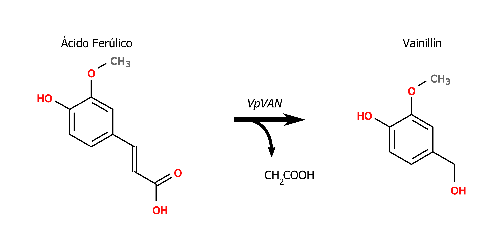
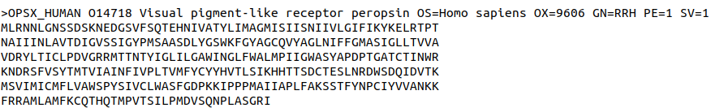

<style>
details > summary:first-of-type {
   display: list-item;
}
details summary { 
  cursor: pointer;
}

details summary > * {
  display: inline;
}

</style>



**Pagina en construccion**



## Materiales

[Descargar](https://drive.google.com/file/d/1DqEbN6w4AyrhyYSyUPai0_weAjJiR8sx/view?usp=sharing)

## Objetivos:

Objetivos:
- Familiarizarse con el uso de herramientas bioinformáticas por línea de comandos,
- Familiarizarse con los formatos característicos de datos biológicos.


## Introducción:

[EMBOSS](http://emboss.sourceforge.net/) es una *suite* bioinformática con una multitud de herramientas elementales en biología molecular y genética. Creada y mantenida por [EMBnet](http://www.embnet.org/), EMBOSS es la clase de herramientas que siempre es mejor tener que no tener, a pesar de que todo lo que podemos hacer con ésta, también lo podemos hacer *manualmente* (esto es, en papel o con algún software específico). La conveniencia radica en que el software no solo maneja información biológica en varios formatos para realizar distintos tipos de tareas, sino que además lo hace muy rápidamente (lo cual significa que es computacionalmente escalable) y con esfuerzo mínimo, dado que la *suite* provee al usuario con una interfaz unificada para todas las aplicaciones. La lista de herramientas disponibles es ENORME:

### Lista de utilidades en EMBOSS Suite

<details>

<summary> <h6> Ver lista completa </h6> </summary>

<table>
   <tr>
      <th>Program name</th>
      <th>Description</th>
   </tr>
   <tr>
      <td><a href="http://emboss.sourceforge.net/apps/cvs/emboss/apps/aaindexextract.html">aaindexextract</a></td>
      <td>
	 Extract amino acid property data from AAINDEX
      </td>
   </tr>
   <tr>
      <td><a href="http://emboss.sourceforge.net/apps/cvs/emboss/apps/abiview.html">abiview</a></td>
      <td>
	 Display the trace in an ABI sequencer file
      </td>
   </tr>
   <tr>
      <td><a href="http://emboss.sourceforge.net/apps/cvs/emboss/apps/acdc.html">acdc</a></td>
      <td>
	 Test an application ACD file
      </td>
   </tr>
   <tr>
      <td><a href="http://emboss.sourceforge.net/apps/cvs/emboss/apps/acdpretty.html">acdpretty</a></td>
      <td>
	 Correctly reformat an application ACD file
      </td>
   </tr>
   <tr>
      <td><a href="http://emboss.sourceforge.net/apps/cvs/emboss/apps/acdtable.html">acdtable</a></td>
      <td>
	 Generate an HTML table of parameters from an application ACD file
      </td>
   </tr>
   <tr>
      <td><a href="http://emboss.sourceforge.net/apps/cvs/emboss/apps/acdtrace.html">acdtrace</a></td>
      <td>
	 Trace processing of an application ACD file (for testing)
      </td>
   </tr>
   <tr>
      <td><a href="http://emboss.sourceforge.net/apps/cvs/emboss/apps/acdvalid.html">acdvalid</a></td>
      <td>
	 Validate an application ACD file
      </td>
   </tr>
   <tr>
      <td><a href="http://emboss.sourceforge.net/apps/cvs/emboss/apps/aligncopy.html">aligncopy</a></td>
      <td>
	 Read and write alignments
      </td>
   </tr>
   <tr>
      <td><a href="http://emboss.sourceforge.net/apps/cvs/emboss/apps/aligncopypair.html">aligncopypair</a></td>
      <td>
	 Read and write pairs from alignments
      </td>
   </tr>
   <tr>
      <td><a href="http://emboss.sourceforge.net/apps/cvs/emboss/apps/antigenic.html">antigenic</a></td>
      <td>
	 Find antigenic sites in proteins
      </td>
   </tr>
   <tr>
      <td><a href="http://emboss.sourceforge.net/apps/cvs/emboss/apps/assemblyget.html">assemblyget</a></td>
      <td>
	 Get assembly of sequence reads
      </td>
   </tr>
   <tr>
      <td><a href="http://emboss.sourceforge.net/apps/cvs/emboss/apps/backtranambig.html">backtranambig</a></td>
      <td>
	 Back-translate a protein sequence to ambiguous nucleotide sequence
      </td>
   </tr>
   <tr>
      <td><a href="http://emboss.sourceforge.net/apps/cvs/emboss/apps/backtranseq.html">backtranseq</a></td>
      <td>
	 Back-translate a protein sequence to a nucleotide sequence
      </td>
   </tr>
   <tr>
      <td><a href="http://emboss.sourceforge.net/apps/cvs/emboss/apps/banana.html">banana</a></td>
      <td>
	 Plot bending and curvature data for B-DNA
      </td>
   </tr>
   <tr>
      <td><a href="http://emboss.sourceforge.net/apps/cvs/emboss/apps/biosed.html">biosed</a></td>
      <td>
	 Replace or delete sequence sections
      </td>
   </tr>
   <tr>
      <td><a href="http://emboss.sourceforge.net/apps/cvs/emboss/apps/btwisted.html">btwisted</a></td>
      <td>
	 Calculate the twisting in a B-DNA sequence
      </td>
   </tr>
   <tr>
      <td><a href="http://emboss.sourceforge.net/apps/cvs/emboss/apps/cachedas.html">cachedas</a></td>
      <td>
	 Generate server cache file for DAS servers or for the DAS registry
      </td>
   </tr>
   <tr>
      <td><a href="http://emboss.sourceforge.net/apps/cvs/emboss/apps/cachedbfetch.html">cachedbfetch</a></td>
      <td>
	 Generate server cache file for Dbfetch/WSDbfetch data sources
      </td>
   </tr>
   <tr>
      <td><a href="http://emboss.sourceforge.net/apps/cvs/emboss/apps/cacheebeyesearch.html">cacheebeyesearch</a></td>
      <td>
	 Generate server cache file for EB-eye search domains
      </td>
   </tr>
   <tr>
      <td><a href="http://emboss.sourceforge.net/apps/cvs/emboss/apps/cacheensembl.html">cacheensembl</a></td>
      <td>
	 Generate server cache file for an Ensembl server
      </td>
   </tr>
   <tr>
      <td><a href="http://emboss.sourceforge.net/apps/cvs/emboss/apps/cai.html">cai</a></td>
      <td>
	 Calculate codon adaptation index
      </td>
   </tr>
   <tr>
      <td><a href="http://emboss.sourceforge.net/apps/cvs/emboss/apps/chaos.html">chaos</a></td>
      <td>
	 Draw a chaos game representation plot for a nucleotide sequence
      </td>
   </tr>
   <tr>
      <td><a href="http://emboss.sourceforge.net/apps/cvs/emboss/apps/charge.html">charge</a></td>
      <td>
	 Draw a protein charge plot
      </td>
   </tr>
   <tr>
      <td><a href="http://emboss.sourceforge.net/apps/cvs/emboss/apps/checktrans.html">checktrans</a></td>
      <td>
	 Report STOP codons and ORF statistics of a protein
      </td>
   </tr>
   <tr>
      <td><a href="http://emboss.sourceforge.net/apps/cvs/emboss/apps/chips.html">chips</a></td>
      <td>
	 Calculate Nc codon usage statistic
      </td>
   </tr>
   <tr>
      <td><a href="http://emboss.sourceforge.net/apps/cvs/emboss/apps/cirdna.html">cirdna</a></td>
      <td>
	 Draw circular map of DNA constructs
      </td>
   </tr>
   <tr>
      <td><a href="http://emboss.sourceforge.net/apps/cvs/emboss/apps/codcmp.html">codcmp</a></td>
      <td>
	 Codon usage table comparison
      </td>
   </tr>
   <tr>
      <td><a href="http://emboss.sourceforge.net/apps/cvs/emboss/apps/codcopy.html">codcopy</a></td>
      <td>
	 Copy and reformat a codon usage table
      </td>
   </tr>
   <tr>
      <td><a href="http://emboss.sourceforge.net/apps/cvs/emboss/apps/coderet.html">coderet</a></td>
      <td>
	 Extract CDS, mRNA and translations from feature tables
      </td>
   </tr>
   <tr>
      <td><a href="http://emboss.sourceforge.net/apps/cvs/emboss/apps/compseq.html">compseq</a></td>
      <td>
	 Calculate the composition of unique words in sequences
      </td>
   </tr>
   <tr>
      <td><a href="http://emboss.sourceforge.net/apps/cvs/emboss/apps/cons.html">cons</a></td>
      <td>
	 Create a consensus sequence from a multiple alignment
      </td>
   </tr>
   <tr>
      <td><a href="http://emboss.sourceforge.net/apps/cvs/emboss/apps/consambig.html">consambig</a></td>
      <td>
	 Create an ambiguous consensus sequence from a multiple alignment
      </td>
   </tr>
   <tr>
      <td><a href="http://emboss.sourceforge.net/apps/cvs/emboss/apps/cpgplot.html">cpgplot</a></td>
      <td>
	 Identify and plot CpG islands in nucleotide sequence(s)
      </td>
   </tr>
   <tr>
      <td><a href="http://emboss.sourceforge.net/apps/cvs/emboss/apps/cpgreport.html">cpgreport</a></td>
      <td>
	 Identify and report CpG-rich regions in nucleotide sequence(s)
      </td>
   </tr>
   <tr>
      <td><a href="http://emboss.sourceforge.net/apps/cvs/emboss/apps/cusp.html">cusp</a></td>
      <td>
	 Create a codon usage table from nucleotide sequence(s)
      </td>
   </tr>
   <tr>
      <td><a href="http://emboss.sourceforge.net/apps/cvs/emboss/apps/cutgextract.html">cutgextract</a></td>
      <td>
	 Extract codon usage tables from CUTG database
      </td>
   </tr>
   <tr>
      <td><a href="http://emboss.sourceforge.net/apps/cvs/emboss/apps/cutseq.html">cutseq</a></td>
      <td>
	 Remove a section from a sequence
      </td>
   </tr>
   <tr>
      <td><a href="http://emboss.sourceforge.net/apps/cvs/emboss/apps/dan.html">dan</a></td>
      <td>
	 Calculate nucleic acid melting temperature
      </td>
   </tr>
   <tr>
      <td><a href="http://emboss.sourceforge.net/apps/cvs/emboss/apps/dbiblast.html">dbiblast</a></td>
      <td>
	 Index a BLAST database
      </td>
   </tr>
   <tr>
      <td><a href="http://emboss.sourceforge.net/apps/cvs/emboss/apps/dbifasta.html">dbifasta</a></td>
      <td>
	 Index a fasta file database
      </td>
   </tr>
   <tr>
      <td><a href="http://emboss.sourceforge.net/apps/cvs/emboss/apps/dbiflat.html">dbiflat</a></td>
      <td>
	 Index a flat file database
      </td>
   </tr>
   <tr>
      <td><a href="http://emboss.sourceforge.net/apps/cvs/emboss/apps/dbigcg.html">dbigcg</a></td>
      <td>
	 Index a GCG formatted database
      </td>
   </tr>
   <tr>
      <td><a href="http://emboss.sourceforge.net/apps/cvs/emboss/apps/dbtell.html">dbtell</a></td>
      <td>
	 Display information about a public database
      </td>
   </tr>
   <tr>
      <td><a href="http://emboss.sourceforge.net/apps/cvs/emboss/apps/dbxcompress.html">dbxcompress</a></td>
      <td>
	 Compress an uncompressed dbx index
      </td>
   </tr>
   <tr>
      <td><a href="http://emboss.sourceforge.net/apps/cvs/emboss/apps/dbxedam.html">dbxedam</a></td>
      <td>
	 Index the EDAM ontology using b+tree indices
      </td>
   </tr>
   <tr>
      <td><a href="http://emboss.sourceforge.net/apps/cvs/emboss/apps/dbxfasta.html">dbxfasta</a></td>
      <td>
	 Index a fasta file database using b+tree indices
      </td>
   </tr>
   <tr>
      <td><a href="http://emboss.sourceforge.net/apps/cvs/emboss/apps/dbxflat.html">dbxflat</a></td>
      <td>
	 Index a flat file database using b+tree indices
      </td>
   </tr>
   <tr>
      <td><a href="http://emboss.sourceforge.net/apps/cvs/emboss/apps/dbxgcg.html">dbxgcg</a></td>
      <td>
	 Index a GCG formatted database using b+tree indices
      </td>
   </tr>
   <tr>
      <td><a href="http://emboss.sourceforge.net/apps/cvs/emboss/apps/dbxobo.html">dbxobo</a></td>
      <td>
	 Index an obo ontology using b+tree indices
      </td>
   </tr>
   <tr>
      <td><a href="http://emboss.sourceforge.net/apps/cvs/emboss/apps/dbxreport.html">dbxreport</a></td>
      <td>
	 Validate index and report internals for dbx databases
      </td>
   </tr>
   <tr>
      <td><a href="http://emboss.sourceforge.net/apps/cvs/emboss/apps/dbxresource.html">dbxresource</a></td>
      <td>
	 Index a data resource catalogue using b+tree indices
      </td>
   </tr>
   <tr>
      <td><a href="http://emboss.sourceforge.net/apps/cvs/emboss/apps/dbxstat.html">dbxstat</a></td>
      <td>
	 Dump statistics for dbx databases
      </td>
   </tr>
   <tr>
      <td><a href="http://emboss.sourceforge.net/apps/cvs/emboss/apps/dbxtax.html">dbxtax</a></td>
      <td>
	 Index NCBI taxonomy using b+tree indices
      </td>
   </tr>
   <tr>
      <td><a href="http://emboss.sourceforge.net/apps/cvs/emboss/apps/dbxuncompress.html">dbxuncompress</a></td>
      <td>
	 Uncompress a compressed dbx index
      </td>
   </tr>
   <tr>
      <td><a href="http://emboss.sourceforge.net/apps/cvs/emboss/apps/degapseq.html">degapseq</a></td>
      <td>
	 Remove non-alphabetic (e.g. gap) characters from sequences
      </td>
   </tr>
   <tr>
      <td><a href="http://emboss.sourceforge.net/apps/cvs/emboss/apps/density.html">density</a></td>
      <td>
	 Draw a nucleic acid density plot
      </td>
   </tr>
   <tr>
      <td><a href="http://emboss.sourceforge.net/apps/cvs/emboss/apps/descseq.html">descseq</a></td>
      <td>
	 Alter the name or description of a sequence
      </td>
   </tr>
   <tr>
      <td><a href="http://emboss.sourceforge.net/apps/cvs/emboss/apps/diffseq.html">diffseq</a></td>
      <td>
	 Compare and report features of two similar sequences
      </td>
   </tr>
   <tr>
      <td><a href="http://emboss.sourceforge.net/apps/cvs/emboss/apps/distmat.html">distmat</a></td>
      <td>
	 Create a distance matrix from a multiple sequence alignment
      </td>
   </tr>
   <tr>
      <td><a href="http://emboss.sourceforge.net/apps/cvs/emboss/apps/dotmatcher.html">dotmatcher</a></td>
      <td>
	 Draw a threshold dotplot of two sequences
      </td>
   </tr>
   <tr>
      <td><a href="http://emboss.sourceforge.net/apps/cvs/emboss/apps/dotpath.html">dotpath</a></td>
      <td>
	 Draw a non-overlapping wordmatch dotplot of two sequences
      </td>
   </tr>
   <tr>
      <td><a href="http://emboss.sourceforge.net/apps/cvs/emboss/apps/dottup.html">dottup</a></td>
      <td>
	 Display a wordmatch dotplot of two sequences
      </td>
   </tr>
   <tr>
      <td><a href="http://emboss.sourceforge.net/apps/cvs/emboss/apps/dreg.html">dreg</a></td>
      <td>
	 Regular expression search of nucleotide sequence(s)
      </td>
   </tr>
   <tr>
      <td><a href="http://emboss.sourceforge.net/apps/cvs/emboss/apps/drfinddata.html">drfinddata</a></td>
      <td>
	 Find public databases by data type
      </td>
   </tr>
   <tr>
      <td><a href="http://emboss.sourceforge.net/apps/cvs/emboss/apps/drfindformat.html">drfindformat</a></td>
      <td>
	 Find public databases by format
      </td>
   </tr>
   <tr>
      <td><a href="http://emboss.sourceforge.net/apps/cvs/emboss/apps/drfindid.html">drfindid</a></td>
      <td>
	 Find public databases by identifier
      </td>
   </tr>
   <tr>
      <td><a href="http://emboss.sourceforge.net/apps/cvs/emboss/apps/drfindresource.html">drfindresource</a></td>
      <td>
	 Find public databases by resource
      </td>
   </tr>
   <tr>
      <td><a href="http://emboss.sourceforge.net/apps/cvs/emboss/apps/drget.html">drget</a></td>
      <td>
	 Get data resource entries
      </td>
   </tr>
   <tr>
      <td><a href="http://emboss.sourceforge.net/apps/cvs/emboss/apps/drtext.html">drtext</a></td>
      <td>
	 Get data resource entries complete text
      </td>
   </tr>
   <tr>
      <td><a href="http://emboss.sourceforge.net/apps/cvs/emboss/apps/edamdef.html">edamdef</a></td>
      <td>
	 Find EDAM ontology terms by definition
      </td>
   </tr>
   <tr>
      <td><a href="http://emboss.sourceforge.net/apps/cvs/emboss/apps/edamhasinput.html">edamhasinput</a></td>
      <td>
	 Find EDAM ontology terms by has_input relation
      </td>
   </tr>
   <tr>
      <td><a href="http://emboss.sourceforge.net/apps/cvs/emboss/apps/edamhasoutput.html">edamhasoutput</a></td>
      <td>
	 Find EDAM ontology terms by has_output relation
      </td>
   </tr>
   <tr>
      <td><a href="http://emboss.sourceforge.net/apps/cvs/emboss/apps/edamisformat.html">edamisformat</a></td>
      <td>
	 Find EDAM ontology terms by is_format_of relation
      </td>
   </tr>
   <tr>
      <td><a href="http://emboss.sourceforge.net/apps/cvs/emboss/apps/edamisid.html">edamisid</a></td>
      <td>
	 Find EDAM ontology terms by is_identifier_of relation
      </td>
   </tr>
   <tr>
      <td><a href="http://emboss.sourceforge.net/apps/cvs/emboss/apps/edamname.html">edamname</a></td>
      <td>
	 Find EDAM ontology terms by name
      </td>
   </tr>
   <tr>
      <td><a href="http://emboss.sourceforge.net/apps/cvs/emboss/apps/edialign.html">edialign</a></td>
      <td>
	 Local multiple alignment of sequences
      </td>
   </tr>
   <tr>
      <td><a href="http://emboss.sourceforge.net/apps/cvs/emboss/apps/einverted.html">einverted</a></td>
      <td>
	 Find inverted repeats in nucleotide sequences
      </td>
   </tr>
   <tr>
      <td><a href="http://emboss.sourceforge.net/apps/cvs/emboss/apps/embossdata.html">embossdata</a></td>
      <td>
	 Find and retrieve EMBOSS data files
      </td>
   </tr>
   <tr>
      <td><a href="http://emboss.sourceforge.net/apps/cvs/emboss/apps/embossupdate.html">embossupdate</a></td>
      <td>
	 Checks for more recent updates to EMBOSS
      </td>
   </tr>
   <tr>
      <td><a href="http://emboss.sourceforge.net/apps/cvs/emboss/apps/embossversion.html">embossversion</a></td>
      <td>
	 Report the current EMBOSS version number
      </td>
   </tr>
   <tr>
      <td><a href="http://emboss.sourceforge.net/apps/cvs/emboss/apps/emma.html">emma</a></td>
      <td>
	 Multiple sequence alignment (ClustalW wrapper)
      </td>
   </tr>
   <tr>
      <td><a href="http://emboss.sourceforge.net/apps/cvs/emboss/apps/emowse.html">emowse</a></td>
      <td>
	 Search protein sequences by digest fragment molecular weight
      </td>
   </tr>
   <tr>
      <td><a href="http://emboss.sourceforge.net/apps/cvs/emboss/apps/entret.html">entret</a></td>
      <td>
	 Retrieve sequence entries from flatfile databases and files
      </td>
   </tr>
   <tr>
      <td><a href="http://emboss.sourceforge.net/apps/cvs/emboss/apps/epestfind.html">epestfind</a></td>
      <td>
	 Find PEST motifs as potential proteolytic cleavage sites
      </td>
   </tr>
   <tr>
      <td><a href="http://emboss.sourceforge.net/apps/cvs/emboss/apps/eprimer3.html">eprimer3</a></td>
      <td>
	 Pick PCR primers and hybridization oligos
      </td>
   </tr>
   <tr>
      <td><a href="http://emboss.sourceforge.net/apps/cvs/emboss/apps/eprimer32.html">eprimer32</a></td>
      <td>
	 Pick PCR primers and hybridization oligos
      </td>
   </tr>
   <tr>
      <td><a href="http://emboss.sourceforge.net/apps/cvs/emboss/apps/equicktandem.html">equicktandem</a></td>
      <td>
	 Find tandem repeats in nucleotide sequences
      </td>
   </tr>
   <tr>
      <td><a href="http://emboss.sourceforge.net/apps/cvs/emboss/apps/est2genome.html">est2genome</a></td>
      <td>
	 Align EST sequences to genomic DNA sequence
      </td>
   </tr>
   <tr>
      <td><a href="http://emboss.sourceforge.net/apps/cvs/emboss/apps/etandem.html">etandem</a></td>
      <td>
	 Find tandem repeats in a nucleotide sequence
      </td>
   </tr>
   <tr>
      <td><a href="http://emboss.sourceforge.net/apps/cvs/emboss/apps/extractalign.html">extractalign</a></td>
      <td>
	 Extract regions from a sequence alignment
      </td>
   </tr>
   <tr>
      <td><a href="http://emboss.sourceforge.net/apps/cvs/emboss/apps/extractfeat.html">extractfeat</a></td>
      <td>
	 Extract features from sequence(s)
      </td>
   </tr>
   <tr>
      <td><a href="http://emboss.sourceforge.net/apps/cvs/emboss/apps/extractseq.html">extractseq</a></td>
      <td>
	 Extract regions from a sequence
      </td>
   </tr>
   <tr>
      <td><a href="http://emboss.sourceforge.net/apps/cvs/emboss/apps/featcopy.html">featcopy</a></td>
      <td>
	 Read and write a feature table
      </td>
   </tr>
   <tr>
      <td><a href="http://emboss.sourceforge.net/apps/cvs/emboss/apps/featmerge.html">featmerge</a></td>
      <td>
	 Merge two overlapping feature tables
      </td>
   </tr>
   <tr>
      <td><a href="http://emboss.sourceforge.net/apps/cvs/emboss/apps/featreport.html">featreport</a></td>
      <td>
	 Read and write a feature table
      </td>
   </tr>
   <tr>
      <td><a href="http://emboss.sourceforge.net/apps/cvs/emboss/apps/feattext.html">feattext</a></td>
      <td>
	 Return a feature table original text
      </td>
   </tr>
   <tr>
      <td><a href="http://emboss.sourceforge.net/apps/cvs/emboss/apps/findkm.html">findkm</a></td>
      <td>
	 Calculate and plot enzyme reaction data
      </td>
   </tr>
   <tr>
      <td><a href="http://emboss.sourceforge.net/apps/cvs/emboss/apps/freak.html">freak</a></td>
      <td>
	 Generate residue/base frequency table or plot
      </td>
   </tr>
   <tr>
      <td><a href="http://emboss.sourceforge.net/apps/cvs/emboss/apps/fuzznuc.html">fuzznuc</a></td>
      <td>
	 Search for patterns in nucleotide sequences
      </td>
   </tr>
   <tr>
      <td><a href="http://emboss.sourceforge.net/apps/cvs/emboss/apps/fuzzpro.html">fuzzpro</a></td>
      <td>
	 Search for patterns in protein sequences
      </td>
   </tr>
   <tr>
      <td><a href="http://emboss.sourceforge.net/apps/cvs/emboss/apps/fuzztran.html">fuzztran</a></td>
      <td>
	 Search for patterns in protein sequences (translated)
      </td>
   </tr>
   <tr>
      <td><a href="http://emboss.sourceforge.net/apps/cvs/emboss/apps/garnier.html">garnier</a></td>
      <td>
	 Predict protein secondary structure using GOR method
      </td>
   </tr>
   <tr>
      <td><a href="http://emboss.sourceforge.net/apps/cvs/emboss/apps/geecee.html">geecee</a></td>
      <td>
	 Calculate fractional GC content of nucleic acid sequences
      </td>
   </tr>
   <tr>
      <td><a href="http://emboss.sourceforge.net/apps/cvs/emboss/apps/getorf.html">getorf</a></td>
      <td>
	 Find and extract open reading frames (ORFs)
      </td>
   </tr>
   <tr>
      <td><a href="http://emboss.sourceforge.net/apps/cvs/emboss/apps/godef.html">godef</a></td>
      <td>
	 Find GO ontology terms by definition
      </td>
   </tr>
   <tr>
      <td><a href="http://emboss.sourceforge.net/apps/cvs/emboss/apps/goname.html">goname</a></td>
      <td>
	 Find GO ontology terms by name
      </td>
   </tr>
   <tr>
      <td><a href="http://emboss.sourceforge.net/apps/cvs/emboss/apps/helixturnhelix.html">helixturnhelix</a></td>
      <td>
	 Identify nucleic acid-binding motifs in protein sequences
      </td>
   </tr>
   <tr>
      <td><a href="http://emboss.sourceforge.net/apps/cvs/emboss/apps/hmoment.html">hmoment</a></td>
      <td>
	 Calculate and plot hydrophobic moment for protein sequence(s)
      </td>
   </tr>
   <tr>
      <td><a href="http://emboss.sourceforge.net/apps/cvs/emboss/apps/iep.html">iep</a></td>
      <td>
	 Calculate the isoelectric point of proteins
      </td>
   </tr>
   <tr>
      <td><a href="http://emboss.sourceforge.net/apps/cvs/emboss/apps/infoalign.html">infoalign</a></td>
      <td>
	 Display basic information about a multiple sequence alignment
      </td>
   </tr>
   <tr>
      <td><a href="http://emboss.sourceforge.net/apps/cvs/emboss/apps/infoassembly.html">infoassembly</a></td>
      <td>
	 Display information about assemblies
      </td>
   </tr>
   <tr>
      <td><a href="http://emboss.sourceforge.net/apps/cvs/emboss/apps/infobase.html">infobase</a></td>
      <td>
	 Return information on a given nucleotide base
      </td>
   </tr>
   <tr>
      <td><a href="http://emboss.sourceforge.net/apps/cvs/emboss/apps/inforesidue.html">inforesidue</a></td>
      <td>
	 Return information on a given amino acid residue
      </td>
   </tr>
   <tr>
      <td><a href="http://emboss.sourceforge.net/apps/cvs/emboss/apps/infoseq.html">infoseq</a></td>
      <td>
	 Display basic information about sequences
      </td>
   </tr>
   <tr>
      <td><a href="http://emboss.sourceforge.net/apps/cvs/emboss/apps/isochore.html">isochore</a></td>
      <td>
	 Plot isochores in DNA sequences
      </td>
   </tr>
   <tr>
      <td><a href="http://emboss.sourceforge.net/apps/cvs/emboss/apps/jaspextract.html">jaspextract</a></td>
      <td>
	 Extract data from JASPAR
      </td>
   </tr>
   <tr>
      <td><a href="http://emboss.sourceforge.net/apps/cvs/emboss/apps/jaspscan.html">jaspscan</a></td>
      <td>
	 Scan DNA sequences for transcription factors
      </td>
   </tr>
   <tr>
      <td><a href="http://emboss.sourceforge.net/apps/cvs/emboss/apps/lindna.html">lindna</a></td>
      <td>
	 Draw linear maps of DNA constructs
      </td>
   </tr>
   <tr>
      <td><a href="http://emboss.sourceforge.net/apps/cvs/emboss/apps/listor.html">listor</a></td>
      <td>
	 Write a list file of the logical OR of two sets of sequences
      </td>
   </tr>
   <tr>
      <td><a href="http://emboss.sourceforge.net/apps/cvs/emboss/apps/makenucseq.html">makenucseq</a></td>
      <td>
	 Create random nucleotide sequences
      </td>
   </tr>
   <tr>
      <td><a href="http://emboss.sourceforge.net/apps/cvs/emboss/apps/makeprotseq.html">makeprotseq</a></td>
      <td>
	 Create random protein sequences
      </td>
   </tr>
   <tr>
      <td><a href="http://emboss.sourceforge.net/apps/cvs/emboss/apps/marscan.html">marscan</a></td>
      <td>
	 Find matrix/scaffold recognition (MRS) signatures in DNA sequences
      </td>
   </tr>
   <tr>
      <td><a href="http://emboss.sourceforge.net/apps/cvs/emboss/apps/maskambignuc.html">maskambignuc</a></td>
      <td>
	 Mask all ambiguity characters in nucleotide sequences with N
      </td>
   </tr>
   <tr>
      <td><a href="http://emboss.sourceforge.net/apps/cvs/emboss/apps/maskambigprot.html">maskambigprot</a></td>
      <td>
	 Mask all ambiguity characters in protein sequences with X
      </td>
   </tr>
   <tr>
      <td><a href="http://emboss.sourceforge.net/apps/cvs/emboss/apps/maskfeat.html">maskfeat</a></td>
      <td>
	 Write a sequence with masked features
      </td>
   </tr>
   <tr>
      <td><a href="http://emboss.sourceforge.net/apps/cvs/emboss/apps/maskseq.html">maskseq</a></td>
      <td>
	 Write a sequence with masked regions
      </td>
   </tr>
   <tr>
      <td><a href="http://emboss.sourceforge.net/apps/cvs/emboss/apps/matcher.html">matcher</a></td>
      <td>
	 Waterman-Eggert local alignment of two sequences
      </td>
   </tr>
   <tr>
      <td><a href="http://emboss.sourceforge.net/apps/cvs/emboss/apps/megamerger.html">megamerger</a></td>
      <td>
	 Merge two large overlapping DNA sequences
      </td>
   </tr>
   <tr>
      <td><a href="http://emboss.sourceforge.net/apps/cvs/emboss/apps/merger.html">merger</a></td>
      <td>
	 Merge two overlapping sequences
      </td>
   </tr>
   <tr>
      <td><a href="http://emboss.sourceforge.net/apps/cvs/emboss/apps/msbar.html">msbar</a></td>
      <td>
	 Mutate a sequence
      </td>
   </tr>
   <tr>
      <td><a href="http://emboss.sourceforge.net/apps/cvs/emboss/apps/mwcontam.html">mwcontam</a></td>
      <td>
	 Find weights common to multiple molecular weights files
      </td>
   </tr>
   <tr>
      <td><a href="http://emboss.sourceforge.net/apps/cvs/emboss/apps/mwfilter.html">mwfilter</a></td>
      <td>
	 Filter noisy data from molecular weights file
      </td>
   </tr>
   <tr>
      <td><a href="http://emboss.sourceforge.net/apps/cvs/emboss/apps/needle.html">needle</a></td>
      <td>
	 Needleman-Wunsch global alignment of two sequences
      </td>
   </tr>
   <tr>
      <td><a href="http://emboss.sourceforge.net/apps/cvs/emboss/apps/needleall.html">needleall</a></td>
      <td>
	 Many-to-many pairwise alignments of two sequence sets
      </td>
   </tr>
   <tr>
      <td><a href="http://emboss.sourceforge.net/apps/cvs/emboss/apps/newcpgreport.html">newcpgreport</a></td>
      <td>
	 Identify CpG islands in nucleotide sequence(s)
      </td>
   </tr>
   <tr>
      <td><a href="http://emboss.sourceforge.net/apps/cvs/emboss/apps/newcpgseek.html">newcpgseek</a></td>
      <td>
	 Identify and report CpG-rich regions in nucleotide sequence(s)
      </td>
   </tr>
   <tr>
      <td><a href="http://emboss.sourceforge.net/apps/cvs/emboss/apps/newseq.html">newseq</a></td>
      <td>
	 Create a sequence file from a typed-in sequence
      </td>
   </tr>
   <tr>
      <td><a href="http://emboss.sourceforge.net/apps/cvs/emboss/apps/nohtml.html">nohtml</a></td>
      <td>
	 Remove mark-up (e.g. HTML tags) from an ASCII text file
      </td>
   </tr>
   <tr>
      <td><a href="http://emboss.sourceforge.net/apps/cvs/emboss/apps/noreturn.html">noreturn</a></td>
      <td>
	 Remove carriage return from ASCII files
      </td>
   </tr>
   <tr>
      <td><a href="http://emboss.sourceforge.net/apps/cvs/emboss/apps/nospace.html">nospace</a></td>
      <td>
	 Remove whitespace from an ASCII text file
      </td>
   </tr>
   <tr>
      <td><a href="http://emboss.sourceforge.net/apps/cvs/emboss/apps/notab.html">notab</a></td>
      <td>
	 Replace tabs with spaces in an ASCII text file
      </td>
   </tr>
   <tr>
      <td><a href="http://emboss.sourceforge.net/apps/cvs/emboss/apps/notseq.html">notseq</a></td>
      <td>
	 Write to file a subset of an input stream of sequences
      </td>
   </tr>
   <tr>
      <td><a href="http://emboss.sourceforge.net/apps/cvs/emboss/apps/nthseq.html">nthseq</a></td>
      <td>
	 Write to file a single sequence from an input stream of sequences
      </td>
   </tr>
   <tr>
      <td><a href="http://emboss.sourceforge.net/apps/cvs/emboss/apps/nthseqset.html">nthseqset</a></td>
      <td>
	 Read and write (return) one set of sequences from many
      </td>
   </tr>
   <tr>
      <td><a href="http://emboss.sourceforge.net/apps/cvs/emboss/apps/octanol.html">octanol</a></td>
      <td>
	 Draw a White-Wimley protein hydropathy plot
      </td>
   </tr>
   <tr>
      <td><a href="http://emboss.sourceforge.net/apps/cvs/emboss/apps/oddcomp.html">oddcomp</a></td>
      <td>
	 Identify proteins with specified sequence word composition
      </td>
   </tr>
   <tr>
      <td><a href="http://emboss.sourceforge.net/apps/cvs/emboss/apps/ontocount.html">ontocount</a></td>
      <td>
	 Count ontology term(s)
      </td>
   </tr>
   <tr>
      <td><a href="http://emboss.sourceforge.net/apps/cvs/emboss/apps/ontoget.html">ontoget</a></td>
      <td>
	 Get ontology term(s)
      </td>
   </tr>
   <tr>
      <td><a href="http://emboss.sourceforge.net/apps/cvs/emboss/apps/ontogetcommon.html">ontogetcommon</a></td>
      <td>
	 Get common ancestor for terms
      </td>
   </tr>
   <tr>
      <td><a href="http://emboss.sourceforge.net/apps/cvs/emboss/apps/ontogetdown.html">ontogetdown</a></td>
      <td>
	 Get ontology term(s) by parent id
      </td>
   </tr>
   <tr>
      <td><a href="http://emboss.sourceforge.net/apps/cvs/emboss/apps/ontogetobsolete.html">ontogetobsolete</a></td>
      <td>
	 Get ontology ontology terms
      </td>
   </tr>
   <tr>
      <td><a href="http://emboss.sourceforge.net/apps/cvs/emboss/apps/ontogetroot.html">ontogetroot</a></td>
      <td>
	 Get ontology root terms by child identifier
      </td>
   </tr>
   <tr>
      <td><a href="http://emboss.sourceforge.net/apps/cvs/emboss/apps/ontogetsibs.html">ontogetsibs</a></td>
      <td>
	 Get ontology term(s) by id with common parent
      </td>
   </tr>
   <tr>
      <td><a href="http://emboss.sourceforge.net/apps/cvs/emboss/apps/ontogetup.html">ontogetup</a></td>
      <td>
	 Get ontology term(s) by id of child
      </td>
   </tr>
   <tr>
      <td><a href="http://emboss.sourceforge.net/apps/cvs/emboss/apps/ontoisobsolete.html">ontoisobsolete</a></td>
      <td>
	 Report whether an ontology term id is obsolete
      </td>
   </tr>
   <tr>
      <td><a href="http://emboss.sourceforge.net/apps/cvs/emboss/apps/ontotext.html">ontotext</a></td>
      <td>
	 Get ontology term(s) original full text
      </td>
   </tr>
   <tr>
      <td><a href="http://emboss.sourceforge.net/apps/cvs/emboss/apps/palindrome.html">palindrome</a></td>
      <td>
	 Find inverted repeats in nucleotide sequence(s)
      </td>
   </tr>
   <tr>
      <td><a href="http://emboss.sourceforge.net/apps/cvs/emboss/apps/pasteseq.html">pasteseq</a></td>
      <td>
	 Insert one sequence into another
      </td>
   </tr>
   <tr>
      <td><a href="http://emboss.sourceforge.net/apps/cvs/emboss/apps/patmatdb.html">patmatdb</a></td>
      <td>
	 Search protein sequences with a sequence motif
      </td>
   </tr>
   <tr>
      <td><a href="http://emboss.sourceforge.net/apps/cvs/emboss/apps/patmatmotifs.html">patmatmotifs</a></td>
      <td>
	 Scan a protein sequence with motifs from the PROSITE database
      </td>
   </tr>
   <tr>
      <td><a href="http://emboss.sourceforge.net/apps/cvs/emboss/apps/pepcoil.html">pepcoil</a></td>
      <td>
	 Predict coiled coil regions in protein sequences
      </td>
   </tr>
   <tr>
      <td><a href="http://emboss.sourceforge.net/apps/cvs/emboss/apps/pepdigest.html">pepdigest</a></td>
      <td>
	 Report on protein proteolytic enzyme or reagent cleavage sites
      </td>
   </tr>
   <tr>
      <td><a href="http://emboss.sourceforge.net/apps/cvs/emboss/apps/pepinfo.html">pepinfo</a></td>
      <td>
	 Plot amino acid properties of a protein sequence in parallel
      </td>
   </tr>
   <tr>
      <td><a href="http://emboss.sourceforge.net/apps/cvs/emboss/apps/pepnet.html">pepnet</a></td>
      <td>
	 Draw a helical net for a protein sequence
      </td>
   </tr>
   <tr>
      <td><a href="http://emboss.sourceforge.net/apps/cvs/emboss/apps/pepstats.html">pepstats</a></td>
      <td>
	 Calculate statistics of protein properties
      </td>
   </tr>
   <tr>
      <td><a href="http://emboss.sourceforge.net/apps/cvs/emboss/apps/pepwheel.html">pepwheel</a></td>
      <td>
	 Draw a helical wheel diagram for a protein sequence
      </td>
   </tr>
   <tr>
      <td><a href="http://emboss.sourceforge.net/apps/cvs/emboss/apps/pepwindow.html">pepwindow</a></td>
      <td>
	 Draw a hydropathy plot for a protein sequence
      </td>
   </tr>
   <tr>
      <td><a href="http://emboss.sourceforge.net/apps/cvs/emboss/apps/pepwindowall.html">pepwindowall</a></td>
      <td>
	 Draw Kyte-Doolittle hydropathy plot for a protein alignment
      </td>
   </tr>
   <tr>
      <td><a href="http://emboss.sourceforge.net/apps/cvs/emboss/apps/plotcon.html">plotcon</a></td>
      <td>
	 Plot conservation of a sequence alignment
      </td>
   </tr>
   <tr>
      <td><a href="http://emboss.sourceforge.net/apps/cvs/emboss/apps/plotorf.html">plotorf</a></td>
      <td>
	 Plot potential open reading frames in a nucleotide sequence
      </td>
   </tr>
   <tr>
      <td><a href="http://emboss.sourceforge.net/apps/cvs/emboss/apps/polydot.html">polydot</a></td>
      <td>
	 Draw dotplots for all-against-all comparison of a sequence set
      </td>
   </tr>
   <tr>
      <td><a href="http://emboss.sourceforge.net/apps/cvs/emboss/apps/preg.html">preg</a></td>
      <td>
	 Regular expression search of protein sequence(s)
      </td>
   </tr>
   <tr>
      <td><a href="http://emboss.sourceforge.net/apps/cvs/emboss/apps/prettyplot.html">prettyplot</a></td>
      <td>
	 Draw a sequence alignment with pretty formatting
      </td>
   </tr>
   <tr>
      <td><a href="http://emboss.sourceforge.net/apps/cvs/emboss/apps/prettyseq.html">prettyseq</a></td>
      <td>
	 Write a nucleotide sequence and its translation to file
      </td>
   </tr>
   <tr>
      <td><a href="http://emboss.sourceforge.net/apps/cvs/emboss/apps/primersearch.html">primersearch</a></td>
      <td>
	 Search DNA sequences for matches with primer pairs
      </td>
   </tr>
   <tr>
      <td><a href="http://emboss.sourceforge.net/apps/cvs/emboss/apps/printsextract.html">printsextract</a></td>
      <td>
	 Extract data from PRINTS database for use by pscan
      </td>
   </tr>
   <tr>
      <td><a href="http://emboss.sourceforge.net/apps/cvs/emboss/apps/profit.html">profit</a></td>
      <td>
	 Scan one or more sequences with a simple frequency matrix
      </td>
   </tr>
   <tr>
      <td><a href="http://emboss.sourceforge.net/apps/cvs/emboss/apps/prophecy.html">prophecy</a></td>
      <td>
	 Create frequency matrix or profile from a multiple alignment
      </td>
   </tr>
   <tr>
      <td><a href="http://emboss.sourceforge.net/apps/cvs/emboss/apps/prophet.html">prophet</a></td>
      <td>
	 Scan one or more sequences with a Gribskov or Henikoff profile
      </td>
   </tr>
   <tr>
      <td><a href="http://emboss.sourceforge.net/apps/cvs/emboss/apps/prosextract.html">prosextract</a></td>
      <td>
	 Process the PROSITE motif database for use by patmatmotifs
      </td>
   </tr>
   <tr>
      <td><a href="http://emboss.sourceforge.net/apps/cvs/emboss/apps/pscan.html">pscan</a></td>
      <td>
	 Scan protein sequence(s) with fingerprints from the PRINTS database
      </td>
   </tr>
   <tr>
      <td><a href="http://emboss.sourceforge.net/apps/cvs/emboss/apps/psiphi.html">psiphi</a></td>
      <td>
	 Calculates phi and psi torsion angles from protein coordinates
      </td>
   </tr>
   <tr>
      <td><a href="http://emboss.sourceforge.net/apps/cvs/emboss/apps/rebaseextract.html">rebaseextract</a></td>
      <td>
	 Process the REBASE database for use by restriction enzyme applications
      </td>
   </tr>
   <tr>
      <td><a href="http://emboss.sourceforge.net/apps/cvs/emboss/apps/recoder.html">recoder</a></td>
      <td>
	 Find restriction sites to remove (mutate) with no translation change
      </td>
   </tr>
   <tr>
      <td><a href="http://emboss.sourceforge.net/apps/cvs/emboss/apps/redata.html">redata</a></td>
      <td>
	 Retrieve information from REBASE restriction enzyme database
      </td>
   </tr>
   <tr>
      <td><a href="http://emboss.sourceforge.net/apps/cvs/emboss/apps/refseqget.html">refseqget</a></td>
      <td>
	 Get reference sequence
      </td>
   </tr>
   <tr>
      <td><a href="http://emboss.sourceforge.net/apps/cvs/emboss/apps/remap.html">remap</a></td>
      <td>
	 Display restriction enzyme binding sites in a nucleotide sequence
      </td>
   </tr>
   <tr>
      <td><a href="http://emboss.sourceforge.net/apps/cvs/emboss/apps/restover.html">restover</a></td>
      <td>
	 Find restriction enzymes producing a specific overhang
      </td>
   </tr>
   <tr>
      <td><a href="http://emboss.sourceforge.net/apps/cvs/emboss/apps/restrict.html">restrict</a></td>
      <td>
	 Report restriction enzyme cleavage sites in a nucleotide sequence
      </td>
   </tr>
   <tr>
      <td><a href="http://emboss.sourceforge.net/apps/cvs/emboss/apps/revseq.html">revseq</a></td>
      <td>
	 Reverse and complement a nucleotide sequence
      </td>
   </tr>
   <tr>
      <td><a href="http://emboss.sourceforge.net/apps/cvs/emboss/apps/seealso.html">seealso</a></td>
      <td>
	 Find programs with similar function to a specified program
      </td>
   </tr>
   <tr>
      <td><a href="http://emboss.sourceforge.net/apps/cvs/emboss/apps/seqcount.html">seqcount</a></td>
      <td>
	 Read and count sequences
      </td>
   </tr>
   <tr>
      <td><a href="http://emboss.sourceforge.net/apps/cvs/emboss/apps/seqmatchall.html">seqmatchall</a></td>
      <td>
	 All-against-all word comparison of a sequence set
      </td>
   </tr>
   <tr>
      <td><a href="http://emboss.sourceforge.net/apps/cvs/emboss/apps/seqret.html">seqret</a></td>
      <td>
	 Read and write (return) sequences
      </td>
   </tr>
   <tr>
      <td><a href="http://emboss.sourceforge.net/apps/cvs/emboss/apps/seqretsetall.html">seqretsetall</a></td>
      <td>
	 Read and write (return) many sets of sequences
      </td>
   </tr>
   <tr>
      <td><a href="http://emboss.sourceforge.net/apps/cvs/emboss/apps/seqretsplit.html">seqretsplit</a></td>
      <td>
	 Read sequences and write them to individual files
      </td>
   </tr>
   <tr>
      <td><a href="http://emboss.sourceforge.net/apps/cvs/emboss/apps/seqxref.html">seqxref</a></td>
      <td>
	 Retrieve all database cross-references for a sequence entry
      </td>
   </tr>
   <tr>
      <td><a href="http://emboss.sourceforge.net/apps/cvs/emboss/apps/seqxrefget.html">seqxrefget</a></td>
      <td>
	 Retrieve all cross-referenced data for a sequence entry
      </td>
   </tr>
   <tr>
      <td><a href="http://emboss.sourceforge.net/apps/cvs/emboss/apps/servertell.html">servertell</a></td>
      <td>
	 Display information about a public server
      </td>
   </tr>
   <tr>
      <td><a href="http://emboss.sourceforge.net/apps/cvs/emboss/apps/showalign.html">showalign</a></td>
      <td>
	 Display a multiple sequence alignment in pretty format
      </td>
   </tr>
   <tr>
      <td><a href="http://emboss.sourceforge.net/apps/cvs/emboss/apps/showdb.html">showdb</a></td>
      <td>
	 Display information on configured databases
      </td>
   </tr>
   <tr>
      <td><a href="http://emboss.sourceforge.net/apps/cvs/emboss/apps/showfeat.html">showfeat</a></td>
      <td>
	 Display features of a sequence in pretty format
      </td>
   </tr>
   <tr>
      <td><a href="http://emboss.sourceforge.net/apps/cvs/emboss/apps/showorf.html">showorf</a></td>
      <td>
	 Display a nucleotide sequence and translation in pretty format
      </td>
   </tr>
   <tr>
      <td><a href="http://emboss.sourceforge.net/apps/cvs/emboss/apps/showpep.html">showpep</a></td>
      <td>
	 Display protein sequences with features in pretty format
      </td>
   </tr>
   <tr>
      <td><a href="http://emboss.sourceforge.net/apps/cvs/emboss/apps/showseq.html">showseq</a></td>
      <td>
	 Display sequences with features in pretty format
      </td>
   </tr>
   <tr>
      <td><a href="http://emboss.sourceforge.net/apps/cvs/emboss/apps/showserver.html">showserver</a></td>
      <td>
	 Display information on configured servers
      </td>
   </tr>
   <tr>
      <td><a href="http://emboss.sourceforge.net/apps/cvs/emboss/apps/shuffleseq.html">shuffleseq</a></td>
      <td>
	 Shuffle a set of sequences maintaining composition
      </td>
   </tr>
   <tr>
      <td><a href="http://emboss.sourceforge.net/apps/cvs/emboss/apps/sigcleave.html">sigcleave</a></td>
      <td>
	 Report on signal cleavage sites in a protein sequence
      </td>
   </tr>
   <tr>
      <td><a href="http://emboss.sourceforge.net/apps/cvs/emboss/apps/silent.html">silent</a></td>
      <td>
	 Find restriction sites to insert (mutate) with no translation change
      </td>
   </tr>
   <tr>
      <td><a href="http://emboss.sourceforge.net/apps/cvs/emboss/apps/sirna.html">sirna</a></td>
      <td>
	 Find siRNA duplexes in mRNA
      </td>
   </tr>
   <tr>
      <td><a href="http://emboss.sourceforge.net/apps/cvs/emboss/apps/sixpack.html">sixpack</a></td>
      <td>
	 Display a DNA sequence with 6-frame translation and ORFs
      </td>
   </tr>
   <tr>
      <td><a href="http://emboss.sourceforge.net/apps/cvs/emboss/apps/sizeseq.html">sizeseq</a></td>
      <td>
	 Sort sequences by size
      </td>
   </tr>
   <tr>
      <td><a href="http://emboss.sourceforge.net/apps/cvs/emboss/apps/skipredundant.html">skipredundant</a></td>
      <td>
	 Remove redundant sequences from an input set
      </td>
   </tr>
   <tr>
      <td><a href="http://emboss.sourceforge.net/apps/cvs/emboss/apps/skipseq.html">skipseq</a></td>
      <td>
	 Read and write (return) sequences, skipping first few
      </td>
   </tr>
   <tr>
      <td><a href="http://emboss.sourceforge.net/apps/cvs/emboss/apps/splitsource.html">splitsource</a></td>
      <td>
	 Split sequence(s) into original source sequences
      </td>
   </tr>
   <tr>
      <td><a href="http://emboss.sourceforge.net/apps/cvs/emboss/apps/splitter.html">splitter</a></td>
      <td>
	 Split sequence(s) into smaller sequences
      </td>
   </tr>
   <tr>
      <td><a href="http://emboss.sourceforge.net/apps/cvs/emboss/apps/stretcher.html">stretcher</a></td>
      <td>
	 Needleman-Wunsch rapid global alignment of two sequences
      </td>
   </tr>
   <tr>
      <td><a href="http://emboss.sourceforge.net/apps/cvs/emboss/apps/stssearch.html">stssearch</a></td>
      <td>
	 Search a DNA database for matches with a set of STS primers
      </td>
   </tr>
   <tr>
      <td><a href="http://emboss.sourceforge.net/apps/cvs/emboss/apps/supermatcher.html">supermatcher</a></td>
      <td>
	 Calculate approximate local pair-wise alignments of larger sequences
      </td>
   </tr>
   <tr>
      <td><a href="http://emboss.sourceforge.net/apps/cvs/emboss/apps/syco.html">syco</a></td>
      <td>
	 Draw synonymous codon usage statistic plot for a nucleotide sequence
      </td>
   </tr>
   <tr>
      <td><a href="http://emboss.sourceforge.net/apps/cvs/emboss/apps/taxget.html">taxget</a></td>
      <td>
	 Get taxon(s)
      </td>
   </tr>
   <tr>
      <td><a href="http://emboss.sourceforge.net/apps/cvs/emboss/apps/taxgetdown.html">taxgetdown</a></td>
      <td>
	 Get descendants of taxon(s)
      </td>
   </tr>
   <tr>
      <td><a href="http://emboss.sourceforge.net/apps/cvs/emboss/apps/taxgetrank.html">taxgetrank</a></td>
      <td>
	 Get parents of taxon(s)
      </td>
   </tr>
   <tr>
      <td><a href="http://emboss.sourceforge.net/apps/cvs/emboss/apps/taxgetspecies.html">taxgetspecies</a></td>
      <td>
	 Get all species under taxon(s)
      </td>
   </tr>
   <tr>
      <td><a href="http://emboss.sourceforge.net/apps/cvs/emboss/apps/taxgetup.html">taxgetup</a></td>
      <td>
	 Get parents of taxon(s)
      </td>
   </tr>
   <tr>
      <td><a href="http://emboss.sourceforge.net/apps/cvs/emboss/apps/tcode.html">tcode</a></td>
      <td>
	 Identify protein-coding regions using Fickett TESTCODE statistic
      </td>
   </tr>
   <tr>
      <td><a href="http://emboss.sourceforge.net/apps/cvs/emboss/apps/textget.html">textget</a></td>
      <td>
	 Get text data entries
      </td>
   </tr>
   <tr>
      <td><a href="http://emboss.sourceforge.net/apps/cvs/emboss/apps/textsearch.html">textsearch</a></td>
      <td>
	 Search the textual description of sequence(s)
      </td>
   </tr>
   <tr>
      <td><a href="http://emboss.sourceforge.net/apps/cvs/emboss/apps/tfextract.html">tfextract</a></td>
      <td>
	 Process TRANSFAC transcription factor database for use by tfscan
      </td>
   </tr>
   <tr>
      <td><a href="http://emboss.sourceforge.net/apps/cvs/emboss/apps/tfm.html">tfm</a></td>
      <td>
	 Display full documentation for an application
      </td>
   </tr>
   <tr>
      <td><a href="http://emboss.sourceforge.net/apps/cvs/emboss/apps/tfscan.html">tfscan</a></td>
      <td>
	 Identify transcription factor binding sites in DNA sequences
      </td>
   </tr>
   <tr>
      <td><a href="http://emboss.sourceforge.net/apps/cvs/emboss/apps/tmap.html">tmap</a></td>
      <td>
	 Predict and plot transmembrane segments in protein sequences
      </td>
   </tr>
   <tr>
      <td><a href="http://emboss.sourceforge.net/apps/cvs/emboss/apps/tranalign.html">tranalign</a></td>
      <td>
	 Generate an alignment of nucleic coding regions from aligned proteins
      </td>
   </tr>
   <tr>
      <td><a href="http://emboss.sourceforge.net/apps/cvs/emboss/apps/transeq.html">transeq</a></td>
      <td>
	 Translate nucleic acid sequences
      </td>
   </tr>
   <tr>
      <td><a href="http://emboss.sourceforge.net/apps/cvs/emboss/apps/trimest.html">trimest</a></td>
      <td>
	 Remove poly-A tails from nucleotide sequences
      </td>
   </tr>
   <tr>
      <td><a href="http://emboss.sourceforge.net/apps/cvs/emboss/apps/trimseq.html">trimseq</a></td>
      <td>
	 Remove unwanted characters from start and end of sequence(s)
      </td>
   </tr>
   <tr>
      <td><a href="http://emboss.sourceforge.net/apps/cvs/emboss/apps/trimspace.html">trimspace</a></td>
      <td>
	 Remove extra whitespace from an ASCII text file
      </td>
   </tr>
   <tr>
      <td><a href="http://emboss.sourceforge.net/apps/cvs/emboss/apps/twofeat.html">twofeat</a></td>
      <td>
	 Find neighbouring pairs of features in sequence(s)
      </td>
   </tr>
   <tr>
      <td><a href="http://emboss.sourceforge.net/apps/cvs/emboss/apps/union.html">union</a></td>
      <td>
	 Concatenate multiple sequences into a single sequence
      </td>
   </tr>
   <tr>
      <td><a href="http://emboss.sourceforge.net/apps/cvs/emboss/apps/urlget.html">urlget</a></td>
      <td>
	 Get URLs of data resources
      </td>
   </tr>
   <tr>
      <td><a href="http://emboss.sourceforge.net/apps/cvs/emboss/apps/variationget.html">variationget</a></td>
      <td>
	 Get sequence variations
      </td>
   </tr>
   <tr>
      <td><a href="http://emboss.sourceforge.net/apps/cvs/emboss/apps/vectorstrip.html">vectorstrip</a></td>
      <td>
	 Remove vectors from the ends of nucleotide sequence(s)
      </td>
   </tr>
   <tr>
      <td><a href="http://emboss.sourceforge.net/apps/cvs/emboss/apps/water.html">water</a></td>
      <td>
	 Smith-Waterman local alignment of sequences
      </td>
   </tr>
   <tr>
      <td><a href="http://emboss.sourceforge.net/apps/cvs/emboss/apps/whichdb.html">whichdb</a></td>
      <td>
	 Search all sequence databases for an entry and retrieve it
      </td>
   </tr>
   <tr>
      <td><a href="http://emboss.sourceforge.net/apps/cvs/emboss/apps/wobble.html">wobble</a></td>
      <td>
	 Plot third base position variability in a nucleotide sequence
      </td>
   </tr>
   <tr>
      <td><a href="http://emboss.sourceforge.net/apps/cvs/emboss/apps/wordcount.html">wordcount</a></td>
      <td>
	 Count and extract unique words in molecular sequence(s)
      </td>
   </tr>
   <tr>
      <td><a href="http://emboss.sourceforge.net/apps/cvs/emboss/apps/wordfinder.html">wordfinder</a></td>
      <td>
	 Match large sequences against one or more other sequences
      </td>
   </tr>
   <tr>
      <td><a href="http://emboss.sourceforge.net/apps/cvs/emboss/apps/wordmatch.html">wordmatch</a></td>
      <td>
	 Find regions of identity (exact matches) of two sequences
      </td>
   </tr>
   <tr>
      <td><a href="http://emboss.sourceforge.net/apps/cvs/emboss/apps/wossdata.html">wossdata</a></td>
      <td>
	 Find programs by EDAM data
      </td>
   </tr>
   <tr>
      <td><a href="http://emboss.sourceforge.net/apps/cvs/emboss/apps/wossinput.html">wossinput</a></td>
      <td>
	 Find programs by EDAM input data
      </td>
   </tr>
   <tr>
      <td><a href="http://emboss.sourceforge.net/apps/cvs/emboss/apps/wossname.html">wossname</a></td>
      <td>
	 Find programs by keywords in their short description
      </td>
   </tr>
   <tr>
      <td><a href="http://emboss.sourceforge.net/apps/cvs/emboss/apps/wossoperation.html">wossoperation</a></td>
      <td>
	 Find programs by EDAM operation
      </td>
   </tr>
   <tr>
      <td><a href="http://emboss.sourceforge.net/apps/cvs/emboss/apps/wossoutput.html">wossoutput</a></td>
      <td>
	 Find programs by EDAM output data
      </td>
   </tr>
   <tr>
      <td><a href="http://emboss.sourceforge.net/apps/cvs/emboss/apps/wossparam.html">wossparam</a></td>
      <td>
	 Find programs by EDAM parameter
      </td>
   </tr>
   <tr>
      <td><a href="http://emboss.sourceforge.net/apps/cvs/emboss/apps/wosstopic.html">wosstopic</a></td>
      <td>
	 Find programs by EDAM topic
      </td>
   </tr>
   <tr>
      <td><a href="http://emboss.sourceforge.net/apps/cvs/emboss/apps/yank.html">yank</a></td>
      <td>
	 Add a sequence reference (a full USA) to a list file
      </td>
   </tr>
</table>

</details>
<br>

La verdad sea dicha, todos los biotecnológos hemos jugado (o jugamos) con secuencias de ácidos nucleicos o aminoácidos, y lo hemos hecho incluso sin saber que esta clase de herramientas existe: Así como podemos irnos de camping sin una de esas herramientas suizas multipropósito, también es cierto que podemos armar estrategias de clonado o hacer alineamientos múltiples sin EMBOSS. 

En el TP de hoy vamos a familiarizarnos con EMBOSS y algunas herramientas del paquete, aplicándolas al diseño de una estrategia de clonado, puntualmente para diseñar/optimizar proteínas para expresión recombinante heteróloga. 

En los últimos años, se ha simplificado cuantiosamente la ejecución del proceso de clonado/expresión; por un lado gracias a la aparición de múltiples herramientas de Ing. Genética y por la posibilidad de sintetizar largas secuencias de ácidos nucleicos *in vitro*, lo que quita el peso de *levantar un gen* de interés o el riesgo de *meter errores* durante la PCR que ejecutamos para hacerlo. Para este TP, consideraremos que hace rato compramos groupón *90% off* en ADN sintético, que está por vencer y que, por ende,tenemos/podemos usar.

Como buenos biotecnólogxs (o *biotec-wannabes*), ya sabemos que una de las industrias biotecnológicas más antigua es la industria alimenticia. Centenas de microorganismos distintos y decenas de enzimas son utilizados en esta industria para distintos procesos. Algunos muy complejos, como la fermentación de un buen vino (y de uno malo también); y otros muy simples y puntuales, como la degradación de lactosa en productos lacteos para intolerantes a este azúcar. Los procesos enzimáticos simples pueden resolverse *fácilmente* mediante la producción de la enzima de interés en forma heteróloga. Con el fin de dar rienda suelta a nuestro *científico entrepeneur* montaremos las bases de una empresa biotecnológica: vamos a producir enzimas.

La enzima que queremos producir es la *VpVan*, la enzima encargada de convertir el ácido ferúlico en **¡nada menos que vainillín!**



Esta enzima ha sido aislada (y secuenciada) de *Vanilla planifolia* . Encontrarán la secuencia correspondiente entre sus materiales de trabajo (`VpVAN.fasta`) y más información acerca de esta *million-dollar-idea* en este [*paper*](https://www.ncbi.nlm.nih.gov/pmc/articles/PMC4083428/).

Por si no lo saben o no lo recuerdan, el formato FASTA es la forma más usada para trabajar secuencias biológicas (ADN, ARN, aminoácidos) en forma digital. Son archivos de texto plano, donde se asume un formato muy sencillo de interpretar para el ojo humano:



El archivo FASTA comienza por un `>` que indica la línea con el nombre, o identificador, de la secuencia. Esa linea puede contener información adicional como alguna descripción extra sobre la secuencia, tal como las condiciones en que fue obtenida u otra descripción opcional.
Luego, el resto de las líneas que continuen contienen la secuencia propiamente dicha, hasta que aparezca otro `>`, indicando que termina la secuencia anterior y comienza otra. Cuando eso ocurre y el archivo contiene más de una secuencia, se lo denomina "multi-fasta".


Volviendo a nuestro experimento, vamos a clonar en forma direccionada, usando las enzimas

- BamHI
- HindIII

Intentaremos expresarla en las siguientes condiciones:

Sistema de expresión heterólogo:
- En *E. coli BL21*

Sistema de purificación:
- Con His-tag
- Con MBP-tag
- Con FLAG-tag

Por cuestiones de practicidad, todos los tags van a estar en el C-terminal. 

> **NOTA**: Estamos asumiendo que TODOS saben de qué estamos hablando con las condiciones expuestas. Si no es el caso, **pregunten**.

**En líneas generales vamos a:**

- Generar secuencia de aminoácidos VpVAN-Tag para cada tag de interés.
- Obtener las secuencias codificantes del organismo de interés y generar tabla de uso de codones para el organismo de interés.
- Generar la secuencia nucleotídica VpVAN-tag con los codones optimizados para el organismo de interés.
- Verificar que no hayan quedado sitios de restricción propios de la estrategia de clonado DENTRO de la secuecnia VpVAN-tag optimizada.

## ¡Manos a la obra!

### Ejercicio 1. Secuencias aminoacídicas VpVan-Tag

Vamos a generar las secuencias de aminoácidos quiméricas VpVan-Tag (donde Tag = His/MBP/FLAG). En su directorio de trabajo tienen los siguientes archivos

- VpVan.fasta
- His-tag.fasta
- MBP-tag.fasta
- FLAG-tag.fasta

Se recomienda **enfáticamente** crear una carpeta nueva donde pueden poner todos los archivos del trabajo práctico y trabajar en ese lugar, de forma tal que si más adelante tienen que buscar archivos, que ustedes hayan generados, saben donde están y no terminan rastreando por todo el sistema raiz. Si no lo recuerdan del TP anterior:

```Bash
cd #me dirijo a la carpeta de mi usuario.
mkdir TP_EMBOSS #creo una carpeta, ustedes pueden darle el nombre que quieran.
cd TP_EMBOSS #entro en dicha carpeta.
```

El primer objetivo será generar un nuevo fasta por cada construcción. Pueden hacerlo por *copy-paste*. Nadie los va a juzgar. PEEEEEEEERO, ya que estamos con la linea de comando, pueden aprovechar para practicar un poco de *scripting*. 

```Bash 
# Acá va una propuesta. Pueden pensar en alguna alternativa, si quieren.
for TAG in `ls *-tag.fasta`; # Por cada Fasta de tag disponible... 

do 
   vpvanseq=`cat VpVAN.fasta | grep -v ">"`; # leer el archivo VpVAN y quitarle el header (>), guardarlo en una variable (1)
   tagseq=`cat $TAG | grep -v ">"`; # leer cada archivo tag y quitarle el header (>), guardarlo en otra variable (2)
   printf ">VpVAN-$TAG\n$vpvanseq$tagseq" > VpVAN-$TAG; # imprimir y guardar en un archivo separado para cada tag (3)
done;
```
Para entender en detalle que hace todo este *script* de **BASH** vamos a dedicarle unos minutos:

`for` es un comando muy útil que más adelante exploraremos en profundidad, por ahora solo importa entender que nos permite recorrer una lista. En este caso la lista que recibe, se genera con `ls *-tag-fasta`. `ls` lista archivos y carpetas, recuerden que el comodín `*` permite tomar cualquier valor, por lo que entonces estaremos listando todos los archivos y carpetas (aunque en este caso solo habrá archivos) que terminen con "-tag.fasta" y con cada uno de los nombres de estos archivos haremos (`do`) las tres líneas que siguen:

1. Leer el archivo VpVAN y quitarle el header (>), guardarlo en una variable:
 - `cat VpVAN.fasta`: lee el archivo con la secuencia de AA que queremos expresar, 
 - luego con el *pipe* (`|`) se lo pasamos al siguiente comando:
 - `grep -v ">"`: grep, es un comando que realiza búsquedas de texto y devuelve las líneas que lo contengan. En este caso le estamos pidiendo que busque el carácter  `>`, pero con el argumento `-v` le decimos que nos devuelva los resultados que NO contengan dicha búsqueda.
 - Finalmente todo se guardará en: **vpvanseq** puesto que fue declarada para almacenar el resultado del comando con el `=`.
2. Leer cada archivo tag y quitarle el header (>), guardarlo en otra variable:
 - Como pueden ver, la estructura es casi idéntica a la línea anterior, salvo que ahora se usa `$TAG`. Esto ocurre puesto que en el **for** definimos la palabra **TAG** (for TAG in ...) como la variable que tomará los distintos valores de la lista que recorra el **for** y en UNIX cuando queremos invocar variables tenemos que anteponerles un `$` al nombre.
 - El resultado se guarda en la variable **tagseq**.
3. Imprimir y guardar en un archivo separado para cada tag:
 - Acá nos interesa generar los nuevos archivos FASTA, primero empezamos por los encabezados (nombres); donde sabemos que tenemos que empezar con `>` y **VpVAN-** (porque todas son secuencias de VpVAN) seguido del nombre del TAG, que lo podemos invocar con `$TAG` y nos queda: ">VpVAN-$TAG". Luego agregamos un salto de línea ("\n") para comenzar con la secuencia propiamente dicha, donde simplemente juntamos la secuencia de VpVAN (`$vpvanseq`), y del TAG (`$tagseq`) con lo que nos queda: **">VpVAN-$TAG\n$vpvanseq$tagseq"** que usamos como argumento para printf (similar al comando echo que ya usaron en el TP anterior, pueden consultarlo con `man printf`). 
 - Todo esto lo guardamos en un archivo con el comando `>` que si no lo olvidaron, crea o sobrescribe un archivo, que en este caso le estamos diciendo que se llame: `VpVAN-$TAG`; es decir, VpVAN- seguido de cada tag para cada nuevo archivo (uno por cada iteración del **for**).
 

¡Ya tenemos nuestras secuencias quiméricas!

###### Entrada en calor con EMBOSS

Para familiarizarnos con EMBOSS, comencemos por buscar qué herramientas vamos a usar durante el TP. Si emboss-doc está instalado, se puede ver la documentación de los paquetes en la linea de comando. Ya sabemos que vamos a estar optimizando codones para algún organismo así que arranquemos por ahí: 
Para buscar comandos que hacen cosas, usar `wossname` con palabras clave (en inglés, ej: 'codon'). El comando `wossname` nos da una lista de comandos asociados con esas palabras clave y lo que hace cada programa.

> Esto solo funcionará si instalamos la documentación de EMBOSS.

Si no tuviéramos la máquina virtual (que ya tiene todo instlado), tendríamos que instalar EMBOSS en nuestro sistema: 


<details>
<summary> <h6> Ver cómo instalar EMBOSS </h6> </summary>
En una linea de comando, ingresaríamos:

```Bash
sudo apt-get install emboss emboss-data emboss-doc 
```
> ¿Se acuerdan qué son estos comandos? Si no se acuerdan, siempre pueden acudir al manual:
```Bash
man sudo
man apt-get
```

</details>
<br>


```Bash
   sudo apt-get install emboss-doc #Esto SI hay que instalarlo en la máquina virtual (VM) 
   #la contraseña es "unsam" en la VM
```

Luego, podremos usar wossname para buscar comandos que trabajen con codones. 

```Bash
wossname codon

    Find programs by keywords in their short description
    SEARCH FOR 'CODON'
    cai         Calculate codon adaptation index
    checktrans  Report STOP codons and ORF statistics of a protein
    chips       Calculate Nc codon usage statistic
    codcmp      Codon usage table comparison
    codcopy     Copy and reformat a codon usage table
    cusp        Create a codon usage table from nucleotide sequence(s) # <---- TABLA DE USO DE CODONES ALERT!
    cutgextract Extract codon usage tables from CUTG database
    syco        Draw synonymous codon usage statistic plot for a nucleotide sequence

```
Si queremos consultar el manual de alguna aplicación en particular, como por ejemplo `cusp`, lo que haremos será usar el comando `tfm`

```Bash
tfm cusp
    
    Display full documentation for an application cusp

    Wiki

    The master copies of EMBOSS documentation are available at
    http://emboss.open-bio.org/wiki/Appdocs on the EMBOSS Wiki.

    Please help by correcting and extending the Wiki pages.

    Function

    Create a codon usage table from nucleotide sequence(s)

    Description

    cusp calculates a codon usage table for one or more nucleotide coding
    sequences and writes the table to file.

    The codon usage table gives for each codon: i. Sequence of the codon.
    ii. The encoded amino acid. iii. The proportion of usage of the codon
    among its redundant set, i.e. the set of codons which code for this
    codons amino acid. iv. The expected number of codons, given the input
    sequence(s), per 1000 bases. v. The observed number of codons in the
    input sequences.

    Usage

    Here is a sample session with cusp

    ....

```


#### Ejercicio 2. Construir tabla de frecuencias de uso de codones

Para poder calcular la tabla de uso de codones, podemos usar `cusp`, de EMBOSS. Pueden ver el manual como en la sección anterior:

 "*cusp calculates a codon usage table for one or more nucleotide coding sequences and writes the table to file*".

Esto significa que necesitaremos una lista de secuencias codificantes.

Vamos a construir un archivo tipo fasta con nuestras secuencias codificantes.

##### 2.1 Obtener secuencias codificantes

Para descargar secuencias codificantes en bacterias, debemos seguir las instrucciones descritas en: 

[*How can I download RefSeq data for all complete bacterial genomes?*](https://www.ncbi.nlm.nih.gov/genome/doc/ftpfaq/), que básicamente se resumen en los siguientes pasos:

- Bajar un resumen de todos los proyectos genoma disponibles para descargar en la base de datos RefSeq: 
```Bash
wget ftp://ftp.ncbi.nlm.nih.gov/genomes/refseq/bacteria/assembly_summary.txt
```

	- ¿Qué hace `wget`? ¿Cómo pueden averiguarlo si no lo saben?

Una vez descargado el resumen, podemos buscar entre todas las secuencias cuáles podrían interesarnos. 

- ¿Qué comandos pueden usar para explorar/visualizar el archivo que acaban de descargar?

Si pensaron en `cat`, `less`, `head` o `more` (entre otros) ¡Muy bien! 
Pero al probarlos ¿Encuentran el archivo fácil de interpretar?

No, claro que no. Esto se debe a que es un archivo de muchas filas y muchas columnas, de diversos tamaños, que hacen compleja la visualización en un medio de texto plano como la consola. Para saltarnos esto y poder darnos una idea de lo que tenemos, vamos a hacer lo siguiente:

1. Guardamos los *headers* (encabezados) del archivo en uno nuevo.
```Bash
head assembly_summary.txt -n 2 > assembly_summary_coli.txt
```
`head` toma las primeras líneas del archivo, en este caso como le damos el argumento `-n 2` tomará solo las 2 primeras. Luego con `>` creamos/sobreescribimos un archivo con el nombre de `assembly_summary_coli.txt` donde guardar lo que devuelva lo anterior.

2. Le agregamos a ese archivo, todas las líneas que contengan la palabra **"BL21"** que es el nombre de la cepa donde haremos la expresión de nuestra enzima de interés.

```Bash
grep "BL21" assembly_summary.txt >> assembly_summary_coli.txt
```

`grep` como mencionamos antes, busca texto y nos devuelve las líneas que lo contengan. En este caso, estamos buscando todas las líneas que contengan la palabra **"BL21"** y con el comando `>>` lo anexamos al archivo assembly_summary_coli.txt.

`>>` funciona igual que `>` solo que en caso de que el archivo exista, no lo sobreescribe, si no que se lo agrega a continuación.

Con este (ahora pequeño) archivo que hemos creado, pasamos a abrirlo en excel o programa similar. En las VMs tienen un programa que se llama *Gnumeric*. Para abrirlo, van al menú desplegable de abajo a la izquierda --> **Oficina** --> **Gnumeric**. Luego desde el programa van a **Archivo** --> **Abrir** y lo buscan en donde lo hayan guardado como en cualquier otro programa de interfaz gráfica, eso sí, abajo a la derecha donde dice **Hojas de cálculo** tienen que seleccionar **Todos los archivos** para que nuestro archivo aparezca.

- Ahora que pueden ver cada una de las columnas y qué contienen, ¿se hacen una idea de donde está la información que necesitamos? ¿Detectan algún problema con algunos de los genomas que tenemos en este archivo?

Si ya identificaron ambas cosas, pueden pasar al siguiente punto, donde detallaremos una solución completa:

##### Filtrar *assembly_summary* y descargar los *links* de interés:

```Bash
# Obtengo los links (1)
cat assembly_summary.txt |grep "BL21" | grep "coli" | awk -F "\t" '{ if ($12 == "Complete Genome" && $11 == "latest") {print $20}}'  > ftpdirpaths

# Agrego el sufijo _cds_from_genomic.fna.gz necesario para descargar el archivo desde NCBI (2)

awk 'BEGIN{FS=OFS="/";filesuffix="cds_from_genomic.fna.gz"}{ftpdir=$0;asm=$10;file=asm"_"filesuffix;print ftpdir,file}' ftpdirpaths > ftpfilepaths

# Descargo de todas las URLs adentro de ftpfilepaths (3)
wget -i ftpfilepaths
```
1. Obtengo los *links*:

	- `cat assembly_summary.txt`: este comando simplemente lee el archivo con el resumen de todos los genomas que ya habíamos descargado que luego con el *pipe* (`|`) se lo pasamos a `awk`.

	`awk` es un comando que nos permite realizar muchas operaciones, es muy útil en nuestro trabajo diario porque además de versátil resulta sumamente eficiente (escalable para trabajar con grandes volúmenes de datos). 

	- En este caso a `awk` primero le estamos dando el argumento `-F "\t"` que le dice que interprete al archivo separado (cada columna) por espacios tabulados (*tabs*: "	"). 
Dentro de las comillas del `awk` podemos realizar distintas operaciones como filtrar filas, seleccionar columnas o como en este caso, hacer ambas cosas. 
	- Lo primero que hacemos es colocar un condicional `if()` que dentro del paréntesis se realiza una evaluación lógica, si se cumple, el registro (fila) se devuelve, caso contrario queda *filtrado*. En este ejemplo, la evaluación es: `$12 == "Complete Genome"` que se lee como: **"si el valor de la columna 12 es exactamente igual a Complete Genome"**. 
	- A eso se le agrega un operador lógico `&&` que se lee como **"Y"**, es decir, que pedimos que se cumplan AMBAS evaluaciones para que todo sea verdadero [(Sencillo articulo que explica evaluaciones lógicas)](https://es.wikipedia.org/wiki/Puerta_l%C3%B3gica). Agregamos la evaluación `$11 == "latest"` **que se tendrá que cumplir al mismo tiempo que la anterior.** 
	- Finalmente agregamos otra operación entre llaves ({}) en el awk `{print $20}` que simplemente selecciona la columna 20.

2. Agrego el sufijo _cds_from_genomic.fna.gz necesario para descargar el archivo desde NCBI

	Los links que nos da NCBI tienen el siguiente formato:
>	ftp://ftp.ncbi.nlm.nih.gov/genomes/all/GCF/000/833/145/GCF_000833145.1_ASM83314v1
	
	Sin embargo, el mismo NCBI necesita otra dirección para descargar el genoma:
>	ftp://ftp.ncbi.nlm.nih.gov/genomes/all/GCF/000/833/145/GCF_000833145.1_ASM83314v1/GCF_000833145.1_ASM83314v1_cds_from_genomic.fna.gz
	
	Como pueden ver, hay que agregarle "_cds_from_genomic.fna.gz" al final, y repetir el nombre del genoma. Esto último es especialmente complejo de automatizar, ya que depende de cada línea de nuestro archivo. Por eso acá usamos el comando `awk` para darle el formato necesario para. Esta solución se toma **literal** de los ejemplos de NCBI previamente mencionados, por lo que puede ser un poco confuso y solo trataremos de explicarlo brevemente:

	- `FS` es el argumento que indica como se separan las columnas en el archivo que lee `awk`, `OFS` indica lo mismo pero para la salida de `awk`. Con `FS=OFS="/"` simplemente indicamos que ambos serán la barra invertida **/**, de esta forma, nos será posible cortar el texto donde querramos y seleccionarlo. (hay otras formas, esta es la propuesta por el ejemplo de NCBI)

	- En `filesuffix="cds_from_genomic.fna.gz"` se define la cadena de texto que queremos agregar al final de cada *link*.

	- En `ftpdir=$0` tomamos toda la dirección que hay en **ftpdirpaths** al haber seleccionado el indice 0 (el 1 es el primer valor, el 2 el segundo, etc, pero el 0 toma todos.) y lo guardamos en **ftpdir**.

	- En `asm=$10` guardamos el decimo campo, que contiene el nombre del genoma, dentro de la variable `asm`.

	- En `file=asm"_"filesuffix` definimos `file` como la concatenación de `asm` un guión bajo y `filesuffix`que habíamos creado antes. 

	- Finalmnente `print ftpdir,file` devuelve lo que tenía **ftpdirpaths** y todo lo que se creó ahora y luego usamos el `>` para guardar todo en un nuevo archivo, que denominamos ftpfilepaths
	


3. Descargo de todas las URLs adentro de ftpfilepaths

	- Acá simplemente usamos el comando wget para descargar los links generados:
		- ¿tienen idea para qué es el argumento `-i`? ¿Cómo pueden averiguarlo?

Deberían haber llegado a lo siguiente:
<details>
<summary> <h6> Ver *links* a los genomas </h6> </summary>


- [GCF_000833145.1_ASM83314v1](ftp://ftp.ncbi.nlm.nih.gov/genomes/all/GCF/000/833/145/GCF_000833145.1_ASM83314v1_cds_from_genomic.fna.gz)
- [GCF_009832985.1_ASM983298v1](ftp://ftp.ncbi.nlm.nih.gov/genomes/all/GCF/009/832/985/GCF_009832985.1_ASM983298v1_cds_from_genomic.fna.gz)
- [GCF_000009565.1_ASM956v1](ftp://ftp.ncbi.nlm.nih.gov/genomes/all/GCF/000/009/565/GCF_000009565.1_ASM956v1_cds_from_genomic.fna.gz)
- [GCF_000022665.1_ASM2266v1](ftp://ftp.ncbi.nlm.nih.gov/genomes/all/GCF/000/022/665/GCF_000022665.1_ASM2266v1_cds_from_genomic.fna.gz)
- [GCF_013167015.1_ASM1316701v1](ftp://ftp.ncbi.nlm.nih.gov/genomes/all/GCF/013/167/015/GCF_013167015.1_ASM1316701v1_cds_from_genomic.fna.gz)
- [GCF_013166975.1_ASM1316697v1](ftp://ftp.ncbi.nlm.nih.gov/genomes/all/GCF/013/166/975/GCF_013166975.1_ASM1316697v1_cds_from_genomic.fna.gz)
- [GCF_014263375.1_ASM1426337v1](ftp://ftp.ncbi.nlm.nih.gov/genomes/all/GCF/014/263/375/GCF_014263375.1_ASM1426337v1_cds_from_genomic.fna.gz)
- [GCF_000009565.1_ASM956v1](ftp://ftp.ncbi.nlm.nih.gov/genomes/all/GCF/000/009/565/GCF_000009565.1_ASM956v1_cds_from_genomic.fna.gz)
- [GCF_000022665.1_ASM2266v1](ftp://ftp.ncbi.nlm.nih.gov/genomes/all/GCF/000/022/665/GCF_000022665.1_ASM2266v1_cds_from_genomic.fna.gz)
- [GCF_013167015.1_ASM1316701v1](ftp://ftp.ncbi.nlm.nih.gov/genomes/all/GCF/013/167/015/GCF_013167015.1_ASM1316701v1_cds_from_genomic.fna.gz)
- [GCF_013166975.1_ASM1316697v1](ftp://ftp.ncbi.nlm.nih.gov/genomes/all/GCF/013/166/975/GCF_013166975.1_ASM1316697v1_cds_from_genomic.fna.gz)
- [GCF_014263375.1_ASM1426337v1](ftp://ftp.ncbi.nlm.nih.gov/genomes/all/GCF/014/263/375/GCF_014263375.1_ASM1426337v1_cds_from_genomic.fna.gz)
- [GCF_000009565.1_ASM956v1](ftp://ftp.ncbi.nlm.nih.gov/genomes/all/GCF/000/009/565/GCF_000009565.1_ASM956v1_cds_from_genomic.fna.gz)
- [GCF_000022665.1_ASM2266v1](ftp://ftp.ncbi.nlm.nih.gov/genomes/all/GCF/000/022/665/GCF_000022665.1_ASM2266v1_cds_from_genomic.fna.gz)
- [GCF_013167015.1_ASM1316701v1](ftp://ftp.ncbi.nlm.nih.gov/genomes/all/GCF/013/167/015/GCF_013167015.1_ASM1316701v1_cds_from_genomic.fna.gz)
- [GCF_013166975.1_ASM1316697v1](ftp://ftp.ncbi.nlm.nih.gov/genomes/all/GCF/013/166/975/GCF_013166975.1_ASM1316697v1_cds_from_genomic.fna.gz)
- [GCF_014263375.1_ASM1426337v1](ftp://ftp.ncbi.nlm.nih.gov/genomes/all/GCF/014/263/375/GCF_014263375.1_ASM1426337v1_cds_from_genomic.fna.gz)
- [GCF_000009565.1_ASM956v1](ftp://ftp.ncbi.nlm.nih.gov/genomes/all/GCF/000/009/565/GCF_000009565.1_ASM956v1_cds_from_genomic.fna.gz)
- [GCF_000022665.1_ASM2266v1](ftp://ftp.ncbi.nlm.nih.gov/genomes/all/GCF/000/022/665/GCF_000022665.1_ASM2266v1_cds_from_genomic.fna.gz)
- [GCF_013167015.1_ASM1316701v1](ftp://ftp.ncbi.nlm.nih.gov/genomes/all/GCF/013/167/015/GCF_013167015.1_ASM1316701v1_cds_from_genomic.fna.gz)
- [GCF_013166975.1_ASM1316697v1](ftp://ftp.ncbi.nlm.nih.gov/genomes/all/GCF/013/166/975/GCF_013166975.1_ASM1316697v1_cds_from_genomic.fna.gz)
- [GCF_014263375.1_ASM1426337v1](ftp://ftp.ncbi.nlm.nih.gov/genomes/all/GCF/014/263/375/GCF_014263375.1_ASM1426337v1_cds_from_genomic.fna.gz)
- [GCF_000023665.1_ASM2366v1](ftp://ftp.ncbi.nlm.nih.gov/genomes/all/GCF/000/023/665/GCF_000023665.1_ASM2366v1_cds_from_genomic.fna.gz)
   
</details>
<br>
---

##### Ejercicio 2.2 Obtener la frecuencia de uso de codones

Veamos cómo puede ayudarnos EMBOSS a hacer esto.  


Ya tenemos nuestra lista de secuencias codificantes así que ya estamos en condiciones de calcular el uso de codones usando `cusp`.

```Bash
files=`ls GCF*.gz` # Listamos todos genomas que descargamos. (1)
for file in ${files}; # Recorremos los archivos (2)
 do zcat ${file} | cusp -auto -sequence stdin -outfile ${file}.cusp; # Calculamos el uso de codones de cada genoma (3)
 done
```
---

1. Listamos todos genomas que descargamos:
	- Con el comando `ls` listamos todos los archivos que empiezan con **"GCF"** y terminen con **".GZ"**  con lo cual solo tendremos los genomas que hayamos descargado. (¡recuerden el uso del comodín `*`!) y lo guardamos en la variable que estamos denominando **files**.
2. Recorremos los archivos:
	- Con el `for` recorremos cada uno de los archivos y lo vamos almacenando en la variable **file**.
3. Calculamos el uso de codones de cada genoma:
	- Primero descomprimimos cada archivo con `zcat ${file}`,
	- Eso se lo pasamos con el *pipe* a `cusp`:
	- Usamos el argumento `-auto` para que el programa use los parámetros por defecto y no nos consulte cuales usar.
	- Usamos el argumento `-sequence stdin` para definir que el genoma se lo estamos dando con el *pipe*.
	- Usamos el argumento `-outfile ${file}.cusp` para definir que el nombre del archivo de salida sea el nombre del genoma, seguido de **.cusp**

Dado que este comando puede demorar mucho en calcular todo, **ya tienen el archivo .cusp listo para usar en su carpeta de trabajo.**

Revisen la tabla de codones:
```Bash
head -20 <organismo-de-interes.cusp>
#CdsCount: 5421

#Coding GC 51.71%
#1st letter GC 58.60%
#2nd letter GC 40.86%
#3rd letter GC 55.68%

#Codon AA Fraction Frequency Number
GCA    A     0.215    20.289  27644
GCC    A     0.269    25.392  34597
GCG    A     0.354    33.395  45501
GCT    A     0.163    15.373  20946
TGC    C     0.550     6.681   9103
TGT    C     0.450     5.461   7440
GAC    D     0.372    18.796  25609
GAT    D     0.628    31.698  43189
GAA    E     0.691    39.176  53377
GAG    E     0.309    17.482  23819
TTC    F     0.425    16.517  22504
TTT    F     0.575    22.385  30499
```
- ¿Qué representa?
- ¿Por qué un AA tiene más de un codón? 
- ¿Notan diferencias entre las frecuencias de uso de codones de los distintos proyectos genoma de *E.Coli BL21* que analizaron?


Ayuda-memoria con aminoácidos y sus abreviaturas:

<details>

<summary> <h6> Ayuda-memoria con aminoácidos y sus abreviaturas </h6> </summary>

<table>
<thead>
   <th>Full Name</th>
   <th>Abbreviation (3 Letter)</th>
   <th>Abbreviation (1 Letter)</th>
</thead>
<tbody>
   <tr>
   <td>Alanine</td>
   <td>Ala</td>
   <td>A</td>
   </tr>
   <tr>
   <td>Arginine</td>
   <td>Arg</td>
   <td>R</td>
   </tr>
   <tr>
   <td>Asparagine</td>
   <td>Asn</td>
   <td>N</td>
   </tr>
   <tr>
   <td>Aspartate</td>
   <td>Asp</td>
   <td>D</td>
   </tr>
   <tr>
   <td>Aspartate or Asparagine</td>
   <td>Asx</td>
   <td>B</td>
   </tr>
   <tr>
   <td>Cysteine</td>
   <td>Cys</td>
   <td>C</td>
   </tr>
   <tr>
   <td>Glutamate</td>
   <td>Glu</td>
   <td>E</td>
   </tr>
   <tr>
   <td>Glutamine</td>
   <td>Gln</td>
   <td>Q</td>
   </tr>
   <tr>
   <td>Glutamate or Glutamine</td>
   <td>Glx</td>
   <td>Z</td>
   </tr>
   <tr>
   <td>Glycine</td>
   <td>Gly</td>
   <td>G</td>
   </tr>
   <tr>
   <td>Histidine</td>
   <td>His</td>
   <td>H</td>
   </tr>
   <tr>
   <td>Isoleucine</td>
   <td>Ile</td>
   <td>I</td>
   </tr>
   <tr>
   <td>Leucine</td>
   <td>Leu</td>
   <td>L</td>
   </tr>
   <tr>
   <td>Lysine</td>
   <td>Lys</td>
   <td>K</td>
   </tr>
   <tr>
   <td>Methionine</td>
   <td>Met</td>
   <td>M</td>
   </tr>
   <tr>
   <td>Phenylalanine</td>
   <td>Phe</td>
   <td>F</td>
   </tr>
   <tr>
   <td>Proline</td>
   <td>Pro</td>
   <td>P</td>
   </tr>
   <tr>
   <td>Serine</td>
   <td>Ser</td>
   <td>S</td>
   </tr>
   <tr>
   <td>Threonine</td>
   <td>Thr</td>
   <td>T</td>
   </tr>
   <tr>
   <td>Tryptophans</td>
   <td>Trp</td>
   <td>W</td>
   </tr>
   <tr>
   <td>Tyrosine</td>
   <td>Tyr</td>
   <td>Y</td>
   </tr>
   <tr>
   <td>Valine</td>
   <td>Val</td>
   <td>V</td>
   </tr>
</tbody>
</table>

</details>
<br>

Si se pusieron a buscar diferencias a ojo entre un archivo y otro, pueden hacerlo mejor: EMBOSS tiene una herrramienta específicamente diseñada para hacer esta comparación (y, además, validarla estadísticamente - porque a ojo igual no íbamos a poder sacar ninguna conclusión).

```Bash
codcmp <primer.cusp> <segund.cusp> cusp-comparison.out
```

Comparen **dos** tablas de frecuencia de uso *Nota: El resultado aparecerá en el archivo cusp-comparison.out.*

- ¿Notan diferencias significativas entre las frecuencias de uso de codones de los distintos proyectos genoma de *E.Coli BL21* que analizaron?

#### Ejercicio 3. Optimizar la secuencia en función de la tabla de uso de codones

Recuerden que todo este embrollo devino de la necesidad de expresar en forma heteróloga una proteína de interés (a no perder el foco, que ya falta poco! :)), de modo que el siguiente paso es **adaptar nuestra secuencia quimérica al uso de codones del organismo en el que expresaremos nuestra proteína recombinante**. Es decir, codificar una secuencia amionacídica de planta en la forma más óptima para su traducción en *E.coli*. 

Para ello, podemos usar `backtranseq`: Dada una secuencia de aminoácidos correspondiente a una proteína de interés, este programa nos permite (des?)-traducirla a la secuencia de DNA que, con mayor probabilidad, le dio origen. Es decir, backtranseq utilizará una tabla de uso de codones provista para escribir una secuencia de DNA a partir de una secuencia de aminoácidos. Revisen el manual de EMBOSS en búsqueda de información sobre cómo usar la herramienta.

```Bash
# A Leer:
tfm backtranseq
# Igual acá está el que anda: 
backtranseq -auto -sequence <myprotein.fasta> -cfile <ecoli.cusp> -outfile <myprotein.ecoli.codons.dna.fasta>
```

1. Contesten después de haber leído el manual de backtranseq:
	-¿Qué hacen los siguientes argumentos?:
	`-auto`
	`-sequence <myprotein.fasta>`
	`-cfile <ecoli.cusp>`
	`-outfile <myprotein.ecoli.codons.dna.fasta>`
2. Después de haber comparado las tablas de codones (los archivos **.cusp**) ¿Cúal cree que debería usar? ¿Por qué?.


¡Tenemos que hacerlo para todas nuestras secuencias quiméricas! 


Los archivos `myprotein.ecoli.codons.dna.fasta` (o como hayan gustado llamarlo) tiene la secuencia en la que nos vamos a gastar nuestro Groupon.

#### Ejercicio 4. Analizar los patrones de restricción de mi nueva secuencia (optimizada)

FINALMENTE, lo ultimísimo que vamos a hacer es verificar que las enzimas que vamos a usar para clonar no están en nuestras secuencias quiméricas optimizadas. Podemos hacer utilizando `remap` (también de EMBOSS). Pero antes de eso, tendremos que indicarle a EMBOSS una base de datos de enzimas de restricción.

##### 4.1. Instalar la base de datos de enzimas de restricción (REBASE) y configurarla para que la pueda usar EMBOSS

Bajar los archivos withrefm.107 y proto.107 desde [aquí](ftp://ftp.neb.com/pub/rebase/) o desde [aquí](ftp://ftp.ebi.ac.uk/pub/databases/rebase)... aunque ya deberían estar descargados en la carpeta del TP. 

(hoy la ultima version es 107, mañana esto puede cambiar!)

```bash
rebaseextract -infile withrefm.107 -protofile proto.107
```

Es posible que Ubuntu no nos deje hacer esto, dado que vamos a estar modificando cosas del sistema operativo, y para eso requerimos permisos. Podemos enseñarle quién manda con un `sudo`

```bash
#la contraseña es "unsam" en la VM
sudo rebaseextract -infile withrefm.107 -protofile proto.107
```

##### 4.2. Verificar sitios de restricción

```Bash
remap -auto -sequence myprotein.ecoli.codons.dna.fasta -single -width 80 -commercial -sitelen 6 -frame 1 -enzymes all -outfile remap
```

Donde:
- -single = enzimas que cortan solo una vez (mincuts = maxcuts = 1)
- -commercial = only enzymes with commercial supplier
- -sitelen = min length of enzyme recognition site
- -width = ancho de secuencia en el outfile 

Abran el archivo `remap` que acaban de generar. Pueden revisar la secuencia en busca de las enzimas que íbamos a usar para cortar (HindIII/BamHI). Si no están, estamos listos para agregarlas a la secuencia que vamos a pedir. 

- ¿Qué pasa si están? ¿Qué alternativas tenemos? 


