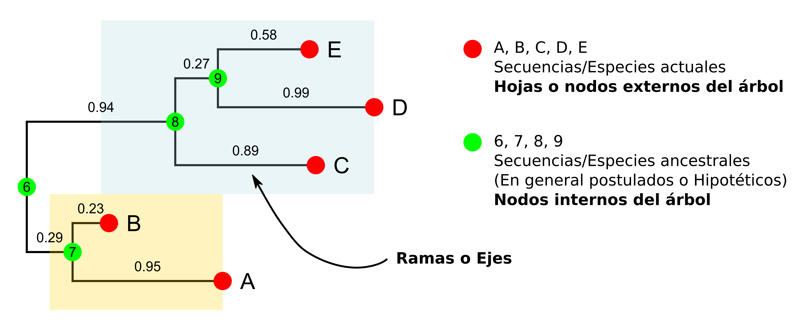
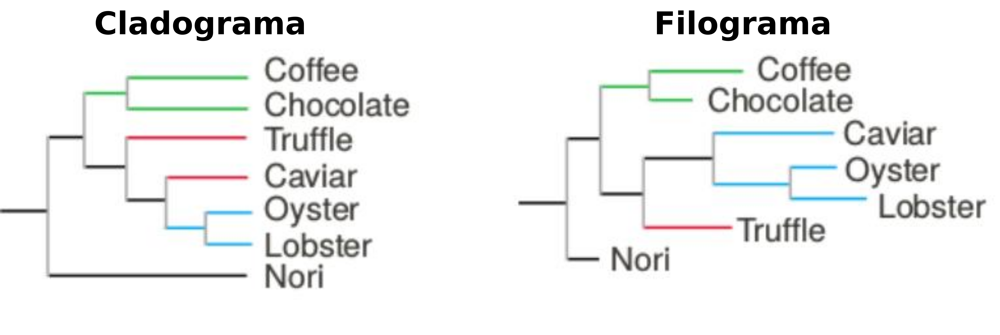

<style>
details > summary:first-of-type {
   display: list-item;
}
details summary { 
  cursor: pointer;
}

details summary > * {
  display: inline;
}

</style>



**Pagina en construccion**



<ul class="block-list has-radius is-primary">
   <li class=" is-info has-icon" markdown="span">
      <span class="icon"><i class="fas fa-clipboard"></i></span>
    <span style="font-weight:bold;">Este TP tiene informe.</span>
   </li>
</ul>

## Materiales

[Descargar](https://drive.google.com/file/d/1hesYx70VP8KdD_mQkgUXPEV7VpR1Gv0a/view?usp=sharing)

## Objetivos
* Familiarizarse con el uso de árboles filogenéticos
* Entender como leer árboles simples
* Entender las distintas representaciones de árboles filogenéticos
* Entender las diferenicias entre los distintos algoritmos para la construcción de árboles filogenéticos

## Filogenia

La filogenética es la ciencia que estudia las relaciones evolutivas entre entidades biológicas, frecuentemente especies, individuos, genes o proteínas. Es decir, que *estima* el pasado evolutivo basado en la comparación de caracteres morfológicos o moleculares como secuencias de ADN o proteína.

Una filogenia, es un árbol (filogenético, claro) que describe la secuencia de eventos que llevó a la distribución de caracteres que observamos en la actualidad. Pero la secuencia de eventos y los eventos del pasado son desconocidos, es decir, se infieren.

<ul class="block-list has-radius is-primary">
   <li class=" is-outlined is-info has-icon" markdown="span">
      <span class="icon"><i class="fas fa-book"></i></span>
      Por lo tanto, un árbol filogenético es una **hipótesis evolutiva**.
   </li>
</ul>

Los árboles filogenéticos están compuestos por: **Ramas** (o ejes) y **Nodos**. Ambos pueden ser *internos* o *externos*.
* Los **nodos externos** (hojas del árbol o terminales) son las *secuencias* o *especies actuales* (o eventos observados) a partir de las cuales se construyó el árbol.
* Los **nodos internos** son las *secuencias* o *especies ancestrales* inferidas. Corresponden al último ancestro común *hipotético* de todo lo que está debajo de él, es decir de los descendientes. Los **nodos internos** son los puntos en los cuales dos o más ramas divergen.
* Por último, las **ramas** conectan nodos ancestrales con sus descendientes.

<!--

  Los árboles pueden derivarse a partir de varios genes (árboles genéticos), de un único gen proveniente de diferentes especies (árbol de especies) o de una combinación de ambos. En el primer caso, los nodos internos podrían interpretarse como eventos de duplicación, mientras que en el segundo, podrían obedecer a eventos de especiación.

-->



<!--
Generalmente los árboles filogenéticos (o filogramas) tienen ramas que son proporcionales a la distancia (o "cantidad de evolución") entre las secuencias, calculada a partir de la similitud entre los nodos que conectan. Por lo tanto, mientras más largas son las ramas mayor es la divergencia entre las secuencias que une. Existen también otras representaciones (llamados cladogramas) en los cuales las ramas están justificadas y su largo no corresponde con información alguna más allá de los agrupamientos.
-->

Los árboles pueden representarse de diversas maneras. Según el significado de la longitud de la rama podemos distinguir entre:
* el **cladograma**, donde cada rama representa únicamente la transición evolutiva entre un nodo ancestral y sus descendientes independientemente de la longitud. La longitud de la rama no corresponde con información alguna más allá de los agrupamientos.
* el **filograma** , donde la longitud de cada rama es proporcional al número de cambios que existe entre un ancestro y sus descendientes, calculada a partir de la similitud entre los nodos que conectan. Por lo tanto, mientras más largas son las ramas mayor es la divergencia entre eventos que une.



Por último, los árboles pueden poseer raíz (**Rooted**) o no poseer raíz (**Unrooted**). La raíz es el punto más antiguo del árbol y marca el orden de ramificación del mismo, es decir, quién comparte un ancestro más reciente con quién. La forma más frecuente de ubicar la raíz del árbol es a través de un **outgroup**: un punto externo de referencia. Un **outgroup** puede ser cualquier secuencia que no sea un miembro natural del grupo de interés. Cuando uno no cuenta con un elemento que pueda usarse como referencia, la raíz suele ubicarse en el medio del árbol, o aun mejor, no se coloca en ningún lado.

## Ejercicios: Paso por paso hacia un árbol.

### Ejercicio 1. Recolección de datos y alineamiento

#### Paso 1. Construcción del dataset
Un árbol filogenético se construye a partir de un alineamiento múltiple que a su vez debe calcularse a partir de un conjunto de secuencias representativas. La topología de el o los árboles resultantes va a depender mucho de la cantidad y calidad de los datos que utilicemos. 

<ul class="block-list has-radius is-primary">
   <li class=" is-outlined is-danger has-icon" markdown="span">
      <span class="icon"><i class="fas fa-exclamation-triangle"></i></span>
Generalmente la mayor cantidad de tiempo y esfuerzo se invierten en este paso ya que un set de datos **ruidoso** puede llevarnos a resultados erróneos y por lo tanto a conclusiones inválidas.
   </li>
</ul>

* **Recolección de secuencias:** En la práctica, la obtención de secuencias puede realizarse como ya se vió en este curso, utilizando herramientas como PSI-BLAST para identificar secuencias homólogas distantes y evitar aquellas que comparten similitud pero no estructura/función.

* **Curación:** Las secuencias recolectadas luego deben ser sometidas a una meticulosa curación, donde se eliminan secuencias redundantes, incompletas o con errores detectables. Incluso pueden realizarse pasos de modelización de estructura para validar la pertinencia de las moléculas al grupo de proteínas que se desea utilizar.

<ul class="block-list has-radius is-primary">
   <li class=" is-outlined is-info has-icon" markdown="span">
      <span class="icon"><i class="fas fa-smile"></i></span>
En este trabajo práctico, por cuestiones de tiempo, se les entrega un conjunto de secuencias seleccionadas y curadas. Pero... tengan presente a la hora de hacer sus propias filogenias que **se debe prestar máxima atención al acondicionamiento de los datos**.
   </li>
</ul>
 
Se utilizarán las secuencias contenidas en el archivo `Ribonucleasas.fasta` cuyos datos asociados pueden encontrarlos en el `Ribonucleasas_organismos.pdf`. 

En el archivo multiFASTA contiene 64 secuencias protéicas de ribonucleasas pancreáticas de diversos animales. Si observan el archivo `Ribonucleasas_organismos.pdf` pueden ver que **todas** pertenecen a mamíferos placentarios, excepto por nuestro viejo amigo el canguro, que como despistó a más de uno en el trabajo práctico de Alineamientos se ganó su lugar.

#### Paso 2. Alineamiento múltiple

Para este paso se utilizará la herramienta de **EMBOSS** del trabajo práctico anterior: `emma`
Por si no recuerdan,`emma` utiliza los siguientes argumentos:
* `-sequence`: Se indica la ENTRADA que es un archivo multiFASTA
* `-outseq`: Se guarda una de las dos SALIDAS. En este caso, el nombre del archivo donde se guardarán las secuencias con los gaps incluidos para su debido alineamiento.
* `-dendoutfile`: Se guarda la segunda de las dos SALIDAS. En este caso, el nombre del archivo donde se guarda un dendograma que sirve de guía para el alineamiento.

```Bash
emma -sequence Ribonucleasas.fasta -dendoutfile Ribonucleasas.dend -outseq Ribonucleasas.msa
```

<ul class="block-list has-radius is-primary">
   <li class=" is-outlined is-danger has-icon" markdown="span">
      <span class="icon"><i class="fas fa-exclamation-triangle"></i></span>
Recuerden que `emma` utiliza `clustalw`. En el TP de alineamientos ya fue instalado pero si tuvieran que instalarlo, pueden hacerlo ingresando:<br> `sudo apt-get install clustalw`
  </li>
</ul>

Inspeccionen el archivo `Ribonucleasas.msa` y respondan:

**1.** ¿Que diferencia principal se ve en este archivo comparado con el archivo `Ribonucleasas.fasta` ?

**2.** Este archivo, ¿Permite visualizar rápidamente si hay regiones conservadas o con muchos gaps a simple vista? ¿Recordás el comando necesario para una mejor visualización?

<details>
<summary> <h6> Clickeá para ver el comando </h6> </summary>
Para una mejor visualización se puede utilizar el comando `showalign` que ya hemos utilizado anteriormente con la opción **-show A** para que **no reemplace** las bases conservadas por puntos:

```Bash
showalign -show A -sequence Ribonucleasas.msa -outfile Ribonucleasas.showalign  
less Ribonucleasas.showalign
```
</details>
<br>
La premisa básica de los alineamientos múltiples es que, en cada columna del alineamiento, cada residuo de cada secuencia sea homólogo; osea, ha evolucionado de la misma posición en un ancestro común. Cuando esto se cumple, se puede obtener muchísima información de un alineamiento múltiple sobre estructura, función, modo de evolución y, por supuesto, filogenia. Sin embargo, las conclusiones a las que lleguemos van a depender mucho de la calidad del alineamiento múltiple.

<ul class="block-list has-radius is-primary">
   <li class=" is-outlined is-info" markdown="span">
Un alineamiento múltiple de mala calidad en el mejor de los casos no nos va a dar información útil, pero... en el PEOR nos va a dar información errónea muy convincente. <br>
Por esto es **SUMAMENTE IMPORTANTE** ¡revisar los alineamientos múltiples! es decir, curarlos.
  </li>
</ul>

Los algoritmos de alineamiento utilizan heurísticas y aproximaciones que pueden (y suelen) dar lugar a errores. Por ello muchas veces (o siempre) es necesario  **curar manualmente** los alineamientos, eliminando o agregando **gaps**. También se puede recurrir a la eliminación de columnas completas si contienen una gran mayoría de gaps o hay dudas sobre su veracidad. En muchos casos, es mejor eliminar estos eventos para deshacernos del ruido.

Dado que el curado de un alineamiento para filogenética es un proceso crítico y muy "visual", existen herramientas más apropiadas (y vistosas) para esta tarea que `showalign`. El visualizador de alineamientos a utilizar se llama Jalview. 

Preferentemente desde una nueva terminal, pueden ejecutar Jalview:
```Bash
cd ~/Tools/Jalview
bash jalview.sh
```
<!--
O desde el el explorador de archivos:


-->

Cuando abren el programa hay algunas ventanas abiertas. Cierren todo. Además ignoren la *"barra de avance"* que se encuentra en la parte inferior de la ventana.

Una vez abierto el programa, carguen el alineamiento generado por `emma` haciendo click en `Archivo` > `Alineamiento de entrada` > `Desde fichero`. Esto abrirá una ventana en la que se puede buscar el archivo yendo a la carpeta de trabajo.

<ul class="block-list has-radius is-primary">
   <li class=" is-outlined is-danger has-icon" markdown="span">
         <span class="icon"><i class="fas fa-exclamation-triangle"></i></span>
Por defecto, Jalview **NO** ve el archivo. Asegúrense de seleccionar **TODOS LOS ARCHIVOS** en el menú desplegable de **Archivos de Tipo**
  </li>
</ul>


Para colorear el alineamiento vayan a `Color` > `ClustalX`

**3.** Revisen su alineamiento con Jalview para ver si hay errores o posiciones dudosas y, en caso de encontrarlos, corríjanlos en `Ribonucleasas.msa` y guarden!

<ul class="block-list has-radius is-primary">
   <li class=" is-outlined is-info has-icon" markdown="span">
         <span class="icon"><i class="far fa-lightbulb"></i></span>
En la parte superior pueden seleccionar columnas del alineamiento y luego presionan **delete** para eliminarlas. 
  </li>
</ul>

### Ejercicio 2. Construcción del Árbol

#### Paso 3. Árboles – Methods, Models and Madness

Los métodos para llevar a cabo la filogenia se pueden separar en dos categorías generales:
* **Métodos basados en distancia**, también conocidos como de clustering o algorítmicos: UPGMA, neighbour-joining, Fitch–Margoliash.

* **Métodos de búsqueda de árboles o discretos:** máxima parsimonia, maximum likelihood (máxima verosimilitud), métodos bayesianos.

#### Parte I. Métodos basados en distancias

El funcionamiento de estos es relativamente sencillo. Se cuenta con un solo parámetro: la distancia, que se calcula entre todos los elementos con los que vamos a construir el árbol (OTUs por sus siglas en inglés: *Operational Taxonomic Unit*), el cual es utilizado para ensamblar el árbol agrupando elementos cercanos.

##### Ejercicio 2a. Método Neighbor-Joining.
Este método se puede utilizar usando el comando `fneighbor`. Pero debemos instalarlo:

```Bash
sudo apt install embassy-phylip
```

Este comando construye un árbol a partir de una matriz de distancias, haciendo clustering de sus elementos, utilizando los valores de la matriz para calcular el largo de las ramas. El árbol resultante es un **árbol sin raíz**, lo que quiere decir es que las distancias son relativas entre los miembros y no hay información sobre qué evento se produjo primero (no hay un reloj evolutivo).

Para poder calcular el árbol primero es necesario obtener la matriz de distancias, mediante el comando `fprotdist`.
Este comando utiliza uno de cinco algoritmos para calcular las distancias:

- **PAM:** Utiliza una matriz PAM 001. La matriz PAM es una matriz de sustitución obtenida empíricamente. El número 001 indica que las secuencias con las que se construyó tienen una tasa de mutación esperada del 1% (`-method d`).
- **JTT:** Nombrado por sus creadores, Jones, Taylor y Thornton, se basa en el mismo concepto que el método PAM, solo que la matriz de sustitución fue creada con un set de datos mucho más grande (`-method j`).
- **PBM:** Las matrices de este modelo derivan de la base de datos *Blocks* que contiene secuencias de dominios conservados (`-method h`).
- **Kimura Formula**: Una aproximación precalculada de la matriz PAM, lo que ofrece un cálculo más veloz sacrificando specificidad (`-method k`).
- **Similarity Table**: Una proyección de distancias en la que se asume que los aminoácidos varían según un caso particular de la fórmula de Kimura (`-method s`). 

Los tres primeros (PAM, JTT y PBM) son los más ampliamente utilizados. 
Construya la matriz de distancia utilizando el método JTT:

```Bash
fprotdist -method j -sequence Ribonucleasas.msa -outfile Ribonucleasas.dist
```

**1.** ¿Qué son los siguientes parámetros del comando?
* `-sequence`: 
* `-outfile`:

Ahora si, con las distancias calculadas se puede comenzar a agrupar.

```Bash
fneighbor -datafile Ribonucleasas.dist -outfile Ribonucleasas-NJ.tree -outtreefile Ribonucleasas-NJ.treefile
```

* Investiguen los archivos `Ribonucleasas.tree` y `Ribonucleasas.treefile` y respondan:

**2.** ¿Qué información tiene `Ribonucleasas-NJ.tree`?  

**3.** ¿Qué les parece que contiene `Ribonucleasas-NJ.treefile`? ¿Cómo se conoce este formato? ¿Por qué cree que es conveniente la creación de este archivo?  

Si bien uno puede ver árboles dibujados en ascii en los archivos *.tree* hay formas más armoniosas para ver un árbol. Por lo tanto, vamos a instalar el programa: **figtree**

```Bash
sudo apt install figtree
```

Para utilizar el programa **figtree** ingrese en la terminal:

```Bash
figtree Ribonucleasas-NJ.treefile
```
Para guardar la imagen y poder verla en detalle tienen que ir a *File* -> *Export PDF*. **Explore las distintas opciones de representación de árboles y grafique los árboles como le parezca más correcto.**

En FigTree se puede seleccionar a nivel de nodos, clados y taxas (nombres de las hojas del árbol) y colorear de distintas maneras. Lo realizado en figtree se puede guardar en un archivo NUEVO *File* -> *Save as...* para seguir trabajando luego o modificar una representación de árbol.

**4.** Observen la topología del árbol a diferentes niveles e identifiquen diferentes órdenes. ¿Tiene sentido el agrupamiento que se realizó?

<ul class="block-list has-radius is-primary">
   <li class=" is-outlined is-info has-icon" markdown="span">
    <span class="icon"><i class="fas fa-lightbulb"></i></span>
   Si aún no vieron taxonomía o si no recuerdan lo que es un Orden...
   "Lineo dijo que el Rey (Reino) era un tipo (phylo) con mucha Clase que puso Orden en su Familia comprando un Género de cada Especie"
    </li>
</ul>

**5.** Hay algunos OTUs que no parecen estar bien ubicados. ¿Cuáles son? ¿Qué puede estar pasando?

##### Ejercicio 2b. Método UPGMA.
La manera de generar el árbol por el método **UPGMA** es esencialmente la misma que **Neighbor-Joining**, ir agrupando los pares de elementos con la menor distancia. La diferencia radica en cómo se calculan las distancias una vez que se empiezan a generar grupos. **Neighbor-Joining** utiliza una metodología un tanto compleja que pueden encontrar explicada [acá](http://www.deduveinstitute.be/~opperd/private/neighbor.html), mientras que **UPGMA** usa un *average linking* pesado por la cantidad de secuencias que componen cada grupo.

 Para construir un árbol con **UPGMA** corremos el comando `fneighbor` pero con la opción `-treetype u`:

```Bash
fneighbor -treetype u -datafile Ribonucleasas.dist -outfile Ribonucleasas-UPGMA.tree -outtreefile Ribonucleasas-UPGMA.treefile
```

* Comparen el árbol obtenido por **Neighbor-Joining** y por **UPGMA**. Identifiquen si hay cambios en las agrupaciones. Grafiquen los resultados de ambos métodos. Se ven diferentes ¿no? Investigue las razones.

#### Parte II. Métodos de búsqueda de árboles

Los métodos de búsqueda de árboles examinan cada columna del MSA de manera individual y buscan un árbol que mejor represente esta información. Este procedimiento los vuelve mas lentos que los métodos basados en distancia, pero el hecho que se examine cada posición por separado da un árbol más *acertado* y brinda la posibilidad de relacionar los eventos a cada una de las posiciones.

En este caso **NO** va a ser necesario calcular una matriz de distancias, podemos ejecutar el método directamente sobre el alineamiento. 

##### Ejercicio 2c. Método de Máxima Verosimilitud
Para utilizar Máxima Verosimilitud (*maximum likelihood*) se usa el comando `fproml`. Los argumentos de este comando son:
* `-sequence`: Indica el MSA de entrada
* `-oufile`: Indica donde guardar la salida
* `-intrefile` (opcional),  Árbol para usar de guía. No se utilizará en este caso, pero lo va a preguntar igual, en ese caso se aprieta *Enter*.

```Bash
fproml -seed 1 -sequence Ribonucleasas.msa -outfile Ribonucleasas-ML.tree -outtreefile Ribonucleasas-ML.treefile
```

<ul class="block-list has-radius is-primary">
   <li class=" is-highlighted is-info has-icon" markdown="span">
         <span class="icon"><i class="fas fa-question"></i></span>
        ¿Qué es Seed?
    </li>
</ul>

<details>

<summary><h6>Respuesta</h6></summary>
Además de los argumentos mínimos, se utilizó el argumento `-seed`. Esto es una buena práctica para que el experimento sea **reproducible**. En computación, lo que se llama *random* (por azar) en realidad no lo es. Para obtener números cuya distribución se acerque a la aleatoria se aplica una serie de fórmulas que dan un resultado dependiendo del número del cual se parte. Este valor es la **semilla** (seed). Por lo general se utiliza como **semilla** el tiempo, el cual cambia constantemente, pero nosotros podemos fijar esa **semilla**, para que otras personas, o nosotros mismos en algún futuro, podamos correr nuestros comandos y obtener exactamente los mismos resultados.

</details>

<br>

**1.** Observen e interpreten la salida obtenida. ¿Hubo cambios radicales con respecto a los árboles anteriores?.  

**2.** ¿Con qué nueva información contamos?  

##### Ejercicio 2d. Uso de Outgroups

Hasta ahora se generaron árboles **sin raiz**, donde las distancias entre los OTUs son relativas. Para colocar una raíz se utiliza un OTU que se sabe *a priori* que divergió antes que el resto, así se obtiene una referencia a partir de la cual construir el árbol.

¡Aprovechemos que tenemos a un intruso! El set de secuencias está compuesto casi en su totalidad por mamíferos placentarios, excepto por el canguro rojo. Su aparición no es casualidad ya que como miembro de otra infraclase sirve de referencia para proponer una raíz al árbol. Para ello se utiliza el argumento `-outgrno`, que recibe el número del organismo a utilizar como referencia. Este número esta dado por la posición de la secuencia en el alineamiento múltiple. Para averiguar que número es hay dos opciones:

* Contar a mano
* Correr un comando

Contar a mano puede llevar a errores, y dado que esto es bioinformática, se utilizará el siguiente comando:

```Bash
cat Ribonucleasas.msa | grep ">" | grep -n "Macropus"
```

La salida se verá similar a esta: ``45:>Macropus_rufus``. La secuencia en el alineamiento en este caso está en la posición 45 pero este número puede cambiar según el usuario.

Una vez obtenido este valor se vuelve a correr `fproml`

```Bash
fproml -outgrno 45 -seed 1 -sequence Ribonucleasas.msa -outfile Ribonucleasas-ML-OUTGR.tree -outtreefile Ribonucleasas-ML-OUTGR.treefile
```

<ul class="block-list has-radius is-primary">
   <li class=" is-highlighted is-info has-icon" markdown="span">
   <span class="icon"><i class="fas fa-lightbulb"></i></span>
**Ventaja del Método de ML.** <br>
ML utiliza un modelo de Markov para estimar las tasas de cambio de las diferentes posiciones y así poder hacer cálculos más precisos. Esto se debe a que no todas las posiciones varían con la misma frecuencia. <br>
Posiciones importantes para la estructura/función de la proteína, por ejemplo el sitio activo de una enzima, tienden a variar mucho menos que el resto y esto debe ser tenido en cuenta a la hora de construir la filogenia.
</li>
</ul>

##### Ejercicio 2e. Método de Máxima Parsimonia
Genere el árbol utilizando máxima parsimonia con el comando `fprotpars`, utilice `-help` para ver qué argumentos recibe. Responda:

**1.** ¿Qué información nos da este método?  

**2.** ¿Cuántos árboles nos devuelve? ¿Por qué?  

### Ejercicio 3. Seleccionar el árbol.

#### Paso 4. Tests – Seleccionar árboles en el bosque

Entonces, ¿qué tan bueno es nuestro árbol?
Uno de los test más simples para medir la veracidad del árbol es el *bootstrap*. Hoy en día sería muy raro encontrar un árbol filogenético que no lo haya utilizado.

El *bootstrap* esencialmente prueba si todo el set de datos está de acuerdo con el árbol resultante, o si dicho árbol es un *outlier* entre varias otras posibilidades. Esto se hace tomando muestras aleatorias de nuestro set de datos, armando varios árboles y calculando la frecuencia de ocurrencia de cada fragmento del árbol.
Si un agrupamiento determinado es encontrado en todos los árboles, entonces tienen un score de 100%; si solo ocurre en 2/3 de los árboles generados el score será de 67% y así.

Es importante aclarar que el muestreo se hace a nivel columna del MSA, y no a nivel de secuencia. Nuestro árbol va a establecer la relación entre diferentes secuencias dada la conservación/mutación de **posiciones homólogas** y esto es lo que se intenta probar con *bootstrap*: que cualquier tipo de composición que mantenga esos patrones de conservación/mutación va a dar el mismo árbol. Por ello, vamos a tener la misma cantidad de secuencias, y del mismo largo, ya que no solo vamos a reordenar las posiciones al azar sino que también vamos a quitar y repetir columnas. En la siguiente imagen pueden ver un ejemplo de los resultados de un *Bootstrapping*


Al final de este proceso se obtiene un conjunto de alineamientos. A partir de cada alineamiento se construye un árbol.
Este test parece sencillo, y estudios en filogenias conocidas (poblaciones virales cultivadas en laboratorio) muestran que es una medida adecuada de la certeza del árbol resultante; y que un valor de **70%** o más suele indicar un agrupamiento adecuado.

Para generar el conjunto de alineamientos se utiliza el comando `fseqboot` los argumentos son `-sequence` (datos de ENTRADA), `-outfile` (datos de SALIDA) y `-reps`:

```Bash
fseqboot -reps 10 -sequence Ribonucleasas.msa -outfile Ribonucleasas.boot
```

`-reps` indica el número de remuestreos a realizar. Calcular varios árboles puede llevar bastante tiempo por lo que solo se harán 10 repeticiones. En un típico ensayo se realizan muchas más repeticiones.

Exploren el archivo `Ribonucleasas.boot`. Hay varios MSA correspondientes al resmuestreo, con posiciones faltantes, repetidas y en distinto orden que el MSA original. Este archivo se utilizará para llevar a cabo numerosos árboles filogenéticos:

```Bash
fproml -seed 1 -sequence Ribonucleasas.boot -outfile Ribonucleasas-ML-BOOT.tree -outtreefile Ribonucleasas-ML-BOOT.treefile
```

<ul class="block-list has-radius is-primary">
   <li class=" is-highlighted is-danger has-icon" markdown="span">
   <span class="icon"><i class="fas fa-exclamation-triangle"></i></span>
Esto puede tardar un rato, podría ser un buen momento para preparar un mate...
</li>
</ul>

El archivo `Ribonucleasas-ML-BOOT.tree` contiene todos los árboles resultantes de todos nuestros muestreos. Al ser tantos, uno puede ver las diferentes topologías creadas, sin embargo es muy difícil sacar conclusiones.

Para poder utilizar toda la información de estas numerosas réplicas vamos a unirlas con el comando `fconsense`. Este toma como entrada el archivo `.treefile` que contiene todos los árboles en formato Phyllip y los va a condensar en uno solo, anotando a cada rama la cantidad de veces que esta fue hallada en nuestros muestreo.

```Bash
fconsense -intreefile Ribonucleasas-ML-BOOT.treefile -outfile Ribonucleasas-CONS.tree -outtreefile Ribonucleasas-CONS.treefile
```
**1.** Un buen ejercicio antes de copiar y pegar un comando es ENTENDER que es cada argumento del comando. ¿Que hace cada argumento?
* `-intreefile`
* `-outfile`
* `-outtreefile`

Observando el árbol consenso. Responda:  

**2.** ¿Resulta ser un buen árbol? ¿En qué se basan para afirmarlo?   
**3.** ¿Cómo podrían lidiar con nodos de baja calidad?   

### Paso 5. Presentación de resultados.

Finalmente algunos conceptos en cuanto a la presentación de los datos. Por lo general no hay reglas duras de cómo debe hacerse pero sí convenciones que están bastante aceptadas.

* En árboles de filogenia molecular, los largos de las ramas suelen dibujarse a escala; esto es, proporcional a la cantidad de evolución que se estima ocurrió entre los nodos que conecta. A pesar de que la relación entre el largo de la rama y el tiempo real no es directa y muy probablemente no es confiable, los largos dan una idea general de las tasa de cambio relativas del árbol.
* Los valores de Bootstrap deben ser presentados en forma de porcentajes, no de valores crudos, para que sea más sencillo de leer y comparar con otros árboles. Por convención, sólo valores de Bootstrap del 50% o mayores son reportados; valores menores significan que la calidad del nodo encontrado es muy baja. 
* Por último, tengan en cuenta la legibilidad del árbol en general. Utilizar nombres para las ramas con códigos de acceso a bases de datos o acrónimos de pocas letras puede resultar muy confuso. Hoy en día existen numerosos softwares para la visualización de árboles (ej. Hypertree) que nos permiten, mediante agrupamientos, colores, fuentes, etc. llamar la atención del lector sobre uno u otro aspecto importante del mismo y lograr que transmita la información que nos interesa mostrar.


## Ejercicio a informar

<ul class="block-list has-radius is-primary">
   <li class="is-highlighted is-info has-icon" markdown="span">
      <span class="icon"><i class="fas fa-calendar"></i></span>
    <span style="font-weight:bold;">Fecha de Publicación:</span> Viernes, 10 de septiembre 2021, 23:59hs.
   </li>
   <li class="is-highlighted is-info has-icon" markdown="span">
      <span class="icon"><i class="fas fa-calendar"></i></span>
    <span style="font-weight:bold;">Fecha Límite de Entrega:</span> Viernes, 17 de septiembre 2021, 23:59hs.
   </li>
</ul>

