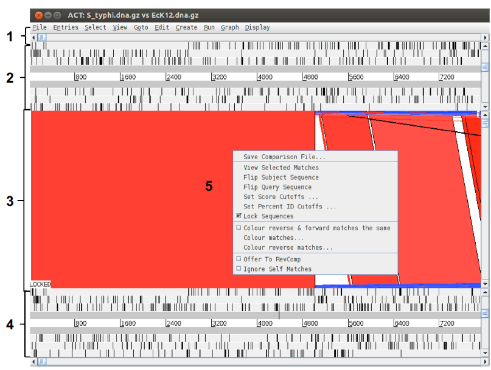
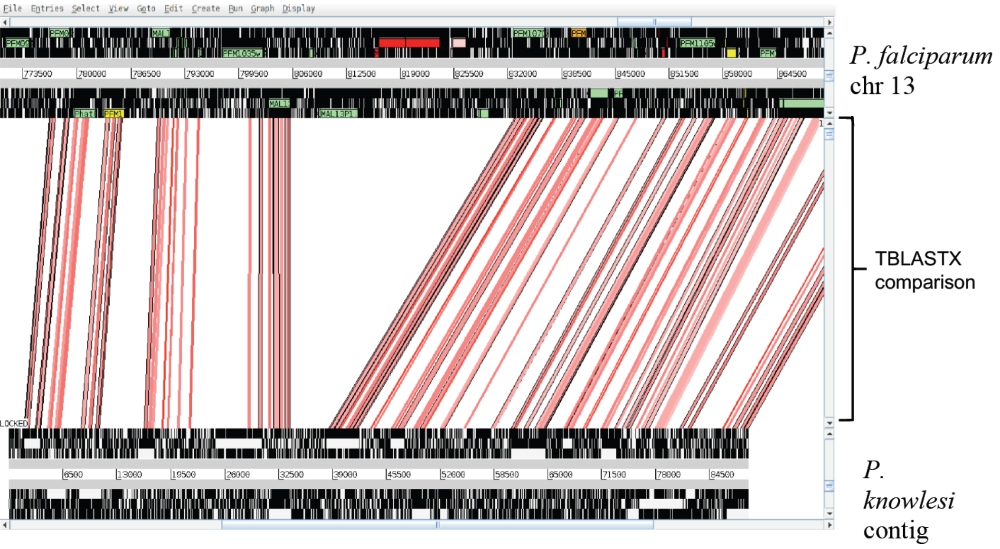



**Pagina en construccion**



<!--

## Recording

* Introducción TP N° 13. [[MP4]](https://drive.google.com/file/  .... )

<iframe src="https://drive.google.com/file/d/.../preview" width="800" height="440"></iframe>

* Final de Clase TP N° 13. [[MP4]](https://drive.google.com/file/  .... )

<iframe src="https://drive.google.com/file/d/.../preview" width="800" height="440"></iframe>

-->

## Materiales

[Descargar](https://drive.google.com/file/d/1AaOh2S80E-aqK8BAr-HaDqLUUAGlv4mm/view?usp=sharing)


# Genómica comparativa: ACT

## Introducción

La herramienta ACT (Artemis Comparision Tool) fue diseñada para extraer información de la comparación entre dos secuencias (Carver et al. 2005). El propósito de comparar genomas es visualizar rearreglos (inversiones, deleciones/inserciones, transposiciones).

Para trabajar con ACT son necesarios tres archivos: dos de secuencias (las que voy a comparar entre sí), y uno de comparación. EL archivo de comparación es un blastn (o un tblastx) entre ambas secuencias. ACT puede leer varios formatos de comparación; nosotros usaremos BLAST para generarlo. En cuanto a los archivos de secuencia, ACT puede leer el mismo tipo de archivos de secuencia que Artemis (ej. multi-fasta, genbank, embl, etc.). 

## Objetivos

*  Familiarizarce con la visualización comparativa de genomas
*  Explorar las funciones básicas de ACT a través de varios casos de uso

## Primera parte

**Comparación de los genomas bacterianos de *E. coli* y *S. tiphy*.**

Para abrir el programa ACT ejecutar en la terminal: 

```bash
cd ~/Tools/artemis/
./act
```

### Preparación de los archivos de entrada

Para comparar genomas es necesario contar con una serie de alineamientos locales delimitados, con scores definidos como los que produce BLAST. (Ver [ACT:Running a comparison](https://www.sanger.ac.uk/science/tools/artemis-comparison-tool-act)). Dado que vamos a comparar secuencias grandes, este archivo no puede ser simplemente un alineamiento continuo de las dos secuencias. 

Para hacer la comparación, pueden usar bl2seq (BLAST 2 Sequences) por línea de comando:

```bash
bl2seq -m T -i EcK12.dna -j S_typhi.dna -p blastn -D 1 > EcK12vsStiphy.blastn
```

<ul class="block-list has-radius is-primary">
   <li class=" is-outlined" markdown="span">
   Los argumentos `-m T` (Mega BLAST = True) indican a BLAST que debe usar el algoritmo ​**Mega BLAST** para hacer el alineamiento y `-D 1` le indica que el formato de output sea tabular, que es el formato que interpreta ACT.
   </li>
</ul>

>Si esto no fuera una opción (porque, por ejemplo, no tienen instalado bl2seq), pueden generar el archivo de comparación online usando [Double ACT](http://www.hpa-bioinfotools.org.uk/pise/double_actv2.html&sa=D&ust=1548712235812000) o en el servidor web de bl2seq [NCBI](http://blast.ncbi.nlm.nih.gov/Blast.cgi?PAGE_TYPE%3DBlastSearch%26BLAST_SPEC%3Dblast2seq%26LINK_LOC%3Dalign2seq&sa=D&ust=1548712235810000).

**1.** ¿Qué indica el Bit Score de Blast?

### Navegando en ACT

Ahora vamos a abrir en ACT los 3 archivos de nuestro interés. Para ello iremos a `File` > `Open` > `Choose` y seleccionamos de la carpeta del tp 14 los siguientes archivos:

-  `EcoliK12.dna ` (Secuencia de la bacteria E. Coli)
-  `EcK12vsStiphy.blastn ` (Archivo de comparación)
-  `S_tiphy.dna ` (Secuencia de la bacteria Salmonella)

Luego incluir las anotaciones almacenadas en los archivos `.tab` correspondientes a cada secuencia desde `File` > `EcoliK12.dna / S_tiphy.dna` > `Read an entry`. 


**Ventana de ACT**

ACT está basado en Artemis, y está compuesto esencialmente de tres capas o ventanas. 

- Las ventanas superior e inferior muestran la representación lineal de la secuencia de ADN con sus "*features*" asociadas. 

- La ventana del medio contiene bloques que conectan las regiones conservadas entre las dos secuencias. Se muestra en color rojo los del sentido directo y en azul los del sentido inverso. 


<ul class="block-list has-radius is-primary">
   <li class=" is-outlined" markdown="span">
Si estuviéramos comparando dos secuencias idénticas en la misma orientación veríamos, en la capa central, un bloque rojo que se extiende a lo largo de la longitud de las dos secuencias. Si una de las secuencias estuviera invertida se observaría un bloque azul entre las dos secuencias. Regiones únicas en cualquiera de las secuencias, como deleciones o inserciones, se visualizarán como espacios blancos entre los bloques rojos o azules.
   </li>
</ul>



1. Menúes desplegables y barra horizontal de desplazamiento. Esta permite moverse a lo largo del genoma. 
2. Panel de la secuencia 1 (la primera que ingresaron al comenzar la sesión de ACT). 
3. Panel de comparación, en el que se muestran las regiones de similitud (rojo), diferencia (blanco) e inversiones (azul) entre las dos secuencias.
4. Lo mismo que el `2` pero con la segunda secuencia que ingresaron al comenzar la sesión.
5. Menú desplegable que se abre al hacer click derecho sobre el panel de comparación. 

Navegar dentro de ACT es similar a Artemis: arriba y abajo de las secuencias 1 y 2 verán una barra de desplazamiento horizontal; y a los los lados de ambas, una barra de desplazamiento vertical. Las primeras se usan para desplazarnos rio arriba o rio abajo en el genoma, mientras que las segundas se usan para acercar o alejar el foco.

### Visualización en ACT

Para comenzar a visualizar vamos a alejar el foco de ambas secuencias hasta que podamos ver ambos cromosomas completos en pantalla. Por el momento, es mejor si apagamos los codones de *stop* y las anotaciones (Haciendo click derecho sobre el genoma de la ventana superior y/o inferior y destildando las opciones que correspondan. Tendrán que hacerlo para ambas secuencias, dado que la mini-ventana de Artemis es independiente en cada caso.) Deberíamos ver algo así:


<!--Nótese que cuando nos desplazamos horizontalmente en una secuencia, la otra se desplaza acompañando el movimiento. Este es el comportamiento por defecto y ocurre porque las secuencias están "bloqueadas" o `LOCKED`. En la imagen anterior, verán que a la izquierda aparece "LOCKED" indicando que esa opción está activada. Generalmente es el comportamiento más conveniente, pero si quisiéramos desactivarlo podemos hacerlo con click derecho sobre el panel de comparación y desmarcando la opción `Lock Sequences`.-->

Para refinar la comparación visual, es posible cambiar los valores de *cutoff* que usa ACT para decidir si dibuja una linea conectando a los cromosomas. Este cutoff se establece sobre los scores de alineamiento de BLAST.

<ul class="block-list has-radius is-primary">
   <li class=" is-outlined" markdown="span">
    Dependiendo de cuánto diverjan nuestras secuencias, modificar este parámetro puede ser fundamental para transformar una maraña de rayas en una gráfica con patrones de arreglos genómicos.
   </li>
</ul>


Hallarán estos cuttoffs haciendo click derecho en el panel de comparación:


Ahora que sabemos bien cómo movernos y enfocarnos, analicemos la imagen: 

**2.** ¿Qué patrones o arreglos ven en la comparación de estos cromosomas?

Agreguen ahora, a *S. tiphy* las anotaciones con el nombre ``SPIs.tab``. Este archivo contiene todas las islas de patogenicidad de esta *Salmonella* (incluyendo la SPI-7, con la que trabajamos anteriormente) 

**3.** ¿Están presentes en *E. coli* K12?

#### Algunas funciones más para explorar

1. Pueden hacer doble click en las cajas rojas o azules para centrarlas en pantalla
2. Activen las anotaciones de cada genoma y busquen alguna caja roja. Céntrenla y hagan zoom para revisar la secuencia aminoacídica en ambos cromosomas.
3. Desde la opción `Graph` de los menúes desplegables, carguen algunos plots de Artemis (ej. %GC) y revisen diferencias entre los cromosomas.
4. Inviertan alguna de las secuencias (``click derecho`` > ``Flip subject/query sequence``)

Cuando ya se hayan aburrido. Cierren **todo** para arrancar una nueva sesión con el próximo ejercicio.

## Segunda Parte
**Comparación de genomas eucariotas de *P. falciparum* y *P. knowlesi*.**

Los patógenos eucariotas, *P. falciparum* y *P. knowlesi* son agentes etiológicos de la malaria o paludismo y están taxonómicamente emparentados. El primero ya ha sido secuenciado en múltiples oportunidades, dado que es causante de la enfermedad en humanos con mayor prevalencia. El segundo está asociado a paludismo en primates no-humanos por lo que está menos estudiado.
Usaremos la abundancia de información del primero y la cercanía evolutiva de ambos para extraer información del segundo a partir de la genómica comparativa. 

El objetivo de esta segunda parte es comparar un fragmento genómico o contig del cromosoma 13 de *P. knowlesi* con el cromosoma 13 completo de *P. falciparum*. Mediante la comparación de ambas secuencias, estaremos en condiciones de estudiar el grado de conservación del orden génico (sintenia) e identificar/anotar genes de *P. knowlesi*. Como parte de este ejercicio, podremos identificar regiones únicas entre las dos secuencias y, finalmente, verificar una serie de anotaciones automáticas realizadas para *P. knowlesi*. 

### Sintenia o conservación del orden de los genes

Comencemos por cargar las secuencias del cromosoma 13 en ACT. 

- ``Pfal_chr13.embl`` - Archivo combinado con secuencia y anotaciones de *P. falciparum* 
- ``Pknowlesi_contig.seq`` - Archivo de secuencia *P. knowlesi* (sin anotaciones)
- ``Pknowlesi_contig.embl`` - Archivo de antoaciones automáticas *P. knowlesi* 
- ``Plasmodium_comp.crunch`` - Comparación entre ambos cromosomas

Fíjense que para *P. falciparum* tienen un archivo combinado que pueden usar como secuencia. En el caso del otro parásito, tenemos los archivos de secuencia y anotaciones por separado. Es decir, el ``.embl`` de *knowlesi* no tiene secuencia. Podrán cargar las anotaciones de ese archivo una vez que hayan comenzado la sesión de trabajo. 

Sin las anotacioens, debería ver algo así:



Prueben incluir las anotaciones de *P. knowlesi*. Utilicen las barras de desplazamiento horizontal para ubicar el contig de *P. knowlesi* en el cromosoma 13 de *P. falciparum*. 

<ul class="block-list has-radius is-primary">
   <li class=" is-outlined" markdown="span">
Un deslizador que aún no usamos pero que puede resultar muy útil para refinar la visualización, es la barra de desplazamiento vertical del panel de comparación. Moviéndola hacia arriba o abajo, filtrarán la aparición de cajas de comparación en función de la longitud del match (más largas o más cortas, respectivamente). 
   </li>
</ul>

> Sugerencia: apaguen los codones de stop para ver mejor las regiones codificantes y refinen el cutoff para visualizar los alineamientos con el mejor score.

**4.** ¿Qué hay de diferente con los arreglos genéticos que vimos en bacterias?
¿Está conservado el orden de los genes? 

Hagan zoom a alguno de los genes anotados en *P. falciparum*. 

**5.** ¿Hay regiones conservadas entre ambos parásitos?  ¿Qué pasa con los genes predichos en *P. knowlesi*?
¿Pueden identificar genes conservados entre ambos parásitos que no hayan sido debidamente anotados/predichos en *P. knowlesi*?

Ahora diríjanse a la región delimitada por las coordenadas 815823..829969 en el cromosoma de *P. falciparum*. Exploren la región codificante (`Click derecho` > `View` > `Selected Features`) 

**6.** ¿De qué gen se trata? ¿Está presente en *P. knowlesi*? ¿Qué opinión les merece, en términos de relevancia biológica, esta observación?

Para visualizar las anotaciones, pueden probar opciones adicionales haciendo click derecho en la secuencia:
- Prender/Apagar `One line per entry`
- Prender/Apagar `Feature stack view`
- Prender/Apagar `All features on frame lines`
- Prender/Apagar `Feature labels`

### Predicción de modelos de genes

Evaluaremos la capacidad predictiva de modelos génicos utilizada para crear las anotaciones de *P. knowlesi*. Como habíamos anticipado, el archivo de anotaciones de este parásito ha sido construído por un anotador automático. Hay muchos algoritmos capaces de proponer modelos génicos pero ninguno es perfecto y generalmente es necesario curar o refinar las predicciones. Para este ejercicio se utilizó el algoritmo PHAT (***P**retty **H**andy **A**nnotation **T**ool*, Mol. Biochem. Parasitol. 2001 Dec;118(2):167-74). 

Diríjanse, en el genoma de *P. falciparum*, al gen anotado como **PFM1010w** (o MAL13P1.103). 
Comparen el modelo génico de uno y otro parásito e identifiquen los exones conservados. 
Pueden usar el deslizador vertical del panel de comparación para incluir *hits* más cortos.

**7.** ¿Pueden encontrar todos los exones en el contig de *P. knowlesi*?

Abran, para cada secuencia, los gráficos de %GC. 

**8.** ¿Qué características tiene la gráfica en *P. falciparum*? ¿Esa característica está conservada en *P. knowlesi* para el gen *Phat4*?


Evalúen las siguientes regiones en el cromosoma 13 de *P. falciparum* en Artemis. 

- 789034..793351, 
- 657638..660023, 
- 672361..673753

Pueden abrir una sesión de Artemis directamente desde ACT:


**9.** Revisen las regiones inter-exon ¿Pueden hallar algún patrón?

**10.** Según lo observado ¿Cómo evalúa la calidad de la predicción de este gen?

## Tercera Parte
**Comparación de genomas eucariotas de *Trypanosoma brucei* y *Leishmania major*.**

### Sintenias camufladas

Por último, vamos a buscar regiones sinténicas entre dos nuevos parásitos, *Trypanosoma brucei* y *Leishmania major*. El primero es el causante de la enfermedad del sueño, y el segundo de la leishmaniasis. Ambos son protistas eucariotas y están taxonómicamente emparentados por familia (Trypanosomatidae). 
En este ejercicio evaluaremos la arquitectura de ambos genomas y la existencia de regiones de sintenia entre éstos.

Los archivos que usaremos son:

- ``Tbrucei.dna`` - secuencia *T. brucei*
- ``Tbrucei.embl`` - anotaciones *T. brucei* 
- ``Leish_vs_Tbrucei.tblastx`` - archivo de compración
- ``Leish.dna`` - secuencia *L. major* 
- ``Leish.embl`` - anotaciones *L. major* 

Carguen las secuencias, apaguen codones de stop y agreguen las anotaciones.

**11.** ¿Qué pasa con la conservación de la arquitectura genómica entre estos dos cromosomas? ¿Dirían que hay o que no hay sintenia?

Restringir al máximo el cutoff de BLAST para las regiones compartidas entre genomas.

**12.** ¿Hay regiones conservadas entre los organismos? ¿Cuáles son los productos predichos para los genes en esas regiones?


