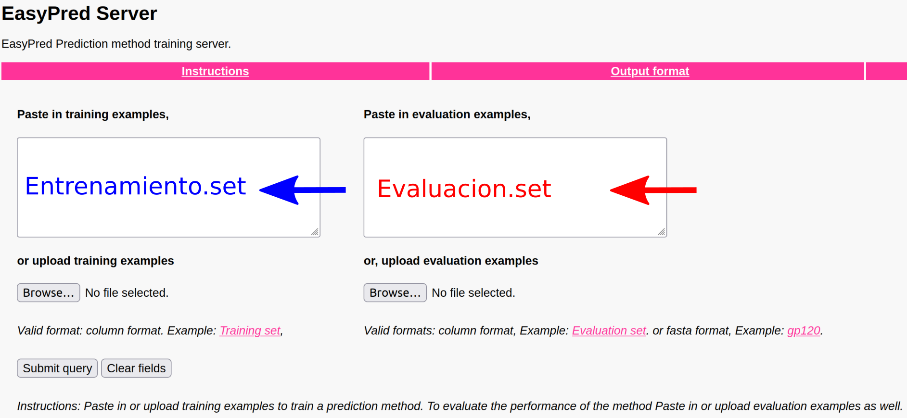
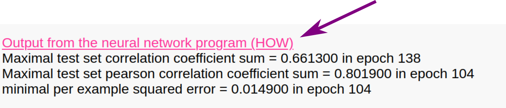



**Pagina en construccion**



<ul class="block-list has-radius is-primary">
   <li class=" is-info has-icon" markdown="span">
      <span class="icon"><i class="fas fa-clipboard"></i></span>
    <span style="font-weight:bold;">Este TP tiene informe.</span>
   </li>
</ul>

## Recording

- Introducción TP N°7. [[MP4]](https://drive.google.com/file/d/1f7MqDqMpzIwUfYj1LuDiDZf_d-gWqYgC/view?usp=sharing)

<iframe src="https://drive.google.com/file/d/1f7MqDqMpzIwUfYj1LuDiDZf_d-gWqYgC/preview" width="800" height="440"></iframe>

- Final de Clase TP N°7.

-- ANN [[MP4]](https://drive.google.com/file/d/1B9etJsvZm9qLfYaq9-IlmCz2F5lu470h/view?usp=sharing)

<iframe src="https://drive.google.com/file/d/1B9etJsvZm9qLfYaq9-IlmCz2F5lu470h/preview" width="800" height="440"></iframe>

-- HMM [[MP4]](https://drive.google.com/file/d/1C04vKioGCA7MoYpedn0dkaTd9TSEBjn3/view?usp=sharing)

<iframe src="https://drive.google.com/file/d/1C04vKioGCA7MoYpedn0dkaTd9TSEBjn3/preview" width="800" height="440"></iframe>


## Materiales

[Descargar](https://drive.google.com/file/d/1b44lbrBURu-s8SNLDd_Xr7-7rupC5BPs/view?usp=sharing)


## Objetivos

* Comprender cómo se entrena y evalúa un modelo basado en redes neuronales.
* Familiarizarse con el esquema de validación cruzada para el entrenamiento de dichos modelos.
* Construir un perfil basado en HMMs y utilizar el mismo para realizar búsquedas en bases de datos de secuencias.
* Crear una base de datos de perfiles de secuencias y utilizar la misma para identificar dominios conservados en secuencias *query*.


## Parte I. Artificial neural networks

En esta sección vamos a utilizar redes neuronales para hacer predicciones como habíamos hecho anteriormente con las PSSM. La idea es similar a la del TP5 donde entrenamos un modelo con péptidos que se unen a MHC. Variaremos los parámetros de modelo para mejorarlo, sensando en cada corrida los indicadores de desempeño del mismo (**Aroc** y **Pearson correlation coefficient**). 

<ul class="block-list has-radius is-primary">
   <li class=" is-outlined has-icon" markdown="span">
      <span class="icon"><i class="fas fas fa-exclamation"></i></span>
      Si no recuerdan qué significan las métricas **Aroc** y **Pearson correlation coefficient (PCC)** diríjanse al TP5 para refrescar estos conceptos.
</li>
</ul>

Para esto vamos a volver a utilizar [EasyPred](http://www.cbs.dtu.dk/biotools/EasyPred/) y los archivos de **Entrenamiento.set** y **Evaluacion.set** en la carpeta del TP (que descargaron al inicio).

- **Entrenamiento.set** contiene 1200 péptidos de longitud 9, con un valor asociado de afinidad de unión a HLA-A\*02:01 transformado entre 0 y 1. Recuerde que mientras más cercano a 1 el péptido tiene mayor afinidad de unión y que a partir de 0.426 se considera que el péptido es un ligando. 
- **Evaluacion.set** contiene 66 péptidos, también con sus valores correspondientes de afinidad de unión. 

Para el entrenamiento del modelo se particionará el archivo **Entrenamiento.set**, de tal manera que una parte se usará para entrenar y la restante se empleará para ir monitoreando el proceso de entrenamiento y así evitar el sobreajuste de los pesos de nuestra red.
Luego el archivo **Evaluacion.set** contiene datos independientes, que se utilizarán para evaluar la capacidad de generalización de nuestro modelo. 

<ul class="block-list has-radius is-primary">
   <li class=" is-outlined has-icon" markdown="span">
      <span class="icon"><i class="fas fas fa-exclamation"></i></span>
      Es recomendable abrir los archivos y ver qué es lo que contienen. Esto SIEMPRE es una buena práctica.
   </li>
</ul>

<ul class="block-list has-radius is-primary">
   <li class=" is-outlined is-info has-icon" markdown="span">
      <span class="icon"><i class="fas fas fa-sticky-note"></i></span>
      A lo largo del TP vamos a mantener el valor de *Cutoff for counting an example as a positive example* en 0.5.
   </li>
</ul>

<ul class="block-list has-radius is-primary">
   <li class=" is-outlined is-danger has-icon" markdown="span">
      <span class="icon"><i class="fas fas fa-exclamation-triangle"></i></span>
      Vayan corriendo las diferentes pruebas en diferentes pestañas o guarden el reporte de salida para poder compararlo cuando sea necesario.  
   </li>
</ul>

### Primera prueba
#### *Comprendiendo los resultados que indican el desempeño de la red*

Para nuestro primer modelo vamos a ir a [EasyPred](http://www.cbs.dtu.dk/biotools/EasyPred/) y cargamos los archivos en los cuadros correspondientes:



Luego bajamos hasta la opción *Select method* dónde vamos a cambiar de *Matrix method* a *Neural Network*.  

Allí vamos a poder ver que nos habilita a ingresar otros parametros que están relacionados a la arquitectura y el entrenamiento de la red.

Los parámetros que queremos utilizar en este paso son:

* *Number of hidden units*: 2  
* *Number iterations (epochs) to run neural network*: 300  
* *Fraction of data to train on (the rest is used to avoid overtraining)*: 0.8  
* *Learning rate*: 0.05  
* *Use top sequences for training*  

Es decir dejamos los valores por defecto y le damos *Submit*.

Una vez entrenado el modelo, recuerde que puede chequear el desempeño del mismo iteración a iteración haciendo click en **Output from the neural network program (HOW)** 




1. ¿Cuál es el máximo valor de PCC alcanzado sobre el set de prueba? (*Maximal test set pearson correlation coefficient sum*) 
2. ¿En qué iteración ocurre? ¿Qué información le está dando esto sobre el proceso de entrenamiento del modelo?  


3. ¿Cuáles son los valores de desempeño del modelo sobre el set de evalución? (PCC y Aroc)
4. ¿El PCC obtenido en el punto 3. es mayor o menor al obtenido en el punto 1.? ¿Qué implica este resultado?  

### Segunda prueba
#### *Cambiando el set de entrenamiento*

Mantenga los mismos parámetros que en el paso anterior pero esta vez seleccione:

* *Use bottom sequences for training*  

4. ¿Cuál es el máximo valor de PCC alcanzado sobre el set de prueba y en qué iteración ocurre esta vez?
5. ¿Qué valores de desempeño alcanza el modelo aplicado al set de evaluación?
6. ¿A qué se debe que no coincidan con lo obtenido en la primera prueba?

### Tercera prueba
#### *Cambiando la arquitectura de la ANN*

Repita los parámetros de la primera prueba excepto por el número de neuronas en la capa intermedia o *hidden layer*:

* *Number of hidden units*: 1

Observe el impacto en los parámetros de desempeño del modelo. Guarde los resultados. 

Repita el ensayo esta vez con:

* *Number of hidden units*: 5

Responda a las siguientes preguntas para ambos casos estudiados:

7. ¿Cómo varía la *performance* en el set de prueba?  
8. ¿Qué impacto tienen estos cambios en la *performance* del set de evaluación?  
9. ¿Puede elegir un número óptimo de neuronas para la capa oculta?  
10. ¿Por qué cree que el número de neuronas en la capa oculta tiene tan poco impacto en esta prueba?  

### Cuarta prueba
#### *Empleando un esquema de validación cruzada*

Como deberían haber notado en las dos primeras pruebas, la partición de los datos que se utilizan en el entrenamiento/prueba influyen significativamente en el desempeño del modelo. 

Como *a priori* uno no puede establecer cual es la mejor forma de partir los datos en entrenamiento y *test* se recurre a una estrategia denominada *cross-validation*. La técnica de validación cruzada consiste en hacer *N* particiones (por lo general 5) y rotarlas, utilizando N-1 para entrenar y la N-ésima (es decir la que queda afuera) como set de prueba. Esto resulta en N modelos diferentes, cada uno entrenado y probado en datos diferentes. Para realizar predicciones en nuevos sets, como el de evaluación, se realizan predicciones con los N métodos y se promedian sus predicciones.

Para realizar esta prueba vuelvan a los parámetros de la **Primera prueba** pero modifiquen lo siguiente:

* *Number of partitions for crossvalidated training*: 5

<ul class="block-list has-radius is-primary">
   <li class=" is-outlined is-danger has-icon" markdown="span">
      <span class="icon"><i class="fas fas fa-exclamation-triangle"></i></span>
      Este paso puede llevar varios minutos. Paciencia.
</li>
</ul>

11. ¿Encuentran diferencias entre los desempeños de los 5 modelos?  
12. Comparen los resultados obtenidos para el set de evaluación con respecto a las pruebas anteriores.
13. En este caso se usa el ensamble de los 5 modelos para realizar las predicciones sobre el set de evaluación. ¿Cómo piensa que se obtienen los valores predichos?

### Utilizando el modelo entrenado

Como vimos en el TP de PSSM, una vez que uno entrena un método, puede guardar los valores ajustados (ya sea de la matriz en el caso de la PSSM o los pesos de la red en el caso de ANN) y utilizarlos para hacer predicciones en un set nuevo de datos.

Para ello vamos a guardar el modelo entrenado en la **Cuarta prueba** haciendo *click* en *Parameters for prediction method* del reporte de resultados (se guarda como **para.dat**). 
Este modelo será utilizado en el ejercicio a entregar de este TP.


## Parte II. HMMer

<ul class="block-list has-radius is-primary">
   <li class=" is-outlined is-danger has-icon" markdown="span">
      <span class="icon"><i class="fas fa-exclamation-triangle"></i></span>
      Antes de comenzar ejecuten en la terminal de su VM `sudo apt install hmmer2`, para instalar el programa `hmmer2`.
</li>
</ul>

### Introducción

**HMMer** es un paquete de programas que nuclea varias funciones para realizar búsquedas en bases de datos mediante la utilización de perfiles de secuencias. Está basado en *profile Hidden Markov Models*, presentados por Anders Krogh (Krogh *et al.*, 1994). Estos perfiles son una aproximación estadística del consenso de un alineamiento múltiple y utilizan un sistema de puntaje posición-específico, en contraste con métodos ya vistos como BLAST o FASTA en donde la matriz de puntajes utilizada es la misma en cada posición.

### Construcción de un perfil

Supongamos que trabajamos con globinas y queremos buscar homólogos lejanos. Para ello contamos con 50 secuencias de globinas las cuales alineamos y guardamos en el archivo *globins50.msf*. Como primer paso para realizar la búsqueda debemos generar un *profile* o perfil que las represente. Para crear el *profile* utilizamos la función `hmm2build` de la siguiente manera:

```Bash
hmm2build globin.hmm globins50.msf
```

`hmm2build` recibe como argumentos el archivo en el cual va a guardar el perfil (*globin.hmm*) y el archivo con el cual crearlo (*globins50.msf*). Si bien el contenido del archivo donde se guardó el perfil es legible, su contenido no debería tener sentido para ustedes (más allá del encabezado con información sobre las opciones que se utilizaron para crearlo) porque únicamente almacena los pesos de las transiciones de estado del HMM.

### Calibración del perfil

Este paso no es imprescindible pero sí aconsejable. La calibración del perfil le otorga mayor sensibilidad en la búsqueda ya que modifica la estimación del E-value de los *hits* encontrados. Si recuerdan, la búsqueda contra bases de datos nos devuelve junto con cada alineamiento un score y un E-value, este último nos da una idea sobre la cantidad de *hits* que esperamos encontrar con ese score en una base de datos construida con secuencias aleatorias y se calcula según la longitud de la secuencia *query* y *subject*, el tamaño de la base de datos y la matriz de *scoring*.

En el caso de HMMer, la estimación del E-value es analítica y resulta muy conservativa, por lo que se dejan de lado posibles *hits* (como homólogos lejanos). Utilizando `hmm2calibrate` podemos calibrar el cálculo de E-values de manera empírica incrementando de manera significativa la sensibilidad de la búsqueda.

```Bash
hmm2calibrate globin.hmm
```
`hmm2calibrate` lee un archivo con un modelo HMM como **globin.hmm** y puntúa un número grande de secuencias sintetizadas al azar (por default 5000 secuencias) con este modelo. Luego ajusta una EVD (Extreme Value Distribution) al histograma de los puntajes obtenidos y guarda nuevamente el modelo HMM con estos nuevos parámetros.

Como para realizar este cálculo se sintetizan secuencias al azar, estableceremos una semilla (o *seed*) para poder reproducir nuestros resultados. Entonces el comando se modifica de la siguiente forma, 

```Bash
hmm2calibrate --seed 1 globin.hmm  
```

### Búsqueda en bases de datos

El comando para utilizar nuestro flamante *profile* en una búsqueda es `hmm2search`. En este caso lo vamos a utilizar contra el archivo Artemia.fa que contiene una única secuencia de globina en búsqueda de dominios pertenecientes a nuestra familia de interés.

```Bash
hmm2search globin.hmm Artemia.fa
```

La salida de este comando es más larga que las anteriores, consta de un encabezado con la información sobre el programa y los parámetros que utilizamos en la búsqueda:

```
hmmsearch - search a sequence database with a profile HMM
HMMER 2.3.2 (Oct 2003)
Copyright (C) 1992-2003 HHMI/Washington University School of Medicine
Freely distributed under the GNU General Public License (GPL)
- - - - - - - - - - - - - - - - - - - - - - - - - - - - - - - - - - - -
HMM file:                   globin.hmm [globins50]
Sequence database:          Artemia.fa
per-sequence score cutoff:  [none]
per-domain score cutoff:    [none]
per-sequence Eval cutoff:   <= 10        
per-domain Eval cutoff:     [none]
- - - - - - - - - - - - - - - - - - - - - - - - - - - - - - - -

Query HMM:   globins50
Accession:   [none]
Description: [none]
  [HMM has been calibrated; E-values are empirical estimates]
```

Una lista parecida a la que da BLAST con los *hits* más importantes ordenados por su E-value:

```
Scores for complete sequences (score includes all domains):
Sequence Description                                    Score    E-value  N 
-------- -----------                                    -----    ------- ---
S13421   S13421 GLOBIN - BRINE SHRIMP                   120.3    6.2e-37   4
```

Noten que después del E-value hay un campo que no se encontraba en los otros algoritmos de búsqueda denominado "N". Este valor representa la cantidad de dominios de nuestro profile que fueron encontrados en el hit.

Luego encontramos información sobre los dominios de nuestro *profile* individualmente. Los campos son:
- el nombre del hit 
- el dominio que se alineó (por ej. 2/4 significa que es el dominio Nro 2 de 4 que hay en total en nuestro perfil) 
- **seq-f** y **seq-t** son las posiciones del hit donde comienza y termina el alineamiento con ese dominio y el campo siguiente a estos valores (sin nombre) es una codificación de qué parte de la secuencia fue alineada. 
  - los corchetes significan extremos y los puntos posiciones en el medio, por lo que:
      - ".." significa que el alineamiento comenzó y terminó en una posición que no es terminal de la secuencia hit
      - "\[." significa que el alineamiento empieza al comienzo de la secuencia y termina en alguna posición en medio
      - al revés, ".\]" empieza en una posición intermedia y termina en el fin de la secuencia
      - por último "\[\]" es que el dominio abarca toda la secuencia. 
- Los tres siguientes campos son análogos pero refiriéndose a la secuencia del dominio en nuestro perfil HMM.
- Luego se reportan el score y el E-value.

```
Parsed for domains:
Sequence Domain  seq-f seq-t    hmm-f hmm-t      score  E-value
-------- ------- ----- -----    ----- -----      -----  -------
S13421     3/4     771  1075 ..     1   333 []    34.0    3e-13
S13421     1/4       1   288 [.     1   333 []    31.9  3.8e-13
S13421     4/4    1085  1390 ..     1   333 []    29.4    5e-13
S13421     2/4     303   607 ..     1   333 []    25.0  8.1e-13
```

 La sección siguiente contiene los alineamientos de los dominios que fueron hit en la lista anterior en un formato similar al de BLAST, teniendo como primera secuencia el consenso del *profile* (noten que hay aminoácidos en mayúsculas, estos se encuentran altamente conservados en el profile). 

 Al igual que BLAST en medio de ambas secuencias se escriben los aminoácidos que coinciden o "matchean" y signos más (+) en donde hay mismatches con puntaje positivo en la matriz de sustitución.

```
Alignments of top-scoring domains:
S13421: domain 3 of 4, from 771 to 1075: score 34.0, E = 3e-13
                   *->viqealvnssShLsaeeKalvkslWygKV..ggnaeeyGaeaLgRlF
                                  L+a eK+ ++++W  + ++ g +++ +++++ RlF
      S13421   771    T-----------LTALEKQSIQDIW-SNLrsTG-LQDLAVKIFTRLF 804  

                   vvYPwTqryFp.hFgdLssldAvkGspkvKAHGkKVltalgdavkhLDdt
                    ++P+ +  F + Fg++     +  ++ +KAH  +Vl+a++ ++  LDd 
      S13421   805 SAHPEYKLLFTgRFGNVDN---INENAPFKAHLHRVLSAFDIVISTLDDS 851  

                   gnlkgalakLSelHAdKLrVDPeNFklLghclivVLAahfgkdFtPevqA
                   + l   l++L+  H + L+ ++ +F +++ +++ V +   +   t     
      S13421   852 EHLIRQLKDLGLFH-TRLGMTRSHFDNFATAFLSVAQDIAPNQLTVLGRE 900  

                   AwdKflagvanaLahKYrelgFQggftviqealvnssShLsaeeKalvks
                   ++ K +++   ++ ++   l      t+           Lsa e a vk+
      S13421   901 SLNKGFKLMHGVIEEGLLQLERINPITG-----------LSAREVAVVKQ 939  

                   lWygKVggnaeeyGaeaLgRlFvvYPwTqryFphFgdLssldAvkGspkv
                   +W   V++++ ++G  ++  lF ++P  q+ Fp+F+d+ +ld + + p v
      S13421   940 TW-NLVKPDLMGVGMRIFKSLFEAFPAYQAVFPKFSDV-PLDKLEDTPAV 987  

                   KAHGkKVltalgdavkhLDdtgnlkgalakLSelHAdKLrVDPeNFklLg
                    +H   V t l++ +  LD   nl+    +L+e H   LrV    Fk +g
      S13421   988 GKHSISVTTKLDELIQTLDEPANLALLARQLGEDH-IVLRVNKPMFKSFG 1036 

                   hclivVLAahfgkdFtPevqAAwdKflagvanaLahKYr<-*
                   ++l+  L   +g  F+  +  +w K++++++  + ++     
      S13421  1037 KVLVRLLENDLGQRFSSFASRSWHKAYDVIVEYIEEGLQ    1075 
```

Llegando al final encontramos un histograma, similar al que nos mostraba FASTA. En este caso como nuestra "base de datos" tiene una sola secuencia no es informativo en absoluto.

```
Histogram of all scores:
score    obs    exp  (one = represents 1 sequences)
-----    ---    ---
  120      1      0|=      
```

Y por último algunos detalles estadísticos que corresponden al ajuste de la EVD, en los cuales no vamos a focalizar. 

```
% Statistical details of theoretical EVD fit:
              mu =  -226.7154
          lambda =     0.1106
chi-sq statistic =     0.0000
  P(chi-square)  =          0

Total sequences searched: 1

Whole sequence top hits:
tophits_s report:
     Total hits:           1
     Satisfying E cutoff:  1
     Total memory:         20K

Domain top hits:
tophits_s report:
     Total hits:           4
     Satisfying E cutoff:  4
     Total memory:         25K

```

### Búsqueda en bases de datos reales

HMMer puede leer los formatos de la mayoría de las bases de datos conocidas. A diferencia de BLAST no es necesario indexar la base de datos. Si recuerdan de la práctica de BLAST/FASTA, uno podía crear su propia base de datos donde realizar los alineamientos a partir de un archivo multifasta utilizando el comando **formatdb**, el cual crea todo el sistema de índices de *ktuplas* y demás archivos para facilitar la búsqueda. En este caso HMMer puede realizar la búsqueda directamente sobre el multifasta sin necesidad de más procesamiento. En nuestro servidor podemos realizar la búsqueda utilizando:

```Bash
hmm2search globin.hmm ~/Swissprot_db/Swissprot.fasta > globin.swissprot.search
less globin.swissprot.search
```
<ul class="block-list has-radius is-primary">
   <li class=" is-outlined is-danger has-icon" markdown="span">
      <span class="icon"><i class="fas fas fa-exclamation-triangle"></i></span>
      Este comando no les va a funcionar si no tienen a la carpeta Swissprot_db en su home directory.
</li>
</ul>

<ul class="block-list has-radius is-primary">
   <li class=" is-outlined has-icon" markdown="span">
      <span class="icon"><i class="fas fas fa-highlighter"></i></span>
      Notarán que la búsqueda directa aumenta considerablemente el tiempo de cómputo necesario para obtener un resultado.
</li>
</ul>

### Modos de alineamiento

HMMer no utiliza los métodos clásicos de alineamiento (*Smith-Waterman o Needleman-Wunsch*) como el resto de los algoritmos de alineamiento sino que el modo de alinear (local o global) está dado por el modelo que construimos. 

Por defecto `hmm2build` lleva a cabo alineamientos que son globales con respecto al HMM y locales con respecto a la secuencia objetivo, permitiendo alinear varios dominios en esa misma secuencia. ¿Qué significa esto? Que cada dominio se intenta alinear **completamente** en alguna porción de la secuencia objetivo. Si queremos recuperar secuencias que contengan alineamientos parciales de dominios podemos agregar a `hmm2build` la opcion `-f` .

### Bases de datos de HMM

Así como nos es posible realizar búsquedas de *profiles* contra bases de datos de secuencias, podemos crear una base de datos de *profiles* y utilizar como *query* a una secuencia. Este es el caso de la base de datos **PFAM** (Sonnhammer *et al.*, 1997; Sonnhammer *et al.*, 1998) que nuclea *profiles* de una gran variedad de dominios y es una herramienta sumamente utilizada para analizar secuencias de proteínas de las cuales no tenemos información previa.

Como ejemplo, tomemos el producto del gen *Sevenless* de *Drosophila melanogaster* que codifica un receptor de *tyrosine kinase* esencial para el desarrollo de las células R7 del ojo de la mosca. La secuencia proteica de este receptor se encuentra en el archivo **7LES_DROME**. Realice una búsqueda de esta secuencia en [PFAM](http://pfam.xfam.org/search#tabview=tab0).
¿Qué dominios fueron identificados en esta proteína? Recuerde estos resultados para contrastarlo con lo que hará más adelante. 

Las bases de datos de *profiles* no son más que múltiples HMMs concatenados, por lo que el comando para construirlas es también **hmm2build**, pero vamos a utilizar la opción **-A** (append) para agregar nuevos *profiles* a nuestro archivo de HMMs original.

Por ejemplo, si queremos construir una base de datos **"myhmms"** que contiene perfiles de dominios **rrm** de reconocimiento de ARN, **fn3** de fibronectina tipo III y **pkinase** del dominio catalítico de las kinasas podemos realizarlo fácilmente con:

```Bash
hmm2build -A myhmms rrm.sto
hmm2build -A myhmms fn3.sto
hmm2build -A myhmms pkinase.sto
```

Para realizar búsquedas en nuestra nueva base de datos utilizamos el comando `hmm2pfam`. En este caso empleamos nuevamente, como ejemplo, a la proteína codificada por el gen *Sevenless* de *Drosophila melanogaster* (archivo **7LES_DROME**):

```Bash
hmm2pfam myhmms 7LES_DROME
```

La salida es muy parecida a la de **hmm2search** pero los hits reportados no serán secuencias sino dominios contenidos en la base de datos. 

En nuestro caso particular podrán notar que tenemos un hit contra un dominio RRM aún cuando nuestra proteína query no contiene ningún dominio de este tipo. 
Relacionado con esto mismo, ¿recuerdan si la base de datos PFAM identificó este dominio en la proteína de estudio?

Nos podemos dar cuenta que este hit es al menos sospechoso debido a su score negativo y su E-value cercano a 1. Por defecto el límite de E-value, al igual que BLAST es 10, este umbral es extremadamente permisivo y proclive a devolver ruido. Si queremos ser más quisquillosos podemos utilizar la opción **-E** seguida del umbral deseado. Por ejemplo:

```Bash
hmm2pfam -E 0.1 myhmms 7LES_DROME
```

### Alineamientos múltiples con HMM

Otro uso que se les da a los *profiles* es el de asistir a la hora de llevar a cabo alineamientos múltiples de grandes cantidades de secuencias. En general este proceso suele ser lento y los alineamientos resultantes contienen errores que requieren curarse a mano. Utilizando HMMs construidos a partir de un alineamiento de unas pocas secuencias representativas, se pueden alinear grandes cantidades de secuencias relacionadas fácilmente. 

Siguiendo con nuestras globinas, tenemos un archivo (**globins630.fa**), que como habrán deducido, contiene 630 secuencias de globinas que vamos a alinear utilizando el comando `hmm2align`:

```Bash
hmm2align -o globins630.ali globin.hmm globins630.fa
```

mediante la opción `-o` indicamos el archivo en el que deseamos guardar el alineamiento (**globins630.ali**), y como argumentos debemos indicar el profile que vamos a utilizar como "semilla" y el archivo con las secuencias a alinear (**globin.hmm** y **globins630.fa** respectivamente). 

Noten que también se puede utilizar la opción `--outformat` para cambiar el formato del alineamiento producido. Por defecto se utiliza el formato *Stockholm*, pero también puede producir alineamientos en formato *MSF*, *Clustal*, *Phylip* y *SELEX*.

## Ejercicio a informar

<ul class="block-list has-radius is-primary">
   <li class="is-highlighted is-info has-icon" markdown="span">
      <span class="icon"><i class="fas fa-calendar"></i></span>
    <span style="font-weight:bold;">Fecha de Publicación:</span> Viernes, 17 de Septiembre 2021, 23:59hs.
   </li>
</ul>

### Enunciado

Su jefe analizó los resultados de la identificación de ligandos de HLA-A02*01 utilizando una PSSM. Lamentablemente no está muy conforme con los resultados porque considera que hay métodos mejores para realizar esta predicción.

Por lo tanto, usted decide volver a realizar las predicciones, utilizando la red que entrenó en la cuarta prueba del TP7, para las mismas proteínas de la variante de coronavirus que está estudiando actualmente. Recordemos que eran las siguientes: proteína **S** (spike o proteína de glicoproteína de superficie), **E** (proteína de la envoltura), **M** (proteína de membrana) y **N** (fosfoproteína de la nucleocápside).

Para lograr su objetivo utilizará la herramienta **EasyPred**. Como va a realizar una predicción, siga los mismos pasos que realizó para hacer la predicción con la PSSM con la diferencia de que en **Load saved prediction method** debe subir el archivo con los pesos de la red. Seleccione **Sort output on predicted values** y apriete el botón **Submit query**.

1. Interprete la salida que obtiene al correr **Easypred**. ¿Cuántas redes se utilizan para realizar las predicciones?
2. ¿Cuántos péptidos se podrían considerar ligandos en cada caso? Recuerde los umbrales para la clasificación de ligandos que enunciamos en los TP5 y TP7.
3. ¿Cuáles son los péptidos que elegiría para testear en el laboratorio de cada una de las proteínas analizadas? Tenga en cuenta que puede elegir como máximo 5 péptidos en total.
4. Teniendo en cuenta su respuesta al punto 2., ¿tiene sentido este resultado considerando la alta especificidad del MHC analizado?
5. Ingrese a Seq2Logo y genere un logo con todos los péptidos que etiquetó como ligandos. Ajuste los parámetros según su criterio. 
6. En base a los conocimientos adquiridos, ¿le parece razonable el motivo hallado para el alelo HLA-A*02:01? ¿Puede ver claramente las posiciones ancla? ¿Qué aminoácidos son los preferidos para estas posiciones?
7. Compare el logo obtenido con el que construyó para el ejercicio final del TP5 (péptidos con un puntaje predicho mayor a 1). ¿Qué diferencias y similitudes observa? ¿Qué diferencia observa en el information content (eje y), y a qué se lo atribuye? ¿Por qué cree que el motivo generado por redes neuronales es más parecido a lo ya conocido en la literatura que el motivo construído a partir de la PSSM?
8. Ahora compare **todas** las predicciones realizadas con la PSSM con las obtenidas utilizando la red neuronal. Calcule el coeficiente de correlación de Pearson y Spearman entre ambos conjuntos de predicciones. Investigue cuál de estas dos métricas sería la más adecuada para realizar esta comparación (Pista: ¿Notó que las predicciones están en diferentes escalas?). Para completar esta tarea puede usar Excel (ver Extras) o cualquier otro programa de su preferencia. A su jefe le gustan las figuras, así que decide realizar un plot o gráfico de dispersión de los datos, además de calcular las métricas enunciadas anteriormente. 

**Extras (y por ende opcionales):** 
1. Puede realizar un `for` loop junto con un `awk` para seleccionar los péptidos relevantes de cada una de las proteínas (recuerde que en un TP se realizó un `awk` para seleccionar columnas).
2. Para completar el punto 8., puede usar R para calcular las métricas y ggplot2 para realizar el gráfico de dispersión. 

Algunos links que les pueden resultar útiles para resolver el punto 8. y los extras:

* [Cálculo de coeficientes de correlación en R](https://cran.r-project.org/web/packages/correlation/vignettes/types.html)
* [Scatterplot en ggplot2](http://www.cookbook-r.com/Graphs/Scatterplots_(ggplot2)/)




