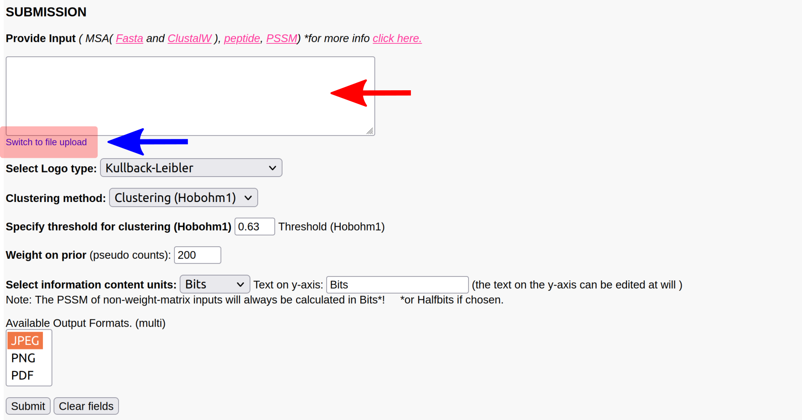
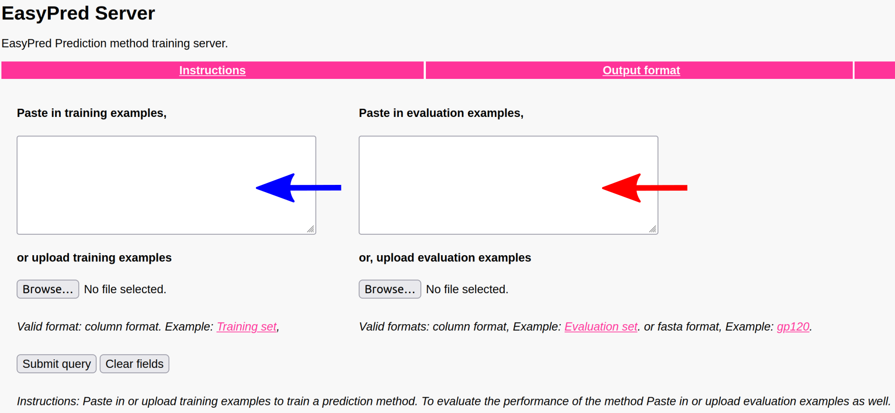
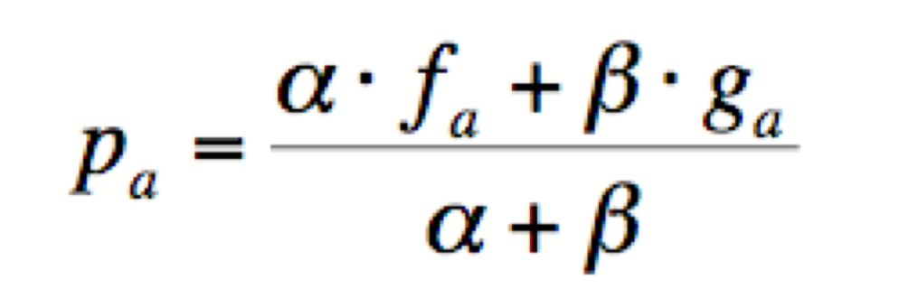
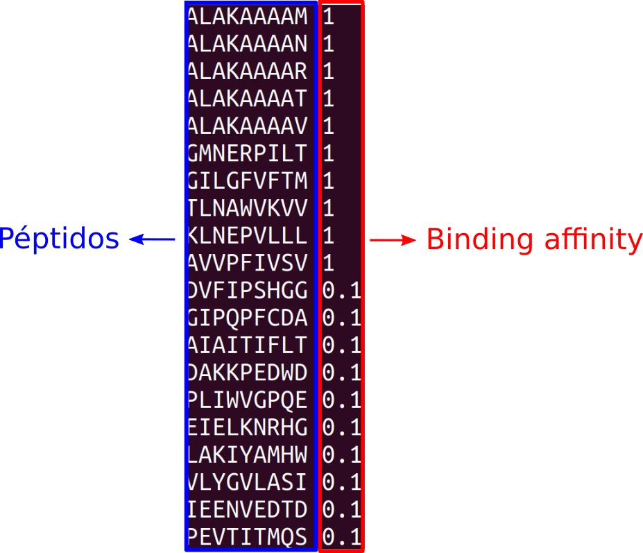
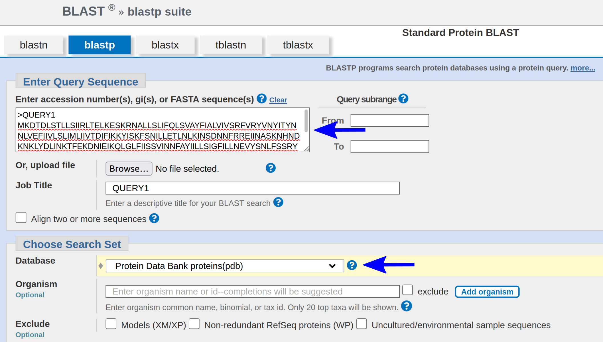
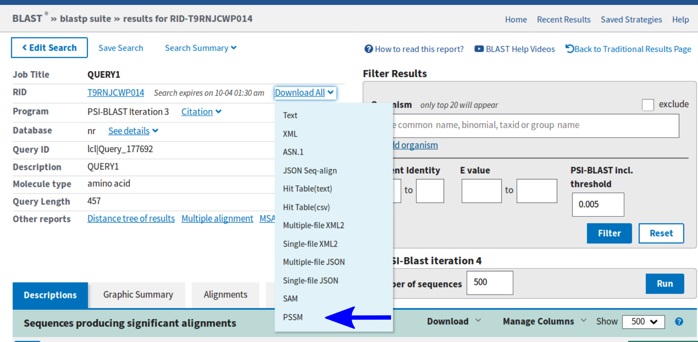
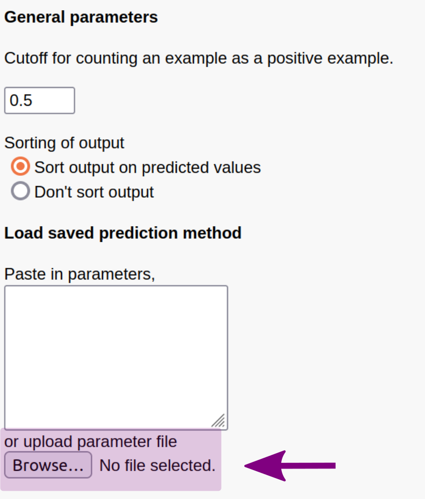

<style>
details > summary:first-of-type {
   display: list-item;
}
details summary { 
  cursor: pointer;
}

details summary > * {
  display: inline;
}

</style>



**Pagina en construccion**



<ul class="block-list has-radius is-primary">
   <li class=" is-info has-icon" markdown="span">
      <span class="icon"><i class="fas fa-clipboard"></i></span>
    <span style="font-weight:bold;">Este TP tiene informe.</span>
   </li>
</ul>

## Materiales

[Descargar](https://drive.google.com/file/d/1FxPw14CbMyxxfiIQSVmZ6k6cmfJgohHU/view?usp=sharing) 

## Construcción de Logos y Matrices peso-específicas  

### Objetivos

* Familiarizarse con la construcción de matrices peso-específicas o PSSM.
* Familiarizarse con la visualización de logos de secuencias, y el uso del contenido de información.
* Utilizar las matrices peso-específicas como métodos predictivos, y entender las métricas PCC (Pearson correlation coefficient) y Aroc (Area under the Receiver Operating Characteristic curve) empleadas para evaluar la calidad de los modelos. 

### Introducción

En este TP utilizaremos herramientas bioinformáticas para predecir la unión de péptidos a MHC, o por sus siglas en inglés *Mayor Histocompatibility Complex*, y seleccionaremos potenciales epítopes como candidatos para desarrollar una vacuna.  

Los pasos a seguir serán:  

1. Identificación de motivos de unión a MHC.  
2. Visualización de motivos utilizando logos de secuencias.  
3. Entrenamiento de métodos de predicción de unión a MHC.  
4. Utilización de los métodos desarrollados para la selección de candidatos vacunales.  

La unión de péptidos a MHC es el paso más selectivo en el camino de procesamiento y presentación antigénica. Este evento es crucial ya que solamente 1 de cada 200 péptidos forma un complejo con el MHC. Existe una gran variedad de MHC diferentes, cada uno con una alta especificidad.  
El motivo de unión de los MHC de la vía de clase I es, en la mayoría de los casos, de 9 aminoácidos de longitud. Estos están caracterizados por una marcada preferencia por ciertos aminoácidos en determinadas posiciones del motivo. Estas posiciones son llamadas "anclas" o, en inglés, *anchor positions*. Para una gran cantidad de complejos de MHC de clase I estas anclas se encuentran en las posiciones P2 y P9. Sin embargo, este no es siempre el caso.
Existe una gran cantidad de datos que describen las diferentes especificidades de las moléculas de MHC. Una base de datos muy conocida que almacena esta información es [SYFPEITHI](http://www.syfpeithi.de/). En ella se puede encontrar informacion de ligandos y motivos de MHC.  
Con este tipo de información es posible desarrollar un modelo de predicción de unión de péptidos a MHC y usarlo para descubrir nuevos epítopes con los cuales diseñar vacunas. Esto puede ser aplicado a nivel de proteomas enteros para ahorrar tanto tiempo como recursos.  

A continuación vamos a:

1. Visualizar motivos de unión utilizando logos de secuencias.  
2. Entrenar un modelo predictivo utilizando el servidor de *Easypred*.  
3. Aplicar el modelo para seleccionar péptidos con potencial inmunogénico de proteínas de SARS-CoV-2.  

### Identificación de motivos de unión a MHC

Diríjanse a la página web de [SYFPEITHI](http://www.syfpeithi.de/). Allí, una vez que hagan *click* en el logo, pueden buscar motivos con el botón **Find your motif, Ligand or Epitope**.

Allí seleccionen con el menú de la izquierda el alelo de MHC **HLA-A\*02:01** y presionen **Do Query**. 

<ul class="block-list has-radius is-primary">
   <li class=" is-outlined" markdown="span">
	El resto de las opciones se pueden usar para refinar la búsqueda, limitándola a ligandos de proteínas determinadas o por referencia bibliográfica. En este caso queremos obtener **TODOS** los ligandos para poder ver qué características comparten.  
</li>
</ul>

En el resultado de la búsqueda podemos ver las posiciones *anchor* principales y auxiliares, y también otras posiciones con residuos preferidos. También tenemos una lista de otros aminoácidos que se ven con frecuencia en los ligandos del alelo que estamos estudiando. Por último, más abajo, se muestra la lista de los ligandos que existen en esta base de datos, junto a su proteina de procedencia, la referencia del trabajo donde se lo identificó y alguna nota como la asociación de un péptido dado con una enfermedad.  

**1.** Respondan a las siguientes preguntas:

**a.** ¿Qué posiciones identifican como *anchors*? ¿Qué residuos son preferidos en estas posiciones? ¿Y en los *auxiliary anchors*?

**b.** ¿Qué otras posiciones muestran preferencias de residuos? ¿Qué residuos son preferidos en estas posiciones? 

**c.** ¿Qué característica del conjunto de péptidos creen que puede estar diferenciando a las posiciones *anchor* (y con residuos preferidos) del resto de las posiciones de los péptidos? 
Recuérdenla para el ejercicio de logos de secuencia.

**2.** Repitan el mismo análisis para el alelo **HLA-B\*27**. ¿Coinciden las posiciones *anchor* con las del alelo **HLA-A\*02:01**?, ¿y los residuos preferidos?


### Logos de secuencias

Los logos son una herramienta muy útil para visualizar motivos de unión. En un logo de secuencia se grafica en el eje y el **contenido de información** de cada posición del motivo, generalmente expresado en *bits*. A su vez, la frecuencia con la que aparece una letra (nucleótido u amininoácido) en una dada posición se grafica con un tamaño proporcional a dicha magnitud.

Un servidor que nos permite generar facilmente logos de secuencia es [Seq2Logo](http://www.cbs.dtu.dk/biotools/Seq2Logo/). Este método nos da la opción de ingresar un alineamiento múltiple (MSA), una lista de péptidos o una matriz peso-específica con la cual realizar el gráfico. 

La información puede pegarse directamente en el <span style="color:red;font-weight:bold;"> cuadro de texto </span> que provee la web, o subiendo directamente un archivo local utilizando la opción <span style="color:blue;font-weight:bold;"> Switch to file upload </span> que se encuentra debajo del cuadro.



Dentro de las opciones que nos permite cambiar tenemos:  

* **Logo type:** Esto refiere a la magnitud que se calculará para cada posición y se graficará en el eje y (Kullback-Leiber, Shannon, etc.).  
* **Clustering method:** Agrupa las secuencias que son muy similares para no sesgar el resultado, se pueden optar por diferentes métodos.  
* **Weight on prior:** Es el valor que le asignamos al parámetro *beta* en la ecuacion del cálculo del **contenido de información**. Recuerden que la relación entre *alfa* y *beta* es determinante para este cálculo.   
* **Information content units:** Generalmente se expresa en *bits*, pero en algunos casos se opta por *half-bits*.  
* **Output format:** El tipo de archivo de imagen adonde se guardará el logo. 

También tenemos la opción de realizar cambios avanzados, como modificar las frecuencias de *background* o la matriz de *scoring*, limitar la región del alineamiento que queremos graficar, etc. y opciones gráficas, como el tamaño de la imagen y los colores con los que se representa cada aminoácido.  

Por convención los colores que se utilizan son:  

* <span style="color:red;font-weight:bold;">Rojo</span>: Aminoácidos ácidos [DE]  
* <span style="color:blue;font-weight:bold;">Azul</span>: Aminoácidos básicos [HKR]  
* <span style="color:black;font-weight:bold;">Negro</span>: Aminoácidos hidrofóbicos [ACFILMPVW]  
* <span style="color:green;font-weight:bold;">Verde</span>: Aminoácidos neutros [GNQSTY]  

En la carpeta del TP pueden encontrar los archivos **HLA-A0201** y **HLA-B27**, los cuales contienen ligandos de cada uno de estos alelos de MHC. 
Úsenlos para generar logos que muestren sus motivos de preferencia. **Utilicen como opción de clustering Heuristics.** Usamos para el resto de las opciones los valores *default*.

<ul class="block-list has-radius is-primary">
   <li class=" is-outlined is-danger has-icon" markdown="span">
      <span class="icon"><i class="fas fa-exclamation-triangle"></i></span>
		Recuerden guardar los logos de secuencia generados.
</li>
</ul>

**3.** Identifiquen las posiciones ancla y las preferencias de cada alelo. 

**a.** ¿El logo obtenido para **HLA-A02:01** y **HLA-B27** se condice con lo que encontró en la base de datos en el punto anterior? 

**b.** ¿Qué magnitud es la que está diferenciando a las posiciones *anchor* del resto? ¿En qué unidad aparece representada en el logo? ¿Coincide con lo supuesto en el punto **1.c**?

### Construcción de matrices peso-específicas (PSSM)

Para este punto vamos a utilizar el servidor de [EasyPred](http://www.cbs.dtu.dk/biotools/EasyPred/). Esta herramienta nos permite construir tanto matrices peso-específicas, o *PSSM (Position-Specific Scoring Matrix)*, como aplicarlas a un set de datos para calcular su *score*. 

El servidor consta de dos cuadros de texto, el de la <span style="color:blue;font-weight:bold;">izquierda</span> en el cual se ingresan datos para construir la matriz, y el de la <span style="color:red;font-weight:bold;">derecha</span> donde uno puede ingresar secuencias sobre las cuales quiere realizar una predicción.



Para explorar un poco la construcción de matrices solo utilizaremos el recuadro de la <span style="color:blue;font-weight:bold;">izquierda</span> donde ingresaremos las siguientes secuencias:

```Bash
VFAAA  
VHYWW  
VLQPK  
LREWQ  
LPYIH  
```
Las opciones que tenemos aquí son muy similares a las que habiamos visto en el servidor de *Seq2Logo* debido a que ambos realizan cálculos del contenido de información.  
En este caso vamos a seleccionar **Clustering method: No clustering** y **Weight on prior: 10000**. Usamos para el resto de las opciones los valores *default*.

**4.** Antes de generar la PSSM, reflexionen un poco acerca de los parámetros empleados para la construcción de la misma.

**a.** ¿Por qué consideran que no estamos usando ningún método de clustering?

**b.** ¿Por qué creen que es tan alto el valor sugerido para el *weight on prior* (β) ?

<details>
<summary> <h6> Recordatorio </h6> </summary>

La ecuación utilizada para estimar la *frecuencia* <span class="latex">p<sub>a</sub></span>, para una dada posición, en una matriz peso-específica es,



donde α es el número de secuencias en el MSA-1, β es el *weight on prior* o *weight on pseudocounts*, <span class="latex">f<sub>a</sub></span> es la frecuencia observada para el aminoácido *a* en esa posición y <span class="latex">g<sub>a</sub></span> es la pseudo frecuencia para el aminoácido *a* en esa misma posición.
</details> 
<br>
Hagan *Submit query* y observen la salida. Allí podrán encontrar información sobre los parámetros utilizados y un logo que representa el set de datos que ingresamos.

Observando el logo generado:

**5.** ¿Qué aminoácidos es más probable hallar en la posición P1?

<details>
<summary> <h6> Pista </h6> </summary>
Son los que están por encima de y=0.
</details> 
<br>
**6.** ¿Cuántos aminoácidos diferentes hay en P1 de los datos de entrada?  
**7.** ¿A qué se debe esta diferencia?  
**8.** Realice el mismo ejercicio pero ahora elija un *weight on prior* β=0. ¿Cambian sus respuestas para los puntos **5.**, **6.** y **7.**?

### Predicción de unión a MHC

Habiéndonos familiarizado con la interfaz de [EasyPred](http://www.cbs.dtu.dk/biotools/EasyPred/) vamos a utilizarla para entrenar un modelo con más datos y ponerlo a prueba. Para eso utilizaremos dos sets de entrenamiento que poseen péptidos fueron testeados con el alelo HLA-A02:01. Cada uno tiene un valor asociado que denota si son positivos (1) o negativos (0.1). A lo largo del proceso iremos variando diferentes parámetros para observar qué efectos esto tiene sobre el poder predictivo del modelo, al ser testeado en un set de evaluación con valores de afinidad (*binding affinity*) de unión a MHC reales (reescalados entre 0 y 1). 

Los datos que utilizaremos están en los archivos:

* **Entrenamiento_chico.set** que contiene 110 péptidos de los cuales sólo 10 son positivos.  
* **Entrenamiento_grande.set** contiene 232 péptidos de los cuales todos son positivos.  

Para evaluar el desempeño de nuestro modelo utilizaremos el archivo **Evaluacion.set**, el cual contiene 1266 peptidos con valores de afinidad convertidos al rango 0-1 mediante la formula 1-log(x)/log(50000). Utilizando esta transformación, 

* valores mayores a **0.638** (equivalente a 50nM) representan una unión fuerte, 
* entre **0.638** y **0.426** (equivalente a 500nM) una unión débil 
* y péptidos con valores menores a **0.426** no se consideran ligandos. 

<ul class="block-list has-radius is-primary">
   <li class=" is-outlined is-danger has-icon" markdown="span">
      <span class="icon"><i class="fas fa-exclamation-triangle"></i></span>
      Una buena práctica antes de comezar a hacer cualquier cosa con nuestros datos es observarlos y entender el formato en el que están almacenados.
</li>
</ul>

Por ejemplo, si hacemos un ```cat``` del archivo **Entrenamiento_chico.set**, nos encontramos con lo siguiente:

<p style="text-align:center">

</p>

Este es un archivo con dos columnas, la primera contiene a los péptidos y la segunda a los valores de afinidad de unión o *binding affinity* de los mismos. (¿En qué escala están los valores de *binding affinity*? ¿Están normalizados entre 0 y 1?)

Para analizar el desempeño de nuestros modelos vamos a tener en cuenta dos métricas:  
* **Aroc (Area under the Receiver Operator Curve):** este valor varía entre 0 y 1, siendo 1 el puntaje perfecto y 0.5 el valor aleatorio. Por regla general, valores mayores a 0.85 son altamente deseables.  
* **Coeficiente de correlación  de Pearson (PCC):** también oscila entre 0 y 1, siendo 1 una correlación perfecta entre las dos variables de estudio, y -1 una anticorrelación perfecta. En este caso el valor que implica aleatoriedad total o no correlación entre las dos variables es 0.  

Estas métricas nos van a ayudar a seleccionar el mejor de nuestros modelos, siendo éste el que alcance los mejores valores de **Aroc** y **Coeficiente de Pearson**.

<ul class="block-list has-radius is-primary">
   <li class=" is-outlined" markdown="span">
	A continuación vamos a entrenar varios modelos y comparar sus resultados. Haga cada prueba en una ventana nueva o guarde las salidas de alguna manera que crea conveniente.
</li>
</ul>

#### Primera prueba

<ul class="block-list has-radius is-primary">
   <li class=" is-outlined is-danger has-icon" markdown="span">
      <span class="icon"><i class="fas fa-exclamation-triangle"></i></span>
		Volvamos a abrir [EasyPred](http://www.cbs.dtu.dk/biotools/EasyPred/) o recarguemos la página para que todas las opciones vuelvan a estar por defecto.
</li>
</ul>

Realicemos los siguientes cambios: los datos del archivo **Entrenamiento_chico.set** en el <span style="color:blue;font-weight:bold;">recuadro de entrenamiento</span> y los de **Evaluacion.set** en el <span style="color:red;font-weight:bold;">recuadro de evaluación</span>. Coloquemos el **umbral de corte para positivos** (*Cutoff for counting an example as a positive example*) en 0 y apretemos el botón *Submit query*.  

La salida consta de varias partes:

* Al principio tenemos una pequeña descripción de los parámetros con los que se llevó a cabo el entrenamiento, tanto de los datos como del método. Esto es siempre útil para poder reproducir los resultados. 
* Luego tenemos un logo construído a partir de los datos de entrenamiento. Esto nos puede ayudar a identificar (como hicimos anteriormente) la preferencia de la molécula que se une a nuestro set de péptidos. 
* A continuación sigue la información sobre la evaluación. Allí podemos encontrar los valores del coeficiente de Pearson y Aroc y la lista de predicciones sobre el set de evaluación. Fíjense que *Assignment* se refiere al valor medido o real que está en el archivo de evaluación y va de 0 a 1, sin embargo la predicción puede adoptar otros valores, incluso negativos. 

<ul class="block-list has-radius is-primary">
   <li class=" is-outlined" markdown="span">
   	<span class="icon"><i class="fas fa-highlighter"></i></span>

	Las métricas que utilizamos no se enfocan en reportar la precisión del método (proporción de verdaderos positivos entre todos los péptidos predichos como positivos) sino que muestran:
	1. la habilidad del método para distinguir instancias positivas de negativas (Aroc) y 
	2. la correlación entre los valores predichos y los valores reales u observados (PCC).
</li>
</ul>

Revisando la salida contesten:

**9.** ¿Qué valores de Aroc y PCC obtuvieron? ¿Qué implica esto?

**10.** Viendo el logo resultante, ¿Entienden por qué el modelo tiene tan mal desempeño?  

**11.** ¿Cuántos de los 110 péptidos se utilizaron para la construcción de la matriz? ¿Por qué se usó ese número de péptidos?

#### Segunda prueba

Volvamos a la página principal de [EasyPred](http://www.cbs.dtu.dk/biotools/EasyPred/). Esta vez coloquemos el **umbral de positivos** en 0.5 pero especifiquemos que no haya **clustering** y pongamos un **weight on prior** de 0.0.
 
**12.** ¿Qué valores de desempeño tienen ahora? ¿Qué implican estos valores? ¿Son mejores o peores que en la primera prueba? ¿Por qué cree que cambiaron?

**13.** ¿Cuántos de los 110 péptidos se utilizaron en este caso para la construcción de la matriz?  

**14.** Mirando el logo, ¿Se parece al motivo de unión de HLA-A\*02:01 que habían visto antes? ¿Por qué cree que ocurre esto?
<details>
<summary> <h6> Pista </h6> </summary>
Tenga en cuenta el número de secuencias que se usaron para construir la matriz y recuerde que siempre es una buena práctica revisar las instrucciones de la guía y los archivos de entrada. 
</details> 
<br>

#### Tercera prueba

Volvamos atrás y repitamos el caso anterior pero seleccionando **Clustering at 62% identity**. Mantengamos el **weight on prior** en 0.0 y el resto de los parámetros como se habían seteado en la segunda prueba. 

**15.** ¿Cuál es el desempeño ahora?  

**16.** ¿Cambió el logo con respecto al anterior? Si es así… ¿A qué cree que se debe el cambio?

<details>
<summary> <h6> Pista </h6> </summary>
De nuevo, es una buena práctica revisar qué contienen los archivos de entrada, es decir los datos crudos. Miren con atención las secuencias de los positivos.
</details> 
<br>

#### Cuarta prueba

Volvamos una vez más, manteniendo **Clustering at 62% identity** pero utilicemos como **weight on prior** un valor de 200, y el resto de los parámetros como se habían seteado en la segunda prueba.

**17.** Una vez más revisen las métricas de desempeño.

**18.** Mirando el logo, ¿Cuál es la gran diferencia con aquellos que venían viendo? ¿Cuál es la razón de este cambio? ¿Empieza ahora a parecerse a los motivos que habían visto antes?  

#### Última prueba

Hasta ahora veníamos utilizando un set de datos sumamente reducido, con solo 10 péptidos positivos para entrenar. Aún asi hemos conseguido valores de desempeño bastante aceptables. Sin embargo, estos métodos suelen utilizar muchas más información para su entrenamiento.  

A continuación recarguen la página de [EasyPred](http://www.cbs.dtu.dk/biotools/EasyPred/) y carguen para entrenar el archivo **Entrenamiento_grande.set**. En el cuadro de evaluación vuelvan a cargar **Evaluacion.set**. Seleccionen una vez más **Clustering at 62% identity**, pongan el **weight on prior** en 200 y el **umbral de positivos** en 0.5. Tilden también la opción **Sort output on predicted values** para ver la tabla de péptidos ordenada por los valores de predicción.

**19.** Revisen una vez más los valores de desempeño.

**20.** Vean el logo, ¿qué les parece?

**21.** Mirando la tabla de predicciones, ¿Cuántos falsos positivos encuentran entre los primeros 20 péptidos? (con *Assignment* menor a 0.426)


<ul class="block-list has-radius is-primary">
   <li class=" is-outlined is-danger has-icon" markdown="span">
      <span class="icon"><i class="fas fa-exclamation-triangle"></i></span>

		Antes de cerrar la ventana haga *click* en **Parameters for prediction method** luego del logo. Allí podrá descargar la matriz calculada a partir de los datos de entrenamiento (Se descarga con el nombre para.dat, es un archivo de texto plano). Esta puede ser utilizada luego para llevar a cabo predicciones.

</li>
</ul>

## PSI-BLAST

### Objetivos

* Comprender el funcionamiento del algoritmo PSI-BLAST, aplicando el mismo en un caso de estudio en el que BLAST no funciona. 
* Generar y reutilizar la PSSM que arroja PSI-BLAST, para encontrar hits en otras bases de datos relevantes tales como PDB.
* Entender la información que nos otorga la PSSM construída por PSI-BLAST en relación a los residuos o dominios conservados de una proteína.

### Introducción

PSI-BLAST (o Position Specific Iterated BLAST) es un algoritmo alternativo de BLAST que construye iterativamente una matriz de puntajes posición específica, o *PSSM (Position-Specific Scoring Matrix)*, para calcular el *score* de los alineamientos. 

En su forma básica de funcionamiento lo que hace es realizar un simple BLAST con una secuencia *query* y, a partir de los resultados o *hits* que obtiene, construye un perfil o PSSM. Entonces, la siguiente búsqueda la realiza con ese perfil, lo que permitirá encontrar, idealmente, nuevos *hits*, correspondientes a secuencias más distantes de la secuencia *query*. Con esos nuevos *hits* genera un nuevo perfil, el cual, idealmente, contendrá mayor cantidad de información y con el que se podrá realizar otra búsqueda. Es un proceso iterativo.

En resumen, a partir de la segunda iteración los puntajes de la matriz variarán acorde a la conservación de los aminoácidos o nucleótidos en cada posición permitiendo refinar nuestra búsqueda y así recuperando secuencias distantes que comparten motivos o dominios con nuestra secuencia *query* original.

### Cuando BLAST falla

Digamos que se tiene una secuencia *query* (abajo) y se quiere predecir su estructura y función. Como vimos anteriormente uno recurre generalmente a BLAST para este tipo de tareas. Si logramos identificar una proteína suficientemente similar podríamos hipotetizar que comparten dichas caracteristicas.

```
>QUERY1
MKDTDLSTLLSIIRLTELKESKRNALLSLIFQLSVAYFIALVIVSRFVRYVNYITYNNLV
EFIIVLSLIMLIIVTDIFIKKYISKFSNILLETLNLKINSDNNFRREIINASKNHNDKNK
LYDLINKTFEKDNIEIKQLGLFIISSVINNFAYIILLSIGFILLNEVYSNLFSSRYTTIS
IFTLIVSYMLFIRNKIISSEEEEQIEYEKVATSYISSLINRILNTKFTENTTTIGQDKQL
YDSFKTPKIQYGAKVPVKLEEIKEVAKNIEHIPSKAYFVLLAESGLRPGELLNVSIENID
LKARIIWINKETQTKRAYFSFFSRKTAEFLEKVYLPAREEFIRANEKNIAKLAAANENQE
IDLEKWKAKLFPYKDDVLRRKIYEAMDRALGKRFELYALRRHFATYMQLKKVPPLAINIL
QGRVGPNEFRILKENYTVFTIEDLRKLYDEAGLVVLE
```

Vayan a la pagina de [BLAST](https://blast.ncbi.nlm.nih.gov/Blast.cgi) y utilicen el algoritmo de *Protein BLAST* para buscar secuencias similares. **En el campo de base de datos seleccione pdb que es la base que contiene estructuras**.

<p style="text-align:center">

</p>

**1.** ¿Cuántos *hits* con E-value < 0.005 encuentran? Vuelvan atrás y, en **Program selection: Algorithm**, seleccionen PSI-BLAST. ¿Cambió el resultado en comparación a lo que habían obtenido anteriormente? 

### Usando PSI-BLAST

<ul class="block-list has-radius is-primary">
   <li class=" is-outlined is-danger has-icon" markdown="span">
      <span class="icon"><i class="fas fa-exclamation-triangle"></i></span>

		Realicen cada corrida de BLAST (e iteración de PSI-BLAST) en una ventana diferente, en varios casos van a necesitar comparar las salidas.
</li>
</ul>

Vuelvan atrás a la página de alineamiento de proteínas, pero esta vez seleccionen la base de datos **Non-redundant protein sequences (nr)** y en la sección de algoritmos seleccionen PSI-BLAST.

Teniendo en cuenta que el primer *hit* es nuestro *query* y por lo tanto vamos a ignorarlo:

**2.** Ahora, ¿Cuántos *hits* significativos encuentran (E-value < 0.005)?

**3.** ¿Qué significa la variable **Query Cover**? Una manera visual para entender el *query coverage* es mirar el **Graphic Summary**. Dentro de la pestaña **Descriptions**, coloquen la pestaña **Show** en 100. Luego cliqueen en la pestaña **Graphic Summary**. ¿Cuál es la cobertura de los *hits* obtenidos? 

### Construyendo la PSSM

Si se fijan debajo de los *hits* significativos van a tener la opción de seguir iterando PSI-BLAST:


 
Allí pueden especificar cuantas secuencias queremos utilizar para refinar nuestras PSSM (*Position-Specific Scoring Matrix*). Conservando el valor por defecto corramos la siguiente iteración.

**4.** ¿Cuántos *hits* significativos pueden encontrar ahora (E-value < 0.005)?

**5.** ¿Cómo se modificó el coverage de estos *hits*? Vuelvan a mirar el **Graphic Summary**, colocando previamente en **Descriptions** la pestaña **Show** en 250. 

**6.** ¿Por qué creen que PSI-BLAST puede identificar ahora más *hits* significativos y que es lo que está afectando el *query coverage*?

**7.** ¿Qué significan que los *hits* estén resaltados en amarillo, y qué significa que estén en blanco con un tick verde?

<ul class="block-list has-radius is-primary">
   <li class=" is-outlined" markdown="span">
	Antes de proseguir realicen una o dos iteraciones más y observen la aparición de nuevas proteínas identificadas (marcadas con amarillo).
</li>
</ul>

### Guardando y reutilizando la PSSM

Ahora podemos utilizar la PSSM que está ajustada con los resultados obtenidos de PSI-BLAST para realizar búsquedas más significativas en otras bases de datos.
Para obtener la PSSM descarguenla arriba donde dice "*Donwload All*"



Volvamos una vez más a la página para realizar la búsqueda. Sin ingresar ninguna secuencia *query* seleccionemos otra vez la base de datos de estructuras Protein Data Bank (pdb) y como algoritmo PSI-BLAST. Por último, justo debajo del botón de BLAST, abramos el menú de *Algorithm parameters* y carguemos nuestra PSSM (justo al final). Ahora sí corramos la búsqueda.

**8.** ¿Pueden encontrar hits significativos de PDB ahora?

**9.** ¿Qué función pueden identificar en los primeros hits?

### Identificando residuos conservados

Ahora (si tuvimos suerte) habremos podido identificar una relación estructural entre nuestra secuencia *query* y las secuencias de la base de datos de estructuras proteicas PDB. Digamos que, en este punto, nos gustaría validar esa relación.

Para identificar los residuos conservados en nuestra secuencia *query* vayan al servidor de [Blast2logo](http://www.cbs.dtu.dk/biotools/Blast2logo/) y suban dicha secuencia. Seleccionen *BLAST Database* NR70 y denle *Submit* (esto puede llevar un tiempito). En caso de que algo falle puede encontrar la salida [acá](http://www.cbs.dtu.dk/biotools/Blast2logo/teaching/Query1/).

Cuando esto termine deberían tener un logo de toda la secuencia. 

<ul class="block-list has-radius is-primary">
   <li class=" is-outlined is-danger has-icon" markdown="span">
      <span class="icon"><i class="fas fa-hand-point-right"></i></span>
		Si les resulta difícil de leer pueden hacer click en el botón *Customize visualization using Seq2Logo*. Al hacer esto los transfiere al servidor de **Seq2logo** y allí, sin tocar ninguna opción, denle *Submit*. 

		Arriba les va a aparecer la opción de descargar cada imagen por separado (JPEG(1), JPEG(2), etc.) o en un sólo archivo EPS (similar a PDF). Se recomienda esto último.
</li>
</ul>

**10.** Viendo el logo: ¿Por qué creen que las primeras \~150 posiciones se ven bastante planas (Bits<1)? ¿Cuáles son las posiciones con contenido de información más alto? ¿Pueden identificar el dominio conservado que habían visto en el ejercicio anterior?

Para probar qué residuos dentro del dominio más conservado son los más relevantes para la estructura y/o función de nuestra proteína, podríamos realizar un ensayo de mutagénesis en el laboratorio. Debido a que la secuencia de nuestra proteína es larga (más de 400 aminoácidos), un estudio completo de mutagénesis podría resultar extremadamente costoso.

Por esta razón, teniendo en cuenta lo realizado con el servidor Blast2logo, vamos a seleccionar (guiados por la conservación de los residuos) 4 de los siguientes 8 residuos para llevar a cabo nuestro hipotético ensayo de mutagénesis:

* (a): H271
* (b): R287
* (c): E290
* (d): Y334
* (e): F371
* (f): R379
* (g): R400
* (h): Y436

**11.** ¿Cuáles creen que son los 4 residuos que podríamos mutar de la lista para generar un impacto en la estructura de nuestra proteína *query*?

## Ejercicio a informar

<ul class="block-list has-radius is-primary">
   <li class="is-highlighted is-info has-icon" markdown="span">
      <span class="icon"><i class="fas fa-calendar"></i></span>
    <span style="font-weight:bold;">Fecha Límite de Entrega:</span> Viernes, 10 de septiembre 2021, 23:59hs.
   </li>
</ul>

### Enunciado

Una vez que usted hizo el análisis (informado en el TP3), se comunicó con el laboratorio AVENAI y le indican que una vez secuenciado el aislamiento, tienen como política hacer todas sus secuencias de dominio público, esto significa que su secuencia de estudio ya figura en las bases de datos (Usted suspira, de haberlo sabido antes...).

Para poder identificarla, y sabiendo que es un *Betacoronavirus*, usted decide utilizar la herramienta provista por NCBI y hacer un BLASTn de su secuencia incognito contra la base de datos **genomic/Viruses/Betacoronavirus**.

1. ¿Cuál es el resultado de realizar el BLASTn? ¿Obtiene algún hit con 100% de cobertura y E-value=0.0? Si obtiene más de un hit, recupere el primero.
2. ¿A qué aislamiento corresponde su secuencia? 

Para recolectar más información de su secuencia, decide acceder al GenBank yendo a la pestaña **Alignments** de la salida del BLASTn y cliqueando en el accession number correspondiente.

Su jefe está muy interesado en estudiar qué proteínas de esta variante de coronavirus contienen ligandos del alelo **HLA-A*02:01**. Para eso a usted se le ocurre realizar predicciones utilizando la matriz peso-específica del alelo correspondiente que ya había generado en un curso de Bioinformática (TP5) tiempo atrás y que sabe que funciona muy bien. 

Puede encontrar una descripción de coronavirus y sus proteínas en [ViralZone de Expasy](https://viralzone.expasy.org/764?outline=all_by_species).

Usted decide trabajar con las proteínas **S** (spike o proteína de glicoproteína de superficie), **E** (proteína de la envoltura), **M** (proteína de membrana) y **N** (fosfoproteína de la nucleocápside) de esta variante de coronavirus (ex secuencia incógnito) ya que cree, además, que son las que podrían llegar a contener los péptidos más inmunogénicos. Para obtener las secuencias de las proteínas en estudio decide recurrir al registro del GenBank que afortunadamente guardó después de hacer el BLASTn.

Decide además utilizar la herramienta **EasyPred** que ya usó tiempo atrás para generar su matriz peso-específica, pero esta vez la usará para realizar una predicción. Por lo tanto, deja el recuadro de entrenamiento vacío e ingresa el archivo con la secuencia de la proteína a evaluar en el recuadro de evaluación. Por último, sube el archivo con la matriz en la sección **Load saved prediction method**. 

<p style="text-align:center">

</p>

Selecciona **Sort output on predicted values** y aprieta el botón Submit query.

<ul class="block-list has-radius is-primary">
   <li class="is-highlighted is-info has-icon" markdown="span">
      <span class="icon"><i class="fas fa-exclamation-circle"></i></span>
   **Importante:** En la salida no hay logos ni métricas porque ya no se está entrenando ni testeando el modelo. En este punto se está utilizando un modelo ya entrenado (su matriz) para hacer predicciones en datos que nunca vió. La lista de péptidos son todas aquellas secuencias de 9 aminoácidos que se pueden obtener de la secuencia proteica que se le administra al servidor, junto con el valor de predicción.
   </li>
</ul>

**3.** Describa lo que observa en el output de EasyPred. ¿Qué operación realiza el servidor para obtener las predicciones para cada péptido?

**4.** ¿Qué péptidos de cada una de las proteínas analizadas elegiría para testear en el laboratorio?

Para analizar en forma conjunta los mejores ligandos que obtuvo según los puntajes predichos por su PSSM decide realizar un logo con todos los péptidos de las proteínas **S**, **E**, **M** y **N** que contengan un valor de predicción mayor a 1. 

**Extra (y por ende opcional):** Puede realizar un `for loop` junto con un `awk` para seleccionar los péptidos relevantes de cada una de las proteínas (recuerde que en un TP se realizó un `awk` para seleccionar columnas). 

Para realizar el logo, utiliza Seq2Logo y genera un logo con todos estos péptidos ajustando los parámetros según su criterio

**5.** En base a los conocimientos adquiridos en su curso de Bioinformática, ¿le parece razonable el motivo hallado para el alelo HLA-A*02:01? ¿Puede ver claramente las posiciones ancla? ¿Qué aminoácidos son los preferidos para estas posiciones?

**6.** ¿Observa algo raro en el logo obtenido? ¿Cómo haría para modificarlo?



