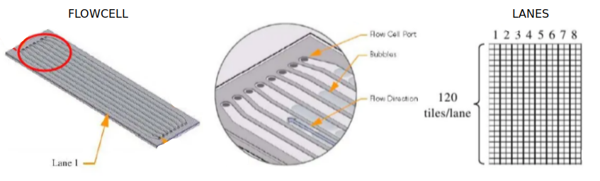



**Pagina en construccion**



<!--

## Recording

* Introducción TP N° 13. [[MP4]](https://drive.google.com/file/  .... )

<iframe src="https://drive.google.com/file/d/.../preview" width="800" height="440"></iframe>

* Final de Clase TP N° 13. [[MP4]](https://drive.google.com/file/  .... )

<iframe src="https://drive.google.com/file/d/.../preview" width="800" height="440"></iframe>

-->

## Materiales

[Descargar](https://drive.google.com/file/d/1FP6qSeLb4f-aYcu4YBi0QnM7Su4-6uHX/view?usp=sharing) 

## Objetivos

* Interpretar los formatos utilizados comunmente en NGS
* Mapear secuencias al genoma de referencia
* Visualizar e interpretar alteraciones genéticas

## Introducción

La re-secuenciación consiste en secuenciar un individuo perteneciente a una especie que ya se ha secuenciada anteriormente. Su objetivo es capturar información de polimorfismos de una base (SNPs), variaciones en el número de copias (CNVs), inserciones y deleciones (indels) en el individuo de interés. 

Siempre que exista un genoma de referencia, lo ideal es mapear en lugar de ensamblar, ya que el genoma de referencia contiene mucha información acumulada sobre el organismo de interés. Hay que tener en cuenta que al mapear se realizan múltiples asunciones, como por ejemplo, que el organismo de referencia y el analizado tienen la misma arquitectura genómica.

#### Repaso: flujo de trabajo de secuenciación y mapeo

**Laboratorio húmedo**: El ADN es clivado en fragmentos con enzimas o sonicación. Mediante Illumina se secuencian entre 75 y 100 bases de ambos extremos de cada fragmento, generando lecturas pareadas (en inglés "paired-end reads").

**_In silico_**: Se obtienen archivos en formato fastq que contienen las secuencias de cada fragmento (llamadas lecturas o _reads_) y valores de calidad de secuenciación por base. El formato FASTQ es similar al formato FASTA pero contiene una línea con la calidad (Q) codificada en [​ASCII](https://elcodigoascii.com.ar/). Luego cada lectura es alineada y mapeada al genoma de referencia. En este paso se obtiene un archivo en formato SAM, el cual contiene la secuencia, la calidad y además las coordenadas donde se ubica este fragmento respecto al genoma de referencia.


#### Chlamydia trachomatis

*Chlamydia trachomatis* es uno de los patógenos humanos de mayor prevalencia en el mundo, capaz de causar una variedad de cuadros clínicos. Las cepas de transmisión sexual pueden ser subdivididas en aquellas restringidas al tracto intestinal y tipos más invasivos como el linfogranuloma venereo o *LGV biovar*. A pesar de las diferencias en la severidad de la enfermedad, hay pocas diferencias genéticas que distinguen a las diferentes cepas de *C. trachomatis*. Como veremos a continuación, la mayoría de las variaciones ocurren al nivel de SNPs.

En este TP, procederemos a mapear las lecturas producidas con Illumina de una nueva variante de *Chlamydia trachomatis* aislada del tracto genital y compararlas con la cepa de referencia **Lb** y otra cepa conocida **L2b**. Esta nueva cepa, llamada **NV**, causó un alerta sanitario en Europa en el año 2006 y comenzó a diseminarse alrededor del mundo. La causa de su expansión es que evade la detección por el test diagnóstico basado en una reacción de PCR. En el desarrollo de este trabajo práctico podrán identificar la razón por la cual esta cepa evadió el ensayo diagnóstico.

### Ejercicio 1: Inspección de los datos crudos

Siempre que sea posible, es una buena práctica visualizar los archivos de trabajo. 
Para comenzar leeremos los archivos crudos de secuenciación de Chlamydia trachomatis, los cuales tienen formato FASTQ.

Abrir una terminal y dirigirse al directorio de descarga de los materiales del TP "Short-Read-Mapping". 
Leer la primera linea de un archivos fastq con el siguiente comando:

```Bash 
zcat NV_1.fastq.gz | head -4 
```

**Formato FASTQ**

- 1ra línea. `IL7_1788:5:1:34:600/1` es el nombre de la lectura secuenciada y contiene la siguiente información descriptiva de la posición en la flowcell de secuenciación

	| Elemento | Descripción |
	| :---: | :---: |
	| IL7_1788 | ID del instrumento y numero de corrida |
	| 5 | _flowcell lane_ o carril |
	| 1 | _tile_ o casilla en la _flowcell lane_ |
	| 34 | coordenada 'x' |
	| 600 | coordenada 'y' |
	| /1 | sentido de la secuenciación |



- 2da línea. La secuencia.
- 3ra línea. `+` Separador entre la secuencia y la calidad.
- 4ta línea. Calidad de la secuencia. Hay un caracter para cada nucleótido. El caracter está asociado a un puntaje de calidad de cada nucleótido, lo cual está codificado de la siguiente forma: cada caracter representa un número (N°) según el código decimal [​ASCII](https://elcodigoascii.com.ar/), y la calidad se define como este número menos 33. ¿Y cómo se asocia esto a la probabilidad de error (p) de la base asignada? así: `(N° - 33) = calidad`


1. Identificar los componentes de la primer lectura: nombre, secuencia, calidad y ubicación física de la lectura en la celda de flujo (es decir, lane, tile, x, y).

2. Usando el código [​ASCII](https://elcodigoascii.com.ar/), determinar la calidad de las primeras 3 bases secuenciadas.

3. Leer la primera lectura del archivo `NV_2.fastq.gz` donde se guardan las lecturas del otro extremo (porque es secuenciación paired ends). ¿Qué similitudes y diferencias encuentra en cada una de las líneas de texto? ¿A qué se deben? 

### Ejercicio 2: Análisis de calidad de secuencias

Dado que la secuenciación de segunda generación tiene una mayor tasa de error que la de primera generación (Sanger), es importante revisar la calidad de nuestras lecturas. Explorar y entender las características de los datos en crudo, nos dará confianza en los experimentos ulteriores que llevemos adelante con las secuencias.

#### FastQC
Este programa analiza los datos crudos para realizar gráficas y tablas que muestren la calidad global de los datos. Permite identificar algunos problemas relacionados a distintos aspectos de los datos. 

Para instalar FastQC, ejecutar el siguiente comando en una consola de linux:

```Bash
sudo apt install fastqc
```

El reporte de FastQC tiene este formato (puede variar entre versiones):


Algunos aspectos a evaluar en un reporte de calidad son:
* Calidad de secuencia por base: Es un indicador global que muestra la distribución de calidad de base (Phred score, en el eje y) por posición en la lectura (eje x). Los Phred scores por encima de 30 suelen considerarse de buena calidad para una lectura de Illumina. En este caso, la lectura comienza con una alta calidad (zona verde), que decrece a medida que aumenta la longitud de la lectura (zonas amarilla, Phred < 30 y rojo, Phred < 20). Debería mantenerse, en lineas generales, dentro de la zona verde; aunque no debemos preocuparnos si cae abruptamente para lecturas largas.
* Calidad de secuencia según posición en la flowcell: Este indicador permite detectar problemas en regiones físicas especificas del secuenciador. Un problema frecuente es la formación de burbujas. 
* Contenido de base por secuencia: La frecuencia de cada nucleótido en una lectura debería ser más o menos constante, y visualizarse como lineas horizontales paralelas a lo largo de toda la lectura.
* Contenido de GC por secuencia: Esta gráfica permite identificar contaminaciones. Un perfil de contenido de GC que no se ajusta a una distribución normal podría indicar presencia de contaminantes. La curva esperada está ajustada a la distribución en humanos, si se trabaja con otro organismo podría verse diferente, pero lo importante es ver un solo pico. 
* Contenido de N por base: El caracter **N** indica que el proceso de secuenciación fue inconcluyente a la hora de asignar un nucleótido. Un exceso de éstos indica problemas.
* Niveles de duplicación de secuencia: La aparición de duplicaciones excesivas puede sugerir artefactos durante la generación de la librería que usamos para secuenciar (o problemas en la PCR que usamos para amplificar nuestra muestra, si usamos alguna).
* Contenido de adaptadores: Aparición de adaptadores propios de la tecnología de secuenciación (no pertenecen a nuestra secuencia de interés y deben ser removidos antes de mapear al genoma de referencia).

#### Análisis de calidad de las secuencias de *C. trachomatis*

Para realizar el análisis de calidad de la secuenciación con FastQC, ejecute el siguiente comandos:

```Bash 
fastqc NV_1.fastq.gz NV_2.fastq.gz
```
Puede observar con el comando `ls`, que FastQC ha generado nuevos archivos en el directorio donde se encuentra. 
A continuación, visualice los resultados de cada archivo de secuenciación por separado abriendo el html generado con un navegador:

```Bash 
firefox NV_1_fastqc.html NV_2_fastqc.html
```

**4.** Compare la calidad de los datos con este ejemplo:
- [Example of Conventional Base Calls](https://www.bioinformatics.babraham.ac.uk/projects/fastqc/bad_sequence_fastqc.html)

### Ejercicio 3: Mapeo de secuencias al genoma de referencia de *C. trachomatis*

<ul class="block-list has-radius is-primary">
   <li class=" is-outlined is-danger has-icon" markdown="span">
      <span class="icon"><i class="fas fa-exclamation-triangle"></i></span>El software para realizar el mapeo funciona en computadoras con una arquitectura de 64bits (actualmente la mas común). Dado que nuestra máquina virtual tiene una arquitectura de 32bits, usted NO debe ejecutar los comandos de esta etapa. Podrá ver los resultados en su directorio de trabajo. Le brindamos los comandos en caso de querer reproducir el análisis en secuencias de su interés.</li>
</ul>

Si tuvieramos la posibilidad de correrlo, los comandos a ejecutar serían los siguientes.
El software para mapear las lecturas es BWA. Para instalarlo ejecutar:

```Bash
# NO ejecutar
sudo apt install bwa
```

La secuencia de referencia para este ejercicio es la cepa LGV de *Chlamydia trachomatis*, denominada **L2** y se encuentra en el archivo "``L2_cat.fasta``". Este archivo contiene concatenado en formato fasta la secuencia del genoma y de un plásmido.

La mayoría de los programas que trabajan con genomas completos necesitan indexar la secuencia de referencia contra la que se alinearán las lecturas antes de comenzar. 
Para ello ejecutar:
 
```Bash 
# NO ejecutar
bwa index L2_cat.fasta 
```

Realizado el indexado del genoma de referencia, podremos mapear nuestras secuencias crudas empleando el algoritmo BWA-MEM:
	 
```Bash 
# NO ejecutar
bwa mem L2_cat.fasta NV_1.fastq.gz NV_2.fastq.gz > mapping.sam
```

#### Compresión de archivos SAM

<ul class="block-list has-radius is-primary">
   <li class=" is-outlined" markdown="span">
   A partir de aqui continúe ejecutando los comandos
   </li>
</ul>

El formato SAM (Sequence Alignment Map) es un formato estandarizado para guardar de secuencias de nucleótidos alineadas (Para mas información ver [SAM format](https://samtools.github.io/hts-specs/SAMv1.pdf)). 

El formato BAM es el equivalente binario y comprimido de SAM, desarrollado para aumentar la velocidad y utilizarse en procesamientos intensivos de datos. 

<!--
El programa que usaremos para convertir y analizar los archivos SAM y BAM es SAMtools, el cual instalaremos con el siguiente comando:

```Bash
sudo apt install samtools
```
-->

Para instalar los programas que usaremos a continuación ejecute el script de instalación ubicado en la carpeta de trabajo con el siguiente comando:

```Bash
bash update.sh
```

Mientras se instalan los programas, abra una nueva ventana de la consola y revise de qué se trata el `.sam` visualizando las primeras líneas del archivo:

```Bash
head mapping.sam
```

Las partes del archivo SAM son las siguientes:


Una vez terminada la instalación, convierta el alineamiento de formato SAM a formato BAM:

```Bash 
samtools view -b -S mapping.sam > mapping.bam 
```

**5.** Compare el tamaño de los archivos SAM y BAM y determine el factor de compresión. 

<details>
<summary> <h6>¿Se le ocurre qué comando puede utilizar para ver el tamaño de los archivos?</h6> </summary>

```Bash 
ls -lh mapping*
```
</details>
<hr>

Seguidamente ordene las lecturas mapeadas por cromosoma y/o coordenada con el siguiente comando:

```Bash 
samtools sort -o NV.bam mapping.bam 
```

**6.** ¿Por qué las secuencias no están ordenadas y debemos hacerlo en un paso más?

Finalmente indexaremos el archivo en formato BAM:

```Bash 
samtools index NV.bam
```

### Ejercicio 4: Visualización de secuencias mapeadas

Artemis permite visualizar datos de secuenciación de tecnologías de nueva generación como Illumina, 454 o Solid (Puede visiar el sitio [NGS Tools](https://www.sanger.ac.uk/science/tools/categories/Sequence%2520data%2520processing/all&sa=D&ust=1548712235814000) para más información y ejemplos). 

Para abrir Artemis ejecutar en la terminal: 

```bash
cd ~/Tools/artemis/
./art
```
- Abrir la secuencia de referencia "L2_cat.fasta". Para esto hacer click en ``'File'`` > ``'Open'`` y abra el archivo correspondiente. Seleccionen la opción "Concatenate Sequences"

#### Vista básica de Artemis

* Menúes desplegables.
* Entradas activas. En nuestro caso estará `L2_cat.fasta`.
* Este es el panel principal de visualización. Las 2 lineas grises centrales representan la hebra de DNA positiva (arriba) y la negativa (abajo). Arriba y abajo de ellas se encuentran los 3 marcos de lectura en cada sentido, respectivamente. Los codones *stop* son señalados con barras negras verticales. Los genes y otros "features" (e.g. dominios Pfam o Prosite) se muestran como cajas coloreadas. Para desplazarse mover el deslizador horizontal (inferior), y para hacer zoom, mover el deslizador vertical (lateral).
* Este panel tiene una disposición similar al panel principal pero es un acercamiento. Haga doble click sobre un gen en el panel principal y en este observará un acercamiento del comienzo del gen.
* Este panel lista las anotaciones o "features" presentes en las secuencias en el orden en que ocurren en el DNA, con el gen seleccionado resaltado.
Nota: para minimizar o expandir los paneles, clickear en los **...** que figuran en el margen superior izquierdo de cada panel. 

- Abrir el archivo de anotación denominado "L2_cat.embl". Para esto hacer click en ``'File'`` > ``'Read an Entry'`` y abra el archivo correspondiente. 

- Para visualizar el mapeo de lecturas que acabamos de hacer vamos a cargar en Artemis nuestras lecturas mapeadas en formato BAM, de la siguiente manera: Haga clic en ``'File'`` > ``'Read BAM / VCF '`` > ``'Select'`` y abra el archivo ``NV.bam``


<ul class="block-list has-radius is-primary">
   <li class=" is-outlined" markdown="span">Recuerden que estas lecturas son de la cepa sueca "NV" mapeadas contra el genoma de referencia de la cepa "L2". 
</li>
</ul>

Ahora debería ver la ventana BAM en la pantalla de Artemis. Es posible moverse hacer zoom en las secuencias moviendo la barra lateral. Pero dado que cargamos mucha información en el visualizador, la apertura demora. 


Si clickea una lectura, también se seleccionará la lectura apareada. También notará que si el cursor se detiene por suficiente tiempo sobre una lectura aparecerán los detalles de esa lectura en una pequeña caja.
Si quieren saber más sobre una lectura, haga click derecho sobre ella y seleccionen en el menú: ``'Show details of: READ NAME'``. Aparecerá una ventana detallando la calidad del mapeo, coordenadas, si es una lectura duplicada o no. Si esta lectura se encontrase en una región interesante, poder acceder facilmente a esta información puede ser muy valioso.


#### Calidad de Mapeo

<ul class="block-list has-radius is-primary">
   <li class=" is-outlined" markdown="span">La calidad de mapeo depende en la precisión de la lectura y el número de "*mismatches*" respecto a la secuencia de referencia. Un valor de 0 indica que la lectura mapea igualmente bien con al menos otro lugar por lo que **su mapeo no es confiable**. El máximo valor posible de "Mapping quality" es 99. </li>
</ul>


**7.** Basándose en sus conocimientos de biología y de bioinformática ¿qué aspectos considera que podrían influir en la calidad de mapeo?

A continuación, vamos a filtrar las lecturas para visualizar solo aquellas que tienen una buena calidad de mapeo. Para realizar esto haga click derecho sobre el gráfico de lecturas apiladas , seleccionen ``'Filter'``. Aparecerá una ventana con muchas opciones para filtrar: ``'By Mapping Quality (mapq) cut-off'`` (Lecturas con calidad de mapeo menor a). Prueben con 59.

> **Tip:**
> Filtrar lecturas con regiones repetitivas y ver únicamente lecturas correctamente apareadas puede ser muy útil para hacer el análisis del mapeo.

#### Visualización de las lecturas mapeadas

Artemis tiene varias modalidades de visualización de archivos BAM. Para explorarlas haga click derecho en el panel BAM y seleccionen el menú de opciones 'Views': 

* Por defecto (la que están viendo) se denomina apilada o **"stack view"**. Cada linea representa una lectura de secuencia. Las lecturas azules son lecturas únicas, mientras que las verdes (o negras) representan lecturas duplicadas que tienen el mismo comienzo y fin. Para ahorrar espacio si hay secuencias duplicadas, solo se muestra una. 
* **'Coverage'** muestra un gráfico que representa la profundidad de secuenciación por posición. En secuenciación de segunda generación la **cobertura** o cantidad de reads secuenciadas por fragmento es muy importante. Dado que esta tecnología puede tener errores, a mayor cobertura, mayor confianza en la detección de variantes. 
* **'Strand stack'**, muestra las lecturas directas y reversas separadas por encima y por debajo de la escala respectivamente. Es útil para aplicaciones hebra específicas. 
* **'Inferred size'** grafica las lecturas apareadas a lo largo del eje Y de acuerdo al tamaño de inserto inferido del fragmento de DNA utilizado para hacer la libreria. Noten que las librerias de Illumina son usualmente hechas de DNA fraccionado con un tamaño promedio de 250bp. Este no es el tamaño real de los fragmentos de la libreria, sin embargo uno esperaría que correlacionen y sean relativamente constantes si la referencia esta altamente conservada con la secuencia mapeada. Esta vista es de gran utilidad para ver inserciones y deleciones.
* **'Paired stack'** une lecturas apareadas. Esto puede ser útil para visualizar rearreglos y para confirmar que regiones cercanas en el genoma de referencia también lo estan en el genoma del cual emanan las lecturas alineadas. 

**8.** ¿Por qué podrían generarse lecturas duplicadas? ¿Todas las lecturas duplicadas nos serán útiles?

Sacaremos provecho de la vistas en nuestro ejemplo biológico. Para ello haga click derecho en el panel BAM y seleccionen la vista 'Stack'. Luego haga click derecho en el panel BAM y seleccionen en Graph la opción 'coverage' (agregando a la vista el gráfico de cobertura). 
Desde el panel de "features" (el de abajo de todo) haga doble click en el ``'fasta_record AM886278.1'`` (el "DNA feature" en marrón) y compare la cobertura del plásmido con la región genómica de **NV**

Su pantalla de Artemis debería verse así:


**9.** ¿Qué aspectos considera que pueden influir en la cobertura en general y en este caso en particular?

A simple vista, ¿notan alguna región diferente? A continuación diríjanse a  ``'Goto'`` > ``'Navigator'`` > ``'Goto Base'`` e inserten la posición 1044000. 
Haga click derecho en el panel BAM y seleccionen la vista 'Inferred size'.
Haga click derecho en el panel BAM y quiten el Graph 'Coverage'. Usen la escala logarítmica (esto lo realiza chequeando la caja 'Use log Scale' en en el mismo menú que abren para cambiar las vistas de las lecturas mapeadas).

Su pantalla de Artemis debería verse así:


Observarán que el tamaño inferido de las lecturas pareadas a los lados de esta zona es mucho mayor al tamaño normal observado por fuera de esta región. No observándose ninguna línea gris uniendo lecturas pareadas dentro del rango normal de tamaño cruzando esta región. Esto es indicativo de una **deleción** en la cepa secuenciada comparada con la referencia.

#### Visualización de múltiples archivos BAM

También pueden visualizar múltiples archivos BAM al mismo tiempo. Recuerden que los archivos BAM son un grupo procesado de lecturas alineadas de una bacteria (en este caso) contra una secuencia de referencia. Asi que en principio podriamos observar múltiples aislamientos bacterianos diferentes mapeados contra la misma referencia. La cepa de *C. trachomatis* que va a leer es la **L2b**. Es filogenéticamente más cercana a la cepa de referencia que la que hemos analizado hasta el momento, por eso el nombre similar.

No harán nuevamente el mapeo para esta cepa, ya hemos procesado los datos crudos en fastq por ustedes. El archivo que necesitan se denomina "L2b.bam". Para abrirlo haga clic derecho sobre la vista de las lecturas apiladas y luego en el menú ``'Add Bam...'`` > ``'Select'`` y seleccionen el archivo correspondiente.

Lo primero que hace Artemis es unir todas las lecturas nuevas a las anteriores en la misma ventana. Esto es útil si se realizaron múltiples corridas de secuenciación a partir de la misma cepa. Pero en este caso queremos separarlas en dos ventanas para verlas independientemente. Para esto lo que haremos es primero clonar la ventana de lecturas apiladas actual haciendo clic derecho sobre la misma y seleccionando ``'Clone window'``. Ahora tendrán dos ventanas idénticas con todas las lecturas apiladas. Si ahora hacen clic derecho sobre la ventana superior y selecciona ``'Bam files'`` pueden prender o apagar los archivos BAM. Lo que significa que pueden desplegar cada archivo BAM por separado en las dos ventanas prendiendo alternativamente uno y apagando el otro.

Veamos la región del plásmido situada al final del genoma y observen la región no mapeada que analizamos previamente (alrededor de la base 1044800). Miren la vista de 'Inferred size' también para comparar (puede que se enlentezcan los desplazamientos, tenga paciencia).

**10.** ¿Por qué piensa que la cepa **NV** no es detectada en el ensayo diagnóstico estándar, pero si la cepa **L2b**?


<!--¿Qué pasa con la región deleteada en NV para la cepa L2b? ¿Qué pueden decir acerca de las tecnologías de secuenciación usadas para una u otra cepa? -->

### Ejercicio 5: Detección de variantes (SNP e InDel)

Para comenzar, regresen a la visualización de lecturas apiladas.

Para visualizar SNPs hagan click derecho en la ventana donde están las lecturas apiladas. Luego en el menú que se despliega, hagan click en ``'Show'`` y chequeen la caja que dice ``'SNP marks'``. Se mostrarán los SNPs con respecto a la referencia como líneas rojas en las lecturas individuales. Observarán que algunos SNPs están presentes en todas las lecturas, formando líneas verticales rojas, mientras que otros SNPs se encuentran distribuidos más esporádicamente. Los primeros tienen mayor probabilidad de ser verdaderos SNPs mientras que los últimos probablemente sean errores de secuenciación. 


Si acerca la visualización de las lecturas apiladas al máximo podrán observar (1) las secuencias individuales de cada lectura y (2) las bases que difieren de la referencia estarán en rojo.


<ul class="block-list has-radius is-primary">
   <li class=" is-outlined" markdown="span">
Muchos SNPs son bastante claros, sin embargo, esto no es siempre el caso. ¿Qué sucede si la profundidad de lecturas es muy baja? Si solo hay dos lecturas mapeando en un sector, la referencia es T y ambas lecturas son C, ¿Es evidencia suficiente para decir que hay un SNP? ¿Que pasa si hay muchas lecturas mapeando una región y, por ejemplo, de 100, 50 tienen G y las otras 50 tienen T en una posición en particular. ¿Es un SNP? También podria ser una coinfección o una variación en un genoma diploide...
   </li>
</ul>

#### Calculando con más precisión los SNPs

Hasta el momento hemos visto la variación como un simple y homogéneo grupo de SNPs. En realidad se necesitaría más información para entender el efecto que el cambio en la secuencia puede ocasionar en, por ejemplo, la capacidad codificante. Para esto podemos visualizar un tipo de formato denominado "variant call format" (VCF), el cual tiene su forma comprimida denominada "binary variant call format" (BCF).

El formato VCF fue desarrollado para representar datos de variación de 1000 proyectos genoma humanos y ya es bastante aceptado por la comunidad como el formato estándar para *SNP calling*. 

Nosotros vamos a generar el archivo en formato VCF a partir de nuestro archivo ``'NV.bam'`` y visualizarlo en Artemis.

Para crear un archivo VCF necesita ir a la terminal y escribir los siguientes comandos:

```bash
bcftools mpileup -Ou -f L2_cat.fasta NV.bam | bcftools call -v -c --ploidy 1 -Ob > NV.bcf
bcftools view -H NV.bcf -Oz > NV.vcf.gz
tabix NV.vcf.gz
```

Visualicen el resultado del *variant calling* usando head:

```bash
zcat NV.vcf.gz | head
```


Ahora leeremos en Artemis el archivo VCF que recien crearon. Para esto diríjanse al menú principal, seleccionen ``'File'`` ,``'Read BAM / VCF'`` , ``'Select...'`` y abran el archivo ``"NV.vcf.gz"``. Como siempre ajusten el tamaño de las ventanas BAM y BCF para poder visualizarlas bien. En un principio, en la ventana VCF solo se muestran los SNPs del cromosoma. Para mostrar los SNPs del plásmido abran el ícono que se encuentra arriba y a la izquierda en el panel de BCF y seleccionen ``'Combine References'``. Ahora ambos serán visibles.

Para ver una región con algo de variación genética interesante vayan al gen CTL0578 haciendo  ``'Goto'`` > ``'Navigator'`` > ``'Goto Feature with Gene Name'`` e insertan allí "CTL0578"

 (otra vez, usen el deslizador, el menú 'GoTo' o el 'Navigador')


Aquí abajo se lista el esquema de colores y formas utilizado para las variantes en el panel de BCF. Noten que a su vez se incluyen los indels. Muevanse a lo largo de la secuencia y busquen algunas de las variantes:

#### Esquema de colores por defecto

	| Variante | Identificador |
	| :---: | :---: |
	| A | Verde |
	| G | Azul |
	| T | Negro |
	| C | Rojo |
	| Alelos múltiples | Naranja, con un círculo en la punta |

<!--
| Inserciones | Magenta |
| Deleciones | Gris |
| Sin variación | Gris claro |
| SNP sinónimo | Rojo |
| SNP no sinónimo | Azul |
-->
	
**11.** ¿Qué tipos de variantes pueden identificar en el gen CTL0578?

#### Puntuación de calidad

Las variantes pueden colorearse por tipo (por defecto) o por score. Las variantes en nuestro ejemplo están todas en la escala del rojo, siendo aquellas con mayor puntaje, de color más intenso. Pruébenlo con `Click derecho` > `Colour by` > `Score`.


Artemis también permite filtrar los archivos BCF. Haciendo clic derecho sobre el panel y seleccionando ``'Filter...'`` podrán ver las opciones de filtrado. Pueden seleccionar o deseleccionar diferentes tipos de variantes de SNPs para modificar la vista. Los sitios *'Non-Variants'* (no variantes) son importantes porque diferencian aquellos sitios que no cambian pero tienen lecturas que mapean sobre esas posiciones, de regiones que *aparentan* no tener variaciones porque no hay lecturas que mapean a ellas. 


Como la vista de archivos BAM, también pueden remover o incluir SNPs basado en, por ejemplo, el puntaje del mapeo, la profundidad de cobertura, la calidad de secuencia. Todo esto lo pueden hacer desde la sección ``PROPERTY`` del menú de filtrado de SNPs. Valores de corte útiles son de un "DP" de "10" y de un "Qual" de al menos "30".

#### Ejercicio adicional: comparando cepas

En el directorio de trabajo tiene el archivo BAM de la cepa L2b. Con los comandos vistos, calcule las variantes de esta cepa respecto al genoma de referencia de L2. 

<details>
<summary> <h6>Comando para realizarlo</h6> </summary>
```bash
bcftools mpileup -Ou -f L2_cat.fasta L2b.bam | bcftools call -v -c --ploidy 1 -Ob > L2b.bcf
bcftools view -H L2b.bcf -Oz > L2b.vcf.gz
tabix L2b.vcf.gz
```
</details>
<hr>

Una vez generado el VCF, agreguelo a la vista haciendo click derecho sobre la ventana BCF y seleccionen ``'Add VCF'``. Una vez que hayan abierto el archivo y para facilitar la identificación de cada archivo BCF activo, hagan clic derecho en la ventana BCF y chequeen la caja ``'Show labels'`` . Verán las etiquetas a la izquierda de la ventana. Pueden alejar el zoom y moverse a distintas regiones para comparar.

**12.** ¿Qué cepa tiene mayor cantidad de variantes? ¿Por qué?


