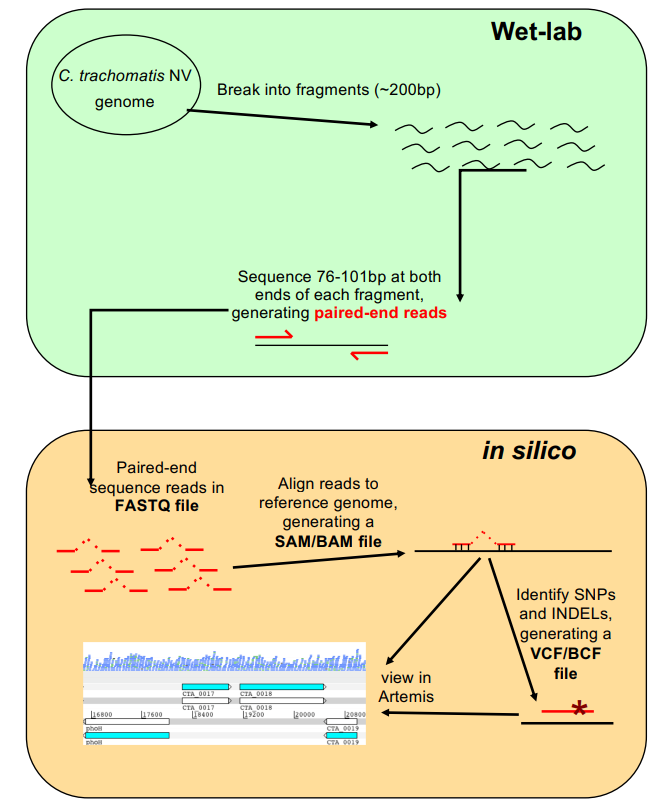
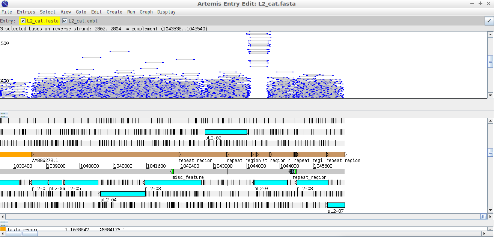
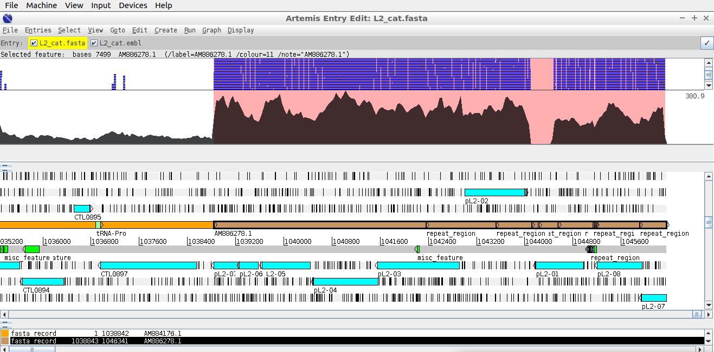
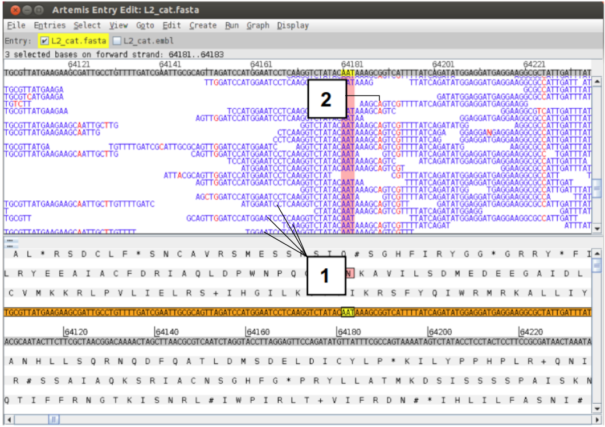
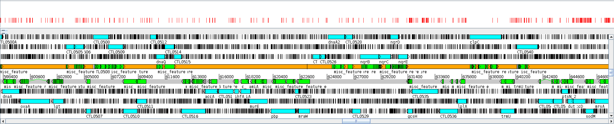
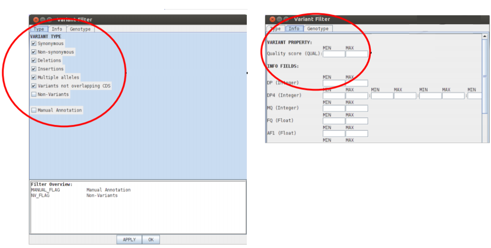



**Pagina en construccion**





## Materiales

<a href="data/"> Descargar </a>



## Introducción

Artemis, como ya hemos visto, nos permite cargar, ver y editar archivos de EMBL/Genbank (NCBI) en un formato gráfico altamente interactivo. También permite ver datos de secuenciación de tecnologías de nueva generación de Illumina, 454 o Solid ([NGS Tools](https://www.sanger.ac.uk/science/tools/categories/Sequence%2520data%2520processing/all&sa=D&ust=1548712235814000) para más información y ejemplos). La re-secuenciación tiene como objetivo capturar información de polimorfismos de una base (SNPs), inserciones y deleciones (indels) y variaciones en el número de copias (CNVs) entre variantes del mismo organismo, dentro de una población. Para cumplir esto, en vez de ensamblar las lecturas de secuencia de novo para producir un nuevo genoma, se suelen mapear los nuevos datos de secuencia al genoma de referencia. De esta forma podemos luego identificar SNPs e INDELS que pueden distinguir dos organismos altamente relacionados. Hay que tener en cuenta que se asumen muchas cosas al realizar esto, incluyendo que el organismo de referencia y el analizado tienen la misma arquitectura genómica.

## Objetivos:

1. Mostrar cómo los datos de lectura de secuenciación de nueva generación pueden ser visualizados en Artemis junto a la secuencia de referencia escogida.
2. Mostrar cómo se puede visualizar datos de variación genética en Artemis.

### Introducción al ejercicio:

*Chlamydia trachomatis* es uno de los patógenos humanos de mayor prevalencia en el mundo, causando una variedad de infecciones. Es la causa principal de enfermedades de transmisión sexual; se estima que solo en el año 1999 ocurrieron 91 millones de infecciones. Adicionalmente, este patógeno produce Tracoma, una ceguera prevenible con aproximadamente 84 millones de casos en todo el mundo. Las cepas de transmisión sexual pueden ser subdivididas en aquellas que están restringidas al tracto intestinal y aquellos tipos más invasivos como la del linfogranuloma venereo o *LGV biovar*. A pesar de las grandes diferencias en el sitio de infección y la severidad de la enfermedad, hay pocas y pequeñas diferencias que distinguen cualquiera de las diferentes cepas de *C. trachomatis*. Como veremos a continuación, la mayoría de las variaciones ocurren al nivel de SNPs.

#### El ejemplo:

Vamos a mapear las lecturas producidas con Illumina de una nueva variante de tracto genital aislada recientemente en Suecia. La cepa, conocida como **NV**, causó un alerta sanitario en Europa en el 2006. Durante este tiempo se ha convertido en la cepa dominante circulante en algunos países Europeos y comienza a desparramarse alrededor del mundo. La razón de la expansión de esta cepa fue que evade la detección por el test diagnóstico que está basado en una reacción de PCR. **En el curso del ejercicio van a identificar la razón por la cual esta cepa evadió el ensayo diagnóstico estándar**.

#### Recordatorio: Flujo de trabajo de secuenciación y mapeo:

**Laboratorio húmedo**: El ADN de la cepa NV de *C. trachomatis* es roto en fragmentos (~200bp), mediante Illumina se secuencian entre 75-100 pares de bases de ambos extremos de cada fragmento generando lecturas pareadas ( del inglés "paired-end reads").

**_In silico_**: Se generan archivos de secuencia de cada lectura en un formato denominados "fastq", los cuales son alineados a la secuencia de referencia del genoma en formato SAM. Luego se generan archivos en formato BAM, los cuales se pueden visualizar en Artemis.



Hasta el momento, no hemos trabajado con archivos tipo FASTQ (Ni SAM/BAM). En la siguiente imagen se muestra las características del formato FASTQ:


Cada lectura de secuencia está representada por cuatro lineas.

- 1ra línea. `IL7_1788:5:1:34:600/1` es el nombre de la lectura secuenciada donde los números de interés incluidos son: `IL7` el cual hace referencia a la máquina de secuenciación. `1788` y `5` indican la corrida y la línea de lectura. `/1` hace referencia a que es una lectura directa, en caso de ser reversa habría un `/2`.
- 2da línea. La secuencia.
- 3ra línea. `+` Separador entre la secuencia y la calidad.
- 4ta línea. Calidad de la secuencia. Hay un caracter para cada nucleótido. El caracter está asociado a un puntaje de calidad de cada nucleótido, lo cual está codificado de la siguiente forma: cada caracter representa un número (N°) según el código decimal [​ASCII](https://elcodigoascii.com.ar/), y la calidad se define como este número menos 33. ¿Y cómo se asocia esto a la probabilidad de error (p) de la base asignada? así: `(N° - 33) = cálidad`

> Calculen la probabilidad de error (p) de las bases con caracteres de calidad '>' (N°=62) y '6' (N°=54). ¿Coincide con la premisa de que las lecturas de secuencia tienden a tener más errores al final que al principio?.

### Ejercicio

Para comenzar el ejercicio necesitamos abrir una terminal y movernos hacia el directorio del TP de "Short-Read-Mapping" (o, si lo copiaron y pegaron en otro lado, vayan a ese directorio).

#### Hallarán los materiales de trabajo en [este link](https://www.dropbox.com/sh/krswe6qo8mjzhh1/AAAl4F8-mHKBJu98X27XwGHda?dl=0)

Antes de hacer cualquier cosa, vamos a revisar la calidad de nuestras lecturas. Como podemos ver más arriba en el esquema del flujo de trabajo necesario para obtener nuestras lecturas de secuencia, hay una multitud de pasos necesarios para tener un fastq. Una buena lectura dependerá en gran medida del éxito individual en cada uno de todos estos pasos. Explorar y entender las características de los datos en crudo, antes de cualquier análisis, nos dará confianza en que los experimentos ulteriores que llevemos adelante con las secuencias estarán más cerca de la realidad, además de sugerir si hubo o no problemas durante los pasos anteriores a la secuenciación propiamente dicha.

#### FastQC:
Este programa toma los datos crudos para realizar gráficas y tablas simplificadas que muestren, en un pantallazo, la calidad de los datos. Permite, además, identificar algunos problemas relacionados a distintos aspectos de los datos (aunque las alarmas que disparan estos problemas están parametrizadas con genomas humanos y podrían no ser relevantes para genomas de otros organismos). La ventana de FastQC es más o menos así:


El panel principal muestra un ejemplo de comparación de la distribución de calidad de base (Phread score, en el eje y) por posición en la lectura (eje x). Los Phread scores por encima de 30 son, típicamente, considerados de buena calidad para una lectura de Illumina. En este caso, la lectura comienza con una alta calidad (zona verde), que decrece a medida que aumenta la longitud de la lectura (zonas amarilla, Phread < 30  y rojo, Phread < 20). Pueden encontrar ejemplos acerca de "buenas" y "malas" lecturas en el sitio web de FastQC (*example reports*). 

Lo principal que vamos a mirar cuando usemos FastQC es:
1. Calidad de secuencia por base: Es un indicador global de la calidad de lectura. Debería mantenerse, en lineas generales, dentro de la zona verde; aunque no debemos preocuparnos si cae abruptamente para lecturas largas.
2. Contenido de secuencia por base: La frecuencia de cada nucleótido en una lectura debería ser más o menos constante, y visualizarse como lineas horizontales paralelas a lo largo de toda la lectura.
3. Contenido de GC por secuencia: Esta gráfica permite identificar contaminaciones (ojo! recuerden que está parametrizadad para humanos!). Un perfile de contenido de GC que no se ajusta a una distribución normal podría indicar presencia de contaminantes.
4. Contenido de N por base: Este caracter indica que el proceso de secuenciación fue inconcluyente a la hora de asignar un nucleótido. Un exceso de éstos indica problemas...
5. Niveles de duplicación de secuencia: La aparición de duplicaciones excesivas puede sugerir artefactos durante la generación de la librería que usamos para secuenciar (o problemas en la PCR que usamos para amplificar nuestra muestra, si usamos alguna).
6. Contenido de adaptadores: Aparición de adaptadores propios de la tecnología de secuenciación (no corresponde a nuestra secuencia de interés).

Los reportes de FastQC se generan para cada FastQ que tengamos. No obstante, si tenemos muchos datasets, sería tedioso analizar uno por uno los reportes individualmente. Podemos usar [MultiQC](http://multiqc.info/), una herramienta que automáticamente reconoce los resultados de múltiples corridas de FastQC y los agrupa para analizar los resultados globalmente. No solo soporta resultados de FastQC, sino una gran variedad de outputs de más de 60 softwares de análisis de calidad. 

FastQC también es un programa hecho en Java y, como tal, todo lo que hicimos para que Artemis y ACT funcionaran en nuestras compus no habrá sido en vano! Vamos a descargarlo haciendo click [acá](https://www.bioinformatics.babraham.ac.uk/projects/fastqc/fastqc_v0.11.9.zip).

Una vez descargado, lo descomprimimos y ejecutamos de la misma manera que ejecutamos Artemis o ACT.

#### Revisen la calidad de las secuencias de *C. trachomatis* con FastQC y MultiQC:

Pueden hacerlo abriendo cada archivo por separado en el programa o, si lo corren desde la consola, pueden pasarle las secuencias por linea de comando:

```Bash 
fastqc NV_1.fastq.gz
fastqc NV_2.fastq.gz
```
Pueden visualizar los resultados de cada uno por separado abriendo el html generado con algún navegador:

```Bash 
firefox NV_1_fastqc.html
firefox NV_2_fastqc.html
```
O pueden juntar los reportes con MultiQC:

```Bash 
multiqc . # En el directorio en el que se encuentran los resultados del fastqc
firefox multiqc_report.html # para visualizar
```

¿Qué opinan de la calidad de los datos? ¿Continuarían trabajando con estos datos? Mientras esperan al resto, para hacer una puesta en común, analicen estos ejemplos:

- [Ejemplo 1](https://www.bioinformatics.babraham.ac.uk/projects/fastqc/bad_sequence_fastqc.html)
- [Ejemplo 2](https://www.bioinformatics.babraham.ac.uk/projects/fastqc/RNA-Seq_fastqc.html)
- [Ejemplo 3](https://www.bioinformatics.babraham.ac.uk/projects/fastqc/small_rna_fastqc.html)
- [Ejemplo 4](https://www.bioinformatics.babraham.ac.uk/projects/fastqc/RRBS_fastqc.html)

#### Mapeando las secuencias

Para mapear las lecturas usando BWA, sigan la siguiente serie de comandos:

**Paso 1:** Nuestra secuencia de referencia para este ejercicio es de la cepa LGV de *Chlamydia trachomatis*, denominada **L2**. El archivo de secuencia contra el cual van a alinear las lecturas se denomina "``L2_cat.fasta``". Este archivo contiene concatenado en formato Fasta la secuencia del genoma y de un plásmido.

La mayoría de los programas necesitan indexar la secuencia referencia contra la que se alinearán las lecturas antes de comenzar. Para hacer esto para BWA, escriban:
 
	bwa index L2_cat.fasta 

Sean pacientes y esperen a que vuelva a aparecer el prompt antes de continuar.

**Paso 2:** Ahora alinearemos las lecturas directas y reversas separadamente contra nuestra nueva secuencia de referencia indexada y salvaremos la salida en archivos "F.sai" y "R.sai" respectivamente. Realicen esto usando los siguientes dos comandos:

	bwa aln -q 15 L2_cat.fasta NV_1.fastq.gz > F.sai  
	bwa aln -q 15 L2_cat.fasta NV_2.fastq.gz > R.sai  

Ambos comandos se tomarán un poco de tiempo ya que son muchas las lecturas a alinear.

> El 'flag' "`-q 15`" le dice al programa el puntaje mínimo de calidad de secuencia que será aceptado. Lecturas de baja calidad no serán alineadas. El archivo ``.sai`` es un mero intermediario que usaremos para generar los `.sam`, con los que terminaremos trabajando. 

**Paso 3:** Ahora queremos mezclar los dos alineamientos; lecturas directas (F) y reversas (R). El comando que utilizaran es:

	bwa sampe L2_cat.fasta F.sai R.sai NV_1.fastq.gz NV_2.fastq.gz > mapping.sam  

>'``sampe``' es para lecturas apareadas. '``mapping.sam``' determina el nombre del archivo de salida que sera creado en formato SAM.

Alternativamente, podemos combinar los pasos 2 y 3 con BWA-MEM:

	bwa mem L2_cat.fasta NV_1.fastq.gz NV_2.fastq.gz > mapping.sam

 El formato SAM ( Sequence Alignment Map)es un formato genérico para guardar grandes cantidades de secuencias de nucleótidos alineadas. Crear nuestra salida en formato SAM nos permite utilizar un paquete de software complementario denominado "Samtools". Este provee varias utilidades para manipular alineamientos en el formato SAM. Vean [​Samtools](http://www.htslib.org/).

Hay una gran cantidad de opciones para cambiar la manera en que el programa corre, algunas explicaremos, otras no. Si lo desean, para tener una explicación de estas opciones o "flags" , escriban 'samtools' y un comando, por ejemplo 'view' o 'index', y presionen enter. Obtendrán una explicación detallada de todas las opciones de cada comando.

Ahora necesitamos cambiar el formato del archivo de SAM a BAM. A pesar de que el formato SAM es muy útil para alineamientos de lecturas de secuencias a una secuencia de referencia, es un poco lento para analizar datos en una computadora. BAM es el equivalente binario de SAM y fue desarrollado para aumentar la velocidad y utilizarse en procesamientos intensivos de datos.

Antes de cambiar el formato, revisen de qué se trata el .sam usando el comando `head`. Debajo hay un ejemplo, detallando de qué se trata cada cosa:


**Paso 4:** Para convertir nuestro alineamiento en formato SAM a formato BAM:

	samtools view -b -S mapping.sam > mapping.bam 

> la opción '-b' indica que la salida debe ser en formato BAM y la opción '-S' indica que la entrada es en formato SAM

**Paso 5:** Seguidamente necesitamos ordenar las lecturas de secuencia mapeadas en el archivo BAM. Muchas herramientas pueden leer SAM/BAM, pero la mayoría de ellas necesitan que éste esté debídamente ordenado por posición. Esto lo haremos con el siguiente comando:

	samtools sort –o NV.bam mapping.bam 

o, alternativamente:

	samtools sort mapping.bam > NV.bam

**Paso 6:** Finalmente tenemos que indexar el archivo en formato BAM para que este listo para ser visualizado en Artemis:

	samtools index NV.bam
	samtools index L2b.bam # Este no lo creamos nosotros, ya vino hecho... pero hay que indexarlo igual!

**Nuestro trabajo con en la linea de comandos ya está terminado!**. Ahora podemos ir a Artemis a visualizar secuencias mapeadas.

1. Inicien Artemis. Abran la secuencia de referencia "L2_cat.fasta". ¿Qué indican los dos "features" que aparecen?"
2. Ahora carguen el archivo de anotación denominado "L2_cat.embl" , para esto hagan click en ``'File'`` > ``'Read an Entry'`` y abran el archivo correspondiente. 

Para examinar el mapeo de lecturas que acabamos de hacer vamos a cargar a Artemis nuestras lecturas mapeadas en formato BAM, de la siguiente manera: Hagan clic en ``'File'`` > ``'Read BAM / VCF '`` > ``'Select'`` y abran el archivo ``NV.bam``

En este punto puede que las extensiones de los archivos empiecen a resultar confusos. Si es el caso, acá va un detalle que debería ayudarles a entender cuál es cuál:
- SAM: **S**equence **A**lignment **M**ap.
- BAM: Un SAM **B**inario.
- VCF: **V**ariant **C**alling **F**ile (O variant call format... Lo explicaremos más tarde en este TP).
- BCF: Un VCF **B**inario.

En poco tiempo deberían ver aparecer la ventana BAM en la pantalla de Artemis. Recuerden que estas lecturas son de la cepa sueca "NV" mapeadas contra el genoma de referencia de la cepa L2. Esta visualización se denomina apilada o "stack view". Cada linea representa una lectura de secuencia. Notar que algunas lecturas estan coloreadas en azul y otras en verdes (o negras), las azules son lecturas únicas, mientras que las verdes (o negras) representan lecturas duplicadas que tienen el mismo comienzo y fin. Para ahorrar espacio si hay secuencias duplicadas, solo se muestra una. Esto significa que podrían haber una gran cantidad de lecturas duplicadas en el mismo punto, pero solo se verá una representada.


Si clickean una lectura, también se seleccionará la lectura apareada. También notarán que si el cursor se detiene por suficiente tiempo sobre una lectura aparecerán los detalles de esa lectura en una pequeña caja. Si quieren saber más sobre una lectura, hagan click derecho sobre ella y seleccionen en el menú: ``'Show details of: READ NAME``' . Aparecerá una ventana detallando la calidad del mapeo, coordenadas, si es una lectura duplicada o no, etc. Si esta lectura se encontrase en una región interesante, poder acceder facilmente a esta información puede ser muy valioso.


"Mapping quality"- El máximo valor posible es 99. La calidad de mapeo depende en la precisión de la lectura y el número de "*mismatches*" con la referencia. Un valor de 0 indica que la lectura mapea igualmente bien con al menos otro lugar por lo que **su mapeo no es confiable**.

Se pueden utilizar varios de estos descripciones en las lecturas mapeadas para filtrar las lecturas que se muestran en la ventana. Para realizar esto hagan clic derecho sobre el gráfico de lecturas apiladas , seleccionen '``Filter``'. Aparecerá una ventana con muchas opciones para filtrar: '``By Mapping Quality (mapq) cut-off``' (Lecturas con calidad de mapeo menor a). Prueben con 59.

> **Tip:**
> Filtrar lecturas con regiones repetitivas y ver únicamente lecturas correctamente apareadas puede ser muy útil para hacer el análisis del mapeo.

#### Visualización de las lecturas mapeadas

Anteriormente mencionamos que, para ahorrar espacio, si hubiesen lecturas duplicadas solo se representa una. Pero tal vez ustedes deseen saber la cobertura total en una región particular o simplemente quieran ver un gráfico de cobertura por otras razones. Pueden hacer esto agregando gráficos adicionales. Hagan clic derecho en el gráfico de lecturas apiladas, luego seleccionen 'Graphs' y 'Coverage' Nota: Tal vez tengan que reajustar el tamaño de los paneles para ver ambas visualizaciones a la vez.

Hay otras maneras de visualizar la información de las lecturas alineadas. Cada una puede ser sutilmente diferente, pero son muy útiles para tareas específicas como (espero) veran luego. Para explorar las vistas alternativas de las lecturas hagan click derecho en el panel BAM y seleccionen el menú de opciones 'Views': 
- Ya hemos visto la 'stack'. 
- La vista 'coverage'. Como se puede agregar el gráfico de cobertura debajo, también se puede convertir la vista apilada en vista de cobertura. Esta vista puede ser útil cuando multiples archivos BAM son cargados y un gráfico separado se muestra para cada uno. 
- La vista 'Strand stack', muestra las lecturas directas y reversas separadas por encima y por debajo de la escala respectivamente. Muy útil para aplicaciones hebra específicas. - La vista 'Paired stack' une lecturas apareadas. Esto puede ser útil para visualizar rearreglos y para confirmar que regiones cercanas en el genoma de referencia también lo estan en el genoma del cual emanan las lecturas alineadas. 
- La vista 'Inferred size' grafica las lecturas apareadas a lo largo del eje Y de acuerdo al tamaño de inserto inferido del fragmento de DNA utilizado para hacer la libreria. Noten que las librerias de Illumina son usualmente hechas de DNA fraccionado con un tamaño promedio de 250bp. Este no es el tamaño real de los fragmentos de la libreria, sin embargo uno esparía que correlacionen y que sean relativamente constante si la referencia esta altamente conservada con la secuencia mapeada. La utilidad de esto parece un poco oscura pero no lo es: es de gran utilidad para ver inserciones y deleciones, como veremos a continuación.



Es difícil ver la utilidad de algunas de estas funciones sin buenos ejemplos biológicos. Así que para ver uno, diríjanse, como deseen, hacia el final de la secuencia o a la posición 1044000. Ajusten la vista de tal forma que puedan ver la ventana de lecturas apiladas y el gráfico de cobertura. Noten dos cosas:



1. La profundidad de la cobertura se incrementa al comienzo del "DNA feature" indicado con una línea marrón.
2. La cobertura cae a cero dentro de una región de este "DNA feature".

**¿A que se puede deber?**

La respuesta al primer interrogante es que la secuencia que esta visualizando es un plásmido ( el "DNA feature" en marrón), el cual esta presente en múltiples copias por célula. El cromosoma sólo esta presente en una copia por célula ("DNA feature" naranja), por lo cual cada región del plásmido es secuenciada más seguido que cada parte del resto del genoma. Pero, ¿que sucede con la región en el plásmido en donde no se mapea ninguna lectura?

Aquí es donde la vista de tamaño inferido ('inferred size view') es realmente útil: Cambien la vista, como antes, a 'inferred size' y usen la escala logarítmica ( esto lo realizan chequeando la caja 'Use log Scale' en en el mismo menú que abren para cambiar las vistas de las lecturas mapeadas). Nuevamente ajusten el tamaño de las ventanas para ver las lecturas sobre la región que nos interesa. Lo que observarán es que el tamaño inferido de las lecturas pareadas a los lados de esta zona es mucho mayor al tamaño normal observado por fuera de esta región. No observándose ninguna línea gris uniendo lecturas pareadas dentro del rango normal de tamaño cruzando esta región. Esto es indicativo de una deleción en la cepa secuenciada comparada con la referencia.


> ¿Ya intuyen por qué esta cepa no era detectada en el ensayo diagnóstico estándar?

#### Visualización de múltiples archivos BAM

También pueden visualizar múltiples archivos BAM al mismo tiempo. Recuerden que los archivos BAM son un grupo procesado de lecturas alineadas de una bacteria (en este caso) contra una secuencia de referencia. Asi que en principio podriamos observar múltiples aislamientos bacterianos diferentes mapeados contra la misma referencia. La cepa de *C. trachomatis* que van a leer es la **L2b**. Es filogenéticamente más cercana a la cepa de referencia que la que hemos analizado hasta el momento, por eso el nombre similar.

No harán nuevamente el mapeo para esta cepa, ya hemos procesado los datos crudos en fastq por ustedes (y ustedes, si recuerdan, indexaron un L2b.bam hace un ratito). El archivo que necesitan se denomina "L2b.bam". Para abrirlo hagan clic derecho sobre la vista de las lecturas apiladas y luego en el menú ``'Add Bam...'`` > ``'Select'`` y seleccionen el archivo correspondiente.

Lo primero que hace Artemis es unir todas las lecturas nuevas a las anteriores en la misma ventana. Esto es útil si se realizaron múltiples corridas de secuenciación a partir de la misma cepa. Pero en este caso queremos separarlas en dos ventanas para verlas independientemente. Para esto lo que haremos es primero clonar la ventana de lecturas apiladas actual haciendo clic derecho sobre la misma y seleccionando ``'Clone window'``. Ahora tendrán dos ventanas idénticas con todas las lecturas apiladas. Si ahora hacen clic derecho sobre la ventana superior y seleccionan ``'Bam files'`` pueden prender o apagar los archivos BAM. Lo que significa que pueden desplegar cada archivo BAM por separado en las dos ventanas prendiendo alternativamente uno y apagando el otro.

Estén donde estén en el genoma, vayan nuevamente a la región del plásmido que está situada al final del genoma y observen la región no mapeada previamente (alrededor de la base 1044800). Pueden ver que el nuevo archivo BAM para la cepa L2b no muestra la deleción, mostrando lecturas cubriendo esta región. Miren la vista de 'Inferred size' también para comparar ( puede que se enlentezcan los desplazamientos, tengan paciencia).


¿Qué pasa con la región deleteada en NV para la cepa L2b?¿Qué pueden decir acerca de las tecnologías de secuenciación usadas para una u otra cepa?

#### Visualización de SNPs

Para comenzar, regresen a la visualización de lecturas apiladas.

Para visualizar SNPs hagan click derecho en la ventana donde estan las lecturas apiladas. Luego en el menú que se despliega, hagan clic en ``'Show'`` y chequeen la caja que dice ``'SNP marks'``. Se mostrarán los SNPs contra la referencia como líneas rojas en las lecturas individuales. Observarán que algunos SNPs están presentes en todas las lecturas, formando líneas verticales rojas, mientras que otros SNPs se encuentran distribuidos más esporádicamente. Los primeros son con mayor probabilidad verdaderos SNPs mientras que los últimos más probablemente sean errores de secuencia. Pero claramente esa no es una verdad universal. 


Si acercan la visualización de las lecturas apiladas al máximo podrán observar (1) las secuencias individuales de cada lectura y (2) las bases que difieren de la referencia estarán en rojo.



> Muchos SNPs son bastante claros, sin embargo, esto no es siempre el caso. ¿Qué sucede si la profundidad de lecturas es muy baja? Si solo hay dos lecturas mapeando en un sector,la referencia es T y ambas lecturas son C, ¿Es evidencia suficiente para decir que hay un SNP? ¿Que pasa si hay muchas lecturas mapeando una región y, por ejemplo, de 100, 50 tienen G y las otras 50 tienen T en una posición en particular. ¿Es un SNP? También podria ser una coinfección o una variación en un genoma diploide...

#### Mirando con más detalle los SNPs:

Hasta el momento hemos visto la variación como un simple y homogéneo grupo de SNPs. En realidad necesitarías más información para entender el efecto que el cambio en la secuencia puede ocasionar en, por ejemplo, la capacidad codificante. Para esto podemos visualizar un tipo de formato diferente denominado "variant call format" (VCF). Hay una forma adicional comprimida de esto denominada "binary variant call format" (BCF) el cual utilizaremos; y para los propósitos del TP VCF y BCF pueden ser utilizados indistintamente.

El formato VCF fue desarrollado para representar datos de variación de 1000 proyectos genoma humanos y ya es bastante aceptado por la comunidad como el formato estándar para *SNP calling*. 

Nosotros vamos a generar el archivo en formato BCF a partir de nuestro archivo NV.bam y visualizarlo en Artemis.

> Ignoren los errores, si aparecen, y sigan hasta el final:

Para crear un archivo BCF necesitan ir al a terminal y escribir los siguientes comandos:

	samtools mpileup -DSugBf L2_cat.fasta NV.bam > NV_sorted.bcf

Para poder visualizar los SNPs necesitan correr además los siguientes dos comandos:

	bcftools view -bcg NV_sorted.bcf > NV.bcf    

Como antes para ver este archivo en Artemis es necesario indexar el archivo de salida:

	bcftools index NV.bcf  

Si hicieron todo correctamente, **van a tener un error... o varios**. Hemos puesto acá un pequeño problema, bastante común en bioinformática. **Muchas herramientas bioinformáticas están actualizándose todo el tiempo**. Los desarrolladores intentan mantener el esquema de trabajo para evitar que los *pipelines* (esto es, los protocolos) se rompan en cada actualización. Sin embargo, no siempre lo logran: Esto implica que las instrucciones que podamos proveerles pueden quedar desactualizadas muy rápidamente. 

Las instrucciones descritas arriba fueron hechas para una versión de Samtools que no tenemos instalada (0.58). Cuando pasan estas cosas, es conveniente actualizar a la versión más reciente de las herramientas y re-adaptar nuestros protocolos a los nuevos estándares. 

Para esto van a tener que correr todos estos comandos (o ejecutar el *script* de bash que se llama ``update.sh`` desde sus consolas). Pídanle la *password* a su instructor.

```Bash
	#Install Updates and Required Packages
	sudo apt-get update;
	sudo apt-get install gcc;
	sudo apt-get install make;
	sudo apt-get install libbz2-dev;
	sudo apt-get install zlib1g-dev;
	sudo apt-get install libncurses5-dev;
	sudo apt-get install libncursesw5-dev;
	sudo apt-get install liblzma-dev;
	# Install HTSLIB
	cd /usr/bin
	sudo wget https://github.com/samtools/htslib/releases/download/1.9/htslib-1.9.tar.bz2
	sudo tar -vxjf htslib-1.9.tar.bz2
	cd htslib-1.9
	sudo make
	# Install SAMTOOLS
	cd ..
	sudo wget https://github.com/samtools/samtools/releases/download/1.9/samtools-1.9.tar.bz2
	sudo tar -vxjf samtools-1.9.tar.bz2
	cd samtools-1.9
	sudo make
	# Install BCFTools
	cd ..
	sudo wget https://github.com/samtools/bcftools/releases/download/1.9/bcftools-1.9.tar.bz2
	sudo tar -vxjf bcftools-1.9.tar.bz2
	cd bcftools-1.9
	sudo make
	# Export To Path And Refresh
	echo "export PATH=\$PATH:/usr/bin/bcftools-1.9" >> ~/.bashrc
	echo "export PATH=\$PATH:/usr/bin/samtools-1.9" >> ~/.bashrc
	echo "export PATH=\$PATH:/usr/bin/htslib-1.9" >> ~/.bashrc
```

Una vez que haya terminado de correr, re-sourceamos el bashrc (para que encuentre los programas nuevos)

	source ~/.profile

Las nuevas instrucciones para construir nuestro bcf en la versión 1.9 (la última) sería:
	
	bcftools mpileup -Ou -f L2_cat.fasta NV.bam | bcftools call -v -c --ploidy 1 -Ob > NV.bcf
	bcftools view -H NV.bcf -Oz > NV.vcf.gz
	tabix NV.vcf.gz


Ya que estamos, visualicen el resultado de *variant calling* usando head:


Para ver una región con algo de variación genética interesante vayan al gen CTL0578, (otra vez, usen el deslizador, el menú 'GoTo' o el 'Navigador')


¿Qué tipos de variantes pueden identificar?

Ahora leeremos en Artemis el archivo BCF que recien crearon. Para esto diríjanse al menú principal, seleccionen ``'File'`` ,``'Read BAM / VCF'`` , ``'Select...'`` y abran el archivo ``"NV.vcf"``. Como siempre ajusten el tamaño de las ventanas BAM y BCF para poder visualizarlas bien. Abran notado que, en un principio, en la ventana BCF solo se muestran los SNPs del cromosoma. Para mostrar los SNPs del plásmido abran el ícono que se encuentra arriba y a la izquierda en el panel de BCF y seleccionen ``'Combine References'``. Ahora ambos serán visibles.

Aquí abajo se lista el esquema de colores y formas utilizado para las variantes en el panel de BCF. Noten que a su vez se incluyen los indels. Muevanse a lo largo de la secuencia y encuentren busquen algunas de las variantes:

#### Esquema de colores por defecto
<div class="alert alert-light">
<table>
	<thead>
		<th> Variante </th>
		<th> Identificador </th>
	<thead>
	<tr>
		<td>Variante A</td>
		<td>Verde</td>
	</tr>
	<tr>
		<td>Variante G</td>
		<td>Azúl</td>
	</tr>
	<tr>
		<td>Variante T</td>
		<td>Negro</td>
	</tr>
	<tr>
		<td>Variante C</td>
		<td>Rojo</td>
	</tr>
	<tr>
		<td>Alelos múltiples</td>
		<td>Naranja, con un círculo en la punta</td>
	</tr>
	<tr>
		<td>Inserciones</td>
		<td>Magenta</td>
	</tr>
	<tr>
		<td>Deleciones</td>
		<td>Gris</td>
	</tr>
	<tr>
		<td>Sin variación</td>
		<td>Gris claro</td>
	</tr>
	<tr>
		<td>SNP sinónimo</td>
		<td>Rojo</td>
	</tr>
	<tr>
		<td>SNP no sinónimo</td>
		<td>Azul</td>
	</tr>									
</table>
</div>

### Puntuación de calidad

Las variantes pueden colorearse por tipo (por defecto) o por score. Las variantes en nuestro ejemplo están todas en la escala del rojo, siendo aquellas con mayor puntaje, de color más intenso. Pruébenlo! `Click derecho` > `Colour by` > `Score`.



Se pueden leer múltiples archivos BCF de muchos aislamientos distintos. Para hacer esto hagan click derecho sobre la ventana BCF y seleccionen ``'Add VCF'`` ( recuerden que BCF y VCF son esencialmente la misma cosa). Ya hemos generado un archivo BCF para la cepa L2b, están en el directorio llamado ``"BCF"`` que se encuentra dentro de la carpeta de este TP. Una vez que hayan abierto el archivo y para facilitar la identificación de cada archivo BCF activo, hagan clic derecho en la ventana BCF y chequeen la caja ``'Show labels'`` . Verán las etiquetas a la izquierda de la ventana. Lo primero que deberían notar es que **L2b tiene bastante menor cantidad de SNPs e indels que NV**, comparado a la referencia. Esto es porque, como mencionamos anteriormente, L2b es un cepa de mayor cercanía filogenética a la de referencia.

Como ya deben imaginarse, Artemis también permite filtrar los archivos BCF. Haciendo clic derecho sobre el panel y seleccionando 'Filter...' podrán ver las opciones de filtrado. Pueden seleccionar o deseleccionar diferentes tipos de variantes de SNPs para modificar la vista. Los sitios *'Non-Variants'* (no variantes) son importantes porque diferencian aquellos sitios que no cambian pero tienen lecturas que mapean sobre esas posiciones, de regiones que *aparentan* no tener variaciones prque no hay lecturas que mapean a ellas. Piénsenlo.



Como la vista de archivos BAM, también pueden remover o incluir SNPs basado en, por ejemplo, el puntaje del mapeo, la profundidad de cobertura, la calidad de secuencia. Todo esto lo pueden hacer desde la sección ``PROPERTY`` del menú de filtrado de SNPs. Valores de corte útiles son de un "DP" de "10" y de un "Qual" de al menos "30".


