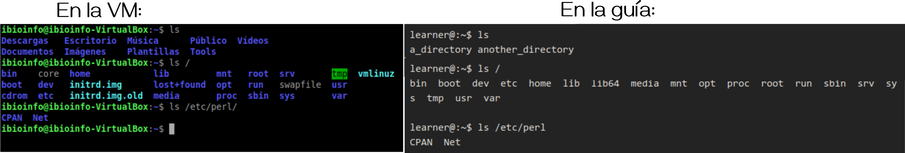

<!--
<ul class="block-list is-outlined is-primary has-radius is-highlighted">
<li class="is-highlighted is-danger"><b>Leo</b></li>
<li>Sos</li>
<li class="is-highlighted is-success is-big"><b>Un Genio</b></li>
</ul>
-->

## Recording

* Introducción y puesta en común TP N°1. [[MP4]](https://drive.google.com/file/d/123NmScxbJY3gds-WSVQfSAudRvTPbRvb/view?usp=sharing)

<iframe src="https://drive.google.com/file/d/123NmScxbJY3gds-WSVQfSAudRvTPbRvb/preview" width="800" height="440"></iframe>

### Encuesta del final de clase

#### Pregunta 1. ¿Cúal es la forma correcta de dirigirse desde cualquier carpeta al home directory del usuario "pareto”?

<ul class="block-list has-radius is-outline">
    <li class="is-highlighted is-info has-icon"> <b>1. cd ~ </b>  
         <i class="fas fa-check"></i> 
        Engañoso. Si el usuario actual en la terminal es pareto es correcta. Si no, no.
    </li>
    <li class="is-highlighted is-danger"> <b>2. cd home/pareto</b>  
         <i class="fas fa-times"></i> 
        No. Sólo funciona si el directorio de trabajo en la terminal es el directorio raíz (o el <i>barra</i>).
    </li>
    <li class="is-highlighted is-danger has-icon"> <b>3. cd home / pareto </b>
         
         <i class="fas fa-times"> </i> 
        No. En primer lugar, `cd home` no tiene adelante el directorio raíz. En segundo lugar, al separar con espacios todo lo que sigue a `cd home` se consideran <b>argumentos</b> del comando `cd`.
    </li>
    <li class="is-highlighted is-danger has-icon"> <b> 4. cd / home / pareto</b>
           <i class="fas fa-times"></i> 
        No. En primer lugar, `cd /` cambiaría al directorio raíz y al separar con espacios todo lo que sigue a `cd /` se consideran <b>argumentos</b> del comando `cd`.
    </li>
    <li class="is-highlighted is-success has-icon"> <b>5. cd /home/pareto </b>  
         <i class="fas fa-check-double"></i> 
        Correcta. El comando `cd` (<b>c</b>hange <b>d</b>irectory) indica el cambio al home del usuario pareto iniciando el <b>path</b> (o <i>caminito</i>) desde el directorio raíz (el <i>barra</i>).
    </li>
    <li class="is-highlighted is-danger has-icon"> <b>6.</b> cd /pareto/home</b>  
         <i class="fas fa-times"></i> 
        No. El comando `cd` (<b>c</b>hange <b>d</b>irectory) indica cambiar el directorio `home`, dentro del directorio `pareto` que se encuentra en el directorio raíz (o <i>barra</i>).
    </li>
    <li class="is-highlighted is-danger has-icon"> <b>7. cd ././pareto</b>  
         <i class="fas fa-times"></i> 
        No. El `.` se utiliza para indicar de manera <b>relativa</b> el directorio actual.
    </li>
    <li class="is-highlighted is-danger has-icon"> <b>8. cd ./home/pareto</b>  
         <i class="fas fa-times"></i> 
        No. El `.` se utiliza para indicar de manera <b>relativa</b> el directorio actual. No serviría desde <b>cualquier</b> carpeta como lo pide el enunciado, únicamente serviría si el directorio actual es el directorio raíz.
    </li>
</ul>

#### Pregunta 2. Seleccione los Paths relativos de la siguiente lista:

<ul class="block-list has-radius is-outline">
    <li class="is-highlighted is-danger has-icon"> <b>1. /var/foo/tom_yerry </b>  
         <i class="fas fa-times"></i> 
        Este es un <b>path absoluto</b>. Indica toda la ruta desde el directorio raíz hasta el directorio tom_yerry
    </li>
    <li class="is-highlighted is-success has-icon"> <b>2. var/foo/tom_yerry </b>  
         <i class="fas fa-check-double"></i> 
        Este es un <b>path relativo</b>. <b>No</b> indica toda la ruta desde el directorio raíz hasta el directorio tom_yerry
    </li>
    <li class="is-highlighted is-danger has-icon"> <b>3. /home/tom/Documentos/catfood.png </b>  
         <i class="fas fa-times"></i> 
        Este es un <b>path absoluto</b>. Indica toda la ruta desde el directorio raíz hasta el archivo catfood.png 
    </li>
    <li class="is-highlighted is-success has-icon"> <b>4. ../../yerry/Documentos/cheese.png </b>  
         <i class="fas fa-check-double"></i> 
        Este es un <b>path relativo</b>. <b>No</b> indica toda la ruta desde el directorio raíz hasta el archivo cheese.png. Los segundos `..` indican el directorio parental a `yerry` y los primeros `..` indican el directorio parental del parental de yerry
    </li>
    <li class="is-highlighted is-success has-icon"> <b>5. ./Videos/Capitulos/ </b>  
         <i class="fas fa-check-double"></i>  
        Este es un <b>path relativo</b>. <b>No</b> indica toda la ruta desde el directorio raíz hasta el directorio Capitulos.  
        El `.` indica el directorio actual.
    </li>
    <li class="is-highlighted is-success has-icon"> <b>6. ./Descargas/tom_yerry_cap1.torrent </b>  
         <i class="fas fa-check-double"></i>  
        Este es un <b>path relativo</b>. <b>No</b> indica toda la ruta desde el directorio raíz hasta el archivo tom_yerry_cap1.torrent. El `.` indica el directorio actual.
    </li>
    <li class="is-highlighted is-danger has-icon"> <b>7. /home/tom/Descargas/tom_yerry_cap1.torrent</b>  
         <i class="fas fa-times"></i>  
        Este es un <b>path absoluto</b>. Indica toda la ruta desde el directorio raíz hasta el archivo tom_yerry_cap1.torrent 
    </li>
</ul>
---

## Objetivo

* Familiarizarse con el uso básico de los comandos de UNIX que más adelante nos permitirán sacar provecho de herramientas bioinformáticas, que solo se pueden utilizar de esta forma.

## Introducción

En este trabajo práctico vamos a aprender a usar la **LINEA DE COMANDO** (*o la consola, o el shell*). Para muchos de nosotros, que crecimos con la interfaz gráfica (GUI, por las siglas en ingles: *Graphic User Interface*) de sistemas operativos como los de Windows, la **LINEA DE COMANDO** puede parecer un desafío. Con práctica y algo de paciencia descubrirán que puede resultar amena. Y su uso tiene dos ventajas destacables para nuestro campo:
- Nos permitirá trabajar en entornos sin interfaz gráfica (GUI),
- Para los entornos que sí cuenten con interfaz gráfica, nos permitirá programatizar/automatizar procesos, acelerando el trabajo y minimizando la cantidad de errores que podemos cometer con tareas repetitivas.

Todo lo que hagamos en este TP se puede hacer directamente en el navegador, gracias a [Alex Morley](https://github.com/blahah/command_line_bootcamp) y colaboradores, que armaron una interfaz web especialmente diseñada para aprender lo básico de linea de comando: 

## Command-line bootcamp

Diríjanse al siguiente link: [Command-line Bootcamp](https://cli-boot.camp/). 

La guía cuenta en uno de los paneles que pueden ver en la web, con una consola que pueden usar para resolver todos los ejercicios de la misma. Sin embargo últimamente la consola no responde, por lo que vamos a resolver los ejercicios en la máquina virtual (VM) de la materia.
La VM, tiene Lubuntu como sistema operativo, y como en todo sistema Linux podemos abrir una nueva terminal para trabajar (y resolver todos los problemas de la guía) con: 

[CTRL]   [SHIFT] + [T]

 o yendo al menú desplegable que ven abajo a la izquierda --> “Herramientas del sistema” --> “LXterminal”

A medida que avancen con la guía, tengan en cuenta que al trabajar en la VM, algunos de los ejemplos de la guía pueden verse ligeramente distintos. Lo cual tiene sentido puesto que algunos ejercicios visualizan archivos y carpetas del sistema, como por ejemplo los primeros ejemplos que vemos en la sección 01 de la guía:

Donde pueden ver que:
- El *prompt* difiere, distinto usuario y equipo. (ver guía para entender qué es el prompt).

Esto se debe a que en efecto cada sistema tiene asignado un usuario distinto (learner en la guía y ibioinfo en la VM) y solo aparece el nombre del equipo en la VM (ibioinfo-VirtualBox).
- El comando `ls` al principio muestra carpetas diferentes; *a_directory* y *another_directory* en la guía y *Descargas*, *Escritorio*, *Música*, *Público*, etc en la VM.

Lo cual es esperable porque como ya se mencionó anteriormente, cada sistema tiene distintas carpetas y archivos.
- El contenido se visualiza con colores en la VM.

Esto se debe a que cada terminal de UNIX se puede configurar para visualizar el contenido de distintas formas; desde no colorear nada (como en la guía) o colorear según se trate de una carpeta, archivo, enlace suave, etc.

**Para quienes NO pudieron instalar la VM:**
Pueden usar una terminal de unix online de [JSLinux](https://bellard.org/jslinux/vm.html?url=alpine-x86.cfg&mem=192). Pero hay aún más diferencias con la terminal de la VM.

> The bootcamp tutorial text was adapted from the original by Keith Bradnam. The infrastructure, including adventure-time and docker-browser-server, was built by @maxogden and @mafintosh. The setup of this app was based on the get-dat adventure. This adventure was made by Richard Smith-Unna. This work is licensed under a Creative Commons 4.0 International License. Creative Commons License
