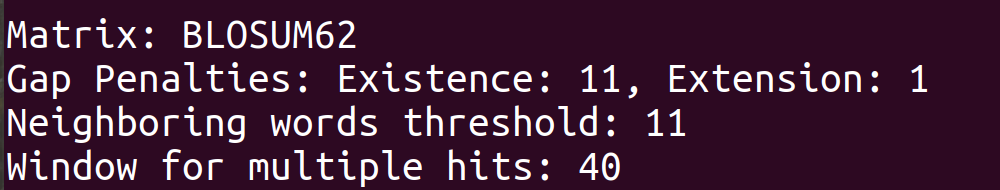
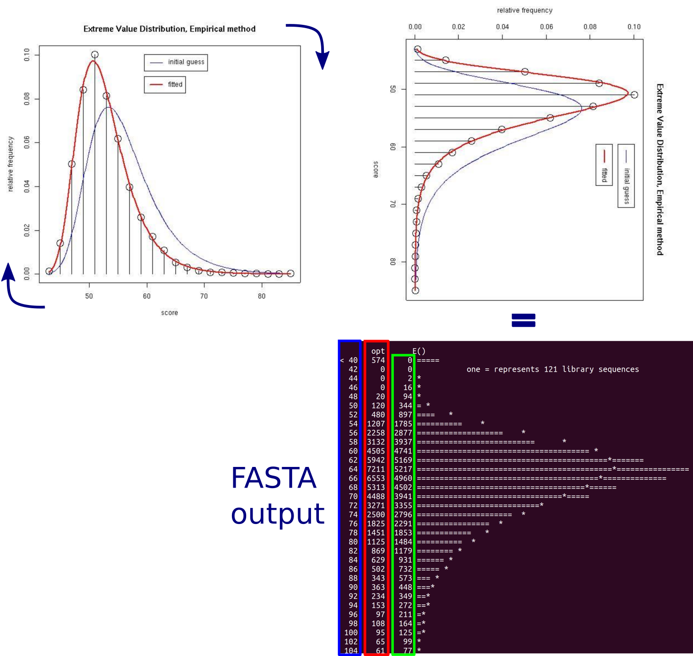
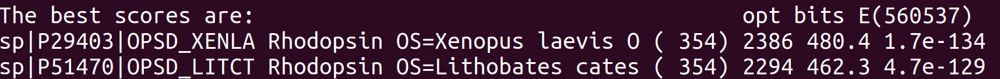



**Pagina en construccion**

## Materiales

[Descargar](https://drive.google.com/file/d/11BIqgiLwt_IPG8n8AQfbx7jwRNVxAfd0/view?usp=sharing) 

## Objetivo

 * Familiarizarse con el uso de programas de búsqueda de secuencias en bases de datos (BLAST y FASTA), y en particular con el uso de estos programas en la línea de comando.
 * Familiarizarse con la visualización de histogramas que arroja FASTA.
 * Familiarizarse con el uso de scores estadísticos en relación a la búsqueda en bases de datos.

<ul class="block-list has-radius is-primary">
   <li class=" is-outlined is-danger has-icon" markdown="span">
      <span class="icon"><i class="fas fa-exclamation-triangle"></i></span>
<b>¡Antes de comenzar!</b>
</li>
</ul>

Para realizar este TP tienen que estar frente a una terminal UNIX. Los programas que vamos a utilizar son: *blastall, blastcl3, formatdb y fastacmd (NCBI-Toolkit), fasta, tfasta, fastx, tfastx, fasty, tfasty, ssearch, prss* (**FASTA** program package). 

Para instalarlos, descarguemos el archivo ``install.sh`` de la carpeta de trabajo provista y ejecutemos el comando.

```Bash
bash install.sh
``` 

## Introducción a BLAST

**BLAST** busca secuencias similares a una secuencia *query* en una base de datos de secuencias, utilizando distintas estrategias de búsqueda:

* **BLASTn**: compara una secuencia nucleotídica *query* contra una base de datos de secuencias nucleotídicas.
* **BLASTx**: compara una secuencia nucleotídica *query*, que es traducida en los 6 posibles marcos de lectura (resultando en 6 secuencias proteicas), contra una base de datos de secuencias proteicas. 
* **tBLASTn**: compara una secuencia proteica *query* contra las traducciones (6 posibles marcos de lectura) de una base de datos de secuencias nucleotídicas. 
* **BLASTp**: compara una secuencia proteica *query* contra una base de datos de secuencias proteicas.

**BLAST**, tal como es distribuído por el **NCBI**, se encuentra disponible mediante el comando ``blastall``. Este comando necesita como mínimo tres argumentos para realizar una búsqueda:
* ``-i`` una secuencia *query* (recordar, i = input) 
* ``-d`` una base de datos con secuencias (recordar, d = database) 
* ``-p`` el tipo de busqueda (p = programa: *blastp*, *blastn*, *blastx*, etc.) 

<ul class="block-list has-radius is-primary">
   <li class=" is-outlined is-info has-icon" markdown="span">
      <span class="icon"><i class="fas fa-sticky-note"></i></span>
		Para ver una lista de los argumentos que acepta ``blastall`` prueben correr el comando sin argumentos. Si esto no les funciona pueden ver todos los argumentos haciendo click [aquí](https://www.ncbi.nlm.nih.gov/Class/BLAST/blastallopts.txt).
</li>
</ul>

### Ejercicio 1

**1.1** Como primer ejemplo podemos usar la secuencia *xlrhodop.pep* para realizar una búsqueda contra *Swissprot*. Como estamos trabajando con una secuencia y una base de datos de proteínas, usamos ``blastp`` para realizar la busqueda: 

```Bash
blastall -p blastp -i xlrhodop.pep -d ~/Swissprot_db/Swissprot.fasta
``` 
<ul class="block-list has-radius is-primary">
   <li class=" is-outlined is-danger has-icon" markdown="span">
      <span class="icon"><i class="fas fa-exclamation-triangle"></i></span>
		Este comando no se ejecutará correctamente si uno mueve de lugar el archivo de la base de datos *Swissprot* luego de ejecutar ``install.sh``. Si este es el caso, especifique el camino completo.
</li>
</ul>

En este ejemplo, el resultado de la busqueda es volcado en la pantalla (stdout). Para que el resultado aparezca en un archivo, podemos redireccionar stdout (usando ``>``, ver TP Unix) o usar la opcion ``-o`` (output).

```Bash
blastall -p blastp -i xlrhodop.pep -d ~/Swissprot_db/Swissprot.fasta -o xlrhodop.blastp
``` 

Pueden ver el resultado del ``blastp``, por ejemplo paginando el archivo:

```Bash
less xlrhodop.blastp
```

¿Qué indican las últimas líneas de este archivo?



**1.2** Explore las siguientes opciones del programa ``blastp``:  

* ``-G`` Costo del gap open (*default*: 11)
* ``-E`` Costo del gap extend (*default*: 1)   
* ``-W`` Tamaño de la ktupla. (*default*: 3, puede variar entre 2 y 7)

<ul class="block-list has-radius is-primary">
   <li class=" is-outlined is-danger has-icon" markdown="span">
      <span class="icon"><i class="fas fa-exclamation-triangle"></i></span>
		Hay tuplas de valores permitidos para los argumentos ``-G`` y ``-E``, no cualquier combinación de costos es válida.
</li>
</ul>


Utilice distintas combinaciones de estos parámetros y preste atención al impacto que esto tiene en los alineamientos reportados. 

**1.2.1** Complete la siguiente tabla para resumir lo observado, teniendo en cuenta diferentes **costos** de gap open y gap extend. 

<div class="table">

|| Observaciones en el extremo del alineamiento | Observaciones en el centro del alineamiento | Extensión de la región con gaps |
| Gap open alto + gap extend alto | | | |
| Gap open alto + gap extend bajo | | | |
| Gap open bajo + gap extend alto | | | |
| Gap open bajo + gap extend bajo | | Muchos gaps | "Larga" |

</div>

**1.2.2** Responda a las siguientes preguntas:

Para una misma combinación de costos para gap open y gap extend:

**a.** ¿Qué sucede con los valores de ktupla=2 y ktupla=7 ? 

**b.** ¿Cuál búsqueda es la que tarda más? ¿Cuál menos? 

**c.** ¿Cuántas secuencias devuelven?

<ul class="block-list has-radius is-primary">
   <li class=" is-outlined is-danger has-icon" markdown="span">
      <span class="icon"><i class="fas fa-exclamation-triangle"></i></span>
		Si corren ``blastp`` sólo, es decir sin invocar primero al comando ``blastall``, van a poder realizar las mismas búsquedas pero los nombres de los argumentos del comando ``blastp`` sólo difieren de los de ``blastall -p blastp``. Por lo tanto, no les recomendamos correrlo de esta forma.   
</li>
</ul>


## Introducción a FASTA

<ul class="block-list has-radius is-primary">
   <li class=" is-outlined is-info has-icon" markdown="span">
      <span class="icon"><i class="fas fa-sticky-note"></i></span>
		El nombre **FASTA** proviene de "FAST-All" porque funciona con cualquier alfabeto, esto significa que es una extensión de las herramientas originales para realizar alineamientos "FAST-P" (proteínas) y "FAST-N" (nucleótidos). El formato ".fasta" para almacenar secuencias de proteínas o nucleótidos se origina con el software **FASTA**, es por esto que llevan el mismo nombre. 
</li>
</ul>

Al igual que **BLAST**, **FASTA** necesita los mismos tres argumentos obligatorios. Sin embargo, el paquete **FASTA** provee un comando ejecutable para cada tipo de búsqueda.
 
Comparación de programas en el paquete FASTA

**FASTA** permite comparar una secuencia proteica contra una base de datos de proteínas o una secuencia de ADN contra una base de datos de ADN (*Pearson and Lipman, 1988, Pearson, 1996*). La velocidad de la búsqueda y la selectividad están controladas por el parámetro ktup (*word size*). Para comparaciones entre proteínas, ktup=2 es el default, ktup=1 es más sensible pero más lento. Para comparaciones entre secuencias de ADN, ktup=6 es el default, ktup=3 o ktup=4 proveen una mayor sensibilidad, ktup=1 debe ser utilizado para oligonucleótidos (secuencias *query* de ADN de longitud < 20).

- **ssearch** Compara una secuencia proteica contra una base de datos de proteínas o una secuencia de ADN contra una base de datos de ADN usando el algoritmo de Smith-Waterman (Smith and Waterman, 1981). 

- **fastx y fasty** Compara una secuencia de ADN contra una base de datos de proteínas.

	 - *fasty* compara la secuencia de ADN traducida en 3 marcos de lectura, permitiendo gaps y frameshifts. Es más lento que *fastx* pero produce mejores alineamientos para secuencias de baja calidad ya que los frameshifts se admiten entre codones. 

	 - *fastx* usa un algoritmo más simple y rápido para alineamientos que permiten frameshifts sólo entre codones. 

* **tfastx** Compara una secuencia proteica a una base de datos de ADN, calculando las similaridades con frameshifts para las orientaciones forward y reverse.  

* **tfasta** Compara una secuencia proteica a una base de datos de ADN, calculando las similaridades (sin frameshifts) para los 3 forward y los 3 reverse ORFs. *tfastx* es preferido debido a que calcula las similaridades teniendo en cuenta frameshifts. 

* **fasts** Compara un set pequeño de péptidos, obtenidos por ejemplo de un experimento de espectrometría de masas, contra una base de datos de proteínas (*fasts*) o de ADN (*tfasts*). 

### Ejercicio 2 

Ahora corramos la misma búsqueda del ejemplo anterior usando FASTA: 

```Bash
fasta -H xlrhodop.pep ~/Swissprot_db/Swissprot.fasta > xlrhodop.fasta
```
Para interpretar correctamente el histograma que FASTA da como output tenemos que pensar que está **apaisado** (o rotado 90 grados en sentido horario) con respecto al típico histograma que muestra la distribución de scores para todas las secuencias halladas. Esto se ilustra en la siguiente figura.



**2.1** Responda a las siguientes preguntas con respecto al histograma **apaisado** que obtuvo como output:

**a.** ¿Qué valores se representan en el eje y (vertical)?

**b.** ¿Qué valores se representan en el eje x (horizontal)?

**c.** ¿Qué representan los asteriscos "\*" ?

**d.** ¿Qué representan los iguales "=" ? ¿Cuánto representa el "=" ?

**e.** ¿Qué es la <span style="color:blue;font-weight:bold;">primera columna</span> de números?, ¿por qué hay un "<" en la primera línea? y ¿por qué hay un ">" en la última?

**f.** ¿Qué es la <span style="color:red;font-weight:bold;">segunda columna</span> de números? (Pista: mirá el números de iguales que hay en esa línea)

**g.** ¿Qué es la <span style="color:green;font-weight:bold;">tercera columna</span> de números?

**h.** ¿Qué es un inset? ¿Qué región del histograma está representada en el inset? ¿Cuánto representa el "=" en el inset?

**i.** ¿El valor del “=” en el inset es mayor o menor que en el resto del histograma? ¿Tiene sentido?


**2.2** ¿Qué parámetros se utilizaron en esta corrida con FASTA?

**2.3** ¿En qué se diferencian las distribuciones esperadas y observadas? ¿Qué implica?

**2.4** ¿Qué representa el número que está entre paréntesis en el E (ver figura más abajo)? ¿Cuál es el E-value para el mejor *hit*?



 
# Diferencias entre BLAST y FASTA

* **ktup:** Tanto FASTA como BLAST usan una estrategia de búsqueda inicial basada en palabras cortas. ktup en FASTA es el parámetro que indica el tamaño de la palabra utilizada en esta búsqueda inicial. FASTA utiliza por default ktup=2, mientras que BLAST utiliza ktup=3. Sin embargo, FASTA sólo considera identidades respecto a la palabra, mientras que BLAST utiliza identidades y sustituciones conservativas. Por lo tanto BLAST con ktup=3 es en general más sensible que FASTA con ktup=2. FASTA con ktup=1 es más sensible, pero es también más lento. 
* **Matrices y scores:** BLAST y FASTA usan distintas matrices de *scoring* y *gap penalties* por *default* (BLAST: BLOSUM62, gap open:-11, gap extend:-1; FASTA: BLOSUM50, gap open:-10, gap extend:-2). 
* **Estadísticas** Los parámetros *kappa* y *lambda* son centrales para estimar scores en BLAST y en FASTA. FASTA calcula estos parámetros *on the fly* a partir de la base de datos (se tiene en cuenta el tamaño) y la matriz de *scoring*. Esto produce estadísticas más representativas, pero puede ser problemático para bases de datos pequeñas. Si la base de datos es de menos de 10 secuencias, FASTA no estima estos parámetros. BLAST usa valores pre-calculados para estos parámetros, que fueron derivados a partir de simulaciones. 
* **Alineamientos:** BLAST puede mostrar varios alineamientos por cada par de secuencias (varios *high-scoring pairs* o HSPs), FASTA sólo muestra un alineamiento. 
* **Filtrado de secuencias de baja complejidad:** Por default, BLAST filtra secuencias de baja complejidad o repeticiones, ¡FASTA no! Esto puede afectar la capacidad de discriminar falsos positivos, aunque FASTA provee otro tipo de opciones para manejar este tipo de casos. Ver la sección específica sobre este punto más abajo. 
* **Traducciones:** *blastx* hace 6 búsquedas independientes (una en cada marco de lectura) mientras que *fastx3* y *fasty3* hacen una única búsqueda *forward* (o *reverse* usando ``-i``) que permite *frameshifts*. Estos últimos son más sensibles y pueden producir mejores alineamientos que *blastx* cuando se usan secuencias de baja calidad (lo mismo es cierto para *tblastn* vs *tfastx3* y *tfasty3*). 
* **Homólogos distantes:** Existe una opción en FASTA (``-F``) que les permite ignorar (i.e. que no aparezcan en el output) secuencias altamente similares al *query*. Esto es útil, por ejemplo, para focalizar una búsqueda en las secuencias más divergentes. No existe una opción similar en **BLAST**. 
* **Secuencias cortas:** Ya sea que busquen un *primer* o un péptido, si quieren utilizar BLAST o FASTA para esto, tengan en cuenta que BLAST es generalmente inútil al respecto. Esto es porque BLAST tiene un límite inferior sobre la longitud que puede tener una palabra (ktup). En el caso de nucleótidos, el límite inferior es 7 (el *default* es 11). En este sentido FASTA es mejor, porque siempre pueden usar ktup=1. Por otra parte, en el caso específico de péptidos, FASTA provee algunos algoritmos particulares de búsqueda (*fastf*, *fasts* y *tfasf*, *tfasts*).

<ul class="block-list has-radius is-primary">
   <li class=" is-outlined is-info has-icon" markdown="span">
      <span class="icon"><i class="fas fa-sticky-note"></i></span>
		Usar un cuchillo en lugar de un destornillador, a veces puede funcionar, pero no deja de ser cierto que cada herramienta fue diseñada para un fin distinto. Si quieren realizar búsquedas de secuencias cortas prueben primero con *fuzznuc*, *fuzzpro* o *findpatterns* (todos parte de **EMBOSS**).
</li>
</ul>


## Filtrado de secuencias de baja complejidad

Muchas secuencias son altamente repetitivas. Si la secuencia *query* contiene regiones de baja complejidad o repeticiones, es posible que una búsqueda encuentre muchas secuencias no relacionadas, con altos scores (por ej. *hits* contra colas de poly-A o regiones ricas en Prolina).
En otros casos, la secuencia puede contener un vector (plásmido) o repeticiones Alu, que ustedes pueden querer omitir en la búsqueda. 

**BLAST** permite filtrar el primer tipo de casos, mediante la opción ``-F``. 
**FASTA** en cambio no provee esta alternativa. Es el usuario el que tiene que filtrar el *query* antes de realizar una búsqueda. 

### Ejercicio 3 

**3.1** Usar la proteína Groucho de Drosophila (grou_drome) para buscar secuencias similares en *Swissprot* usando **BLAST**. Comparar los resultados obtenidos usando (``-F T``) o sin usar (``-F F``) la opción de filtrado que provee **BLAST**. 

**3.2** Ahora para repetir el mismo ejercicio con **FASTA**, tenemos que detectar y marcar las regiones de baja complejidad. Para esto se utiliza ``segmasker``: 

```Bash
segmasker -in grou_drome.fasta -outfmt fasta > grou_drome_lc.fasta
```

**3.3** Comparen las secuencias *grou_drome.fasta* y *grou_drome_lc.fasta* e identifiquen las diferencias. ¿Qué hizo *segmasker* con la secuencia? 

Ahora, podemos buscar secuencias similares en *Swissprot* usando *grou_drome.fasta* (con opciones standard) y *grou_drome_lc.fasta* (usando la opción ``-S``). 

```Bash
fasta -H grou_drome.fasta ~/Swissprot_db/Swissprot.fasta
fasta -H -S grou_drome_lc.fasta ~/Swissprot_db/Swissprot.fasta
```

¿Qué diferencias encuentran en los histogramas de cada búsqueda? 

<ul class="block-list has-radius is-primary">
   <li class=" is-outlined is-info has-icon" markdown="span">
      <span class="icon"><i class="fas fa-sticky-note"></i></span>
		Para el segundo tipo de casos (vector, elementos repetitivos), es necesario detectarlos y enmascararlos (reemplazarlos por N o X) o marcarlos (con minúscula, por ejemplo, si toda la secuencia esta en mayúsculas) previo a la búsqueda. 
</li>
</ul>

## Bases de datos propias

Tener acceso a **BLAST** o **FASTA** en la línea de comando les da la posibilidad de crear sus propias bases de datos para realizar búsquedas. 
**FASTA** puede realizar búsquedas sobre un archivo en formato *fasta* conteniendo varias secuencias sin ningún otro tipo de tratamiento. **BLAST**, sin embargo necesita contar con una base de datos indexada. ``formatdb`` es el comando que vamos a utilizar para generar los índices que **BLAST** necesita. 

### Ejercicio 4

**4.1** Primero, vamos a generar un archivo *fasta* múltiple con algunas secuencias. Por ejemplo, para construir una base de datos con secuencias de opsinas podemos empezar con: 

```Bash
seqret "~/Swissprot_db/Swissprot.fasta:ops*" fasta::ops
```
Esto debería generar un archivo FASTA múltiple conteniendo secuencias de opsinas. 

**4.2** ¿Cuántas secuencias tiene nuestra base de datos? 

Ahora para indexar el archivo ops (en formato *fasta*), usamos ``formatdb``, indicándole el archivo que contiene las secuencias (``-i``) y si el archivo contiene secuencias de ADN (``-p F``) o de proteínas (``-p T``). 

```Bash
formatdb -i ops -p T
```

**4.3** Una vez indexada la base de datos, podemos hacer una búsqueda, por ejemplo, con nuestra ya conocida *xlrhodop.pep*

```Bash
blastall -p blastp -d ./ops -i xlrhodop.pep > xlrhodop.ops.blastp
```

Pueden ver las opciones que acepta el comando ``formatdb`` pidiendo ayuda: 

```Bash
#formatdb --help ... (en versiones viejas de blast se podía usar este comando... pero ya no)
makeblastdb -help

```

## BLAST con múltiples secuencias

Si tienen un archivo con múltiples secuencias en formato *fasta*, pueden usarlo como *query* en una búsqueda, usando **BLAST**. 

### Ejercicio 5 

**5.1** El archivo *opsv.fasta* contiene la secuencia de 4 fotorreceptores, usen este archivo para realizar una búsqueda, usando *blastp*, contra la base de datos **ops** que crearon en el ejercicio anterior. 

**5.2** El output generado consiste en 4 reportes de **BLAST**, concatenados en un único archivo. ¿Cómo pueden navegar fácilmente dentro del documento usando `less`? 

<ul class="block-list has-radius is-primary">
   <li class=" is-outlined is-info has-icon" markdown="span">
      <span class="icon"><i class="fas fa-lightbulb"></i></span>

		Tip: ¿qué palabras o conjunto de palabras ocurren una sola vez en cada reporte?
</li>
</ul>

**5.3** Ahora puedo leer el reporte y manejarme bien dentro de él. Si quiero partirlo en 4 reportes individuales ¿Cómo hago? 

Para esto pueden usar el comando de Unix `split` que puede partir un archivo en otros más pequeños, ya sea por tamaño o cada vez que encuentre una palabra o *pattern* (patrón, expresión regular). Usando la opción `-p` pueden especificar un *pattern*.

<ul class="block-list has-radius is-primary">
   <li class=" is-outlined is-info has-icon" markdown="span">
      <span class="icon"><i class="fas fa-sticky-note"></i></span>
 		La opción `-p` sólo está disponible en el comando `split` de sistemas operativos del tipo BSD (*FreeBSD*, *NetBSD*). Linux usa el comando `split` de GNU, donde esta opción no existe. 
</li>
</ul>

```Bash
man split 
```
Tanto en Linux como en cualquier Unix, una manera de partir un archivo en varios usando un *pattern* es usando el comando `awk`: 

Dado un archivo llamado *blast.out*, podemos partirlo en varios usando la siguiente invocación: 

```Bash
awk -v i=0 '/pattern/{i++}{print > "blast."i}' blast.out 
```
<ul class="block-list has-radius is-primary">
   <li class=" is-outlined is-danger has-icon" markdown="span">
      <span class="icon"><i class="fas fa-exclamation-triangle"></i></span>
		Recuerden reemplazar "*pattern*" por el patrón que quieren utilizar para dividir el archivo.
</li>
</ul>

¿Lo lograron?


