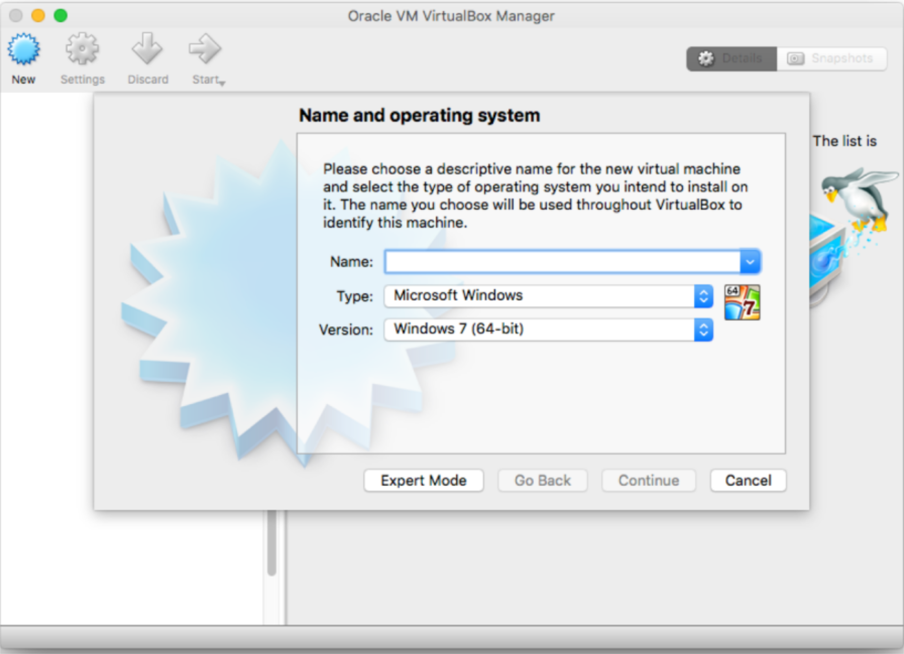
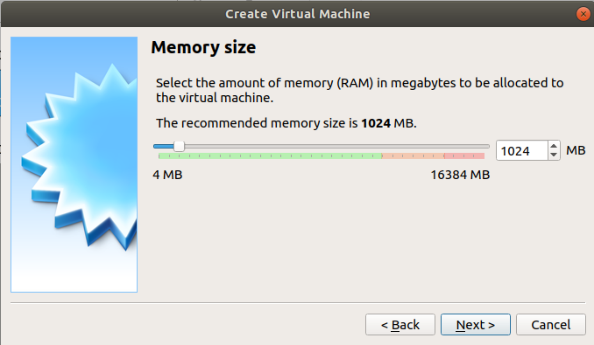

# Instructivo: Puesta en funcionamiento de máquina virtual con biolinux

Este es un instructivo corto sobre cómo hacer para correr biolinux en sus compus sin tener que reinstalar el sistema operativo. Vamos a necesitar:

- La *imagen* de biolinux (pronto explicaremos qué es esto)
- Tener [Oracle Virtual Box](https://www.virtualbox.org/) instalado en nuestras compus.

## Antes de arrancar... 

### ¿Qué es un sistema operativo?

Un sistema operativo es una pieza de *software* que nos permite realizar funciones básicas, como copiar/pegar/mover/generar archivos, y sobre el cual se construyen otros softwares. Muchos sistemas operativos también proveen una interfaz gráfica que permite al usuario hacer tareas sin linea de comando (yay!). Hay un montón de sistemas operativos, pero los más comunes son Windows, OSX y Linux.

### ¿Qué es una máquina virtual?

Las máquinas virtuales no son más que compus *invitadas* (o *guests*), emuladas dentro de una computadora real, hospedadora (o *host*). Como las máquinas físicas, éstas corren un sistema operativo que permitirá hacer distintas cosas. La virtualización es un proceso costoso, desde el punto de vista de que nos permite crear nuevas compus pero, al momento de correrlas, estaremos repartiendo los recursos reales (espacio en disco, memoria RAM y velocidad de procesamiento CPU) del *host* entre todas las máquinas virtuales *guest* que estén activas. Es por esto que debemos ser cuidadosos al momento de generarlas, dándoles suficientes recursos para funcionar, pero no todos los recursos del *host*.

## La *imagen* de biolinux

Una *imagen* ISO es una captura o foto de un disco de almacenamiento. Esto es: todo lo que un disco duro tiene guardado, incluyendo el sistema operativo y los programas instalados, quedarán guardados en una imagen ISO cuando la creemos con las herramientas adecuadas. Una imagen ISO permite regenerar el estado de la compu desde la que se creó dicha imagen al momento de sacar la foto. Particularmente, las distribuciones de imagen ISO de biolinux, son una instancia de Linux con un montón de programas que usamos los bioinformáticos ya instalados. Nosotros no vamos a crear ninguna imagen, sino que vamos a usar una que ya existe. Comenzaremos por descargar la imagen. En el contexto de una máquina virtual, esta imagen ISO será la responsable de proveer al virtualizador de toda la información sobre el sistema operativo y programas instalados, necesaria para emular la computadora virtual. 

Pueden usar este link, que tiene la máquina que usamos en los TPs (es un link a Dropbox)
- [Biolinux via Dropbox de la materia](https://www.dropbox.com/s/mh71ia4kts0n5ht/IBioinfo-Lubuntu-32.zip?dl=0)
> Es pesada! Descarguenla con tiempo y con conexión estable.

O este link, si el anterior no estuviera disponible
- [Biolinux via Environmental Omics](http://environmentalomics.org/bio-linux-download/)
> Esta página es de los autores originales de esta distro.

Este proceso demora bastante, puesto que una imagen contiene todo lo que un sistema operativo necesita (y éste, en particular, todo lo que un bioinformático necesista), y suelen ser bastante pesadas (>20-50 GB). Háganlo con tiempo.

## Instalar Virtual Box

Mientras descarga la imagen, aprovechen el tiempo muerto para descargar Oracle Virtual Box. El programa es gratuito y pueden descargarlo desde [la página oficial](https://www.virtualbox.org/). Descárguenlo y sigan las instrucciones del instalador hasta que hayan terminado. 

## Crear una máquina virtual

Virtual Box es un virtualizador de entornos. Nos permite generar una *máquinas virtuales*. Vamos a crear nuestra máquina virtual con biolinux:

1. Abrimos Virtual Box
2. Hacemos click en `New`

3. Una cája de diálogo aparecerá, en donde deberemos indicar el nombre que queremos darle a la máquina virtual, el tipo de virtualización y la versión del sistema operativo. Virtual Box es bastante *inteligente* y si ponemos un nombre descriptivo (por ejemplo, Biolinux), Virtual Box cambiará los valores de Tipo y Versión a los necesario para emular: "Linux" y "Oracle (64-bit)", respectivamente.

> Si no aparece NINGUNA opción con 64 bits, su sistema operativo no está preparado para emular a 64 bits y no podrán correr la máquina virtual del curso. Si esto ocurriera, prueben con otra compu.

También puede aparecer una opción para determinar el lugar en el que vamos a guardar nuestra máquina virtual. Dejemos ese valor por defecto y presionamos `NEXT >`

1. Ahora deberemos definir los recursos que vamos a *prestarle* a nuestra máquina virtual. El primero es la memoria RAM. Virtual box tiene un código de colores bastante intuitivo sobre cúanto podemos *prestar* sin comprometer las funciones básicas de nuestro *host*. Verde: "OK", Naranja: "Poneeeele", Rojo: "Noooo!". Estos valores dependerán de la cantidad de RAM física que tenga nuestro *host*. Cuanto más RAM le demos a la máquina virtual, más rápido va a andar. Para las tareas que realizaremos, darle entre 2 y 4 GB de ram (2048-4096 MB) estará bien. 
   

5. El siguiente recurso será el disco duro. Aquí es donde entra la imagen que descargamos antes. Aquí podríamos *prestarle* cierta cantidad de espacio en el disco a nuestra máquina virtual, no prestarle nada, o prestarle aquel espacio que ya está ocupado por la imagen de biolinux que descargamos. Esto último será lo que hagamos.

6. Con esto habremos finalizado la creación y podremos comenzar. Si todo salió bien, deberán ver una entrada con su máquina virtual recientemente creada en el Inicio del Virtual Box:

Intenten correr la máquina virtual. En breve deberían ver el logo de Bio-linux

Si en este punto ocurriera un error que dice "This computer does not have hardware-assisted virtualization", nos encontraremos ante una compu que, por defecto, no permite la virtualización. Si este es su caso, sigan los pasos descritos en [este post](https://www.makeuseof.com/tag/virtualization-issues-simple-solutions/):
